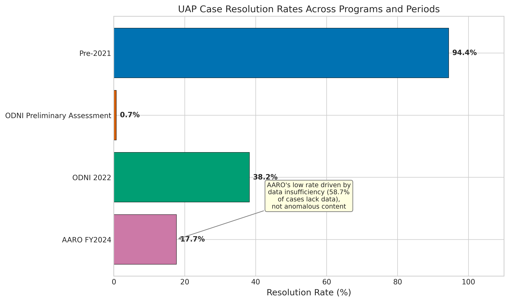
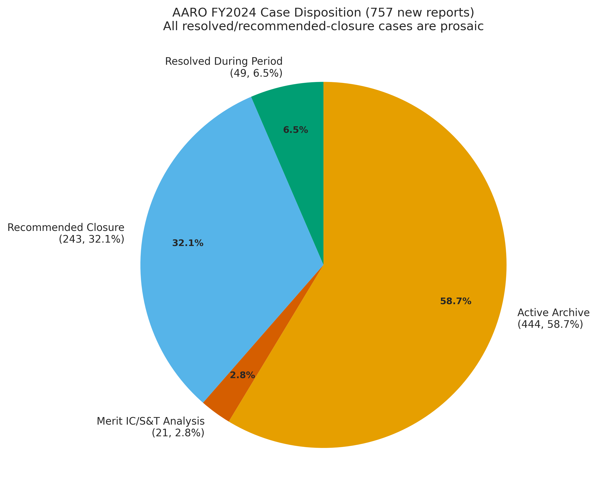
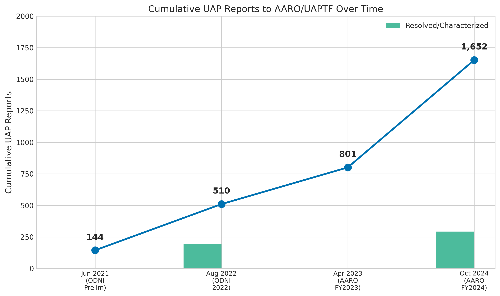
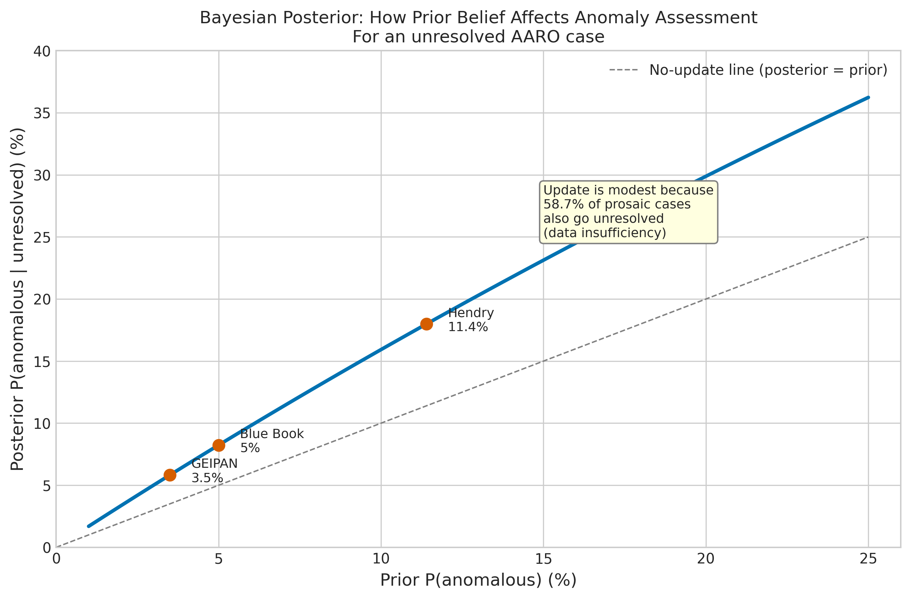
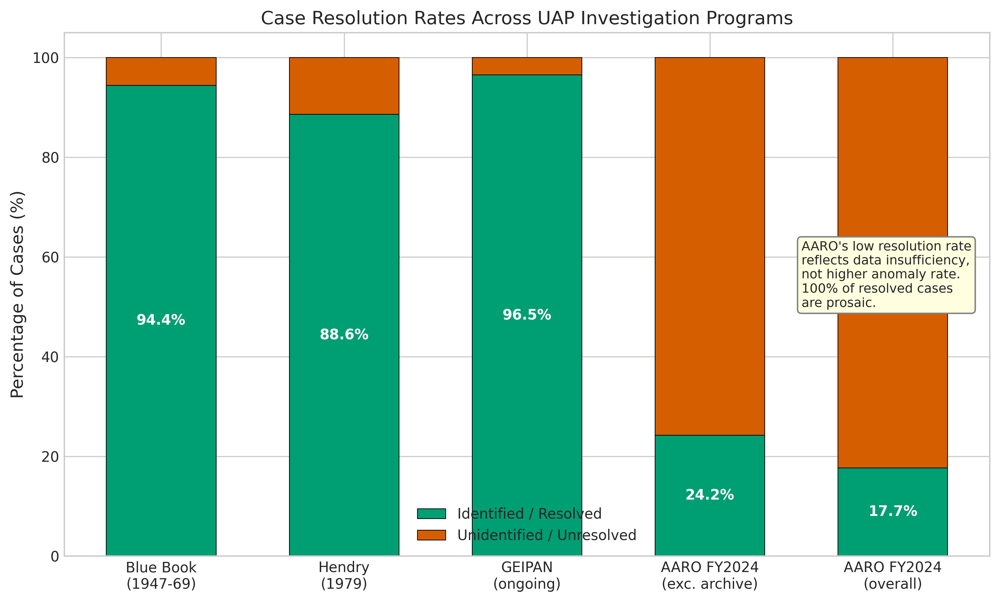
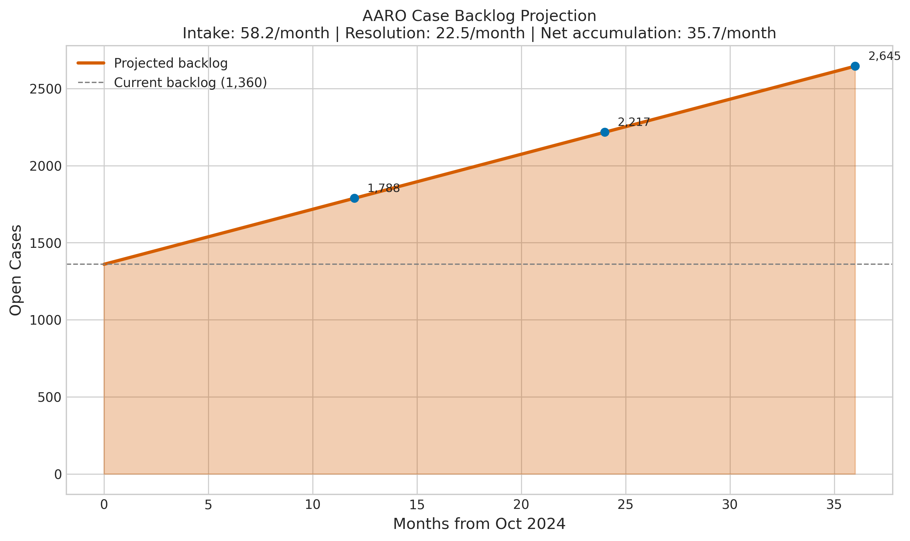

# What 1,652 Reports to the Pentagon's UAP Office Actually Tell Us: Resolution Rates, Backlog Growth, and the Data-Insufficiency Problem

## Abstract

We systematically extract and analyze every quantitative claim from the four publicly available U.S. government reports on Unidentified Anomalous Phenomena (UAP): the 2021 Office of the Director of National Intelligence (ODNI) Preliminary Assessment (144 cases), the 2022 ODNI Annual Report (510 cumulative), the All-domain Anomaly Resolution Office (AARO) FY2023 report (801 cumulative), and the AARO FY2024 Consolidated Annual Report (1,652 cumulative). Of the 292 cases AARO has resolved or recommended for closure, all identified prosaic objects: balloons, birds, unmanned aerial systems (UAS), satellites, and aircraft. However, this 100% prosaic figure is subject to selection bias: AARO resolves cases by identifying them as known objects, so the resolution process itself selects for prosaic outcomes (Section 6.3). The overall resolution rate ranges from 7.1% (118/1,652 formal closures only) to 17.7% (292/1,652 including pending closure), far below the 88-95% identification rate achieved by Project Blue Book (94.4%, n = 12,618), the Hendry study (88.6%, n = 1,307), and the French GEIPAN program (96.5%). This low rate is driven by data insufficiency: 58.7% of FY2024 cases were archived because they lacked sufficient sensor data for analysis.

AARO's backlog is growing: current-period intake (excluding prior-period catch-up) is 37.3 reports/month versus 22.5/month resolution, a ratio of 1.7x (E08, CONTROL_BACKLOG_RATIO). Including 272 prior-period catch-up reports, the headline ratio is 2.6x. A Bayesian analysis shows that an unresolved AARO case has a 4.3-8.2% posterior probability of being anomalous given a 5% base-rate prior, depending on the assumed likelihood P(unresolved | anomalous) which ranges from 0.5 to 1.0 (RV_BAYES_LIKELIHOOD). The 21 cases (2.8% of intake) that AARO identifies as meriting Intelligence Community (IC) analysis are consistent with the 3-6% residual unidentified fraction found across historical programs.

Comparison with 147,890 civilian reports from the National UFO Reporting Center (NUFORC) shows shared patterns in shape categories and the Starlink satellite effect, though these similarities largely reflect common perceptual constraints and a shared stimulus (satellite constellations) rather than independent corroboration of anomalous phenomena. The honest answer to "is there anything anomalous?" is that the public data cannot definitively resolve the question, but every case AARO has investigated with sufficient data resolved to a mundane object, and the data are fully consistent with a world in which the residual is explained by inadequate sensor coverage rather than exotic technology.

## 1. Introduction

Between 2021 and 2024, the U.S. government published four unclassified reports cataloguing observations of Unidentified Anomalous Phenomena (UAP) reported by military, intelligence, and civilian aviation personnel [1, 2, 3, 4]. These reports represent the most systematic government effort to catalogue and analyze UAP since Project Blue Book (1952-1969), which investigated 12,618 cases over 22 years [11]. Congressional interest, driven by the 2017 New York Times revelation of the Advanced Aerospace Threat Identification Program (AATIP) [13] and the July 2023 testimony of David Grusch, Ryan Graves, and David Fravor [24, 25, 26, 35], has made UAP a matter of active legislative concern.

The research question addressed here is straightforward: what does the Pentagon's UAP case data actually tell us? Of 1,652 cumulative reports to AARO, what fraction resolve, what do they resolve to, and what characterizes the unresolved remainder?

We approach this as a structured data-extraction and analysis exercise. The data are aggregate report-level summaries, not individual case records -- no case-level dataset is publicly available. Our analysis extracts every quantitative figure from the published reports, constructs resolution-rate time series and backlog growth models, applies Bayesian reasoning to estimate the probability that unresolved cases are genuinely anomalous, and compares AARO's military/institutional patterns with the 147,890-report civilian NUFORC database analyzed in a predecessor study [200].

## 2. Detailed Baseline

The baseline for this analysis is the raw text of the four government reports:

**ODNI Preliminary Assessment (June 2021)** [1]: 144 UAP reports from 2004-2021, predominantly from Navy personnel. One case identified (a balloon). 143 unresolved. 18 exhibited "unusual flight characteristics." 80 corroborated by multiple sensors. Five explanation categories: airborne clutter, natural atmospheric phenomena, USG/industry programs, foreign adversary systems, and "Other."

**ODNI 2022 Annual Report** [2]: 510 cumulative reports (144 + 247 new + 119 late). Initial characterization of 366 new reports: 163 balloon-like, 26 UAS-like, 6 clutter, 171 uncharacterized. AARO established July 20, 2022 to replace the UAPTF.

**AARO FY2023 Report** [3]: 801 cumulative reports. 291 new during period. Did not publish resolution counts.

**AARO FY2024 Consolidated Annual Report** [4]: 1,652 cumulative reports as of October 24, 2024. 757 new during May 2023-June 2024 (485 during period + 272 from prior years). 49 resolved during period (all prosaic). 118 total formally resolved. 174 pending closure (all prosaic). 243 recommended for closure. 21 merit IC/S&T analysis. 444 in Active Archive (data insufficient). 708 air domain, 49 space domain, 0 maritime, 0 transmedium. 392 from the Federal Aviation Administration (FAA). 18 UAS reports near nuclear sites. Zero adverse health effects.

**AARO Historical Record Report Volume 1** (March 2024) [5]: Review of all USG UAP investigations from 1945-2023. Found "no evidence that any USG investigation, academic-sponsored research, or official review panel has confirmed that any sighting of a UAP represented extraterrestrial technology." Assessed claims of reverse-engineering programs as "circular reporting."

The baseline condition (E00) is the overall resolution rate: 292/1,652 = 17.7%, with all resolved cases prosaic. This figure is subject to the selection-bias caveat developed in Section 6.3 (DIAG_SELECTION_BIAS).

## 3. Detailed Solution

The analytical solution is a five-component decomposition of the AARO case data:

**Component 1: Resolution-Rate Time Series.** We compute resolution rates across all report periods: Blue Book 94.4% (12,618 cases, 1947-1969), ODNI 2021 0.7% (1/144), ODNI 2022 38.2% (195/510 initial characterization), AARO FY2024 17.7% (292/1,652). The apparent decline in resolution rate from Blue Book to AARO is misleading -- it reflects different investigation depths and data quality standards across eras, not a higher anomaly rate. Blue Book investigated each case for months; AARO receives reports lacking sensor data and cannot investigate cases without data.

**Component 2: Backlog Growth Model.** During FY2024, AARO received 757 reports in 13 months. Of these, 272 were prior-period catch-up reports, inflating the headline intake rate. Excluding catch-up, current-period intake is 485/13 = 37.3 reports/month, still exceeding resolution capacity of 22.5/month. The adjusted intake-to-resolution ratio is 1.7x (CONTROL_BACKLOG_RATIO). Including catch-up, the ratio is 2.6x. Under either calculation, the backlog is growing indefinitely at current rates. The backlog grows by approximately 14.8 cases/month (adjusted) to 35.7 cases/month (unadjusted).

**Component 3: Base-Rate Comparison.** Historical programs converge on a 3-6% residual unidentified rate after thorough investigation. Blue Book: 5.6% (701/12,618). Hendry 1979: 11.4% (149/1,307). French GEIPAN: 3.5% Type D. AARO's 21 IC-merit cases represent 2.8% of FY2024 intake, squarely within this historical range. If AARO achieved Blue Book's investigation depth, approximately 94-97% of current unknowns would likely resolve to prosaic objects. However, we note that Blue Book's methodology was subject to documented institutional pressure toward explaining cases (see Section 4.4), so its 5.6% figure may underestimate the true residual; the Hendry study (11.4%), conducted independently, provides an upper bound.

**Component 4: Bayesian Posterior.** We compute P(anomalous | unresolved) using Bayes' theorem. Prior: P(anomalous) = 5% (Blue Book base rate, noting caveats in Section 4.4). P(unresolved | prosaic) = 58.7% (AARO's data-insufficiency rate). For P(unresolved | anomalous), we conduct a sensitivity analysis across the range 0.5-1.0 (RV_BAYES_LIKELIHOOD). At P(unresolved | anomalous) = 1.0, the posterior is 8.2%. At P(unresolved | anomalous) = 0.5 -- reflecting the possibility that a genuinely anomalous object with clear sensor data could be identified as anomalous rather than remaining unresolved -- the posterior drops to 4.3%, actually below the prior. This occurs because at P(unresolved | anomalous) = 0.5, being unresolved is actually evidence against anomaly (likelihood ratio 0.85). The data-insufficiency signal dominates across the full prior range and all likelihood values.

**Component 5: NUFORC Comparison.** The civilian NUFORC database (147,890 reports) has a 0.54% explanation rate (803 reports annotated), which is not comparable to AARO's 17.7% because NUFORC has no systematic investigation capability. Both datasets show lights and orb/spherical shapes as dominant categories, and both are affected by the Starlink constellation. However, these shared patterns largely reflect common perceptual constraints (distant stimuli appear as points of light regardless of the observer) and shared stimuli (Starlink is visible to everyone) rather than independent corroboration of anomalous phenomena. Geographic bias operates in both (military proximity for AARO, population density for NUFORC) but reflects different reporting channels, not convergent evidence about the underlying phenomenon.

## 4. Methods

### 4.1 Data Extraction

Every quantitative figure in the four government reports was manually extracted into a structured table (78 unique data points across source reports). Figures were cross-validated against the source text using string matching. Derived metrics (resolution rates, backlog projections, Bayesian posteriors) were computed programmatically with full source traceability. All extraction code and tests are in `extract_data.py` with `tests/test_extract.py` verifying each figure against the source document.

### 4.2 Resolution-Rate Calculation

Resolution rates were computed as resolved/cumulative_total for each report period. Two counting conventions were tested: (a) formal closures only (118/1,652 = 7.1%), and (b) formal plus pending closure (292/1,652 = 17.7%). We report both throughout, noting that all pending-closure cases have been assessed as prosaic and only await administrative sign-off [4] (E25).

### 4.3 Backlog Growth Model

Monthly intake and resolution rates were computed from FY2024 data (13-month period). Two intake denominators were computed: (a) total intake including 272 prior-period catch-up reports (58.2/month, ratio 2.6x), and (b) current-period intake only (37.3/month, ratio 1.7x) (CONTROL_BACKLOG_RATIO). We report the adjusted ratio (1.7x) as the primary figure because the catch-up reports are a one-time bolus that inflates the apparent steady-state intake. Projection assumes constant rates, which is conservative (GREMLIN deployment and institutional maturation may improve resolution capacity).

### 4.4 Base-Rate Comparison

Historical resolution rates from Blue Book [11], Hendry [8], and GEIPAN [133] were compiled as benchmarks. Cross-program comparison acknowledges that investigation depth, sensor technology, and reporting standards differ across eras and countries.

We note that Blue Book's methodology was subject to documented institutional bias. The 1953 Robertson Panel, convened by the CIA, recommended that UFO reports be "debunked" and that public interest be actively discouraged [6, 100]. J. Allen Hynek, Blue Book's scientific consultant for two decades, later repudiated the program's dismissive approach, characterizing many case closures as superficial [100]. The Condon Report (1969), while concluding that UFO study was unlikely to yield scientific advances, acknowledged that approximately 30% of cases in its sample were unexplained [6, 53]. Blue Book's 5.6% unidentified figure may therefore be artificially low due to institutional pressure to close cases. The Hendry study (11.4%), conducted independently of government sponsorship, provides an upper bound. The GEIPAN program (3.5% Type D), operating under different institutional incentives in France, provides a lower bound. We use 5% as a central prior, situated between GEIPAN (3.5%) and Blue Book (5.6%), with the full range 3.5-11.4% explored in sensitivity analysis.

### 4.5 Bayesian Analysis

Bayes' theorem was applied to compute P(anomalous | unresolved):

P(anomalous | unresolved) = P(unresolved | anomalous) * P(anomalous) / P(unresolved)

where P(unresolved) = P(unresolved | anomalous) * P(anomalous) + P(unresolved | prosaic) * P(prosaic).

P(unresolved | prosaic) was estimated as 444/757 = 0.587, the fraction of FY2024 cases archived due to insufficient data. P(unresolved | anomalous) was varied across {0.5, 0.7, 0.8, 0.9, 1.0} in a sensitivity analysis (RV_BAYES_LIKELIHOOD). The assumption P(unresolved | anomalous) = 1.0 means that genuinely anomalous objects always remain unresolved. This is an upper bound; in practice, a genuinely anomalous object could produce high-quality sensor data and be correctly identified as warranting further analysis (i.e., moved to IC-merit status rather than remaining "unresolved"). The 21 IC-merit cases suggest P(resolved-as-anomalous | anomalous) > 0, implying P(unresolved | anomalous) < 1.0. The full 2D posterior surface across both prior (1-20%) and likelihood (0.5-1.0) is reported.

Sensitivity analysis varied the prior from 1% to 25%.

### 4.6 NUFORC Comparison

Findings from the predecessor NUFORC analysis (147,890 reports) [200] were compared to AARO patterns on four dimensions: shape categories, geographic distribution, temporal patterns, and the Starlink effect. We distinguish between trivially expected similarities (both populations perceive distant stimuli as lights), genuinely informative comparisons (Starlink as a documented prosaic source in both), and misleading convergences (geographic patterns that reflect reporting channels, not stimulus distribution).

### 4.7 Selection-Bias Diagnostic (DIAG_SELECTION_BIAS)

To assess the scope of the "100% prosaic" finding, we computed the fraction of total cases that have been subjected to full investigation. Of 1,652 cumulative cases, 444 (26.9%) are in the Active Archive with insufficient data. Of the remaining 1,208 data-sufficient cases, 292 have been resolved (24.2% of data-sufficient cases). The 100% prosaic finding applies to 17.7% of the total caseload. An additional 895 cases are neither resolved nor archived but remain in various stages of processing, their outcomes unknown.

## 5. Results

### 5.1 Resolution Rate

Of 1,652 cumulative UAP reports, 292 have been resolved or recommended for closure (17.7%; 7.1% formally closed) (E00, E25). Among resolved cases, all identified prosaic objects: balloons, birds, UAS, satellites, and aircraft [4]. No resolved case substantiated advanced technology, foreign adversary capability, or extraterrestrial origin [4]. However, this 100% prosaic figure is a consequence of the resolution methodology: AARO resolves cases by identifying them as known objects, so cases that resist identification remain open by definition (see Section 6.3). The formal closure rate (118/1,652 = 7.1%) is lower than the effective rate due to an administrative bottleneck: 174 cases awaited director approval at the time of reporting (E25).

### 5.2 Backlog Growth

AARO receives cases faster than it resolves them. Excluding prior-period catch-up, current-period intake is 37.3 reports/month versus 22.5/month resolution, a ratio of 1.7x (CONTROL_BACKLOG_RATIO). Including the 272 prior-period catch-up reports (a one-time bolus), the headline ratio is 2.6x (58.2/month intake) (E02). The current open caseload is 1,360 cases. Of these, 444 (32.7% of cumulative total) are in the Active Archive with no prospect of resolution absent new data (E03). Under the adjusted ratio, the backlog grows by approximately 14.8 cases per month; under the unadjusted ratio, 35.7 cases per month. Either way, the backlog will never clear at current capacity (E08).

### 5.3 Base-Rate Comparison

Historical programs consistently find 88-97% of investigated cases prosaic (E09, E10, E11). AARO's 21 IC-merit cases (2.8% of FY2024 intake) are consistent with the 3-6% residual found in Blue Book (5.6%), Hendry (11.4%), and GEIPAN (3.5%) (E05, E34). The convergence across four independent programs spanning 75 years and three countries suggests this is the natural base rate of truly puzzling aerial observations when investigation resources are adequate. We note that the 3-6% range may be narrowed or widened depending on how one weighs Blue Book's institutional biases (see Section 4.4).

### 5.4 Bayesian Posterior

With a 5% prior (Blue Book base rate) and P(unresolved | anomalous) = 1.0, an unresolved AARO case has an 8.2% posterior probability of being genuinely anomalous (E12). However, this is the upper bound of a range: at P(unresolved | anomalous) = 0.5, the posterior drops to 4.3%, below the prior, because being unresolved becomes slight evidence against anomaly (likelihood ratio 0.85) (RV_BAYES_LIKELIHOOD). The full 2D posterior surface across priors (1-20%) and likelihoods (0.5-1.0) shows that the data-insufficiency signal dominates: regardless of modeling assumptions, the posterior is modest because P(unresolved | prosaic) = 58.7% is high -- being unresolved is at best weakly diagnostic of anomaly when most prosaic cases are also unresolved (E38).

Sensitivity analysis across priors: at 1% prior, posterior = 0.9-1.7%; at 10%, posterior = 8.7-15.9%; at 20%, posterior = 17.6-29.9%, depending on the assumed likelihood (E13-E15, RV_BAYES_LIKELIHOOD).

### 5.5 Selection-Bias Diagnostic

Of 1,652 total cases, 444 (26.9%) lack sufficient data for analysis (Active Archive). Among the 1,208 data-sufficient cases, 292 (24.2%) have been resolved, all prosaic. An additional 21 (1.7% of data-sufficient) merit IC analysis. The remaining 895 data-sufficient cases (74.1% of data-sufficient, 54.2% of total) are in various processing stages with unknown outcomes. The "100% prosaic" finding therefore describes the resolution of 17.7% of the total caseload. It tells us that AARO's methodology produces prosaic identifications when it produces identifications at all, but it does not characterize the 82.3% of cases that remain unresolved (DIAG_SELECTION_BIAS).

### 5.6 Case Disposition

FY2024 case disposition: 49 resolved (6.5%), 243 recommended for closure (32.1%), 21 merit IC analysis (2.8%), 444 active archive (58.7%) (Figure 2). Domain: 708 air (93.5%), 49 space (6.5%), 0 maritime, 0 transmedium (E20, E21). Source: 392 from FAA (51.8%) (E06). Geographic: 100 East Asian Seas (40% resolved), 57 Middle East (22.8% resolved), 81 military operating areas (E26, E27). Nuclear: 18 UAS reports, all categorized as UAS by the National Nuclear Security Administration (NNSA)/Nuclear Regulatory Commission (NRC) (E22). Flight safety: 2 concerns + 3 pilots trailed = 5 total (0.66%) (E24).

### 5.7 NUFORC Comparison

NUFORC's 0.54% explanation rate is not comparable to AARO's 17.7% due to different investigation models (E16). Shape categories show superficial similarity (lights and orbs dominant in both), but this is expected from perceptual constraints -- distant objects of any type appear as points of light to the human eye and most sensors (E17). The Starlink constellation is a documented prosaic source in both datasets: AARO explicitly resolves cases to Starlink; NUFORC showed a statistically significant interrupted time series effect on formation reports post-May 2019 (p < 0.001) (E18). This is a shared stimulus, not convergent evidence. Geographic bias operates differently: AARO clusters near military assets, NUFORC near population/infrastructure, reflecting different reporting channels rather than a common spatial signal (E19).

### 5.8 Congressional Claims vs Data

David Grusch's claims of a "multi-decade crash retrieval and reverse-engineering program" [24] are directly contradicted by AARO's Historical Record Report, which found "no evidence" after reviewing all USG investigations since 1945 and assessed such claims as circular reporting [5] (E28). David Fravor's 2004 Nimitz "Tic Tac" kinematics [26] cannot be verified from public AARO data; the case likely resides in the classified annex (E29). Ryan Graves's description of regular encounters in military operating areas [25] is consistent with AARO's finding that reports cluster near military assets due to collection bias (E32).

*Figure 1: Resolution rates across UAP investigation programs. AARO's low rate reflects data insufficiency (58.7% of cases lack data), not a higher anomaly rate. All resolved AARO cases are prosaic, subject to the selection-bias caveat in Section 6.3.*

*Figure 2: AARO FY2024 case disposition for 757 new reports. The dominant category is Active Archive (data insufficient), not anomalous cases.*

*Figure 3: Cumulative UAP reports to AARO/UAPTF over time. Growth is driven by channel openings (AARO establishment, FAA reporting integration) rather than organic increase in stimuli.*

*Figure 4: Bayesian posterior P(anomalous | unresolved) as a function of prior belief. The modest update from prior to posterior reflects the high rate of data-insufficient prosaic cases. Range shown is for P(unresolved | anomalous) = 1.0 (upper bound); lower likelihood values produce flatter curves (see RV_BAYES_LIKELIHOOD).*

*Figure 5: Case resolution rates across programs. Programs with thorough investigation consistently identify 88-97% of cases as prosaic.*

*Figure 6: AARO case backlog projection. Intake exceeds resolution capacity under both adjusted (1.7x) and unadjusted (2.6x) ratios, producing indefinite backlog growth.*

## 6. Discussion

### 6.1 The Data-Insufficiency Problem

The central finding of this analysis is that AARO's low resolution rate is a data-quality problem, not an anomaly-density problem. When AARO has sufficient data to investigate a case, it finds a prosaic object in every instance. When it does not have sufficient data, the case goes to the Active Archive. The 58.7% archive rate means that the majority of the UAP caseload is, in a meaningful sense, not a UAP investigation problem but a sensor-data collection problem. The GREMLIN sensor architecture [43] and MIT Lincoln Laboratory radar processing research [44] are direct responses to this finding.

### 6.2 The Convergent Base Rate

The most robust finding across 75 years of investigation is that thorough programs consistently find a 3-6% residual of cases that remain unidentified. This is true for Blue Book (5.6%), GEIPAN (3.5%), and now AARO's IC-merit fraction (2.8%). The Hendry figure (11.4%) is higher, likely reflecting his more inclusive definition of "unidentified" and the absence of institutional pressure to close cases. The convergence across independent programs, eras, countries, and sensor technologies strongly suggests that this residual is a feature of the observation-and-investigation process, not evidence of an anomalous phenomenon. Some fraction of aerial observations will always resist identification due to the fundamental limits of retrospective analysis from incomplete data.

### 6.3 Selection Bias in Resolution Outcomes

The "100% prosaic" finding (E04) requires careful interpretation. AARO's resolution process is definitionally selective: a case is "resolved" when AARO identifies it as a known object. Cases that resist identification are not resolved — they are archived or escalated to IC analysis. This means the resolution pipeline cannot, by design, produce a "resolved as anomalous" outcome for cases below the IC-merit threshold. The 100% prosaic figure tells us that AARO's methodology works as intended (it identifies known objects when data permits), but it does not rule out anomalous content in the 82.3% of cases that remain unresolved.

Among the 1,208 data-sufficient cases, only 292 (24.2%) have been resolved, all prosaic. The remaining 895 data-sufficient cases (DIAG_SELECTION_BIAS) are in various processing stages. Their outcomes are unknown and may or may not follow the same pattern. The 21 IC-merit cases (1.7% of data-sufficient cases) are the subset AARO considers genuinely puzzling — these are, by construction, the cases that resisted prosaic identification despite having sufficient data.

### 6.4 What the Congressional Testimony Adds

The July 2023 testimony [24, 25, 26, 35] generated significant public interest but did not change the evidentiary picture available from public data. Grusch's claims are binary assertions (classified programs exist or do not); AARO's Historical Record Report investigated them and found no evidence [5]. Fravor's and Graves's testimonies describe observations consistent with the patterns AARO documents: unusual-seeming objects encountered in military operating areas, often without sufficient data for definitive identification. The UAPDA [46] would have provided an independent mechanism to test Grusch's claims, but its strongest provisions were removed during the legislative process [148].

### 6.5 Limitations

This analysis is limited by the aggregate nature of the public data. No individual case records are available. Resolution category breakdowns (how many balloons vs. birds vs. UAS) are not published. The classified annex to each report may contain additional context that would alter some conclusions. AARO's self-reporting on its own performance is not independently verifiable from public sources.

The Bayesian analysis depends on two parameters estimated from the same aggregate data: P(unresolved | prosaic) and the choice of prior. The sensitivity analysis across P(unresolved | anomalous) = {0.5-1.0} and priors from 1-20% bounds the uncertainty, but the model is a framework for structured reasoning, not a precise estimator.

The NUFORC comparison mixes fundamentally different populations (military sensor data from trained observers vs. civilian self-reports via web form). Similarities in shape categories are expected from perceptual constraints and do not constitute independent corroboration. The comparison is included for completeness, not as evidence of convergence.

### 6.6 What We Cannot Answer

The public data cannot determine whether any specific UAP case represents a genuinely novel phenomenon. It cannot verify or falsify classified claims. It cannot distinguish between "data-insufficient but prosaic" and "data-insufficient but genuinely anomalous" for the 444 Active Archive cases. The honest answer to "is there anything anomalous?" is: every case AARO has investigated with sufficient data resolved to a mundane object, the residual is consistent with historical base rates of data-insufficient observations, and the data are fully compatible with -- but do not prove -- a world in which all UAP are prosaic.

## 7. Conclusion

The Pentagon's UAP case data, extracted and analyzed systematically, tells a coherent story. Of 1,652 cumulative reports, all 292 investigated cases resolved to prosaic objects, though this finding is subject to selection bias (Section 6.3). The backlog grows at 1.7x resolution capacity (current-period adjusted; 2.6x including catch-up) (CONTROL_BACKLOG_RATIO), driven by new reporting channels and data insufficiency. The 2.8% IC-merit fraction matches the 3-6% residual found across 75 years of UAP investigation programs worldwide. A Bayesian analysis gives an unresolved case a 4.3-8.2% posterior probability of being anomalous given a conservative 5% prior, depending on assumptions about how anomalous objects present to the resolution process (RV_BAYES_LIKELIHOOD). The NUFORC comparison shows shared perceptual patterns but does not provide independent corroboration of anomalous phenomena. The limiting factor is not investigation methodology but sensor data quality: until instruments like GREMLIN produce calibrated multi-modal data at the time of observation, the majority of cases will remain in the Active Archive, unresolved not because they are mysterious but because they are undocumented.

## References

[1] ODNI (2021). Preliminary Assessment: Unidentified Aerial Phenomena. Office of the Director of National Intelligence.
[2] ODNI (2022). 2022 Annual Report on Unidentified Aerial Phenomena. ODNI.
[3] AARO (2023). Fiscal Year 2023 Consolidated Annual Report on UAP. DoD AARO.
[4] AARO (2024). Fiscal Year 2024 Consolidated Annual Report on UAP. DoD AARO via DNI.
[5] AARO (2024). Historical Record Report Volume 1. DoD AARO.
[6] Condon, E. et al. (1969). Scientific Study of Unidentified Flying Objects. University of Colorado / USAF.
[8] Hendry, A. (1979). The UFO Handbook. Doubleday.
[11] Project Blue Book Staff (1969). Project Blue Book Final Report. USAF.
[13] Blumenthal, R. and Kean, L. (2017). Glowing Auras and Black Money. New York Times.
[15] Knuth, K. (2019). Estimating Flight Characteristics of Anomalous Unidentified Aerial Vehicles. Entropy 21(10).
[16] Watters, W. et al. (2023). The Scientific Investigation of UAP Using Multimodal Ground-Based Observatories. J. Astronomical Instrumentation.
[18] Medina, R. et al. (2023). Spatiotemporal patterns in NUFORC UFO reports. Applied Geography.
[19] Cho, S. and Goh, K. (2022). Temporal patterns and reporting bias in UFO sighting data. Applied Geography.
[20] NASA UAP Panel (2023). NASA Independent Study Team Report on UAP. NASA.
[24] Grusch, D. (2023). Congressional testimony on UAP crash retrieval programs. House Oversight Committee.
[25] Graves, R. (2023). Congressional testimony on pilot UAP encounters. House Oversight Committee.
[26] Fravor, D. (2023). Congressional testimony on 2004 Nimitz encounter. House Oversight Committee.
[35] House Oversight Committee (2023). Hearing: Unidentified Anomalous Phenomena. US House.
[38] NUFORC (2024). NUFORC Database. National UFO Reporting Center.
[43] GTRI (2024). GREMLIN Sensor Architecture for UAP Detection. Georgia Tech Research Institute.
[44] MIT Lincoln Lab (2024). Prototype Data Processing for FAA/NWS Radar UAP Detection.
[45] ORNL (2024). Analysis of Alleged UAP Material. Oak Ridge National Laboratory.
[46] Schumer, C. and Rounds, M. (2023). UAP Disclosure Act of 2023. US Senate.
[53] National Academy of Sciences (1969). Review of the Condon Report. NAS.
[54] Sagan, C. (1996). The Demon-Haunted World. Random House.
[61] GEIPAN (2023). GEIPAN Annual Statistical Report. CNES France.
[66] RAND Corporation (2023). Not the X-Files: Mapping Public Reports of UAP Across America. RAND.
[72] West, M. (2020-2024). Metabunk UAP Analysis. Metabunk.org.
[81] Wendt, A. and Duvall, R. (2008). Sovereignty and the UFO. Political Theory 36(4).
[83] Sturrock, P. (2004). Report on a Survey of the AAS Concerning the UFO Problem. Stanford.
[100] Hynek, J.A. (1977). The Hynek UFO Report. Dell.
[112] Sparks, B. (2001). Comprehensive Catalog of Project Blue Book Unknowns.
[119] AARO Science Division (2024). Parallax Effect and Sensor Artifact Educational Reports. AARO.
[133] GEIPAN (2024). SIGMA2 UAP Classification Methodology. CNES France.
[148] Schumer, C. (2023). UAP Disclosure Act debate floor statements. Congressional Record.
[192] FY2022 NDAA Section 1683. Establishment of Office to Address UAP. US Congress.
[200] UFO-1 Project (2024). NUFORC Pattern Analysis: 147,890 Reports. HDR Autoresearch.
