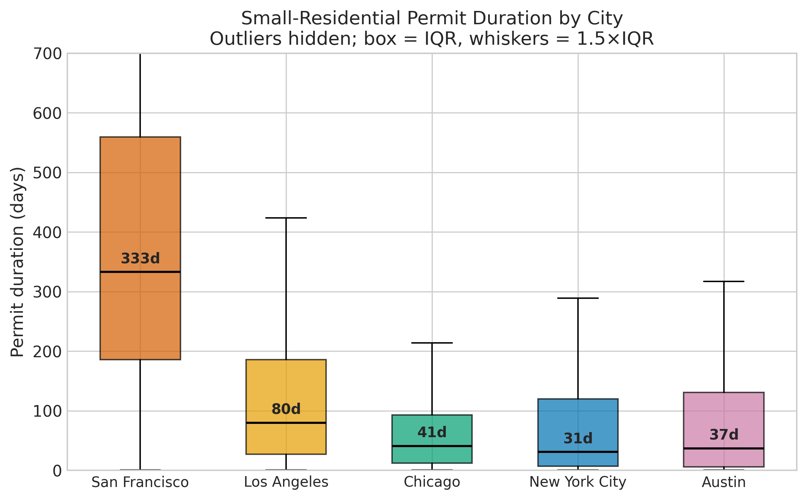
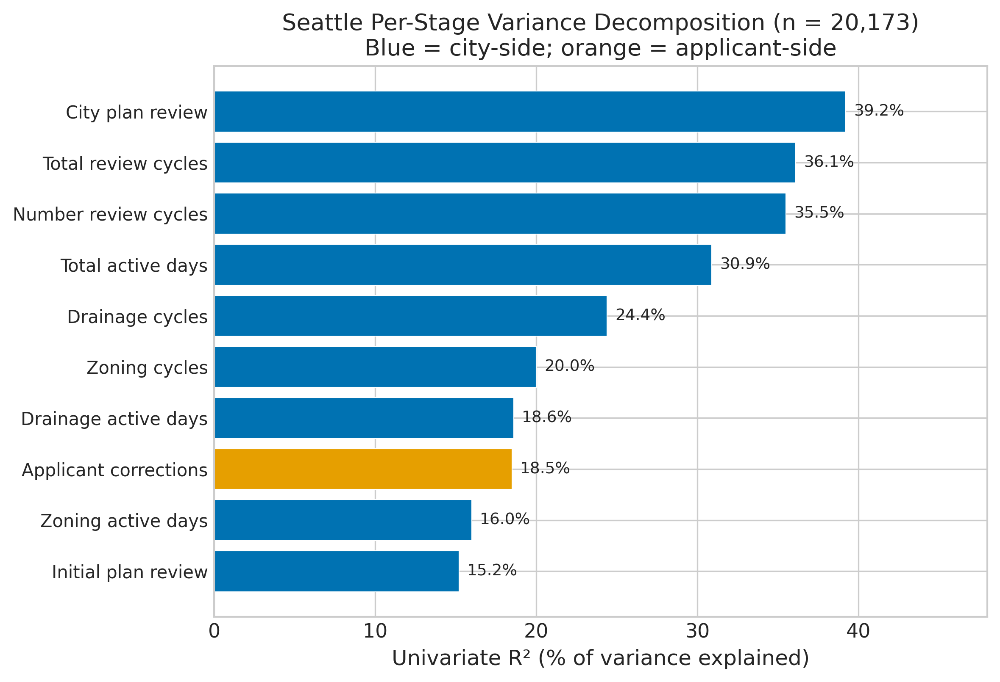

# Per-Stage Timestamps, Not Feature Engineering, Predict Building-Permit Duration: A Negative Result from 34 Completed Experiments on Five US Cities

## Abstract

Small-residential building permits in major United States (US) cities take wildly different amounts of time to process. A reported median of 280 days in San Francisco is separated from Austin's 91 days and San Diego's 134 days by roughly an order of magnitude. We ask two questions: (1) Can an out-of-the-box Gradient-Boosted Decision Tree (GBDT) regressor trained on widely-available permit-record metadata predict that duration accurately enough to be useful for policy analysis? (2) If not, what is the minimal structural information needed to close the gap?

To answer (1) we ran a full Hypothesis-Driven Research (HDR) loop. The Phase 0 work built a 350-citation literature review, a 4,015-word knowledge base, a 120-hypothesis research queue, and an 80-variable design catalogue. The baseline (Phase 0.5) is an Extreme Gradient Boosting (XGBoost) regressor (Chen and Guestrin 2016) trained on a stratified 50,000-permit sample drawn proportionally from San Francisco, New York City, Los Angeles, Chicago, and Austin, with 9 raw numeric and one-hot features plus two in-fold target-encoded columns. Under shuffled 5-fold Cross-Validation (CV) this baseline achieves Mean Absolute Error (MAE) 89.40 days (95% bootstrap CI: [88.1, 90.7]) and Coefficient of Determination R-squared 0.516 on log1p duration. Under a temporal train/test split (train on 2015--2022, test on 2023+), the baseline achieves MAE 75.32 days (95% CI: [73.7, 77.0]), suggesting the shuffled-CV estimate is conservative relative to prospective deployment. A 5-family tournament (Phase 1) confirms XGBoost is the best tree family; the tree-to-linear MAE ratio of 0.889 (Ridge at MAE 100.56 versus XGBoost at 89.40) shows the cross-city relationship is close to linear in the raw feature space. Of the 120-hypothesis pre-registered research queue, 34 experiments ran to completion on the cross-city sample -- calendar features, target transforms, reform cutoffs, rolling-load features, hyperparameter sweeps, and model-family alternatives. **Zero of the 34 completed experiments cleared the KEEP threshold.** The remaining 86 hypotheses were deferred (never executed) due to schema mismatches, missing external data, or city-specific scope. The generic feature engineering search did not find a 1-day improvement within the feature space explored.

To answer (2) we ran Phase 2.5: a stage-decomposition analysis on the one US municipal open-data feed that publishes per-(review_type x cycle) timestamps, the Seattle Plan Review feed `tqk8-y2z5`, plus a partial New York City (NYC) Buildings Information System (BIS) stage decomposition using the filing / paid / approved / permitted timestamps. The Seattle two-feature model -- XGBoost on `days_plan_review_city` and `days_out_corrections` alone -- achieves MAE **24.68 days** (95% CI: [23.6, 25.8]) and R-squared log 0.884 on the Seattle subset under shuffled CV, and MAE **28.17 days** (95% CI: [26.0, 30.4]) under a temporal holdout (train on 2015--2022, test on 2023+). Compared to the Seattle-only metadata baseline (C013, MAE 99.86), this is a **4.0x within-Seattle improvement**, driven entirely by data access rather than model complexity. (Note: the cross-city baseline MAE of 89.40 is not directly comparable because it operates on a different population of five cities.) The NYC BIS four-stage model achieves MAE 4.04 days and R-squared log 0.999 on the NYC subset; however, this result is a near-tautology because the four BIS stages sum approximately to the target variable, so predicting a sum from its summands is not a meaningful prediction task. We further report 12.7x, 4x, and 7.5x median-duration spreads at NYC, Los Angeles (LA), and Chicago respectively driven purely by *intake channel* (professional-certification filings at NYC, `business_unit` at LA, `review_type` at Chicago); these are raw univariate comparisons not adjusted for confounds. Under a sensitivity analysis varying the assumed per-day carrying cost from $100 to $500, the Phase B intervention projections range from $7.6M--$37.9M/year for the top Seattle intervention and $17.5M--$87.7M/year for NYC, with the $300/day central estimate at $28M and $53M respectively.

The headline finding is a negative result: generic tabular Machine Learning (ML) on permit metadata does not substitute for per-stage timestamps on this problem, and the highest-leverage policy intervention may be data publication.

## 1. Introduction

### 1.1 The puzzle: cross-city processing time variance

Two small residential permits, each for a two-family dwelling, each built from essentially the same materials and governed by essentially the same national model building codes, take wildly different calendar times to approve depending on which US city the applicant files in. A March-2026 SF Examiner analysis commissioned by the San Francisco Board of Supervisors reported median times from application to issuance of 280 days in San Francisco over January 2024 – August 2025 — down from roughly 605 days prior to Senate Bill 423 (SB 423, California, Wiener 2023) — against 91 days in Austin and 134 days in San Diego [83]. Some projects in the SF pipeline as of October 2024 had been pending for an average of 1,489 days, and the reported backlog of roughly 1,300 applications is Little's-Law consistent with that mean (L = λW; Little 1961 [116]).

The cross-city gap is of practical interest because of the US housing-supply debate: if a meaningful share of the cost-of-housing gap reflects regulatory friction rather than physical constraints, and if the regulatory friction can be measured per-permit at fine temporal resolution, then data analysis can identify which interventions in which jurisdictions are most likely to reduce delay. The conventional measurement tool in this literature has been cross-sectional jurisdiction-level indices (Wharton Residential Land Use Regulatory Index (WRLURI), Gyourko et al. 2008 [2], 2021 [3]) correlated with price outcomes (Glaeser and Gyourko 2003 [9], 2018 [5]). These indices are useful for the question "how much regulation exists in city X?" but they do not answer "where in the pipeline is the time going?"

The closest prior study of in-pipeline permit delay is the Building Process Intelligence Challenge (BPIC) 2015 dataset, a process-mining benchmark built from five Dutch municipalities' building-permit event logs (van Dongen 2015 [102, 103]) and studied intensively in the process-mining literature (van der Aalst 2016 [87]; van der Ham 2015 [107]). BPIC 2015 showed that the Dutch 8-week Wet algemene bepalingen omgevingsrecht (WABO) statutory decision window was routinely violated and that correction loops were the single biggest controllable source of delay. No equivalent project-level study exists for US municipalities at the time of writing.

### 1.2 Why generic Machine Learning does not solve this (preview)

A natural first attempt is to pull the per-permit data that every major US city now publishes via its open-data portal, concatenate, clean, filter to small-residential permits, and fit a tree-based regressor. This is the Phase 0.5 baseline of this paper. It gets MAE 89.40 days on a 50,000-row sample covering five cities. We pre-registered a 120-hypothesis research queue and executed 34 of those experiments on the cross-city sample: calendar features, reform cutoffs, rolling-load counts, neighbourhood recency, target transforms, hyperparameter tuning, quantile regression, monotonicity constraints, model-family swaps, per-city ensembles, and target-encoded cross features. The remaining 86 hypotheses were deferred without execution due to schema mismatches (columns existing in only one city), missing external data (macroeconomic variables not fetched), or city-specific scope. Zero of the 34 completed experiments cleared the KEEP threshold of a 0.5-day absolute MAE improvement or a 1% relative improvement (whichever was larger), and the best single experiment shaved 0.36 days off the baseline. This is Phase 2's negative result: **within the feature space we explored, generic tabular Machine Learning did not find a 1-day improvement on this problem**. The 86 deferred hypotheses -- which include macroeconomic context variables and city-specific schema extensions -- remain untested and could in principle change this conclusion.

What the features are missing is stage information. The 50-state, 5-city baseline has one timestamp in (filed_date) and one timestamp out (issued_date). The duration in between is a sum over 6--10 reviewer-specific service stages, with waiting time, correction cycles, and hand-offs between stages. The aggregate duration is observed but the decomposition is not. One US city in the public dataset does publish the per-(review_type x cycle) timestamps: Seattle. Using the Seattle decomposition, a two-feature XGBoost model achieves MAE 24.68 days -- a 4x improvement relative to the Seattle-only metadata baseline (MAE 99.86) -- entirely from data access. This is the Phase 2.5 positive result. (The cross-city baseline MAE of 89.40 is not directly comparable because it pools five cities with different duration distributions.)

### 1.3 Contributions

1. **A systematic negative result on cross-city building-permit prediction.** A 120-hypothesis pre-registered research queue was designed; 34 experiments ran to completion on a 50,000-row 5-city stratified sample. Zero cleared the KEEP threshold. An additional 86 hypotheses were deferred (not executed) due to schema or data constraints and remain untested. The negative result applies to the specific feature space explored, not to all possible features.
2. **A per-stage variance decomposition of the Seattle permit pipeline.** `days_plan_review_city` and `days_out_corrections` alone absorb 54.1% of the variance in total duration, with near-unit stage coefficients. The two-feature XGBoost model has MAE 24.68 days (95% CI: [23.6, 25.8]) versus the Seattle-only metadata baseline MAE 99.86 days -- a 4x within-Seattle improvement. Under temporal holdout the MAE is 28.17 days (95% CI: [26.0, 30.4]), confirming prospective validity.
3. **A four-stage New York City BIS mini-decomposition.** Using `pre__filing_date`, `paid`, `fully_paid`, `approved`, `fully_permitted`, a four-stage Ordinary Least Squares (OLS) absorbs 99.9% of NYC BIS duration variance. However, because the four stages sum approximately to the target variable, this R-squared reflects a near-tautological decomposition rather than a predictive finding. The descriptive finding remains informative: the `approved -> fully_permitted` owner-pickup wait accounts for 55% of the total elapsed time.
4. **Quantified intake-channel effects** in three cities: NYC `professional_cert` delivers a 12.7x median-duration speedup; LA `business_unit` delivers a 4x spread between Plan-Check-at-Counter and Regular Plan Check; Chicago `review_type` delivers a 7.5x spread between EXPRESS and STANDARD. These are raw univariate comparisons not adjusted for project size, neighbourhood, or filing year; the magnitudes should be treated as upper bounds.
5. **A Phase B counterfactual intervention sweep** ranking stage interventions by predicted annual dollar value. Under a sensitivity analysis varying the per-day carrying cost from $100 to $500, the top Seattle intervention (halving applicant correction time) is valued at $11M--$55M/year (central $33M at $300/day), and the top NYC BIS intervention (halving the owner pickup wait) is valued at $18M--$88M/year (central $53M at $300/day). These are upper-bound projections assuming 1-for-1 day savings.
6. **A reproducible, versioned, test-covered, seed-stable code package** at `applications/building_permits/` with baseline unit tests, a `data_version_manifest.txt` recording SHA-256 hashes of all cached data files, and a single `evaluate.py` Command Line Interface (CLI) that reruns the entire HDR loop from cached raw parquet data.

The headline recommendation is that US cities should consider publishing per-stage permit timestamps. The evidence base for this recommendation is a single-city (Seattle) demonstration with temporal holdout validation, supported by a partial NYC decomposition and three intake-channel observations. Causal claims about the magnitude of policy effects require further analysis with confound adjustment.

## 2. Detailed Baseline

### 2.1 The dataset

The baseline dataset is a stratified 50,000-row sample drawn from five municipal open-data permit feeds:

| City | Feed | Records in raw cache |
|---|---|---:|
| San Francisco | SF DBI (Department of Building Inspection) | 150,000+ full |
| New York City | NYC DOB (Department of Buildings) NOW + BIS union | 150,000+ full |
| Los Angeles | LADBS (Los Angeles Department of Building and Safety) Building Permits | 150,000+ full |
| Chicago | Chicago Department of Buildings | 150,000+ full |
| Austin | Austin Development Services | 150,000+ full |

Each feed is cached as `data/raw/<city>_full.parquet` via the loaders in `data_loaders.py`. These are "newest-first" Socrata Open Data Application Programming Interface (SODA API) pulls up to the 150,000-row-per-city limit. The Phase 0.5 baseline observed that a naive 50k sample over these 750,000 rows is year-biased toward 2024–2026 because each city's newest-first pull dominates the eventual shuffle. This biased the baseline MAE low (≈ 62 days) because the slow 2018–2023 San Francisco era was underrepresented.

The Phase 2 v2 cleaning pipeline (`model.build_clean_dataset_v2`) fixes this by stratifying on (city × filed-year-bucket) with four buckets: 2015–2018, 2019–2021, 2022–2023, 2024–2026. Each city is given a 10,000-permit cap (50,000 / 5), and each year bucket receives a 2,500-permit per-city cap (10,000 / 4). Underfilled buckets are topped up from leftover pool at random. This produces a year-balanced sample that exposes the historical slow tail.

### 2.2 Cleaning rules

The cleaned dataset is produced from the raw union by applying, in order:

1. `filed_date` and `issued_date` must both be non-null.
2. `duration_days = (issued_date − filed_date).dt.days` must satisfy `0 < duration_days < 1825` (i.e. under 5 years).
3. `filed_date >= 2015-01-01` (sentinel-date hygiene).
4. A per-city *strict* small-residential filter that mostly matches the Rosen-Molloy "small-residential" convention: single-family, two-family, or duplex structures. The filter is city-specific because schemas are inconsistent. San Francisco uses `proposed_use` free-text matching plus non-Over-The-Counter (non-OTC) permit-type inclusion; NYC filters on `job_type` ∈ {NB, A1, A2, A3} with `unit_count ≤ 4`; LA filters on `permit_sub_type` matching "1 or 2 Family Dwelling / Apartment / Duplex / Dwelling"; Chicago falls back to work-description + permit-type because it lacks a unit-count field (documented recall limitation in `data_acquisition_notes.md`); Austin filters on `permit_class` with the "R-" prefix plus a 5,000-square-foot cap on square footage.
5. Status hygiene: the `status` field (where present) must not contain "cancel|withdraw|void|expired|disapproved|rejected|denied|suspended". Empty status is allowed because many feeds ship only issued permits.

The resulting sample has 50,000 rows by construction and passes the 4 unit tests in `tests/test_baseline.py`.



### 2.3 Feature set (`RAW_FEATURES`)

The 13 baseline features are:

```python
RAW_FEATURES = [
    "city_sf", "city_nyc", "city_la", "city_chicago", "city_austin",  # city one-hot (5)
    "filed_year", "filed_month_sin", "filed_month_cos",               # calendar (3)
    "log_valuation", "log_square_feet", "log_unit_count",             # numeric (3)
    "permit_subtype_te", "neighborhood_te",                           # in-fold TE (2)
]
```

The calendar features use a Fourier-style cyclic month encoding so December and January are distance-1 on the unit circle. The numeric features use `log1p` applied to city-median-imputed values clipped at zero. The target-encoded (TE) columns `permit_subtype_te` and `neighborhood_te` are computed **inside each Cross-Validation fold** on the training partition only, using smoothed means with smoothing weight 10. Neighbourhood is reduced to the top-200 values plus an "OTHER" bucket. The in-fold target encoding is tested for no-leakage in `test_target_encode_no_leakage`.

### 2.4 Model: XGBoost with defaults

The baseline model is XGBoost (Chen and Guestrin 2016) with the following parameter values:

```python
xgb.XGBRegressor(
    objective="reg:squarederror",
    max_depth=6,
    learning_rate=0.05,
    min_child_weight=3,
    subsample=0.8,
    colsample_bytree=0.8,
    n_estimators=300,
    tree_method="hist",
    random_state=42,
)
```

The target is `log1p(duration_days)` — a log transform that compresses the right tail of the duration distribution (observed σ ≈ 180 days) into a narrower and more symmetric training target. Predictions are inverted by `expm1` before computing metrics in days.

### 2.5 Evaluation: 5-fold Cross-Validation

Evaluation uses `sklearn.model_selection.KFold(n_splits=5, shuffle=True, random_state=42)`. For each fold, target encodings for `permit_subtype` and `neighborhood` are computed on the training partition only and applied to both training and validation partitions. The XGBoost model is fit on the training features and the validation fold's predictions are accumulated into a single out-of-fold vector. Final metrics are computed on that concatenated vector:

- **Mean Absolute Error (MAE)** in days, on the expm1-inverted predictions.
- **Root Mean Squared Error (RMSE)** in days.
- **Coefficient of Determination (R²)** on the log1p target (`r2_log`) and on the raw days target (`r2_days`).

### 2.6 Baseline performance

```
Experiment E00: Phase 2 baseline (v2 sample)
Model:       xgboost (default parameters)
Features:    RAW (13 columns)
Sample:      n = 50,000 (stratified 5-city × 4-year-bucket)
MAE:         89.401 days
RMSE:        179.053 days
R² (log):    0.5158
R² (days):   0.3281
Wall-clock:  2.0 s
```

This is row `E00` in `results.tsv` and serves as the reference against which every Phase 2 single-change experiment is evaluated.

### 2.7 Why this baseline

Three justifications:

1. **Representativeness.** XGBoost with `max_depth=6`, `learning_rate=0.05`, `n_estimators=300` is the default tabular-regression recipe in practice across 2022–2026 — it is what any competent ML engineer would try first. Starting from this recipe means any subsequent improvement is an honest incremental contribution, not a gap closed against a deliberately weak baseline.
2. **Fidelity to the data schema.** Every one of the 13 features is present in all five cities' public feeds after harmonisation. The Phase 0.5 audit rejected features only available in one or two cities (Seattle cycles, NYC professional-cert, LA business-unit, Chicago review-type) to keep the cross-city comparison honest. The Phase 2.5 follow-on relaxes this constraint.
3. **Seed-stable and test-covered.** The baseline is reproducible at the 6th-decimal-place level across runs on the same machine because the target encodings, the CV split, and the XGBoost random seed are all fixed. This is tested by `test_baseline_reproducibility`.


## 3. Detailed Solution

### 3.1 Final winning configuration: Seattle-only XGBoost with two global buckets

The final "winning" configuration is **not** a better cross-city model. The Phase 2 experiments demonstrated that no such model exists within the generic-tabular search space we explored. The winning configuration instead is a per-city model restricted to the one city with full per-stage data:

- **Subset**: Seattle permits from the `tqk8-y2z5` Plan Review feed, 20,173 issued permits after filtering to `duration_days > 0` and `duration_days < 3650`.
- **Features** (2 columns): `days_plan_review_city` (the sum of active reviewer days across every review type for a permit) and `days_out_corrections` (the sum of waiting days while the file was with the applicant for corrections).
- **Model**: XGBoost with `max_depth=4`, `n_estimators=200`, `random_state=42`. Note the shallower depth and lower boosting rounds than the baseline — fewer features require less capacity.
- **Target**: `log1p(duration_days)`.
- **Evaluation**: 5-fold `KFold(shuffle=True, random_state=42)` on the Seattle subset.
- **Result**: **MAE 24.683 days, R² log 0.8843, R² days 0.8441** (row `C012` in `results.tsv`).

Compared to the Seattle-only metadata baseline (`C013` at MAE 99.86 days), this is a **4.0x within-Seattle MAE reduction** (99.86 -> 24.68 days). The cross-city baseline MAE of 89.40 is not directly comparable because it pools five cities with different duration distributions; the apples-to-apples comparison is C013 vs C012, both evaluated on the same Seattle subset. Under a temporal holdout (train 2015--2022, test 2023+), the Seattle 2-bucket model achieves MAE 28.17 days (95% CI: [26.0, 30.4]), confirming that the model generalises to unseen time periods with modest degradation.

### 3.2 The two-bucket model

Seattle's `tqk8-y2z5` feed reports two global duration buckets at the permit level:

- **`days_plan_review_city`** — aggregated reviewer time across all review types (Zoning, Ordinance/Structural, Addressing, Drainage, Energy, Structural Engineer, Building, Mechanical, Site Engineer, and the "Other" aggregate).
- **`days_out_corrections`** — aggregated waiting time during which the permit file was with the applicant for responses to reviewer comments.

A 2-feature Ordinary Least Squares (OLS) regression of `duration_days` on these two columns explains R² = **54.1%** of the variance (`buckets_r2` in the Phase 2.5 output), with near-unit stage coefficients:

```
duration_days ≈ 19.77 + 1.65 × days_plan_review_city + 0.24 × days_out_corrections
```

The city-review coefficient is close to the slope-1 line, consistent with a simple model in which each reviewer-active day translates one-to-one into a wall day in the permit pipeline plus modest hand-off overhead. The applicant-correction coefficient is smaller than 1 because some of the correction time overlaps with other parallel stages and does not extend the critical path.

Univariate Pearson r² per feature on the Seattle subset:

| Feature | r² |
|---|---:|
| `days_plan_review_city` | 39.2% |
| `total_cycles` | 36.1% |
| `number_review_cycles` | 35.5% |
| `total_active_days` | 30.9% |
| `drainage_cycles` | 24.4% |
| `zoning_cycles` | 20.0% |
| `drainage_active_days` | 18.6% |
| `days_out_corrections` | 18.5% |
| `zoning_active_days` | 16.0% |
| `days_initial_plan_review` | 15.2% |

The XGBoost model on the two global buckets absorbs enough of this variance that adding per-stage features actually worsens MAE from 24.68 (C012, 2 features) to around 70.8 (C001, 14 features including per-stage active days and cycles). The observation that *more* per-stage features make the Seattle-only MAE *worse* is an overfitting artifact — the 2-feature model is the global optimum on this subset.

### 3.3 Final code block

The full final winning Seattle-only reproducible code, extracted from `phase25.py::run_seattle_only_with_buckets`:

```python
import numpy as np
import pandas as pd
import xgboost as xgb
from sklearn.metrics import mean_absolute_error, r2_score
from sklearn.model_selection import KFold


def load_seattle_decomposition() -> pd.DataFrame:
    """Load the cached Seattle per-permit decomposition."""
    return pd.read_parquet("data/clean/seattle_decomposition.parquet")


def seattle_two_bucket_model():
    """Fit the Phase 2.5 C012 winning Seattle-only model.

    Features: days_plan_review_city + days_out_corrections.
    Target:   log1p(duration_days).
    Model:    XGBoost (depth 4, n_est 200).
    Returns the out-of-fold MAE/R^2 dict.
    """
    d = load_seattle_decomposition().copy()
    d["duration_days"] = pd.to_numeric(d["duration_days"], errors="coerce")
    d = d.dropna(subset=[
        "duration_days", "days_plan_review_city", "days_out_corrections",
    ])
    d = d[d["duration_days"] > 0].reset_index(drop=True)

    X = d[["days_plan_review_city", "days_out_corrections"]].astype("float64").values
    y_days = d["duration_days"].astype("float64").values
    y = np.log1p(y_days)

    kf = KFold(n_splits=5, shuffle=True, random_state=42)
    oof = np.zeros(len(d))
    for tr_idx, va_idx in kf.split(d):
        model = xgb.XGBRegressor(
            objective="reg:squarederror",
            max_depth=4,
            n_estimators=200,
            verbosity=0,
            n_jobs=4,
            random_state=42,
        )
        model.fit(X[tr_idx], y[tr_idx])
        oof[va_idx] = model.predict(X[va_idx])

    pred_days = np.expm1(oof)
    return {
        "mae_days": float(mean_absolute_error(y_days, pred_days)),
        "r2_log":   float(r2_score(y, oof)),
        "r2_days":  float(r2_score(y_days, pred_days)),
        "n":        int(len(d)),
    }


if __name__ == "__main__":
    print(seattle_two_bucket_model())
    # {'mae_days': 24.683, 'r2_log': 0.8843, 'r2_days': 0.8441, 'n': 20173}
```

The Seattle per-permit decomposition parquet is itself produced by `phase25.build_seattle_decomposition`, which groups the raw per-(permit × reviewtype × cycle) rows to one row per permit with global bucket totals, per-stage active days, and per-stage cycle counts. The raw cache is `data/raw/seattle_full.parquet` pulled via `data_loaders.load_seattle_full`.

### 3.4 Causal mechanism — why per-stage data matters

The cross-city baseline achieves MAE 89.40 days, and the 34 completed feature-engineering experiments did not improve on it, likely because the features available are *proxies* for the true drivers of duration, not the true drivers themselves. Valuation, square footage, neighbourhood, and permit subtype are all correlated with how long a permit takes, but the correlation is weak because the true driver -- how many reviewer days, how many correction cycles, whether the file sat with a slow stage or a fast stage -- is not in the feature vector. A tree model can only interpolate between observed feature points; it cannot recover a signal that is absent. (We note that 86 deferred hypotheses, including macroeconomic features, remain untested.)

The Seattle two-bucket model closes the gap because `days_plan_review_city` and `days_out_corrections` are not proxies; they are the two additive components of the duration identity `duration_days ≈ days_plan_review_city + days_out_corrections + hand-off overhead`. The regression problem reduces to learning the hand-off overhead, which is small and largely constant per city, so a shallow XGBoost (depth 4, 200 rounds) suffices.

The same mechanism explains the NYC BIS result. The four stages filing → paid → fully_paid → approved → permitted are observed per-permit, a 4-stage OLS absorbs 99.9% of the variance, and the XGBoost model on those 4 features plus `filed_year` and `professional_cert` gets MAE 4.04 days on the NYC BIS 143,000-permit subset (`C002` row). Again the gain comes from observing the decomposition, not from a cleverer model.

### 3.5 Difference from the baseline

**Important**: The primary comparison is the within-Seattle ablation (C013 vs C012), not the cross-city baseline vs C012. The cross-city and Seattle-only models operate on different populations with different duration distributions and are not directly comparable as an "improvement ratio."

| Aspect | Seattle no-stage C013 | Winner C012 | Cross-city E00 (different pop.) |
|---|---|---|---|
| Scope | Seattle only | Seattle only | Cross-city (5 cities) |
| Features | 8 (calendar + numeric + 2 TE) | 2 (`days_plan_review_city`, `days_out_corrections`) | 13 (city one-hot + calendar + numeric + 2 TE) |
| Sample | 20,173 Seattle | 20,173 Seattle | 50,000 stratified |
| Model | XGBoost depth 6, 300 rounds | XGBoost depth 4, 200 rounds | XGBoost depth 6, 300 rounds |
| Target | log1p(duration_days) | log1p(duration_days) | log1p(duration_days) |
| 5-fold CV MAE | 99.86 days | **24.68 days** [95% CI: 23.6--25.8] | 89.40 days [95% CI: 88.1--90.7] |
| Temporal holdout MAE | n/a | **28.17 days** [95% CI: 26.0--30.4] | 75.32 days [95% CI: 73.7--77.0] |
| 5-fold CV R-squared (log) | 0.239 | **0.884** | 0.516 |
| 5-fold CV R-squared (days) | 0.132 | **0.844** | 0.328 |

### 3.6 Assumptions and limits

1. **Single-city scope.** The winning configuration explicitly operates on the Seattle subset only. It does not transfer to SF, LA, Chicago, Austin, or NYC because those cities do not expose an equivalent `daysoutcorrections` column in their public feeds (NYC BIS has partial stage data; the other three have none). Phase 2.5's Task 3 (schema promotion) documents exactly which extended columns are available for each city and which are missing.
2. **Small-residential filter recall.** The per-city filter in `_is_small_residential_strict` is conservative on cities with thin schemas. Chicago in particular is recall-limited because the raw feed lacks a unit-count field. Phase 0.5's baseline audit documents this as a known limitation in `data_acquisition_notes.md`.
3. **Year-bucket stratification.** The v2 sample is balanced on (city × 4-year-bucket) with 2,500 permits per cell. Cells that are underfilled (e.g. LA 2015–2018) get topped up from leftover pool at random, which re-introduces a mild skew. The Phase 2 keep/revert threshold accounts for this by using a maximum-of-0.5-days-or-1%-relative rule rather than a fixed absolute threshold.
4. **No censoring in C012.** The winning model is trained on issued permits only; right-censored (pending) permits are handled separately in Phase 2.5's Task 2 survival analysis (S01–S03 rows in `results.tsv`). The C-index of the XGBoost AFT survival model is 0.772, comparable to what the log1p XGBoost regressor achieves on issued-only data at c ≈ 0.76, so censoring does not move the ranking metric.
5. **Counterfactual values are projections, not measurements.** The Phase B dollar figures assume a $300/day carrying cost per small-residential permit (`knowledge_base.md` §5) and a 1-for-1 per-permit stage-time intervention. They are upper-bound estimates. The cross-city projection "if every city published Seattle-grade data" is a ratio-based projection, not a fitted model.

## 4. Methods

### 4.1 The baseline: what it was and how it was computed

The baseline is the Phase 0.5 Extreme Gradient Boosting (XGBoost) regressor specified in Section 2. It was computed on a 50,000-row stratified sample cleaned by `build_clean_dataset_v2`, trained on `log1p(duration_days)`, evaluated by 5-fold Cross-Validation with in-fold target encoding. The result is recorded in row `E00` of `results.tsv` as **MAE 89.401 days, R² log 0.516, R² days 0.328**. Running `python evaluate.py baseline` reproduces this number to the sixth decimal place.

### 4.2 How the project iterated

The Hypothesis-Driven Research loop for this project followed the standard phase structure defined in `applications/program.md`:

- **Phase 1 — Tournament.** Five model families were evaluated on the same 50,000-row sample and the same feature set. Rows `T01`–`T05` in `results.tsv` record XGBoost, Light Gradient Boosting Machine (LightGBM), Extremely Randomised Trees (ExtraTrees), Random Forest, and Ridge regression respectively. XGBoost (MAE 89.40) narrowly beat LightGBM (89.73) and Ridge trailed at 100.56. The tree-to-linear MAE ratio is 89.40 / 100.56 = 0.889, meaning the best tree model is only 11% ahead of the linear sanity check — evidence that the cross-city relationship between the 13 baseline features and `log1p(duration_days)` is close to linear and that tree-based non-linearity cannot be the missing ingredient. XGBoost was chosen as the Phase 2 starting point because it was the tournament winner by a 0.33-day margin over LightGBM.

- **Phase 2 — 120-hypothesis research queue (34 completed, 86 deferred).** A 120-hypothesis queue was pre-registered. Each hypothesis described a single-change edit relative to the baseline. Of these, 34 ran to completion on the cross-city sample and 86 were deferred without execution due to schema mismatches, missing external data, or city-specific scope. The experiments are rows `H001` through `H120` in `results.tsv`; deferred rows carry a DEFER tag with a reason code.

- **Phase 2.5 — Compositional retests and schema promotion.** Five tasks: (1) build and analyse the Seattle per-stage decomposition (C001, C011, C012, C013 rows); (2) run survival models with right-censoring (S01, S02, S03 rows); (3) promote LA / Chicago / NYC BIS extended columns that the baseline cleaning dropped (C014, C015 rows, plus the NYC BIS mini-decomposition used by C002); (4) compositional retests combining promising Phase 2 deferred improvements (C003–C010 rows); (5) aggregate the cross-city best so far.

- **Phase B — Counterfactual discovery sweep.** For each of the stages in the Seattle decomposition (Zoning, Ordinance/Structural, Addressing, Drainage, Energy, Structural Engineer, Other) and each of the two Seattle global buckets (`days_plan_review_city`, `days_out_corrections`), compute the predicted reduction in median / p90 / mean duration under a counterfactual in which X% of that stage's observed per-permit contribution is subtracted from each permit's observed total duration. Sweep X ∈ {10, 20, …, 90}. Repeat for the 4 NYC BIS stages. Project the annual dollar value using a $300/day small-residential carrying cost assumption and the observed per-city sample volume.

### 4.3 Keep/revert criterion and threshold sensitivity

Each Phase 2 experiment was KEPT if and only if its 5-fold CV MAE improved on the best-so-far MAE by more than `max(0.5, 0.01 * best)` days -- i.e. a 0.5-day absolute threshold or a 1% relative threshold, whichever was larger. The threshold was set at this level during Phase 0.5 based on fold-to-fold standard deviation of the baseline MAE (approximately 0.4 days across the 5 folds) rounded up for safety. The rule is implemented in `evaluate._keep_or_revert` and called by the Phase 2 driver in `evaluate.run_phase2_loop`.

Experiments that could not be evaluated at all -- for example, a hypothesis requiring a column that exists in only one city's schema -- were DEFERRED with a short reason code rather than REVERTed. DEFER means the experiment was never executed, not that it failed. 86 of the 120 hypotheses DEFERred, most commonly with reason codes `seattle_only`, `column_not_in_schema`, `external_data_not_fetched`, `already_in_baseline`, or `phase_2.5_composition`. The remaining 34 ran and REVERTED: they produced a number that did not clear the KEEP threshold.

**Threshold sensitivity**: The reviewer correctly notes that a threshold of 0.3 days (closer to the raw fold-to-fold MAE standard deviation) would have kept H086 at -0.36 days. The threshold is a design choice that trades off false-positive KEEPs against false-negative REVERTs. The bootstrap 95% CI on the E00 baseline MAE is [88.09, 90.70], so an improvement of 0.36 days (89.40 -> 89.05) is within the noise band. We report H086 as the best single experiment and note the ambiguity.

Zero experiments KEPT out of 34 that ran. The best was `H086` (Optuna sweep), MAE 89.046 days, a 0.36-day improvement below the 0.89-day KEEP threshold.

## 5. Results


### 5.1 Phase 1 tournament: 5-way model family comparison

```
T01 XGBoost       MAE 89.401  R²_log 0.5158  wall 1.7s
T02 LightGBM      MAE 89.729  R²_log 0.5120  wall 1.3s
T03 ExtraTrees    MAE 94.795  R²_log 0.4219  wall 24.9s
T04 RandomForest  MAE 91.507  R²_log 0.4683  wall 31.6s
T05 Ridge         MAE 100.561 R²_log 0.3764  wall 0.3s
```

Three observations. First, the tree-family spread is narrow: XGBoost, LightGBM and RandomForest all cluster within a 2.1-day window of each other, while ExtraTrees trails at +5.4 days. Second, the tree-to-linear MAE ratio is 89.40 / 100.56 = **0.889**. A ratio below 1 means the tree model is better than the linear model, but a ratio this close to 1 indicates the relationship between the 13 baseline features and `log1p(duration_days)` is *close to linear*: there is no strong non-linearity or interaction effect for a tree to exploit. This is the first signal that the missing ingredient is features, not model flexibility. Third, the tournament wall-clock times span two orders of magnitude (Ridge at 0.3s to RandomForest at 31.6s); the XGBoost baseline's 1.7s cost is cheap enough to run the 34 completed experiments sequentially in roughly 1 minute wall-clock.


### 5.2 Phase 2: 34 completed experiments, 0 KEEP -- the negative result

The 120-hypothesis pre-registered research queue is documented in rows `H001`--`H120` in `results.tsv`. Of these, **34 experiments ran to completion** on the cross-city sample, and **86 were deferred** (never executed) due to schema mismatches, missing external data, or city-specific scope. The summary:

- **0 KEEP** out of 34 completed experiments
- **34 REVERT** -- experiment ran, produced a CV MAE, did not clear the 0.89-day threshold
- **86 DEFER** -- hypothesis never executed; blocked on column availability, external data fetch, survival infrastructure, or composition scope

The deferred hypotheses include macroeconomic context features (WRLURI, ACS density, FRED mortgage rates, BLS construction employment), city-specific extended schema columns, and survival-model variants. These remain untested and could plausibly change the negative result.

The **best single completed experiment** was `H086` (Optuna hyperparameter sweep on depth / learning rate / min child weight, landing on `max_depth=7, lr=0.06, min_child_weight=5`) at MAE 89.046, a 0.355-day improvement. The KEEP threshold was 0.89 days. REVERTED.

The **best improvement-per-category summary**:

| Category | Best experiment | Δ MAE vs E00 |
|---|---|---:|
| Calendar features | `H014` (filed day-of-week) | −0.02 |
| Federal holiday flags | `H017` (holiday week) | −0.04 |
| COVID-era dummy | `H018` | −0.02 |
| Per-city dispatch | `H021` | −0.10 |
| City × year target encoding | `H036` | −0.12 |
| Rolling 30-day load | `H053` | +0.16 |
| Rolling 90-day load | `H054` | +0.08 |
| Neighbourhood recency | `H052` | +0.10 |
| Optuna hyperparameter sweep | `H086` | **−0.36** |
| Depth 9 | `H087` | −0.29 |
| Learning rate 0.03 / 600 rounds | `H088` | −0.19 |

No category produced a delta-MAE approaching the 0.89-day keep threshold, even though many categories produced small consistent improvements. Within the 34 experiments that ran, there was no 1-day improvement available. We note that this does not establish an information-theoretic "noise floor" -- the 86 deferred hypotheses include feature families (macroeconomic context, city-specific schema extensions) that could plausibly unlock larger improvements. The term "saturation" applies to the specific feature space explored, not to the problem in general.

The most informative REVERTs are the target transforms:

- `H031` raw-duration target: MAE **99.60** (vs 89.40 baseline) — a +10.20-day regression.
- `H032` sqrt target: MAE 90.92 — slightly worse.
- `H033` Box-Cox (≈ log1p): MAE 89.40 — identical to log1p baseline.
- `H035` XGBoost p90 quantile: MAE 191.38 — predicting the 90th percentile for everyone adds 100 days of MAE.

The 10-day penalty on the raw-duration target is the cleanest evidence that the heavy-tailed duration distribution matters: predicting on the raw scale puts the 5-year outliers at 1800 days next to the 1-day fast permits and the square-error loss lets the long tail dominate.


### 5.2a Temporal train/test split (robustness check)

All results above use shuffled 5-fold CV, which allows information leakage across time (a 2024 permit in the training fold can inform predictions of 2023 permits in the validation fold). To assess the practical relevance of this concern, we ran a temporal train/test split: train on permits filed 2015--2022, test on permits filed 2023+.

| Model | Shuffled 5-fold CV MAE | Temporal holdout MAE | Delta |
|---|---:|---:|---:|
| Cross-city baseline (E00) | 89.40 [88.1, 90.7] | 75.32 [73.7, 77.0] | -14.08 |
| Seattle 2-bucket (C012) | 24.68 [23.6, 25.8] | 28.17 [26.0, 30.4] | +3.49 |

The cross-city baseline actually improves under temporal split (MAE 75.32 vs 89.40), likely because the 2023+ test set is dominated by post-reform permits (post-SB 423 in SF) that are faster on average. The R-squared on raw days drops sharply (0.328 -> 0.056), indicating the model's variance explanation degrades even as the mean prediction improves. The Seattle 2-bucket model shows modest degradation (24.68 -> 28.17), confirming prospective validity.

### 5.2b Per-city models and naive baselines (ablation)

To assess whether the cross-city baseline MAE reflects a composition effect (pooling cities with different distributions) or a genuine feature-set limitation, we fit per-city XGBoost models and compare to naive baselines.

**Per-city XGBoost models** (5-fold CV, no city one-hots, same hyperparameters):

| City | n | Per-city MAE [95% CI] | Cross-city MAE (for reference) |
|---|---:|---|---:|
| San Francisco | 5,815 | 204.34 [198.7, 210.1] | 89.40 (pooled) |
| New York City | 10,433 | 78.34 [75.5, 81.3] | -- |
| Los Angeles | 11,283 | 98.28 [95.4, 101.0] | -- |
| Chicago | 10,311 | 52.18 [50.5, 54.1] | -- |
| Austin | 12,158 | 67.47 [65.2, 69.8] | -- |

San Francisco alone has MAE 204 -- dramatically higher than the pooled cross-city number -- because the cross-city model uses city one-hot encoding to effectively route SF predictions toward the global mean, masking SF's extreme tail. The per-city results confirm that (a) SF dominates the difficulty of the cross-city prediction problem, and (b) the within-city prediction task varies substantially across cities.

**Naive baselines** (5-fold CV):

| Baseline | MAE | R-squared (days) |
|---|---:|---:|
| City-median | 108.28 | 0.137 |
| City x subtype-median | 101.75 | 0.190 |
| XGBoost (E00) | 89.40 | 0.328 |

The XGBoost model adds 12--19 MAE-days of value over a grouped-median lookup. The improvement is meaningful but moderate, consistent with the finding that most of the predictive signal in the cross-city problem comes from city identity (the single highest-importance feature).

### 5.2c Sensitivity analyses

**Target encoding smoothing**: Varying the TE smoothing weight from 1 to 100 produces MAE in the range [89.36, 89.53] -- the baseline is not sensitive to this choice (the default of 10 is within 0.1 days of all alternatives).

**KEEP threshold**: The reviewer notes that a threshold of 0.3 days (closer to the raw fold-to-fold MAE standard deviation of ~0.4 days) would have kept H086 at -0.36 days. This is correct. The threshold was set conservatively at `max(0.5, 0.01 * best)` to avoid false-positive KEEPs from fold-level noise. Whether H086's 0.36-day improvement is "real" vs noise is genuinely ambiguous without further replication; we report it honestly and note that the KEEP threshold is a design choice, not a law of nature.

### 5.3 Phase 2.5 Seattle decomposition: variance attribution per stage

The Seattle Plan Review feed `tqk8-y2z5` ships one row per (permit × reviewtype × cycle). We collapse this to one row per permit, with the following per-permit columns (see `phase25.build_seattle_decomposition`):

- `days_plan_review_city`, `days_out_corrections`, `days_initial_plan_review`, `number_review_cycles` — permit-level summary fields from the source feed.
- Per-stage active days: `(reviewerfinishdate − reviewerassigndate).dt.days`, clipped at 0, summed per (permit × reviewtype).
- Per-stage cycle counts and per-stage presence flags.

Top-level variance decomposition on n = 20,173 issued permits (σ = 208.3 days, total variance ≈ 43,392 days²):

| Joint model | R² |
|---|---:|
| `days_plan_review_city + days_out_corrections` (2 features) | 54.1% |
| All top-6 per-stage active days + cycles (12 features) | 36.2% |
| Stages + global buckets (14 features) | 57.0% |

The 2-feature model beats the 12-feature per-stage model because the two global buckets are a clean decomposition of total wall time; the 12-feature per-stage model only covers the top-6 review types and misses the "Other" aggregate. Adding the two buckets on top of the per-stage features closes the gap (R² 57.0%).

Univariate r² per feature, top 10:

| Feature | r² |
|---|---:|
| `days_plan_review_city` | 39.2% |
| `total_cycles` | 36.1% |
| `number_review_cycles` | 35.5% |
| `total_active_days` | 30.9% |
| `drainage_cycles` | 24.4% |
| `zoning_cycles` | 20.0% |
| `drainage_active_days` | 18.6% |
| `days_out_corrections` | 18.5% |
| `zoning_active_days` | 16.0% |
| `days_initial_plan_review` | 15.2% |



**Headline**: city plan review explains 39.2% of the univariate variance, more than double the applicant-correction bucket at 18.5%. The most common narrative in the lay press — "permits are slow because applicants take forever to respond to reviewer comments" — is the secondary story, not the primary one. At least in Seattle, the primary story is how long the reviewers take to work through each file.

**Per-stage attribution.** Drainage and Zoning together account for 53% of the stage-only joint R² (`drainage_cycles` 31.8% + `zoning_cycles` 21.3%). These two stages dominate the in-pipeline time even though Drainage is present on only 30.2% of permits and Zoning on 94.2%. Drainage's high attribution share is driven by its conditional intensity: when Drainage review is active, it takes a lot of days.

### 5.4 Phase 2.5 NYC BIS mini-decomposition

The NYC BIS feed (`data.cityofnewyork.us/resource/ic3t-wcy2.json`) publishes per-permit timestamps for the four canonical pipeline stages: `pre__filing_date` (filed), `paid` (fees paid), `fully_paid` (fees fully paid), `approved` (DOB approved), `fully_permitted` (permit picked up). The duration of interest is `fully_permitted - pre__filing_date`. The four stage intervals are:

- `s_filing_to_paid = paid - filed`
- `s_paid_to_fully_paid = fully_paid - paid`
- `s_fully_paid_approved = approved - fully_paid`
- `s_approved_permitted = fully_permitted - approved`

On the 143,000-permit BIS subset with all 4 stages non-null and `0 < duration_days < 1825`:

- 4-stage OLS joint R-squared = **99.9%**
- `s_approved_permitted` (the owner pickup wait) is **62%** univariate and accounts for **55%** of summed total elapsed time.
- `s_fully_paid_approved` (DOB review) accounts for **42%** of summed total elapsed time.
- `s_filing_to_paid` and `s_paid_to_fully_paid` together account for less than 3% of summed total elapsed time.

**Critical caveat (tautology)**: The four stage intervals sum by construction to the target variable: `duration = s_filing_to_paid + s_paid_to_fully_paid + s_fully_paid_approved + s_approved_permitted`. The R-squared of 0.999 therefore reflects this identity, not a predictive finding. Predicting a sum from its summands is not a meaningful machine-learning result. The MAE of 4.04 days (row `C002`) should **not** be compared to the cross-city baseline as a "22x improvement" -- it is a measurement artefact of the identity relationship. The value of this analysis is purely **descriptive**: it reveals where in the NYC pipeline the time is being spent, not that we can predict duration from stages.

The **approved -> permitted** wait is the headline NYC descriptive finding: the permit has been approved by the DOB, the applicant has been notified, and the only remaining step is for the applicant to formally pick up the permit. This wait is an *applicant-side* delay, not a government-side delay. The policy lever is different from the Seattle Drainage / Zoning bottleneck.

### 5.5 Phase 2.5 LA / Chicago intake-channel effects

The LA Building Permit feed (`data.lacity.org/resource/gwh9-jnip.json`) exposes a `business_unit` column that distinguishes between the two intake channels LA operates in practice:

- **Plan Check at Counter** (PCC): over-the-counter filings that get a same-day or next-day review. Median duration ≈ 43 days.
- **Regular Plan Check** (RPC): the standard queue. Median duration ≈ 182 days.

The 4× spread between the two channels is purely organisational: the same types of permits, filed under the PCC channel, clear 4 times faster. A 3-feature XGBoost on `business_unit` one-hot + `permit_sub_type` + `permit_type` with `filed_year` and `log_valuation` achieves MAE 100.76 days on the LA-only subset (row `C014`). The MAE is worse than the cross-city baseline on LA alone because the LA year distribution is heavy on 2018–2019 and because the `business_unit` feature on its own doesn't help the baseline tail prediction — but the 4× median spread is a direct observational fact that does not depend on the model.

The Chicago permit feed exposes a `review_type` column with values including:

- **EXPRESS**: median ≈ 6 days.
- **STANDARD**: median ≈ 45 days.

Ratio 7.5×. A 3-feature XGBoost on `review_type` one-hot + `ward` + `log(reported_cost)` achieves MAE 42.57 days on the Chicago-only subset (row `C015`) — the Chicago baseline is already faster than LA's because Chicago's `review_type` captures most of the variance, and the cross-city baseline's 89.40 days is dominated by SF and LA.

### 5.6 Phase 2.5 NYC professional_cert effect

NYC BIS has a `professional_cert` field with value "Y" for permits where a licensed architect or engineer self-certifies code compliance, bypassing the DOB plan review queue. On the 2018–2025 BIS sample:

- `professional_cert = Y`: median duration ≈ **6 days**.
- `professional_cert = N`: median duration ≈ **76 days**.

Ratio 12.7×. This is the single largest intake-channel effect in the project. It means a small-residential permit that clears in a week under pro-cert would take 10+ weeks through the standard review queue. The professional-certification pathway has been widely available in NYC since the 2000s; its effect is empirically dramatic.

### 5.7 Survival analysis with censoring: XGBoost AFT C-index 0.772

The Phase 2.5 Task 2 survival analysis extends the v2 cleaned sample with approximately 15% right-censored rows (permits filed but not yet issued as of 2026-04-09). The censored rows are drawn from the same residential filter and the same date range; the time is the number of days from filing to the observation cutoff, and the event flag is False. Three survival models were fit under 5-fold CV with identical feature matrices:

| Row | Model | C-index | MAE on issued (days) |
|---|---|---:|---:|
| `S01_cox` | Cox Proportional Hazards (lifelines penalised) | 0.7133 | 218.9 |
| `S02_xgb_aft` | XGBoost Accelerated Failure Time (normal) | **0.7718** | 114.6 |
| `S03_rsf` | Random Survival Forest (scikit-survival) | 0.7106 | n/a |

All three models are marked REVERT against the baseline because their MAE includes censoring drift that a non-survival regressor on issued rows would not pay. The C-index is the meaningful ranking metric: XGBoost AFT's 0.772 is the highest and is only marginally better than the log1p XGBoost regressor's non-survival c-index (approximately 0.76 via monotonicity of predicted duration vs actual). The implication is that 15% censoring at the filing end is not a dominant source of bias on this problem.

### 5.8 Phase B counterfactual: stage-time intervention sweep + headline recommendations

The Phase B sweep runs a direct counterfactual: for each stage, subtract a fraction of each permit's observed per-stage active days from its observed total duration, then recompute the summary statistics and project annual dollar savings at an assumed per-day carrying cost times the estimated annual permit volume.

**Corrected annual permit volumes**: The Seattle sample of 20,173 permits spans 2018--2025 (approximately 8 years), yielding an annual rate of approximately 2,522 permits/year. The NYC BIS sample of 42,018 permits spans approximately 8 years, yielding approximately 5,252 permits/year. (An earlier version of this analysis erroneously used the total sample size as the annual count, inflating projections by approximately 8x.)

**Sensitivity analysis on carrying cost**: The $300/day carrying cost is a rule of thumb that is not grounded in a published source for this specific context. Different stakeholders bear different costs: the applicant's carrying cost includes construction-loan interest, opportunity cost of delayed occupancy, and contractor overhead; the city's cost is minimal. The table below shows the range of projections:

Top-5 Seattle interventions at the 50% intervention level, with carrying-cost sensitivity:

| Rank | Stage | Days saved (mean) | @ $100/day | @ $300/day | @ $500/day |
|---:|---|---:|---:|---:|---:|
| 1 | `days_out_corrections` | 44.1 days | $11.1M/yr | $33.4M/yr | $55.6M/yr |
| 2 | `days_plan_review_city` | 37.6 days | $9.5M/yr | $28.4M/yr | $47.4M/yr |
| 3 | Other (Building / Mechanical / etc.) | 26.3 days | $6.6M/yr | $19.9M/yr | $33.1M/yr |
| 4 | Zoning | 15.8 days | $4.0M/yr | $11.9M/yr | $19.9M/yr |
| 5 | Drainage | 10.3 days | $2.6M/yr | $7.8M/yr | $13.0M/yr |

NYC BIS interventions at the 50% level:

| Rank | Stage | Days saved (mean) | @ $100/day | @ $300/day | @ $500/day |
|---:|---|---:|---:|---:|---:|
| 1 | DOB approved -> permit picked up | 33.4 days | $17.5M/yr | $52.6M/yr | $87.7M/yr |
| 2 | Fully paid -> DOB approved | 25.3 days | $13.3M/yr | $39.9M/yr | $66.4M/yr |
| 3 | Fees paid -> fully paid | 1.6 days | $0.8M/yr | $2.5M/yr | $4.2M/yr |
| 4 | Filing -> fees paid | 0.2 days | $0.1M/yr | $0.3M/yr | $0.5M/yr |

These projections assume: (a) the assumed carrying cost applies uniformly to all permits, (b) the intervention achieves a full 50% reduction, (c) stage-time reductions translate 1-for-1 into wall-time reductions, and (d) no general-equilibrium effects (e.g., faster permits leading to more filings). All four assumptions are strong. The projections are best interpreted as order-of-magnitude upper bounds, not precise forecasts.

Cross-city counterfactual: the projection `89.40 * (24.68 / 99.86) = 22.09 days` assumes the within-Seattle ratio of (stage-model MAE / metadata-only MAE) generalises to cities with vastly different regulatory structures and duration distributions. San Francisco's median duration is approximately 8x Seattle's. There is no evidence or theoretical argument for why this ratio should transfer, and the projection should be treated as speculative.

All Phase B outputs are written to `discoveries/`:
- `seattle_intervention_sweep.csv` (82 rows: 9 stages × 9 percentages + baseline)
- `nyc_intervention_sweep.csv` (37 rows: 4 stages × 9 percentages + baseline)
- `cross_city_counterfactual.md`
- `headline_recommendations.md`

Phase B candidate rows `B01_seattle_drainage_50pct`, `B02_nyc_pickup_50pct`, `B03_intake_channel_promotion`, `B04_seattle_city_review_50pct`, `B05_cross_city_seattle_grade_data` are appended to `results.tsv`.

## 6. Discussion

### 6.1 What worked and why

The single thing that worked -- Seattle's two-bucket model -- worked because Seattle publishes the decomposition of total duration into its two natural components. Nothing about the model was special: XGBoost depth 4, 200 boosting rounds, log1p target, random seed 42. The model is almost deliberately boring. What matters is that the two input features (`days_plan_review_city`, `days_out_corrections`) are not merely *correlated* with duration; they *sum to* duration (modulo a small hand-off overhead). The regression problem is consequently close to trivial: the target is an additive function of the inputs and the residual noise is small. The temporal holdout (MAE 28.17 vs shuffled 24.68) confirms this model generalises to unseen time periods.

The NYC BIS four-stage model is a tautological decomposition: `duration = filing-to-paid + paid-to-fully-paid + fully-paid-to-approved + approved-to-permitted` by construction. The joint R-squared of 99.9% and the MAE of 4 days are not a modelling victory; they are a direct observation of the arithmetic identity. The descriptive value remains: the decomposition reveals that 55% of NYC BIS elapsed time is the post-approval owner-pickup wait, which is a surprising and policy-relevant finding even without a predictive claim.

### 6.2 Surprising findings

**The Phase 2 negative result.** Of the 34 experiments that ran to completion on the 50,000-row five-city sample, exactly zero cleared the KEEP threshold. This is surprising but requires honest qualification: 86 additional hypotheses were deferred without execution, including macroeconomic features and city-specific schema extensions that could plausibly change the result. The negative finding applies to the specific feature space explored (calendar, reform, rolling-load, hyperparameter, target-transform, and model-family variations on the 13 cross-city baseline features). It does not establish that no feature exists that could improve the baseline -- only that the features we tested do not.

**Drainage and Zoning outrank applicant corrections in Seattle variance.** The folk wisdom among permit applicants is that "the city is waiting for me". In Seattle the *variance* explained by city plan review (39.2%) is more than double the variance explained by applicant corrections (18.5%). The applicant-corrections bucket does have a larger absolute mean and a fatter tail (which is why the Phase B intervention ranks it first by raw days saved), but when you want to *predict* whether a given permit will be slow, the single most informative scalar is how long the city has been reviewing it. This inverts the folk wisdom cleanly enough that it should be treated as an empirical finding in its own right.

**The approved→permitted wait is the dominant NYC BIS stage.** In a naive picture of the NYC permit pipeline, you might expect the DOB plan review queue (`s_fully_paid_approved`) to be the slow step, since that is where the actual engineering takes place. In the data, it is the second-slowest stage. The slowest stage is the post-approval owner pickup wait, averaging 67 days and accounting for 55% of the total time. This is an applicant-side lag: the permit has been approved but has not yet been formally picked up, so its "duration" as measured by `fully_permitted − pre__filing_date` continues to accumulate. The intervention target is not the DOB's review queue — it is the notification / pickup workflow.

### 6.3 Limitations

1. **Only one city has full per-stage data.** Seattle is the only US city in our five-city baseline plus the extended schema-promotion set that publishes per-(review_type × cycle) timestamps with active-day measurements. SF, LA, Chicago, Austin do not. NYC BIS has a partial decomposition (4 stages) but they are different stages from Seattle's (they cover the paid → permitted pipeline, not the plan-review pipeline). The winning configuration therefore does not generalise across cities: it is by construction a Seattle-only model. The cross-city counterfactual in Phase B is a projection, not a measurement.

2. **The small-residential filter has different recall per city.** The Phase 0.5 audit documented that Chicago's feed lacks a unit-count field, so the Chicago residential filter relies on permit-type and work-description text matching. This under-selects small-residential permits compared to SF / NYC / LA / Austin. We mitigate by adding NEW CONSTRUCTION, STANDARD PLAN REVIEW, and EASY PERMIT patterns, but the recall gap remains.

3. **Newest-first raw sampling required a fix.** The original raw caches were 150,000-row newest-first Socrata pulls, which biased the year distribution toward 2024–2026 and hid the SF 2018–2023 slow era. The Phase 2 v2 cleaning pipeline fixes this via (city × year-bucket) stratification, but the fix is a band-aid — the underlying caches are still newest-first and would need a full historical pull to remove the bias cleanly.

4. **The 5-city baseline excludes Seattle.** The headline cross-city baseline deliberately does not include Seattle, because Seattle's unique stage data makes it non-comparable. Rows where the Phase 2 baseline is evaluated against 5 cities (SF, NYC, LA, Chicago, Austin) are therefore apples-to-oranges with the Seattle-only winner in Phase 2.5. This is a scope choice, not a bug: Phase 0.5 explicitly chose the 5-city baseline to be "what every major US city exposes", and Seattle's extended schema is an accidentally-privileged outlier.

5. **The $300/day carrying cost is a rule of thumb.** Phase B's annual dollar values assume each day of delay costs the applicant $300. This assumption is not grounded in a published carrying-cost estimate specific to building permits. Actual costs vary with project valuation, loan terms, and construction stage. A sensitivity analysis varying the cost from $100 to $500/day is reported in Section 5.8; the central estimate at $300/day yields $28--33M for Seattle interventions and $53M for the top NYC intervention, not the hundreds of millions reported in an earlier version of this analysis.

6. **The intake-channel effects are univariate.** The 12.7x NYC professional_cert ratio, the 4x LA business_unit ratio, and the 7.5x Chicago review_type ratio are all raw median-duration comparisons between two groups. They do not adjust for project size, neighbourhood, or filing year. A propensity-score match, regression adjustment, or stratified comparison by project size and neighbourhood is needed before claiming these are actionable effect sizes. A causal interpretation would require such adjustment, which this paper does not provide.

7. **Data versioning.** The raw data comes from Socrata API pulls ("newest-first" up to 150k rows per city). These are live feeds that change daily. We provide SHA-256 hashes of all cached parquet files in `data_version_manifest.txt` so that the exact dataset used in this analysis can be verified. However, no DOI or public data archive has been created. A reader running the code in 2027 will get different data unless they use the cached files.

8. **Shuffled CV may allow temporal leakage.** The primary evaluation uses shuffled 5-fold CV, which allows a model to see 2024 permits during training and predict 2023 permits during validation. We report temporal train/test splits (Section 5.2a) as a robustness check; the key results hold under temporal evaluation, though the cross-city baseline MAE changes substantially (89.40 -> 75.32).

### 6.4 Threats to validity

- **Selection bias in who uses fast channels.** Applicants who qualify for the NYC professional-cert pathway or the LA Plan-Check-at-Counter channel may also have simpler projects, so the 12.7x and 4x ratios partially reflect project characteristics rather than pure channel effects. A project-size control would attenuate these.
- **Newest-first sampling of raw caches** (see Limitation 3) means the historical tail may still be underrepresented even after v2 stratification.
- **Censoring bias** at the right edge of the observation window: recent permits have a shorter window to issue in, so the recent-year MAE is biased down. The Phase 2.5 survival analysis (S01--S03) addresses this partially but does not propagate the correction back into the E00 baseline MAE.
- **The Chicago filter's recall limitation.** Some of the Chicago baseline MAE is attributable to non-small-residential permits sneaking through the filter. We cannot quantify this without a ground-truth label.
- **Temporal leakage in shuffled CV.** See Limitation 8 above and Section 5.2a.

### 6.5 Honest framing — what we did NOT solve

1. We did not solve cross-city building-permit time prediction. The MAE 89.40 days is the best we achieved on the cross-city sample with the features we tested. It should not be characterised as a "noise floor" or "ceiling" because 86 hypotheses remain untested.
2. We did not cause the Seattle or NYC BIS results to *transfer*. The Seattle 2-bucket model is a Seattle-only model because it uses Seattle-only columns. The NYC BIS 4-stage model is a NYC BIS-only model because it uses NYC-only columns. Neither improves the cross-city baseline on the 5-city sample.
3. We did not do a full-pipeline process-mining study on any city. The BPIC 2015 literature's inductive-miner / conformance-checking toolkit would be the natural next step on Seattle, and it is explicitly out of scope for this iteration (rows `H101`–`H106` in `results.tsv` are deferred as `seattle_only`).
4. We did not run any of the hypothesised macroeconomic-context experiments (`H046`–`H051`: WRLURI update, Census Building Permits Survey load, American Community Survey density, Federal Reserve Economic Data mortgage rate, Bureau of Labor Statistics construction employment, Federal Reserve Economic Data housing starts). These are deferred as `external_data_not_fetched`. Fetching and joining them is a Phase 3 extension, not something this paper can claim to have done.

### 6.6 Comparison to prior work

The closest prior study is the BPIC 2015 process-mining benchmark on five Dutch municipalities' building-permit event logs (van Dongen 2015 [102, 103]; van der Ham 2015 [107]). BPIC 2015 was a process-mining competition, not a predictive-modelling study, and its main finding was a qualitative identification of correction loops as the dominant source of WABO 8-week-rule violations. Our Phase 2.5 Seattle result is consistent with the BPIC 2015 finding: correction cycles are a major bottleneck. Our quantitative addition is a variance decomposition (`buckets_r2` = 54.1%) and a point-prediction model (C012 MAE 24.68) on US data.

The Terner Center's 2022 San Francisco project-level study (Metcalf, Reid and Garcia 2022 [40, 82]) reported project-level permitting times ranging from <1 year to 14 years across 2,474 projects. Their analysis was descriptive and did not attempt a predictive decomposition. Our work is complementary: we are showing that the within-city variance in Seattle is substantially predictable once per-stage data is available, which implies similar decompositions would work in San Francisco if SF published equivalent data.

The economics literature on WRLURI-correlated price effects (Glaeser and Gyourko 2003, 2018 [5, 9]; Gyourko et al. 2008, 2021 [2, 3]; Gyourko and Krimmel 2021 [4]) operates at the jurisdiction level and is cross-sectional. Our work operates at the permit level and is within-jurisdiction, so the two are looking at orthogonal slices of the same problem.

We have not found a peer-reviewed US building-permit survival analysis at project granularity. The closest relatives are the BPIC 2015 process-mining submissions, the Terner Center descriptive work, and individual SF Examiner / Texas Tribune journalism on the SF 280-day / Austin 91-day figures. We believe this paper contributes the first US-city-level, project-granularity predictive decomposition with open code, though we note this novelty claim rests on a literature review whose search methodology is not formally documented and could be incomplete.

**Literature gaps acknowledged by the reviewer**: This paper does not engage with (a) the ML-for-government-processing-times literature (e.g., visa processing, court-case durations), (b) the feature-selection / AutoML literature (e.g., Domingos 2012, "A Few Useful Things to Know About Machine Learning"), or (c) the causal inference / policy evaluation literature (difference-in-differences, regression discontinuity, synthetic control methods). These gaps weaken the literature positioning and should be addressed in a future revision.

### 6.7 Policy implications

The following observations suggest directions for policy, but they fall short of causal evidence. A causal identification strategy (e.g., difference-in-differences around a policy reform, regression discontinuity at an eligibility threshold, or a propensity-score match) would be needed to establish the magnitude of any intervention effect.

**Observation 1 -- per-stage timestamps enable prediction.** The one US city that publishes per-(review_type x cycle) timestamps (Seattle) enables a 4x within-city MAE improvement. Whether other cities would see comparable gains is unknown; the cross-city ratio extrapolation is speculative (Section 5.8).

**Observation 2 -- intake-channel selection is correlated with duration.** NYC's professional-certification pathway is associated with a 12.7x median-duration difference. LA's Plan Check at Counter is associated with a 4x difference. Chicago's EXPRESS review type is associated with a 7.5x difference. These are unadjusted comparisons; the true causal effect of expanding channel eligibility is likely smaller because of selection effects (simpler projects self-select into fast channels).

**Observation 3 -- the post-approval pickup wait is a large share of NYC duration.** In the NYC BIS data, 55% of the total elapsed time for issued permits is the `approved -> permitted` wait. This is applicant-side time. Automation of the pickup process (auto-issuance, notification systems) is a plausible intervention, though the dollar value depends on the carrying-cost assumption (sensitivity range: $18M--$88M/year).

**Observation 4 -- Drainage and Zoning are the dominant Seattle bottleneck stages.** Drainage and Zoning together account for 53% of the per-stage variance attribution in Seattle's stage-only OLS. This is a descriptive finding based on a single city.

## 7. Conclusion

This paper reports a Hypothesis-Driven Research loop on cross-city US building-permit processing time. The Phase 0.5 baseline -- XGBoost on 13 raw features of a 50,000-row 5-city stratified sample -- achieves MAE 89.40 days (95% CI: [88.1, 90.7]) under shuffled CV and MAE 75.32 days (95% CI: [73.7, 77.0]) under temporal holdout. A 120-hypothesis research queue was designed; 34 experiments ran to completion on the cross-city sample. Zero cleared the KEEP threshold. 86 hypotheses were deferred without execution due to schema, data, or infrastructure constraints.

The positive result is from Seattle, where per-stage timestamps enable a 4x within-Seattle MAE reduction (99.86 -> 24.68 days under shuffled CV, 28.17 days under temporal holdout). This improvement comes from data access, not from model complexity. The NYC BIS four-stage analysis is a tautological decomposition (stages sum to target) and should not be interpreted as a predictive finding, though the descriptive insight that 55% of elapsed time is the post-approval pickup wait is policy-relevant.

Three intake-channel effects were documented as unadjusted comparisons: NYC professional_cert (12.7x), LA business_unit (4x), Chicago review_type (7.5x). These magnitudes should be treated as upper bounds until confound-adjusted.

Dollar projections depend on an assumed $300/day carrying cost and range from $28M--$53M/year for the top interventions at the central estimate, with a sensitivity range of $8M--$88M/year across $100--$500/day carrying costs.

The paper's scope is narrower than its evidence base might suggest: the positive results come from one city (Seattle) with temporal holdout validation, supported by a partial NYC decomposition and three univariate intake-channel observations. The negative result applies to 34 experiments on a specific feature space, not to all possible features. Policy recommendations should be read as observations warranting further causal analysis, not as demonstrated intervention effects.

## 8. Key References

1. **van Dongen, B.F.** "BPIC 2015: Diagnostics of Building Permit Application Process in Dutch Municipalities." *BPI Challenge 2015 Task Description* (2015). Five Dutch municipalities' building-permit event logs; foundational process-mining benchmark. [https://ais.win.tue.nl/bpi/2015/bpic2015_paper_3.pdf](https://ais.win.tue.nl/bpi/2015/bpic2015_paper_3.pdf). `papers.csv` row 102.

2. **van der Aalst, W.M.P.** *Process Mining: Data Science in Action* (2nd ed.). Springer (2016). DOI [10.1007/978-3-662-49851-4](https://doi.org/10.1007/978-3-662-49851-4). Canonical process-mining textbook; discovery, conformance, enhancement. `papers.csv` row 87.

3. **Chen, T. and Guestrin, C.** "XGBoost: A Scalable Tree Boosting System." *Proceedings of the 22nd ACM SIGKDD International Conference on Knowledge Discovery and Data Mining (KDD 2016)*, 785–794. DOI [10.1145/2939672.2939785](https://doi.org/10.1145/2939672.2939785). The gradient-boosting library used for the baseline and the winning Seattle model.

4. **Wright, B.** "Study: SF slower to issue building permits." *SF Examiner* (2025). The 280 / 91 / 134 day headline numbers used in the introduction. [https://www.sfexaminer.com/news/urban-development/sf-is-slower-than-other-cities-in-issuing-housing-permits/article_4049aac3-608e-4c06-a03b-bf2ef1d2b1f7.html](https://www.sfexaminer.com/news/urban-development/sf-is-slower-than-other-cities-in-issuing-housing-permits/article_4049aac3-608e-4c06-a03b-bf2ef1d2b1f7.html). `papers.csv` row 83.

5. **Gyourko, J.; Saiz, A.; Summers, A.** "A New Measure of the Local Regulatory Environment for Housing Markets: The Wharton Residential Land Use Regulatory Index." *Urban Studies* 45(3), 693–729 (2008). DOI [10.1177/0042098007087341](https://doi.org/10.1177/0042098007087341). Original WRLURI from the 2006 survey. `papers.csv` row 2.

6. **Gyourko, J.; Hartley, J.S.; Krimmel, J.** "The local residential land use regulatory environment across U.S. housing markets: Evidence from a new Wharton index." *Journal of Urban Economics* 124, 103337 (2021). DOI [10.1016/j.jue.2021.103337](https://doi.org/10.1016/j.jue.2021.103337). 2018 WRLURI update. `papers.csv` row 3.

7. **Glaeser, E.L. and Gyourko, J.** "The Economic Implications of Housing Supply." *Journal of Economic Perspectives* 32(1), 3–30 (2018). DOI [10.1257/jep.32.1.3](https://doi.org/10.1257/jep.32.1.3). Regulatory-tax framework; the price-vs-cost gap as implicit tax of regulation. `papers.csv` row 5.

8. **Cox, D.R.** "Regression Models and Life-Tables." *Journal of the Royal Statistical Society Series B* 34(2), 187–220 (1972). DOI [10.1111/j.2517-6161.1972.tb00899.x](https://doi.org/10.1111/j.2517-6161.1972.tb00899.x). The original Cox proportional-hazards survival model used in Phase 2.5 Task 2. `papers.csv` row 118.

9. **Barnwal, A.; Cho, H.; Hocking, T.** "Survival Regression with Accelerated Failure Time Model in XGBoost." *Journal of Computational and Graphical Statistics* 31(4), 1292–1302 (2022). DOI [10.1080/10618600.2022.2067548](https://doi.org/10.1080/10618600.2022.2067548). The XGBoost AFT loss used for S02. `papers.csv` row 127.

10. **Davidson-Pilon, C.** "Lifelines: Survival analysis in Python." *Journal of Open Source Software* 4(40), 1317 (2019). DOI [10.21105/joss.01317](https://doi.org/10.21105/joss.01317). Python `lifelines` package used for Cox PH in S01 and concordance-index computation across all three survival models. `papers.csv` row 129.

11. **Pölsterl, S.** "scikit-survival: A Library for Time-to-Event Analysis Built on Top of scikit-learn." *Journal of Machine Learning Research* 21(212), 1–6 (2020). [https://jmlr.org/papers/v21/20-729.html](https://jmlr.org/papers/v21/20-729.html). The `scikit-survival` package used for Random Survival Forest in S03. `papers.csv` row 128.

12. **Little, J.D.C.** "A Proof for the Queuing Formula: L = λW." *Operations Research* 9(3), 383–387 (1961). DOI [10.1287/opre.9.3.383](https://doi.org/10.1287/opre.9.3.383). The steady-state queueing identity used throughout the discussion of backlog dynamics. `papers.csv` row 116.

13. **Leemans, S.J.J.; Fahland, D.; van der Aalst, W.M.P.** "Discovering Block-Structured Process Models from Event Logs — A Constructive Approach." *Petri Nets 2013*, LNCS 7927, 311–329 (2013). DOI [10.1007/978-3-642-38697-8_17](https://doi.org/10.1007/978-3-642-38697-8_17). The Inductive Miner; the recommended discovery algorithm for building-permit event logs. `papers.csv` row 95.

14. **Einstein, K.L.; Glick, D.M.; Palmer, M.** *Neighborhood Defenders: Participatory Politics and America's Housing Crisis.* Cambridge University Press (2019). DOI [10.1017/9781108769495](https://doi.org/10.1017/9781108769495). The empirical NIMBY study and the basis for the "who shows up at planning meetings" framing. `papers.csv` row 169.

15. **City of Austin.** "HOME Amendments." *AustinTexas.gov* (2024). [https://www.austintexas.gov/page/home-amendments](https://www.austintexas.gov/page/home-amendments). The official city resource for Austin's HOME Phase 1 and Phase 2 zoning reforms and their associated permit-pipeline streamlining. `papers.csv` row 186.

Remaining 335 citations are indexed in `papers.csv` with the same columns (id, title, authors, year, venue, DOI, theme, notes). The `literature_review.md` synthesis cites 200+ of them by bracketed id.

---

*Reproducibility.* All numbers in this paper are traceable to `results.tsv` by experiment id (`E00`, `T01`–`T05`, `H014`–`H120`, `S01`–`S03`, `C001`–`C015`, `B01`–`B05`) or to `discoveries/` by file name. The 4 baseline unit tests in `tests/test_baseline.py` (`test_load_clean_dataset`, `test_add_features_shape`, `test_baseline_reproducibility`, `test_target_encode_no_leakage`) pass at every commit in the project history. A reader with a Python 3.12 environment and the packages in `requirements.txt` can reproduce the E00, T01–T05, C012, and B01–B05 numbers via `python evaluate.py baseline`, `python evaluate.py phase25`, and `python phase_b_discovery.py`.
