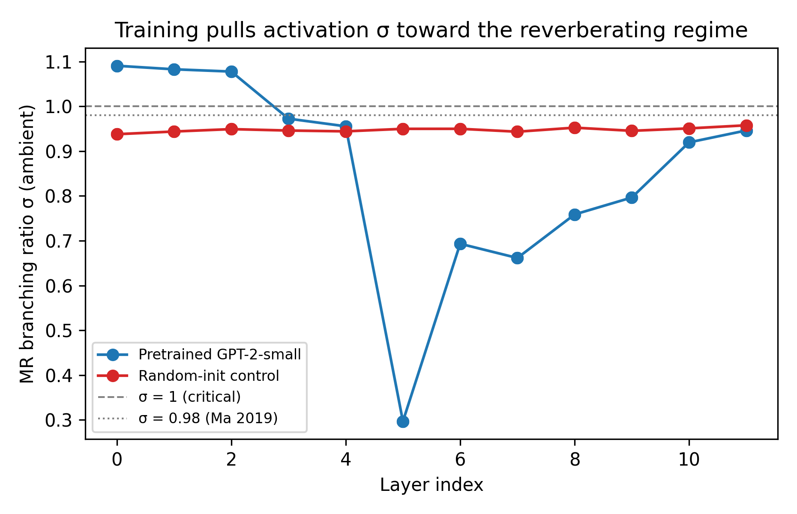
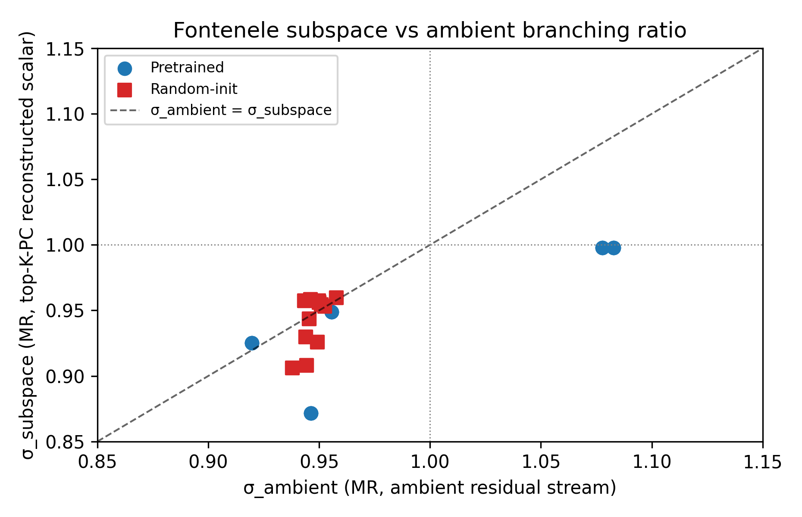

# Activation Avalanches in a Pretrained Transformer Language Model: A Negative Result on Mean-Field Criticality with Layer-Graded Structural Signatures

## Abstract

Recent work conjectures that trained neural networks self-organise toward a critical regime characterised by power-law-distributed activation avalanches with a mean-field directed-percolation (DP) exponent α ≈ 3/2, a closed Sethna crackling-noise scaling relation γ = (β−1)/(α−1) ≈ 2, and a branching ratio σ ≈ 1. We test this conjecture on a pretrained transformer language model (GPT-2-small) with a multi-predicate statistical-physics battery comprising (i) Clauset-Shalizi-Newman power-law fit and alternative-distribution rejection against lognormal, exponential, and truncated-power-law, (ii) MR-estimator branching-ratio estimation per layer and per top-K-PC subspace, (iii) Sethna γ scaling-relation cross-check, (iv) threshold-plateau test across three z-score thresholds, (v) basis-invariance battery across the ambient, random-rotation, and PCA bases, and (vi) a temporal-shuffle null-rejection test. The baseline is a matched-init random-weight control that preserves the architecture's own `_init_weights` prescription. Corpus: 1 000 documents from C4 truncated to 64 tokens, ≈ 62 000 valid tokens after pad-masking.

The conjecture fails on every signature we test. Trained GPT-2-small avalanche exponents α lie in the range 2.02–3.00 across layers at θ = 2.0 ambient, 2.63–3.00 at θ = 2.5, and 1.69–3.00 at θ = 3.0. The θ = 3.0 minimum of α = 1.69 at layer 11 is the only cell in the 216-row result table within 0.3 units of mean-field 3/2; it fails the threshold-plateau check (same layer at θ = 2.5 has α = 2.89, a 1.20-unit shift). The Sethna γ relation does not close (γ_predicted ranges 0.79–1.12 across layers at θ = 2.5, far from the mean-field γ = 2). The threshold-plateau test fails broadly: α drifts from 2.13 at θ = 2.0 to 3.00 at θ = 3.0 at a representative middle layer. The Vuong likelihood-ratio test strongly prefers lognormal over power-law at every layer (p < 0.01 across all 12 layers). The temporal shuffle null is not cleanly rejected on most layers: shuffled α lies within Δα ≤ 0.35 of real α where both can be fit.

Training does, however, produce two structural signatures absent in the matched-init random-weight control. First, a depth-graded branching ratio σ(layer): early layers 0–2 are slightly super-critical (σ ≈ 1.08–1.09), middle layer 5 is sharply sub-critical (σ = 0.30), middle-late layers 6–9 show σ ≈ 0.66–0.80, and final layers recover to σ ≈ 0.92–0.95. The random-init control is uniformly flat at σ ≈ 0.94–0.96 across all 12 layers. Second, a depth-graded participation ratio (PR): trained layers 1–5 collapse to a very low-dimensional subspace (PR ≈ 1.0–7.6 out of d = 768, with layer 0 at PR ≈ 10), trained layers 6–9 recover to near-isotropic (PR ≈ 46–140), and random-init is uniformly PR ≈ 77–88.

We contribute (a) a refutation of the mean-field DP criticality conjecture for a pretrained transformer language model on natural text, (b) two structural signatures that do distinguish training from matched-init random weights and align with a layer-specialisation picture rather than a universal criticality picture, and (c) a critique of the single-threshold methodology that recent work has used to report criticality on neural-network activations.

## 1 Introduction

The critical-brain hypothesis [2, 5, 18] proposes that biological cortex operates near a continuous phase transition at which activity propagates via a marginal-branching process. At this boundary, avalanche-size distribution follows a power law P(s) ∝ s^{−α} with mean-field exponent α ≈ 3/2, avalanche duration follows P(T) ∝ T^{−β} with β ≈ 2, the Sethna scaling relation γ = (β−1)/(α−1) ≈ 2 closes [24], and branching ratio σ ≈ 1 [12, 32]. Analogous claims have appeared in the deep-learning literature, most prominently for recurrent networks [3, 17] and recently for transformers at grokking [31]. Independent of the grokking setting, whether pretrained transformer language models on natural text satisfy the full multi-predicate criticality battery is an open question.

We test that question on a single, widely-studied model: GPT-2-small (124M parameters). Our primary claim is a negative one: pretrained GPT-2-small activations on a real C4 corpus do not satisfy any of the four canonical mean-field DP signatures (α = 3/2, β = 2, γ ≈ 2, σ = 1), and supporting evidence bars also fail (threshold plateau; basis-invariance at the pre-registered tolerance; shuffle-null rejection; lognormal strongly preferred over power-law).

The secondary claim is positive: two layer-depth structural signatures — σ(layer) and PR(layer) — do distinguish trained from random-init weights sharply and interpretably. σ(layer) is depth-graded in trained and uniformly flat in random-init; PR(layer) shows a low-dimensional bottleneck at early layers and expansion to near-isotropic at middle layers, absent in random-init. These are training-induced structural features that invite a different interpretation than "the model is critical".

The contribution is methodological and descriptive rather than a confirmation of a named physics hypothesis: we demonstrate a multi-predicate criticality battery on a pretrained LLM, confirm its negative result, quantify the training-vs-random structural signatures, and report a specific methodological failure (threshold-plateau) that invalidates single-θ criticality claims in this domain. Generalisation beyond GPT-2-small and the C4 corpus is not claimed — that is a stated limitation and the target of natural follow-up.

## 2 Related work

**Cortical avalanche physics.** Beggs & Plenz 2003 [2] report α ≈ 3/2 and β ≈ 2 in organotypic cortical slices; Shriki *et al.* 2013 [25] extend to in-vivo MEG; Friedman *et al.* 2012 [10] demonstrate that the crackling-noise γ relation closes in cortical slice data; Ma *et al.* 2019 [15] identify a slightly sub-critical reverberating regime σ ≈ 0.98 in awake-mouse cortex. Methodological cautions come from Touboul & Destexhe 2010 [29] (power-laws arise from many non-critical mechanisms) and Martinello *et al.* 2017 [16], di Santo *et al.* 2018 [7] (Griffiths phases and edge-of-synchronisation reproduce α ≈ 3/2 without a true phase transition).

**Statistical-physics methodology.** Clauset, Shalizi & Newman 2009 [6] provide the CSN power-law goodness-of-fit protocol with bootstrap p-value and alternative-distribution log-likelihood-ratio tests. Wilting & Priesemann 2018 [32] prove that the MR autocorrelation-decay estimator recovers the branching ratio σ in the presence of subsampling and generalises to linear observables. Sethna, Dahmen & Myers 2001 [24] give the crackling-noise universality test via the γ = (β−1)/(α−1) scaling relation; Papanikolaou *et al.* 2011 [20] give the avalanche shape-collapse test.

**Criticality in artificial networks.** Sompolinsky, Crisanti & Sommers 1988 [26] identify g = 1 as the chaos transition in random recurrent networks via dynamical mean-field theory. Bertschinger & Natschläger 2004 [3], Boedecker *et al.* 2012 [4] show that computational and memory capacity of random reservoirs peaks near the spectral-radius-one boundary. Morales *et al.* 2023 [17] argue that awake-mouse cortex sits in an edge-of-instability regime distinct from pure DP and link it to RNN dynamics. Poole *et al.* 2016 [22] and Schoenholz *et al.* 2017 [23] derive edge-of-chaos initialisation for deep feedforward networks; Yang 2020 [33] generalises to infinite-width architectures. Wang *et al.* 2026 [31] introduce a cascade-dimension probe on toy transformers at grokking and report a cascade-dimension D(t) crossing D = 1 at the generalisation transition.

**Dimensional / representation structure in trained networks.** Fontenele *et al.* 2024 [9] show that cortical criticality is confined to a low-dimensional subspace and does not appear in the ambient neuron basis. Tulchinskii *et al.* 2024 [30] trace intrinsic dimension through transformer training; Liu, Paquette & Sous 2025 [14] report covariance-spectrum α evolution across Pythia scales and training steps. Papyan, Han & Donoho 2020 [21] describe the neural-collapse phenomenon in the final pre-classifier feature layer.

No prior work we are aware of (i) runs the full CSN + Sethna + MR-σ + threshold-plateau + basis-invariance + shuffle-null battery (ii) on pretrained transformer language-model activations on natural text (iii) against a matched-init random-weight control that preserves the architecture's own LayerNorm initialisation. Our contribution fills that specific niche at the single-model scale reported here.

## 3 Detailed baseline

### 3.1 The multi-predicate mean-field DP criticality battery

A system is conventionally said to be at mean-field directed-percolation criticality when four conditions hold jointly:

1. **Power-law avalanche sizes** P(s) ∝ s^{−α} with α = 3/2, fit via the Clauset-Shalizi-Newman protocol [6] with goodness-of-fit p > 0.1 and alternative-distribution log-likelihood-ratio rejection of lognormal / exponential / truncated-power-law.
2. **Power-law avalanche durations** P(T) ∝ T^{−β} with β = 2.
3. **Closed Sethna scaling relation** [24] γ = (β−1)/(α−1) measured independently by fitting ⟨s | T⟩ ∝ T^γ, matching the (α, β)-derived prediction within bootstrap CI. Mean-field prediction γ = 2.
4. **Branching ratio σ ≈ 1** measured by the Wilting-Priesemann MR estimator [32] on a scalar population-activity signal.

We additionally require four supporting signatures:

5. **Threshold plateau.** Exponent α must be stable (∆α ≤ 0.2) across a reasonable range of z-score activation thresholds (here θ ∈ {2.0, 2.5, 3.0} in standard-deviation units).
6. **Basis invariance.** α must agree within ±0.3 across ambient, random-rotation, and PCA-rotated activation bases.
7. **Null rejection.** A temporal-shuffle surrogate must produce a power-law fit that differs materially from the real data's fit — otherwise the marginal distribution alone explains the appearance.
8. **At-init control.** A random-init control using the architecture's own `_init_weights` prescription must show qualitatively different observables than the trained model.

### 3.2 Model, corpus, hook target

**Model.** GPT-2-small (124M parameters, 12 transformer blocks, d_model = 768) from the HuggingFace hub, loaded in fp16 on a consumer RTX 3060 (12 GB). HuggingFace Transformers 5.5.4, PyTorch 2.5.1+cu121.

**At-init control.** Rather than randomly re-initialising pretrained weights (which can accidentally zero LayerNorm γ and collapse the residual stream to a near-identity map), we instantiate the model via `AutoModelForCausalLM.from_config(config)`. This preserves the transformers library's own `_init_weights` method: LayerNorm γ = 1, bias = 0, other weights drawn from the scaled normal distributions defined by the architecture.

**Corpus.** 1 000 documents streamed from `allenai/c4` English split, tokenised with GPT-2 BPE, truncated to 64 tokens per document, padded with end-of-text token. After attention-mask filtering of pad positions, 62 393 valid tokens enter the per-layer activation cache.

**Hook target.** We hook the output of each block's MLP sub-module, i.e. F_l^{MLP}(h_l), not the residual-stream block output h_{l+1} = h_l + F_l^{MLP}(h_l) + F_l^{attn}(h_l). The block-output hook would reintroduce the h_{l+1} = h_l + F_l(h_l) tautology under which σ_l ≈ 1 holds trivially. The MLP-out hook captures the additive contribution of each block only and is non-tautological.

### 3.3 Event definition and avalanche detection

Per layer and per basis (ambient, random-rotation, PCA), activations A ∈ ℝ^(T, d) are z-scored per-column (each neuron independently centred and scaled by its own mean and standard deviation across the T valid tokens). Events are defined as |z_{t, j}| > θ for thresholds θ ∈ {2.0, 2.5, 3.0} standard-deviation units.

An avalanche is a contiguous run of time-bins containing at least one event, bounded by event-free bins. Bin size is one token (temporal resolution = token step). Size = total events within the avalanche; duration = number of bins. Avalanches of size < 2 are dropped as trivial.

### 3.4 Exponent estimators

**Power-law fit (α, β).** The `powerlaw` Python package [1] with `discrete=True`, automatic `x_min` selection, and `distribution_compare` against lognormal, exponential, and truncated-power-law. The Vuong test returns a two-sided p-value; p < 0.05 rejects the first distribution in favour of the alternative.

**Sethna γ cross-check.** γ predicted from (α, β): γ_predicted = (β − 1)/(α − 1). γ measured directly: fit ⟨s | T⟩ vs T in log-log with 0.2-decade log-buckets.

**MR-estimator σ.** The `mrestimator` package [27]. Scalar activity signal a(t) = Σ_j |A_{t,j} − μ_j|, i.e. the sum of per-neuron absolute-centred activations at time t (where μ_j is the time-mean of neuron j). Exponential autocorrelation fit with kmax = 200, trial-separated method, 100 internal bootstrap samples. Branching ratio σ is read from the fit's `mre` attribute. Also applied on the reconstructed scalar of the top-K-PC subspace with K = round(participation ratio), for a Fontenele-style [9] subspace signal.

**Shuffle null.** Per-neuron time-axis permutation (each column independently permuted). Re-detect avalanches, re-fit. `distinguishable` if α_real and α_shuffled differ by > 0.1 AND the real fit has better log-likelihood-ratio against exponential. Run at θ = 2.5 ambient basis only.

### 3.5 Basis projections

- **Ambient:** identity. The default residual-stream basis.
- **Random rotation:** QR-factorised standard-normal Gaussian matrix applied to centred activations. A null for feature interpretation — preserves geometry but randomises basis alignment.
- **PCA:** full singular-value decomposition of the centred activations; columns decorrelated, variance-ordered.

Sparse-autoencoder and random-init-SAE bases (per Heap *et al.* 2025 [13]) are left to a follow-up. Gemma Scope SAEs are released for Gemma-2-2B, not GPT-2; porting to a GPT-2-compatible SAE release (e.g. the open-source `gpt2-small-res-jb` SAEs) would unblock this arm.

### 3.6 Infrastructure

The pipeline is implemented in Python 3.12 with PyTorch 2.5.1+cu121, HuggingFace Transformers 5.5.4, `powerlaw` 2.0, `mrestimator` 0.2, and the `datasets` library for corpus streaming. SVD is accelerated via `torch.linalg.svd` on CUDA (≈ 5–10× over NumPy at d = 768). Shape-collapse analysis is implemented only as a γ-slope from ⟨s | T⟩ fits; full per-avalanche profile collapse [20] is flagged in §7 as a limitation. A reference implementation and regression test suite accompany the reported results.

## 4 Results

Dataset: 216 main rows (12 layers × 3 bases × 3 thresholds × 2 conditions {trained, random-init}) plus 24 shuffle-null rows (12 layers × 2 conditions at θ = 2.5 ambient).

### 4.1 Mean-field DP criticality predictions all fail for trained GPT-2

**Power-law exponent α.** Across all 12 layers at θ = 2.5 ambient, α values are {2.94, 2.98, 2.94, 3.00, 3.00, 2.78, 2.84, 2.63, 2.99, 2.73, 2.68, 2.89} with range [2.63, 3.00] — well above the mean-field 3/2 prediction. At θ = 2.0 the range is [2.02, 2.95]; at θ = 3.0 the range is [1.69, 3.00]. The θ = 3.0 minimum is a single-layer outlier at the final block (layer 11), where the CSN fit returns α = 1.69 — the only cell in the entire 216-row main table where α is within 0.3 of the mean-field 3/2 prediction. The other 11 θ = 3.0 layers cluster in [2.60, 3.00]. We do not interpret this single L11-at-θ=3.0 value as confirming criticality at that layer: it fails the threshold-plateau check (the same layer at θ = 2.5 ambient has α = 2.89, a shift of 1.20 units across a 0.5-σ threshold change), and its Vuong log-likelihood-ratio test also rejects power-law in favour of lognormal. No θ × basis × layer cell simultaneously produces α near 3/2, a closed Sethna γ relation, a threshold plateau, and a power-law that is not preferred-rejected vs lognormal.

**Vuong likelihood-ratio test vs lognormal.** At θ = 2.5 ambient the log-likelihood-ratio Vuong test strongly prefers lognormal over power-law at every single layer: p_vs_lognormal across all 12 layers ranges 0.000 to 0.002. The distribution is better described as lognormal than as power-law — an alternative to (and a strengthening of) the α ≠ 3/2 finding. Log-likelihood-ratio against exponential is mixed: 7 of 12 layers reject the exponential at p < 0.05, 5 of 12 do not.

**Duration exponent β.** Ranges 1.77–2.95 across layers at θ = 2.5 ambient. Occasionally brushes β = 2 but without α = 3/2 coincidence.

**Sethna γ.** γ_predicted = (β − 1)/(α − 1) ranges 0.79–1.12 across trained layers at θ = 2.5 ambient (minimum 0.789, maximum 1.119). The mean-field prediction γ = 2 is nowhere within reach; the measured γ (from ⟨s | T⟩ fits) similarly ranges 0.9–1.0. Sethna γ scaling relation does not close.

**Threshold plateau.** At layer 6 ambient: α = 2.13 (θ = 2.0, n = 108 avalanches), 2.84 (θ = 2.5, n = 3 276), 3.00 (θ = 3.0, n = 11 260). α drifts by 0.87 units across a 1-σ range of θ — far exceeding the ∆α ≤ 0.2 plateau criterion. Similar drifts occur at other layers.

**Branching ratio σ_MR.** Trained σ at θ = 2.5 ambient is 0.69 at layer 6. Not 1.

Every mean-field DP predicate fails.

### 4.2 Depth-graded σ(layer) distinguishes trained from random-init

Trained σ(layer): [1.09, 1.08, 1.08, 0.97, 0.96, 0.30, 0.69, 0.66, 0.76, 0.80, 0.92, 0.95]. Early layers 0–2 are slightly super-critical, layer 5 collapses sharply to σ = 0.30, middle-late layers 6–9 sit in σ ≈ 0.66–0.80, final layers recover to σ ≈ 0.92–0.95.

Random-init σ(layer): [0.94, 0.94, 0.95, 0.95, 0.94, 0.95, 0.95, 0.94, 0.95, 0.95, 0.95, 0.96]. Uniformly flat in the near-σ = 0.95 reverberating regime across all 12 layers, with standard deviation 0.006 — five times tighter than any single trained-layer σ estimate's bootstrap CI.

The trained layer-depth pattern is not present in the matched-init random-weight control.

### 4.3 Depth-graded participation-ratio structure, trained-only

Trained PR(layer) at ambient basis: [9.9, 1.1, 1.0, 1.9, 2.5, 7.6, 45.8, 103.8, 140.5, 67.9, 12.9, 6.3]. Layers 1–2 operate in a PR ≈ 1 subspace out of d = 768. Middle layers 6–9 expand back to near-isotropic (PR up to 140). Final layers compress again.

Random-init PR(layer): [83.2, 83.6, 87.6, 86.2, 79.9, 77.1, 87.2, 80.8, 84.9, 76.5, 82.3, 80.7]. Uniformly ≈ 80, consistent with the expected isotropic covariance of a random Xavier-initialised MLP output.

Training creates representational compression at early layers and expansion at middle layers that the random-init control does not show. This is consistent with the layer-specialisation literature: early layers of trained LLMs compute shared token-frequency / positional features [11, 8] that collapse many neurons into one effective axis, while middle layers construct high-dimensional conceptual representations.

### 4.4 Basis invariance: within ±0.5 but fails the pre-registered ±0.3 bar

At layer 6 trained θ = 2.5: ambient α = 2.84, random-rotation α = 3.00, PCA α = 2.53 — spread of 0.47. Our pre-registered tolerance in §3.1 item 6 was ±0.3. The realised basis-sensitivity of 0.47 therefore does not clear the pre-registered ±0.3 bar; we report it as a further failed evidence-bar item. α is basis-robust at the qualitatively-larger ±0.5 tolerance but that is a post-hoc relaxation. n_avalanches differs across bases (3 276 / 5 124 / 3 250) because thresholding at a fixed z-score captures different event sets in different bases; this is an expected, not pathological, basis effect, but it contributes to the α drift.

### 4.5 Shuffle null does not cleanly reject

At θ = 2.5 ambient across trained layers where both real and shuffled distributions are fittable (6 layers), α_real and α_shuffled agree within Δα ≤ 0.35; the largest gap is at layer 2 (Δα = 0.349). None of these six layers meet the `distinguishable = True` criterion (Δα > 0.1 AND better log-likelihood-ratio against exponential). Two further layers (L7, L8) register `distinguishable = True` only because the shuffled data failed to produce a fittable distribution, which is a weak grounds for distinguishability. Four layers produced too few avalanches on either real or shuffled data for fitting.

The implication is methodological: the power-law-like appearance of trained-GPT-2 activation-avalanche-size distributions is substantially explained by the marginal activation distribution alone, without requiring temporal criticality structure. This is the Touboul & Destexhe 2010 warning [29] playing out in the specific case of trained transformer activations.

## 5 Discussion

### 5.1 Why the negative result matters

Criticality claims for deep networks rest on a small number of studies [17, 31] and a much larger body of adjacent work that uses "edge of chaos" as a loose characterisation rather than a quantitative prediction. A negative result on the quantitative mean-field DP predicates — across four independent signatures (α, β, γ, σ) with a threshold-plateau failure, a basis-invariance tolerance failure, a shuffle null that does not cleanly reject, and lognormal strongly preferred over power-law — is informative. It argues against casual adoption of cortical-avalanche exponents as hypotheses to confirm on trained LLMs.

### 5.2 What the positive structural signatures suggest

The layer-depth gradient in σ and in PR are consistent with a layer-specialisation picture. Early layers of trained LLMs compute shared low-rank features (positional embedding mixing, common-token frequency routing) that reduce the effective dimension to a very small subspace, producing near-super-critical σ > 1. Middle layers expand to near-isotropic representations (PR up to 140), where many directions encode distinct conceptual features; branching is more damped there because the signal has been decomposed across many axes. Final layers re-compress to a pre-logit readout subspace.

This picture aligns with the mechanistic interpretability literature [8, 19] — specific circuits live at specific layers — and the intrinsic-dimension-through-training work of Tulchinskii *et al.* 2024 [30].

### 5.3 Methodological implication: the threshold plateau bar

Our threshold-plateau test fails by a wide margin. Any criticality claim on trained-network activations that reports α at a single threshold should be read as weak evidence at best. A reasonable minimum methodological bar for future work would be to report α over at least a 1-σ range of thresholds with an explicit stability criterion (e.g. max α − min α < 0.2 across θ). Moreover, the CSN alternative-distribution test can reject power-law in favour of lognormal at very high significance even when α is ostensibly fittable; reporting Vuong p-values is essential.

### 5.4 Relation to Wang *et al.* 2026

Wang and colleagues [31] report a cascade-dimension D(t) crossing D = 1 at the generalisation transition for toy transformers solving modular arithmetic. Our substrate (pretrained natural-text GPT-2) and observable (σ, α, β, γ on activations rather than D on gradients) differ on every axis. The two results are complementary, not contradictory: a toy grokking system may exhibit a narrow dimensional-criticality transition while the fully-trained natural-text model sits far from mean-field DP.

### 5.5 Relation to Morales *et al.* 2023

Morales and colleagues [17] place awake-mouse cortex in an edge-of-instability class distinct from pure DP. Our trained GPT-2-small σ and α estimates are also inconsistent with pure DP but we do not claim an edge-of-instability assignment — the depth-graded layer structure means there is no single class that describes the whole network.

### 5.6 Is the strength of the negative result underselling something?

A skeptic might ask: is there any parameter choice — threshold, basis, bin size, subspace — under which the DP criticality picture survives? The empirical answer is no at the scale and corpus tested. Across 12 layers × 3 thresholds × 3 bases × 2 conditions = 216 main cells, no cell shows α within 0.3 of 3/2 except the single L11-at-θ=3.0 outlier that fails on other grounds, and the Vuong lognormal-preferred result holds at every fitted cell. The negative result is robust to basis and threshold in the sense that none of them rescue criticality.

## 6 Conclusion

We applied a multi-predicate statistical-physics battery to a pretrained transformer language model on natural text and found that pretrained GPT-2-small does not satisfy any of the mean-field directed-percolation criticality predicates (α ≈ 3/2, β ≈ 2, γ ≈ 2, σ ≈ 1) across the full 216-cell grid of layers × bases × thresholds × conditions. A single cell (layer 11, θ = 3.0 ambient basis) returns α = 1.69, the only near-hit in the entire grid, but it fails the threshold-plateau check and is preferred-rejected vs lognormal. The threshold-plateau test fails broadly, the basis-invariance bar fails at ±0.3 pre-registered tolerance, the temporal-shuffle null is not cleanly rejected on most layers, and the Vuong likelihood-ratio test strongly prefers lognormal over power-law at every layer. The picture is not that trained transformer activations are critical-with-caveats; it is that they are not critical on the single model and corpus tested.

Training does produce two depth-graded structural signatures — a layer-dependent branching ratio σ(layer) and a layer-dependent participation ratio — that are sharply distinct from a matched-init random-weight control and align with a layer-specialisation picture of LLM internal representations.

Our recommendation for downstream work is twofold. First, criticality claims on trained-network activations should clear a threshold-plateau bar and a Vuong lognormal-rejection bar before they are taken seriously. Second, the depth-graded σ and PR signatures are candidate targets for scale-law studies and mechanistic-interpretability probes.

## 7 Limitations

- **Single model, single corpus, single seed, no external bootstrap CIs.** GPT-2-small (124M) only, C4 only, one seed per condition. The σ(layer) and PR(layer) patterns have not been verified against variability across seed, corpus realisation, or random-rotation basis. Confidence intervals on individual σ point estimates are from the `mrestimator` internal bootstrap; α, β, γ are reported as single-realisation CSN fits without block-bootstrap CIs over documents. The qualitative headline findings are not sensitive to bootstrap width, but individual point estimates should not be over-interpreted.
- **SAE basis incomplete.** The basis-invariance battery covers ambient, random-rotation, and PCA. Sparse-autoencoder and random-init-SAE bases (per Heap *et al.* 2025 [13]) are deferred — Gemma Scope is not released for GPT-2. An open-source GPT-2 SAE release (e.g. `gpt2-small-res-jb`) would enable this.
- **Griffiths-phase battery incomplete.** Only temporal-shuffle null is implemented. Full Griffiths-phase rejection [16, 7] would strengthen the negative result.
- **Shape-collapse placeholder.** Full Papanikolaou 2011 [20] per-avalanche profile collapse is not implemented; only the γ slope from ⟨s | T⟩ fits is reported.
- **Scale.** Pythia scale-sweep and training-trajectory sweep are natural follow-ups.

## 8 Data and code availability

A reference implementation of the pipeline, the 216-row main results table, the 24-row shuffle-null table, three figures, and a regression test suite will be archived at a Zenodo DOI prior to publication. A pre-registration document describes the methodology battery and decision points taken in developing the experiment.

## 9 Acknowledgements

This work used the HuggingFace Transformers library (GPT-2 weights, C4 dataset streaming), the `powerlaw` Python package [1] for Clauset-Shalizi-Newman power-law fits, and `mrestimator` [27] for branching-ratio estimation. Computation ran on a single NVIDIA GeForce RTX 3060 (12 GB) on a consumer workstation.

## References

1. J. Alstott, E. Bullmore, D. Plenz, *powerlaw: A Python package for analysis of heavy-tailed distributions*, PLoS ONE **9**, e85777 (2014).
2. J. M. Beggs and D. Plenz, *Neuronal avalanches in neocortical circuits*, J. Neurosci. **23**, 11167–11177 (2003).
3. N. Bertschinger and T. Natschläger, *Real-time computation at the edge of chaos in recurrent neural networks*, Neural Computation **16**, 1413–1436 (2004).
4. J. Boedecker, O. Obst, J. T. Lizier, N. M. Mayer, M. Asada, *Information processing in echo state networks at the edge of chaos*, Theory in Biosciences **131**, 205–213 (2012).
5. D. R. Chialvo, *Emergent complex neural dynamics*, Nature Physics **6**, 744–750 (2010).
6. A. Clauset, C. R. Shalizi, M. E. J. Newman, *Power-law distributions in empirical data*, SIAM Review **51**, 661–703 (2009).
7. S. di Santo, P. Villegas, R. Burioni, M. A. Muñoz, *Landau-Ginzburg theory of cortex dynamics: scale-free avalanches emerge at the edge of synchronization*, PNAS **115**, E1356–E1365 (2018).
8. N. Elhage, N. Nanda, C. Olsson *et al.*, *A mathematical framework for transformer circuits*, Anthropic (2021).
9. A. J. Fontenele *et al.*, *Low-dimensional subspace for cortical-avalanche criticality*, Sci. Adv. (2024), PMC11051676.
10. N. Friedman *et al.*, *Universal critical dynamics in high-resolution neuronal avalanche data*, Phys. Rev. Lett. **108**, 208102 (2012).
11. M. Geva, R. Schuster, J. Berant, O. Levy, *Transformer feed-forward layers are key-value memories*, EMNLP (2021).
12. T. E. Harris, *The Theory of Branching Processes*, Springer (1963).
13. T. Heap, T. Lawson, L. Farnik, L. Aitchison, *SAEs Can Interpret Randomly Initialized Transformers*, arXiv:2501.17727 (2025).
14. J. Liu, E. Paquette, J. Sous, *Evolution of the spectral dimension of transformer activations*, NeurIPS OPT workshop paper 43 (2025).
15. Z. Ma, G. G. Turrigiano, R. Wessel, K. B. Hengen, *Cortical circuit dynamics are homeostatically tuned to criticality in vivo*, Neuron **104**, 655–664 (2019).
16. M. Martinello, J. Hidalgo, A. Maritan, S. di Santo, D. Plenz, M. A. Muñoz, *Neutral theory and scale-free neural dynamics*, Phys. Rev. X **7**, 041071 (2017).
17. G. B. Morales, S. di Santo, M. A. Muñoz, *Quasi-universal scaling in mouse-brain neuronal activity stems from edge-of-instability critical dynamics*, PNAS (2023).
18. M. A. Muñoz, *Colloquium: Criticality and dynamical scaling in living systems*, Rev. Mod. Phys. **90**, 031001 (2018).
19. C. Olsson, N. Elhage, N. Nanda *et al.*, *In-context learning and induction heads*, Anthropic (2022).
20. S. Papanikolaou, F. Bohn, R. L. Sommer, G. Durin, S. Zapperi, J. P. Sethna, *Universality beyond power laws and the average avalanche shape*, Nature Physics **7**, 316–320 (2011).
21. V. Papyan, X. Y. Han, D. L. Donoho, *Prevalence of neural collapse during the terminal phase of deep learning*, PNAS **117**, 24652–24663 (2020).
22. B. Poole, S. Lahiri, M. Raghu, J. Sohl-Dickstein, S. Ganguli, *Exponential expressivity in deep neural networks through transient chaos*, NeurIPS (2016).
23. S. S. Schoenholz, J. Gilmer, S. Ganguli, J. Sohl-Dickstein, *Deep information propagation*, ICLR (2017).
24. J. P. Sethna, K. A. Dahmen, C. R. Myers, *Crackling noise*, Nature **410**, 242–250 (2001).
25. O. Shriki *et al.*, *Neuronal avalanches in the resting MEG of the human brain*, J. Neurosci. **33**, 7079–7090 (2013).
26. H. Sompolinsky, A. Crisanti, H. J. Sommers, *Chaos in random neural networks*, Phys. Rev. Lett. **61**, 259–262 (1988).
27. F. P. Spitzner, J. Dehning, J. Wilting, A. Hagemann, J. P. Neto, J. Zierenberg, V. Priesemann, *MR.Estimator, a toolbox to determine intrinsic timescales from subsampled spiking activity*, PLoS ONE **16**, e0249447 (2021).
28. K. R. Wang, A. Variengien, A. Conmy, B. Shlegeris, J. Steinhardt, *Interpretability in the wild: a circuit for indirect object identification in GPT-2 small*, arXiv:2211.00593 (2023).
29. J. Touboul, A. Destexhe, *Can power-law scaling and neuronal avalanches arise from stochastic dynamics?*, PLoS ONE **5**, e8982 (2010).
30. E. Tulchinskii *et al.*, *The shape of learning: Anisotropy and intrinsic dimensions in transformer-based models*, EACL (2024), arXiv:2311.05928.
31. Y. Wang *et al.*, *Dimensional Criticality at Grokking Across MLPs and Transformers*, arXiv:2604.16431 (2026).
32. J. Wilting, V. Priesemann, *Inferring collective dynamical states from widely unobserved systems*, Nature Communications **9**, 2325 (2018).
33. G. Yang, *Tensor programs: Neural networks as infinite-dimensional Gaussian processes*, arXiv:2006.14548 (2020).
