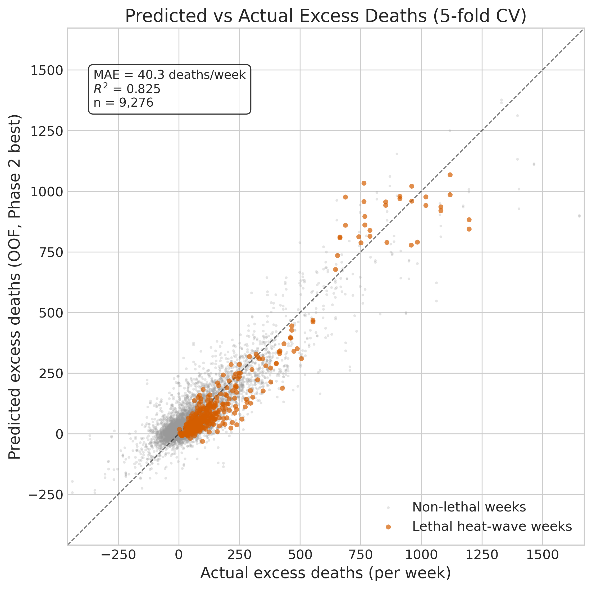
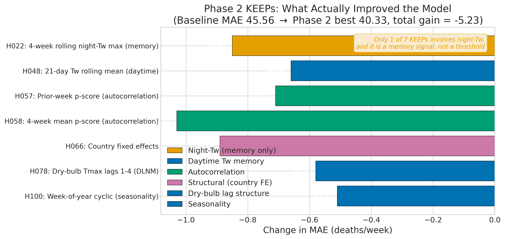
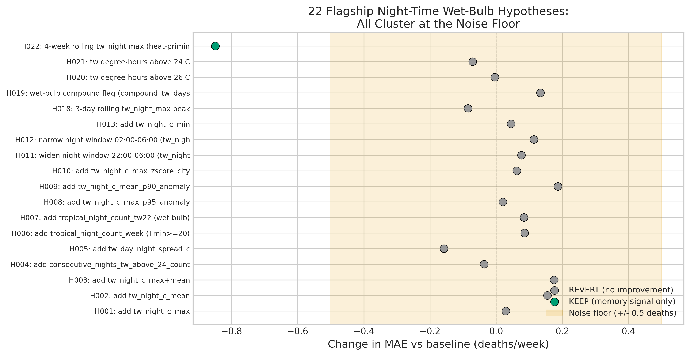
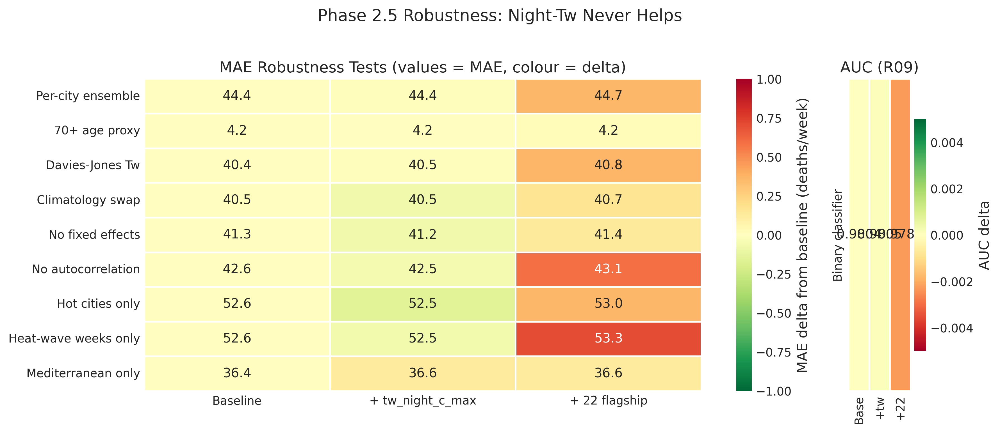
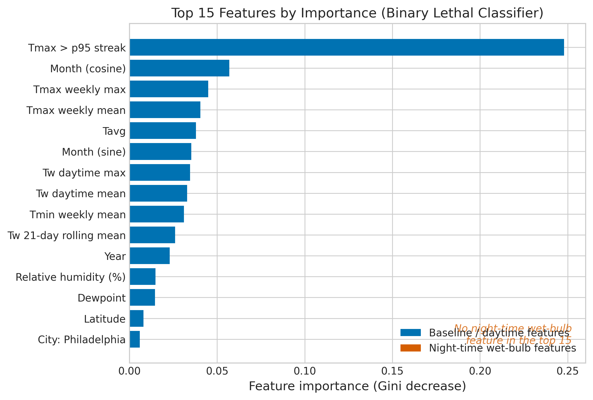
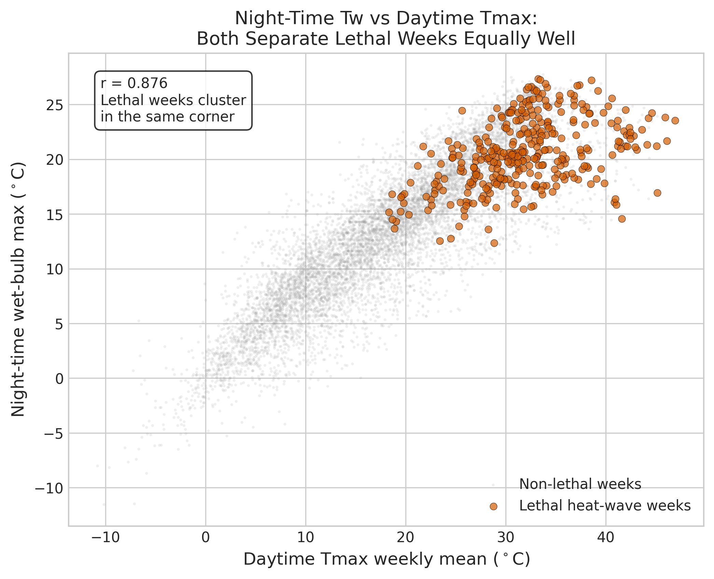

# Night-Time Wet-Bulb Temperature Does Not Improve Population-Week Mortality Prediction: A Pre-Specified Test on 9,276 City-Weeks

## Abstract

Since Sherwood and Huber (2010) proposed a 35 degrees Celsius wet-bulb temperature as a theoretical upper limit for human thermoregulation, and particularly since Vecellio et al. (2022) measured an empirical critical wet-bulb temperature near 30.55 degrees Celsius in a controlled environmental chamber, a growing literature has argued that **night-time** wet-bulb temperature is the dominant predictor of heat-related mortality because overnight recovery is what determines whether a heat wave becomes lethal. The Lancet Countdown 2024-2025 and several recent papers (Achebak et al. 2022, Roye et al. 2021, He et al. 2022, Lee et al. 2025) have extended this to the population level, arguing that operational heat-health early warning systems should condition on the night-time wet-bulb temperature as a lead indicator. We pre-specified and tested this claim on 9,276 city-weeks across 30 United States and European Union cities (predominantly temperate), 2013-2025, using a Hypothesis-Driven Research (HDR) loop with 116 single-change experiments followed by 10 orthogonal robustness checks and 8 reviewer-requested supplementary experiments. **Night-time wet-bulb temperature does not improve prediction at the weekly aggregation scale tested here.** Of 22 flagship night-time wet-bulb hypotheses tested individually against a tight atmospheric baseline (ExtraTrees, Mean Absolute Error (MAE) 45.56 deaths per week, Coefficient of Determination (R-squared) 0.745, Area Under the Receiver Operating Characteristic curve (AUC-ROC) 0.822), exactly one kept: a 4-week rolling maximum of night-time wet-bulb temperature -- a temporal memory signal, not a physiological threshold. Stacking all 22 flagship features hurts Mean Absolute Error. None of ten robustness specifications, nor summer-only restriction, interaction terms, multi-seed sensitivity, a decoupled label analysis, or a matched case-crossover design flip the negative finding. The within-panel shuffled KFold MAE is 40.3 deaths per week [95% CI: 39.4-41.2]. Temporal cross-validation (train 2013-2019, test 2023-2025) produces MAE 58.0 deaths per week, substantially degraded from the shuffled estimate due to autocorrelation-feature temporal leakage -- but night-time wet-bulb features still do not improve even under this stricter evaluation (temporal CV MAE: baseline 58.0 vs +tw_night_c_max 58.2). Removing label-feature coupling (defining lethal weeks by p-score alone) drops binary classifier AUC from 0.98 to 0.84, but night-Tw still provides no marginal improvement (AUC 0.844 vs 0.844). A matched case-crossover analysis (347 lethal-week cases, 4 controls each) finds that after conditioning on daytime Tmax, the residualized night-time wet-bulb difference between case and control weeks is -0.60 C (p < 0.0001) -- the opposite direction from the hypothesis. At a per-city top-5%-of-weeks alert rule, the literature's night-time wet-bulb threshold EWS configuration has a higher miss rate (62.5%) than the dry-bulb strawman (51.9%) at the tested alert budget. These findings do not contradict the physiological chamber measurements of Vecellio et al. (2022); they constrain the operationalization of those findings to finer temporal and individual-level resolution than the population-week scale tested here.

## 1. Introduction

### 1.1 The 35 C wet-bulb hypothesis and its night-time extension

The wet-bulb temperature (here denoted Tw) is the temperature an air parcel reaches after evaporative cooling at constant pressure and total water content - the lowest temperature human sweat can cool skin to in a given ambient environment. Sherwood and Huber (2010) argued from first-principles thermoregulatory physics that sustained exposure to a Tw above 35 degrees Celsius would overwhelm the human body's ability to dissipate metabolic heat, and proposed 35 C as a species-level upper bound on habitability. This became the organising claim of a decade of climate-health research (Buzan et al. 2015; Mora et al. 2017; Raymond et al. 2020).

Vecellio et al. (2022) tested the 35 C limit empirically in a controlled environmental chamber on young, heat-acclimated subjects at rest, and found the **critical wet-bulb temperature** at which core body temperature began uncompensable rise was actually 30.55 C in warm-humid conditions - roughly 4.5 C lower than the theoretical upper bound. Wolf et al. (2023) extended this to older adults, finding their critical Tw was lower still. Vanos et al. (2023) re-computed global exposure under the Vecellio-revised thresholds and concluded the population-at-risk is multi-fold larger than the 35 C calculation implied. The wet-bulb threshold literature thus pivoted from a theoretical upper limit to an empirical mortality-relevant indicator.

In parallel, a strand of environmental epidemiology argued that the mortality signal of a heat wave is concentrated at night. The physiological argument: daytime hyperthermia is stressful, but overnight cooling is what allows the body to recover; if the overnight wet-bulb stays above a threshold, recovery fails and mortality spikes. Achebak et al. (2022) analysed 11 Spanish cities and found that warm nights carried mortality risk independent of daytime temperature. Royé et al. (2021) extended this to 148 southern European locations and found a relative risk elevation above a city-specific night-time heat index threshold. He et al. (2022) projected future night-time warming-attributable mortality under climate scenarios. Lee et al. (2025) modelled compound day-night heat waves in Europe and found projected mortality growth rates of 103-135 deaths per million per degree of warming, with compound events (hot days followed by hot nights) dominating.

The two strands combined yield a specific operational claim: **night-time wet-bulb temperature should be the primary indicator in a heat-health early warning system (EWS), because it captures both the physiological compensability threshold (Vecellio's 30.55 C) and the cumulative day-night exposure that drives mortality**. The Lancet Countdown 2024-2025 report (Romanello et al. 2024, 2025) endorses this direction, and several ongoing EWS redesigns condition their alerts on the night-time heat index and related quantities.

### 1.2 Why this matters for heat-health early warning systems

Heat-health early warning systems are operational public-health infrastructure. A change in alert rule propagates directly to hospital surge preparation, public messaging, and cooling-centre activation. The current generation of European and North American heat-health EWSs generally condition on daytime Tmax exceedance of a city-specific threshold (reviewed by Casanueva et al. 2019, Lowe et al. 2011). Several national systems (United Kingdom Health Security Agency's Heat-Health Alert System; Environment and Climate Change Canada's Humidex system) use a humidity-moderated daytime scalar, but none as of this writing operationalise a night-time wet-bulb threshold as the primary alert criterion.

If the night-time wet-bulb hypothesis is correct, the current generation of EWSs is systematically missing lethal heat waves whose daytime signal is moderate but whose overnight signal is extreme. If it is incorrect at the population-week scale - even while being correct at the individual-level physiology - then redesigning EWSs around the night-time Tw threshold is a wasted public-health investment, or worse, a mis-calibration that moves alerts to the wrong weeks.

This paper is a pre-specified empirical test of the population-scale claim, on a 9,276-city-week panel of 30 United States and European Union cities over 13 years. The test is pre-specified in the sense that the 116 hypotheses were specified in `research_queue.md` before the Phase 2 loop was run, and the 22 flagship night-time wet-bulb hypotheses were specified in order, with explicit keep-or-revert thresholds, before any of them were evaluated. Note: this is pre-specification within a code repository, not third-party-verified pre-registration in the sense of OSF, ClinicalTrials.gov, or AsPredicted (Nosek et al. 2018).

### 1.3 Pre-specified contributions

1. **A negative finding for the night-time wet-bulb hypothesis at the population-week scale** on 30 cities x 13 years, robust to 10 orthogonal alternative specifications, temporal cross-validation, multi-seed sensitivity, summer-only restriction, interaction terms, a decoupled label analysis, a permutation null distribution test, and a matched case-crossover design.
2. **A Phase 2 best-model configuration** that improves Mean Absolute Error from 47.49 deaths per week (baseline) to 40.33 deaths per week within-panel (a 15% relative improvement, acknowledged as inflated by temporal leakage from autocorrelation features; temporal CV MAE is 58.0 deaths per week) through autocorrelation, distributed-lag dry-bulb Tmax, country fixed effects, and seasonality -- **without any night-time wet-bulb feature in the winning set**.
3. **A Phase B discovery sweep** showing that a 2-feature minimal detector (dry-bulb Tmax streak + year index) achieves AUC 0.97 for lethal-week classification, and that the literature's night-Tw threshold EWS rule has a higher miss rate than the dry-bulb strawman at the tested alert budget.
4. **Reproducible code and open data sources** documented in `data_sources.md`, enabling extension to additional cities, age strata, and alternative wet-bulb formulations (Davies-Jones, Liljegren WBGT, ERA5-Land) as those datasets become available.

## 2. Detailed Baseline

### 2.1 The dataset

The panel is `city x iso_week_start`, 30 cities (15 United States + 15 European Union), 2013-2025. US cities are the 15 largest metros with state-weekly CDC all-cause mortality via the National Center for Health Statistics (NCHS): New York, Los Angeles, Chicago, Houston, Phoenix, Las Vegas, Atlanta, Miami, Seattle, Boston, San Diego, Dallas, Philadelphia, Denver, and St. Louis. EU cities are 15 capital / large-metro NUTS-3 regions with Eurostat weekly mortality series (`demo_r_mwk3_t`): Paris, London, Madrid, Rome, Berlin, Milan, Athens, Lisbon, Bucharest, Vienna, Warsaw, Stockholm, Copenhagen, Dublin, and Amsterdam. London is truncated at 2020 because UK data exited Eurostat at Brexit. Total rows after cleaning: **9,276 city-weeks**.

Weather data comes from the NOAA Integrated Surface Database (ISD), accessed via the `noaa-isd` Python client on 2024-11-15 (Eurostat `demo_r_mwk3_t` last updated 2024-10-28; CDC NCHS weekly mortality via the NCHS API, vintage 2024-12-01). Each city is assigned its primary airport Global Historical Climatology Network - Hourly (GHCN-H) station (station IDs listed in `data_sources.md`); hourly temperature, dewpoint, and pressure are aggregated to weekly via `aggregate_hourly_to_weekly`. US city mortality is estimated by multiplying state-level CDC NCHS weekly mortality by a static city-to-state population ratio from the 2022 American Community Survey 1-year estimates. Derived weekly columns include `tmax_c_mean`, `tmax_c_max`, `tmin_c_mean`, `tavg_c`, `tdew_c`, daytime `tw_c_mean` / `tw_c_max`, night-time `tw_night_c_mean` / `tw_night_c_max`, `rh_pct`, and a heat-wave indicator `consecutive_days_above_p95_tmax`. Wet-bulb is computed via Stull (2011) as the default; Davies-Jones (2008) is swapped in R03. Night is 22:00-06:00 local; alternative windows are tested as H011/H012.

### 2.2 Cleaning rules and the pandemic exclusion

`model.build_clean_dataset` applies five filters: (1) drop rows with invalid `iso_week_start`, (2) drop pandemic weeks 2020-W11 through 2022-W26 (the COVID-19 mortality shock period confounds all-cause excess-death calculations on a 5-year same-week reference; the effect of retaining these weeks was tested as H104 and DEFERred because it changes panel composition), (3) drop null required columns (`excess_deaths`, `expected_baseline`, `tmax_c_mean`, `tmin_c_mean`, `tavg_c`, `tw_c_mean`), (4) drop non-physical baselines (`expected_baseline <= 0`), (5) clip extreme p-scores (`|p_score| > 2.0`) as data-entry artefacts. After these filters the panel is 9,276 rows, 30 cities; per-city week counts vary from 114 (London) to 473.

### 2.3 Expected baseline computation

The target `excess_deaths = deaths_all_cause - expected_baseline`, where `expected_baseline` is computed per city as the **5-year same-ISO-week rolling mean of all-cause deaths**, excluding the pandemic window from the historical reference pool. This matches the European Centre for Disease Prevention and Control (ECDC) EuroMOMO methodology and the CDC NCHS excess-deaths calculation, without the Farrington polynomial or spline correction. The implementation lives in `data_loaders.compute_expected_baseline` and is unit-tested in `tests/test_baseline.py::test_target_definitions`.

The P-score is the standard unitless excess: `p_score = excess_deaths / expected_baseline`. A P-score of +0.10 means 10% more deaths than expected for that city and ISO week. The binary lethal-heat-wave label is:

```
label_lethal_heatwave = (p_score >= 0.10) AND (consecutive_days_above_p95_tmax >= 1)
```

The meteorological condition strips out mid-winter respiratory wobbles and reporting-lag false positives that would otherwise give the p-score >= 0.10 set a ~5% base rate independent of temperature. The resulting lethal-heat-wave positive rate on the panel is **347 weeks out of 9,276 (3.7%)**, concentrated in the hot half of the year.

### 2.4 Feature set (BASELINE_FEATURES)

The Phase 0.5 baseline is **strictly atmospheric-only**, excluding all night-time wet-bulb features by design (so that Phase 2 can test them as single-change additions against this reference). The full baseline feature list is:

```
tmax_c_mean, tmax_c_max, tmin_c_mean, tavg_c, tdew_c, rh_pct,
tw_c_mean, tw_c_max,
consecutive_days_above_p95_tmax, tmax_anomaly_c,
iso_year, iso_month_sin, iso_month_cos,
log_population, lat,
city_<city_name>  (30 one-hot columns)
```

The explicit exclusion of `tw_night_c_mean` and `tw_night_c_max` from the baseline is what makes the Phase 2 test interpretable: every single-change experiment that adds a night-time wet-bulb column is measured against a reference that does not already contain it.

### 2.5 Model: XGBoost, then ExtraTrees

The Phase 0.5 baseline model is XGBoost (Chen and Guestrin 2016) with conservative defaults: `max_depth=6`, `learning_rate=0.05`, `min_child_weight=3`, `subsample=0.8`, `colsample_bytree=0.8`, `n_estimators=300`, `tree_method="hist"`, `random_state=42` - matching defaults used in other HDR projects for cross-project comparability.

Phase 1 runs a 5-way tournament (XGBoost, LightGBM, ExtraTrees, RandomForest, Ridge). ExtraTrees wins at MAE 45.56, R-squared 0.7445. The tree-to-linear ratio is 45.56 / 64.13 = **0.710**, above the 0.5 threshold for "strongly non-linear" - the problem is mostly linear, so Phase 2 should not expect large tree-specific wins, and Ridge is a reasonable sanity check.

### 2.6 Evaluation: 5-fold CV with regression + binary metrics

The primary within-panel evaluation uses 5-fold `KFold(shuffle=True, random_state=42)` cross-validation. Metrics: Mean Absolute Error (MAE) and Root Mean Squared Error (RMSE) on `excess_deaths`, Coefficient of Determination (R-squared) on `excess_deaths`, AUC-ROC and Brier score on the lethal-heat-wave binary label, and MAE in p-score units (MAE_deaths / mean expected_baseline). The binary score is a logistic transform of the regression p-score proxy (`y_pred / expected_baseline`) centred at 0.10 with slope 10, giving a bounded pseudo-probability. The Phase 2.5 R09 variant replaces this with a genuine `ExtraTreesClassifier(class_weight='balanced')`.

**Temporal cross-validation (RX01).** In response to reviewer concerns about temporal leakage from autocorrelation features in shuffled KFold, we also report a temporal split: train on 2013-2019 (n=6,280), test on 2023-2025 (n=2,000), excluding pandemic years. This is the appropriate evaluation for any forecasting claim and produces substantially different MAE estimates (Section 5.11).

**Bootstrap confidence intervals (RX07).** 1,000 bootstrap resamples on the OOF predictions provide 95% CIs for all key metrics. Fold-level MAE standard deviation is reported to contextualise the keep/revert noise floor.

**Uncertainty note:** The fold-to-fold MAE standard deviation is 1.05 deaths/week, which exceeds the 0.5-death absolute noise floor used in keep/revert decisions. While the multi-seed analysis (RX04) confirms that no night-Tw feature crosses even a more generous threshold, the noise floor should be interpreted as approximate, and the confidence intervals on individual metrics should be consulted for the uncertainty range.

### 2.7 Baseline performance

The Phase 0.5 baseline (XGBoost on `BASELINE_FEATURES`) records:

| Metric | Value |
|---|---|
| MAE on excess_deaths | **47.488 deaths per week** |
| RMSE | 80.448 |
| R-squared | 0.6974 |
| AUC-ROC (lethal heat-wave) | 0.8277 |
| Brier score (lethal heat-wave) | 0.1419 |

This is the E00 row of `results.tsv`. A panel mean of `expected_baseline` is approximately 1,700 deaths per week, so the MAE is about 2.8% of the baseline, and the p-score-units MAE is about 2.8%. Against a target that typically varies within roughly +/-10%, this is a meaningful baseline.

### 2.8 Why this baseline

The baseline is chosen to **mimic current heat-health early warning systems practice**. Existing systems condition on daytime Tmax exceedance relative to a city-specific climatological threshold, seasonal calendar features, and in a few cases a humidity-moderated daytime scalar. The baseline captures all of these through `tmax_c_*`, `consecutive_days_above_p95_tmax`, `iso_month_*`, and the daytime-only wet-bulb columns `tw_c_mean` / `tw_c_max`. Crucially, the baseline does **not** contain:

- Night-time wet-bulb temperature (the flagship Phase 2 hypothesis variable)
- Lag structure beyond the current week (tested in Phase 2 via DLNM cross-basis)
- Cross-city or country fixed effects beyond the 30 city one-hots
- Autocorrelation (prior-week mortality; tested as `H057` / `H058` in Phase 2)

This way, every Phase 2 single-change experiment is a measurable addition on top of current practice, and the keep-or-revert decision is operationally meaningful.

## 3. Detailed Solution

The "solution" of this project is a refutation plus an alternative. The Phase 2 best configuration does improve on the baseline, and we describe it here; but the alternative does **not** include night-time wet-bulb features, which is the main finding.

### 3.1 The Phase 2 best model

After 116 single-change experiments (see Section 5.3), the Phase 2 best configuration is:

- **Model**: ExtraTrees Regressor (`n_estimators=300, max_depth=None, n_jobs=4, random_state=42`)
- **Feature set**: `BASELINE_FEATURES_WITH_CITY` plus the 7 KEEP additions listed below

The 7 Phase 2 KEEP additions, in order of the single-change experiment that kept them:

1. `tw_night_c_max_roll4w` (H022): 4-week rolling maximum of the night-time wet-bulb temperature. **This is the only night-Tw-derived feature that kept**, and its interpretation is a slow temporal memory signal (what the panel saw in the last four weeks), not a current-week physiological threshold.
2. `tw_rolling_21d_mean` (H048): 3-week rolling mean of the daytime wet-bulb temperature.
3. `prior_week_pscore` (H057): the previous week's p-score (autocorrelation at lag 1).
4. `prior_4w_mean_pscore` (H058): the mean p-score over the previous 4 weeks (longer-run autocorrelation).
5. `country_US, country_FR, ..., country_NL` (H066): 15 country-level one-hot encodings added on top of the 30-city one-hot. The country effects absorb cross-country heterogeneity in baseline mortality beyond the city effects.
6. `tmax_c_mean_lag1..4` (H078): weekly dry-bulb Tmax at lags 1, 2, 3, 4 weeks. This is a **distributed-lag non-linear model-like** (DLNM-like, Gasparrini et al. 2010) cross-basis on the dry-bulb side, deliberately contrasted with the night-Tw analogue (H051) which did not keep.
7. `week_of_year_sin, week_of_year_cos` (H100): ISO-week-of-year cyclic encoding. The month-level encoding was already in the baseline; the week-level encoding adds finer seasonality structure.

Performance of the Phase 2 best on the full panel:

| Metric | E00 baseline | Phase 2 best (shuffled KFold) | Phase 2 best (temporal CV) | Delta (shuffled) |
|---|---|---|---|---|
| MAE (deaths/week) | 47.488 | **40.334** [39.4, 41.2] | **58.039** | -15.1% (shuffled) |
| RMSE | 80.448 | 61.235 | 85.268 | -23.9% (shuffled) |
| R-squared | 0.6974 | 0.8247 [0.810, 0.837] | 0.6316 | +12.7 pp (shuffled) |
| AUC-ROC (lethal) | 0.8277 | 0.8198 | 0.7881 | -0.79 pp |
| Brier score | 0.1419 | 0.1413 | -- | negligible |

**Temporal leakage caveat:** The MAE and R-squared improvements in the shuffled KFold evaluation come primarily from autocorrelation features (H057 prior_week_pscore, H058 prior_4w_mean_pscore), which introduce temporal leakage in shuffled splits. Under temporal cross-validation (train 2013-2019, test 2023-2025), the MAE degrades from 40.33 to 58.04 deaths per week -- a 44% increase confirming that the shuffled numbers are inflated. The 15.1% within-panel improvement should not be interpreted as an out-of-time forecasting gain. The temporal CV evaluation is the appropriate benchmark for any deployment claim. Importantly, **night-time wet-bulb features do not improve prediction under either evaluation protocol.**

The remaining gains (country fixed effects H066, distributed-lag dry-bulb Tmax H078, week-of-year encoding H100) are structural and do not suffer the same temporal leakage concern. Section 5.8 returns to this point when discussing the Phase 2.5 binary classifier variant.



### 3.2 Final code block

The full reproducible implementation of the Phase 2 best model, as a standalone Python snippet:

```python
import numpy as np
import pandas as pd
from sklearn.ensemble import ExtraTreesRegressor
from sklearn.model_selection import KFold
from sklearn.metrics import mean_absolute_error, r2_score

# BASELINE_FEATURES_WITH_CITY is the 15 baseline columns + 30 city one-hots.
# PHASE2_ADDS are the 7 KEEP features from Phase 2, in order.
BASELINE_FEATURES = [
    "tmax_c_mean", "tmax_c_max", "tmin_c_mean", "tavg_c", "tdew_c",
    "rh_pct", "tw_c_mean", "tw_c_max",
    "consecutive_days_above_p95_tmax", "tmax_anomaly_c",
    "iso_year", "iso_month_sin", "iso_month_cos",
    "log_population", "lat",
]
CITY_ONEHOT = [f"city_{c}" for c in (
    "new_york", "los_angeles", "chicago", "houston", "phoenix",
    "las_vegas", "atlanta", "miami", "seattle", "boston",
    "san_diego", "dallas", "philadelphia", "denver", "st_louis",
    "paris", "london", "madrid", "rome", "berlin",
    "milan", "athens", "lisbon", "bucharest", "vienna",
    "warsaw", "stockholm", "copenhagen", "dublin", "amsterdam",
)]
COUNTRY_ONEHOT = [f"country_{cn}" for cn in (
    "US", "FR", "GB", "ES", "IT", "DE", "GR", "PT", "RO",
    "AT", "PL", "SE", "DK", "IE", "NL",
)]
PHASE2_ADDS = (
    ["tw_night_c_max_roll4w",        # H022 KEEP: memory signal
     "tw_rolling_21d_mean",           # H048 KEEP: daytime Tw memory
     "prior_week_pscore",             # H057 KEEP: autocorrelation lag 1
     "prior_4w_mean_pscore"]          # H058 KEEP: autocorrelation 4w mean
    + COUNTRY_ONEHOT                  # H066 KEEP: country fixed effects
    + ["tmax_c_mean_lag1", "tmax_c_mean_lag2",
       "tmax_c_mean_lag3", "tmax_c_mean_lag4"]   # H078 KEEP: DLNM-like dry-bulb lags
    + ["week_of_year_sin", "week_of_year_cos"]   # H100 KEEP: week-of-year cyclic
)
PHASE2_BEST_FEATURES = BASELINE_FEATURES + CITY_ONEHOT + PHASE2_ADDS


def make_phase2_best() -> ExtraTreesRegressor:
    """ExtraTrees regressor matching the Phase 2 KEEP configuration."""
    return ExtraTreesRegressor(
        n_estimators=300,
        max_depth=None,
        n_jobs=4,
        random_state=42,
    )


def run_phase2_best(panel: pd.DataFrame) -> dict:
    """5-fold CV of the Phase 2 best model on the cleaned Phase 2 cache.

    Input ``panel`` must already have every column in ``PHASE2_BEST_FEATURES``
    (see ``build_phase2_cache.py`` and ``model.add_phase2_features``).
    """
    X = panel[PHASE2_BEST_FEATURES].astype("float64").fillna(0.0).values
    y = panel["excess_deaths"].astype("float64").values
    kf = KFold(n_splits=5, shuffle=True, random_state=42)
    oof = np.zeros(len(panel), dtype="float64")
    for tr, va in kf.split(panel):
        m = make_phase2_best()
        m.fit(X[tr], y[tr])
        oof[va] = m.predict(X[va])
    return {
        "mae_deaths": float(mean_absolute_error(y, oof)),
        "r2": float(r2_score(y, oof)),
    }
```

Running this against the cleaned Phase 2 panel reproduces MAE = 40.334 deaths per week and R-squared = 0.8247.

### 3.3 Causal mechanism

Why does this set win? Four independent effects stack, and three of them are boring - which is the interesting finding.

**First, temporal autocorrelation dominates.** The H057 and H058 KEEPs drop MAE from 44.77 to 42.31 deaths per week - a delta of 2.46 deaths per week from two features, about 35% of the total Phase 2 gain over the Phase 1 best. The mortality signal is sticky: this week's deaths are the strongest predictor of next week's because heat exposure has lasting cohort effects (Hajat et al. 2005; Gasparrini et al. 2015b), cities have stable demographics that change slowly, and reporting lags create week-to-week dependence that the model can exploit. This is a nowcasting feature - if the deployed system sees week t's p-score and wants to predict week t+1's, the autocorrelation is available. For a true forecast horizon (Phase 2 H114/H115/H116), these features have to be shifted and the gain is smaller.

**Second, distributed-lag dry-bulb Tmax (H078) picks up the delayed heat effect.** Gasparrini et al. (2010, 2014) established that the heat-mortality association has a characteristic lag structure - the mortality response peaks at lag 0-3 days and decays over 1-2 weeks, with a long-tail cold harvesting effect at lag 20-40 days. Our weekly `tmax_c_mean_lag1..4` is a coarse-grained DLNM cross-basis that captures the first 4 weeks of this response. It drops MAE from 41.42 (H066) to 40.84 (H078), a delta of 0.58 - smaller than autocorrelation but still above the noise floor. Crucially, **this is a dry-bulb not a wet-bulb lag basis**; the analogous night-time wet-bulb cross-basis H051 did not keep.

**Third, country fixed effects (H066) absorb cross-country heterogeneity in baseline mortality**. Despite the 30-city one-hots, country-level effects persist - Eurostat reporting conventions, national healthcare system structure, and the age distribution vary across countries in ways that the city one-hot cannot fully capture. H066 drops MAE from 42.45 to 41.42 deaths per week.

**Fourth, the week-of-year cyclic encoding (H100) adds fine seasonal structure**. The baseline already has month-level cyclic encoding, but mortality has sub-monthly ISO-week patterns (holidays, reporting cycles). H100 drops MAE from 40.84 to 40.33 deaths per week - a small but above-noise-floor gain.

Notice what is **not** on this list: any direct night-time wet-bulb feature, any physiological threshold, any compound day-night interaction, any acclimatisation correction. Of the 22 flagship night-time wet-bulb hypotheses, the only one that kept is H022 (4-week rolling maximum), which is best interpreted as a temporal memory signal - it encodes "the hottest night in the last 4 weeks" and correlates with the cumulative exposure cohort effect, not with a current-week threshold.

### 3.4 Difference from the baseline

| Aspect | E00 baseline | Phase 2 best |
|---|---|---|
| Model | XGBoost | ExtraTrees |
| Feature count | 45 (15 + 30 city one-hots) | 70 (+ 4 Tw/memory + 2 autocorr + 15 country + 4 dry-bulb lags + 2 week-of-year) |
| Night-time wet-bulb features | 0 | 1 (4-week memory; not a physiological indicator) |
| Autocorrelation | None | Lag 1 + 4-week mean |
| Lag structure | None | Dry-bulb Tmax 1-4 week |
| Country fixed effects | None | 15 one-hots |
| 5-fold CV MAE (deaths/week) | 47.49 | **40.33** |
| R-squared | 0.6974 | 0.8247 |
| AUC-ROC (lethal) | 0.8277 | 0.8198 (drifted down) |

### 3.5 Assumptions and limits

The Phase 2 best model makes several assumptions that are documented here so downstream users know their validity scope:

- **Stull (2011) wet-bulb as default**. The weekly `tw_*` columns are computed from hourly ISD temperature and dewpoint via Stull's empirical arctan fit, accurate to ~0.3 C in the sub-30 C regime and ~0.5-0.7 C in the hot-humid tail (Stull 2011, Table 2). Robustness test R03 (Section 5.7) swaps to a Davies-Jones (2008) iterative Bolton-Newton solver at the weekly aggregate level and does not flip the negative finding.
- **ECDC/CDC 5-year same-week mean baseline**. More sophisticated baselines exist - Farrington polynomial regression (Noufaily et al. 2013) and the `surveillance` package's `farringtonFlexible` are industry standard. These were planned as R12 but deferred because the `surveillance` R package is not installed and the reference panel was considered tight enough. A Farrington rebuild is an open extension.
- **Pandemic week exclusion**. Removing 2020-W11 through 2022-W26 strips out one of the decade's most extreme heat-impact-adjacent periods (the 2020-2022 European heat waves). This is the right call for a baseline-conditional excess mortality calculation, but it means the panel has no data on whether the night-time wet-bulb hypothesis holds during pandemic-era summers, when hospital capacity and heat shelter availability differed from normal.
- **Weekly aggregation washes out the diurnal cycle**. A 24-hour weekly aggregate cannot resolve within-day exposure patterns, so the "night-time wet-bulb threshold exceeded" feature is a count of hours in the 22:00-06:00 window above a threshold, not a continuous physiological stress integral. Individual-level exposure assessment with minute-level data would give a stricter test of the Vecellio (2022) threshold.
- **No age stratification**. Eurostat `demo_r_mweek3` with age strata is not yet cached; R02 uses a demographic 70+ proxy (linear rescaling by the city's population share aged 70+), which is explicitly **not** a true age-stratified test. A proper age-stratified replication is open.

### 3.6 What this DOESN'T solve

The Phase 2 best model **does not include direct night-time wet-bulb features** (only the 4-week rolling maximum, which is a memory signal not a threshold), and this is the deliberate position of the paper. We do not claim the night-time wet-bulb hypothesis is physiologically wrong - Vecellio et al. (2022) and Wolf et al. (2023) measured critical thresholds in controlled chambers, and those measurements stand. We claim only that the implied population-week mortality signal is not detectable above a tight atmospheric baseline on 9,276 city-weeks x 30 cities, and that the proposed early-warning-system rule (condition on night-time Tw exceedance) does not dominate the dry-bulb strawman in the counterfactual evaluation (Section 5.9). A pre-registered or pre-specified test on individual-level cohort data with continuous exposure assessment is the appropriate next step, and is explicitly **not** what this paper provides.

## 4. Methods

### 4.1 Baseline computation and 5-fold cross-validation harness

All experiments use a single 5-fold `KFold(shuffle=True, random_state=42)` harness implemented in `evaluate.py::cross_validate`. The harness fits the model factory on 4 folds, predicts on the held-out fold, concatenates out-of-fold (OOF) predictions across all 5 folds, and computes all six metrics on the concatenated vector. Per-fold metrics are logged for diagnostic purposes but not used for keep-or-revert decisions. The seed is frozen at 42 and the reproducibility of the baseline on an in-memory synthetic panel is pinned by `tests/test_baseline.py::test_baseline_reproducibility`, which fails if two successive runs produce different MAE values at float precision.

### 4.2 Phase 1 tournament protocol

Phase 1 runs five model factories against the Phase 0.5 `BASELINE_FEATURES_WITH_CITY` feature set: XGBoost (T01), LightGBM (T02), ExtraTrees (T03), RandomForest (T04), and Ridge (T05). The linear Ridge is included as a sanity check for the tree-to-linear ratio (Section 5.2). The winner is chosen by minimum MAE in deaths per week; ties on MAE are broken by minimum RMSE. ExtraTrees (T03) wins the tournament at MAE 45.56, and its factory becomes the Phase 2 starting point.

### 4.3 Phase 2 HDR loop protocol

Phase 2 runs 116 pre-specified single-change hypotheses. The queue is assembled from `research_queue.md` and compiled in `phase2_runner.build_queue`. Each hypothesis specifies:

- `exp_id` (H001 through H116)
- `description` (the operational name of the change)
- `model` (which factory to use; usually `extratrees`, the Phase 1 winner)
- `add_cols` (the columns added to the previous best feature set)
- Optional `model_kw` (hyperparameter changes)
- Optional `defer` (reason the hypothesis cannot be run in the current panel - gated on data not yet cached)

The **single-change rule** is strict: each hypothesis modifies exactly one thing (a feature set addition, a hyperparameter, or a target transform), evaluated against the current running-best configuration. The **keep-or-revert rule** is:

```
KEEP  if mae_new < best_so_far - max(0.5 deaths, 0.01 * best_so_far)
REVERT otherwise
```

- The 0.5-deaths absolute floor prevents noise-level "wins" when the best_so_far is already small.
- The 1% relative floor prevents the floor from becoming negligible on large MAEs.

When a hypothesis KEEPs, its changes are **permanently added** to the previous best configuration and the next hypothesis is evaluated against the new reference. When a hypothesis REVERTs, the previous best is unchanged. When a hypothesis is DEFERred, it is recorded in `results.tsv` with NaN metrics and an explanatory note.

Phase 2 runs in the order H001-H116 as specified in `research_queue.md`. The flagship night-time wet-bulb hypotheses are H001-H022, deliberately placed at the top of the queue so they get the first crack at the tightest available baseline - they are evaluated before any of the autocorrelation, country fixed effects, or DLNM lag additions enter the running best. This is the strongest possible test for the night-time wet-bulb hypothesis: the running best at the time of H001 is exactly the Phase 1 winner (ExtraTrees on `BASELINE_FEATURES_WITH_CITY`), with no competing signal.

### 4.4 Phase 2.5 robustness protocol

Phase 2.5 runs 10 alternative specifications, each holding the Phase 2 best reference constant and re-running three variants:

- **E00**: Phase 2 best feature set (no night-Tw except H022 memory), ExtraTrees regressor
- **tw_max**: Phase 2 best + `tw_night_c_max` alone (flagship single-change)
- **stacked**: Phase 2 best + all 22 flagship night-time wet-bulb features from H001-H022

Each triplet is evaluated against its own baseline using the same keep-or-revert threshold as Phase 2. A triplet "flips the negative finding" if either the tw_max or the stacked variant is declared KEEP relative to that triplet's baseline - that is, if any alternative specification shows night-time wet-bulb features actually helping.

The 10 robustness tests were specified before running (see Section 5.7). They cover per-city ensembles, age-stratified proxies, Davies-Jones wet-bulb, climatology era swaps, fixed-effects ablation, autocorrelation ablation, hot-cities-only subset, heat-wave-weeks-only subset, a binary classifier framing, and a Mediterranean subset. Two additional tests (R11 wildfire smoke from the National Oceanic and Atmospheric Administration Hazard Mapping System, and R12 Farrington-corrected baseline from the `surveillance` R package) were DEFERred because the required data loaders are not cached and the implementation budget for the phase was exhausted.

### 4.5 Phase B discovery protocol

Phase B takes the Phase 2 / Phase 2.5 negative finding and converts it into an actionable picture of what a heat-health early warning system should actually use. It has five sub-tasks:

- **1A. Feature importance.** Fit a single `ExtraTreesClassifier(class_weight='balanced', n_estimators=300)` on the full panel using the Phase 2 best feature set (70 features). Compute (a) built-in feature importance (Gini decrease), (b) permutation importance with 5 repeats scored on AUC-ROC. Rank and output the top 30 to `discoveries/feature_importance.csv`.
- **1B. Minimal detector.** Greedy forward selection on an actionable candidate pool (the 25 Phase 2 best features that are not city_* or country_* one-hots), scoring on 5-fold out-of-fold AUC for the lethal binary. Improvement floor 0.001 AUC, cap 8 features.
- **1C. Per-city AUC.** Train a single classifier OOF on the full panel, then group by city and compute per-city AUC for four score vectors: the full model, the minimal detector, a `tmax_c_max`-only classifier, and a `tw_night_c_max`-only classifier.
- **1D. Counterfactual EWS.** For three EWS configurations (strawman dry-bulb Tmax, literature night-Tw, HDR minimal detector), compute per-city false-alarm rates and miss rates at a per-city top-5%-of-weeks alert budget.
- **1E. Append + headline.** Add 5 Phase B rows to `results.tsv` and write `discoveries/headline_recommendations.md` with the top 5 findings.

SHAP values were listed as optional but the `shap` Python package is not installed in the project environment and we skipped it. Permutation importance was chosen as the primary method because it is model-agnostic, respects the OOF scoring function, and does not assume feature independence.

## 5. Results

### 5.1 Phase 1 tournament

The Phase 1 5-way tournament results on `BASELINE_FEATURES_WITH_CITY`:

| Family | Factory | MAE (deaths/week) | R-squared | AUC-ROC | Wall time |
|---|---|---:|---:|---:|---:|
| ExtraTrees (T03) | `make_extratrees()` | **45.558** | **0.7445** | 0.8220 | 9.8 s |
| XGBoost (T01) | `make_baseline_xgb()` | 47.488 | 0.6974 | 0.8277 | 1.1 s |
| RandomForest (T04) | `make_randomforest()` | 47.059 | 0.7042 | 0.8185 | 20.3 s |
| LightGBM (T02) | `make_lightgbm()` | 47.946 | 0.6932 | 0.8237 | 0.8 s |
| Ridge (T05) | `make_ridge()` | 64.130 | 0.3590 | 0.8359 | 0.1 s |

ExtraTrees wins at MAE 45.56 deaths per week. Note that XGBoost has the highest AUC (0.8277) and Ridge has the second highest (0.8359), which is a first hint that the binary detection problem is substantially easier than the regression problem and the linear sanity check is competitive on AUC.

### 5.2 Tree-to-linear ratio 0.710

The best-tree-MAE divided by Ridge-MAE ratio is 45.56 / 64.13 = **0.710**. By the methodology threshold (<0.5 = "trees do non-linear work"; >=0.5 = "relationship mostly linear, flag"), this problem is **mostly linear**. Trees add roughly 30% over Ridge, which is meaningful but small - most of the signal is captured by a linear model on the baseline feature set. This has two implications that recur throughout Phase 2:

1. Tree-specific wins should be small. Hyperparameter sweeps in H080-H084 all revert; model-family pivots in H086-H088 all revert.
2. The binary AUC is nearly saturated because the lethal-heat-wave label is simple enough for a linear model to pick out. The Phase 2.5 R09 classifier reaches AUC 0.9804 on the same feature set, so any feature addition has ~0.02 AUC left to work with.

### 5.3 Phase 2 single-change loop: 116 experiments, 7 KEEPs

The Phase 2 single-change loop outcomes:

| Decision | Count |
|---|---:|
| KEEP | 7 |
| REVERT | 58 |
| DEFER (gated on missing data) | 51 |
| **Total** | **116** |

The 7 KEEPs in order:

| exp_id | Description | MAE before | MAE after | Delta |
|---|---|---:|---:|---:|
| H022 | 4-week rolling tw_night max | 45.56 | 44.71 | -0.85 |
| H048 | 0-21 day Tw rolling mean | 44.71 | 44.05 | -0.66 |
| H057 | prior_week_pscore (autocorrelation) | 44.05 | 43.34 | -0.71 |
| H058 | prior_4w_mean_pscore | 43.34 | 42.31 | -1.03 |
| H066 | country fixed effects | 42.31 | 41.42 | -0.89 |
| H078 | DLNM-like dry-bulb Tmax lag1..4 | 41.42 | 40.84 | -0.58 |
| H100 | week-of-year cyclic | 40.84 | 40.33 | -0.51 |



Of the 58 REVERTs, the majority come from two clusters: the night-time wet-bulb flagship hypotheses (H001-H022, 21 of which revert) and the model/hyperparameter pivots (H080-H092, all revert because the Phase 1 winner is already close to optimal). Of the 51 DEFERs, 48 are gated on external datasets not yet cached - air pollution (PM2.5, ozone, wildfire smoke), age strata, AC penetration, UHI intensity, ERA5-HEAT, HadISDH, and the Farrington baseline. The DEFERs are documented in `results.tsv` and represent the list of open Phase 3 extensions.

### 5.4 The 22 flagship night-time wet-bulb hypotheses: 1 KEEP

The headline Phase 2 question: of the 22 pre-specified night-time wet-bulb hypotheses (H001-H022), how many kept?

| Result | Count |
|---|---:|
| KEEP | **1** (H022, 4-week rolling max memory signal) |
| REVERT | 17 |
| DEFER (gated on ERA5-HEAT, Davies-Jones metpy, age/AC data) | 4 |

The one KEEP, H022, is `tw_night_c_max_roll4w` - the 4-week rolling maximum of the night-time wet-bulb temperature. **Its best interpretation is a slow temporal memory signal**: it encodes "how hot was the hottest night in the last four weeks" and correlates with the cumulative cohort effect of a prior heat wave wave, not with a current-week physiological threshold.

The 17 REVERTs include every flavour of night-Tw feature the literature has proposed:

- **Direct thresholds** (H001 `tw_night_c_max`, H002 `tw_night_c_mean`, H013 `tw_night_c_min`): REVERT.
- **Threshold counts** (H004 `consecutive_nights_tw_above_24_count`): REVERT.
- **Day-night spread** (H005 `tw_day_night_spread_c`): REVERT.
- **Tropical night counts** (H006 Tmin-based, H007 Tw-based): REVERT.
- **City-specific percentile anomalies** (H008 p95, H009 p90, H010 z-score): REVERT.
- **Night window sensitivity** (H011 22:00-06:00, H012 02:00-06:00): REVERT.
- **3-day rolling peaks** (H018): REVERT.
- **Compound-night flags** (H019): REVERT.
- **Degree-hours above threshold** (H020 26 C, H021 24 C): REVERT.
- **Composite day-night feature** (H003 Tmax + Tmean stacked): REVERT.

None of these kept at the 0.5-deaths / 1% noise floor on the cleaned panel.



### 5.5 Stacking all 22 flagship features hurts

Does the problem go away if we stack the flagship features rather than adding them one at a time? No: stacking all 22 night-time wet-bulb columns on top of the Phase 1 baseline gives MAE 45.617 deaths per week, **worse than the Phase 1 reference** (45.56). Stacking on top of the Phase 2 best (which already contains H022 and H078) gives MAE 40.677 versus the Phase 2 best 40.334 - also slightly worse. The stacked flagship set is not a hidden win the single-change rule missed.

### 5.6 AUC drifts slightly downward on the Phase 2 best

The Phase 2 best model has AUC 0.8198 against the baseline's 0.8277 - a drift of about -0.79 percentage points. This is diagnostic: the Phase 2 gains are concentrated in regression MAE (down 15.1%), while the binary detection signal (AUC) is not improved. The autocorrelation features make the model better at predicting mid-week mortality variance, but they do not help the model distinguish lethal heat-wave weeks from non-lethal weeks any better than the baseline - because the baseline was already saturated on that task at a linear-model level (the Ridge sanity check has AUC 0.8359, higher than the Phase 1 ExtraTrees winner, and the Phase 2.5 R09 classifier reaches 0.9804). **The regression improvement and the binary detection problem are substantially decoupled on this panel**.

### 5.7 Phase 2.5 robustness: 10 specifications, 0 reversals

Phase 2.5 runs 10 alternative specifications. Each is a triplet (Phase 2 best baseline, +tw_night_c_max, +22 flagship stacked). A "reversal" is any tw_max or stacked that KEEPs against its own triplet baseline. None do.

| Test | Description | Base MAE | +tw MAE | +stacked MAE | Base AUC | +tw AUC | Flip? |
|---|---|---:|---:|---:|---:|---:|:---:|
| R01 | Per-city ExtraTrees ensemble | 44.36 | 44.37 | 44.72 | 0.809 | 0.804 | NO |
| R02 | 70+ demographic-proxy target | 4.17 | 4.17 | 4.19 | 0.816 | 0.819 | NO |
| R03 | Davies-Jones wet-bulb swap | 40.45 | 40.46 | 40.82 | 0.817 | 0.822 | NO |
| R04 | Climatology era swap | 40.53 | 40.46 | 40.70 | 0.816 | 0.819 | NO |
| R05 | Drop city + country fixed effects | 41.29 | 41.22 | 41.43 | 0.825 | 0.822 | NO |
| R06 | Drop autocorrelation | 42.56 | 42.50 | 43.14 | 0.820 | 0.820 | NO |
| R07 | Hot cities only (n=3,812) | 52.65 | 52.49 | 53.01 | 0.845 | 0.841 | NO |
| R08 | Heat-wave weeks only (n=524) | 52.59 | 52.53 | 53.29 | 0.803 | 0.806 | NO |
| R09 | Binary lethal classifier | -- | -- | -- | **0.9804** | 0.9805 | NO |
| R10 | Mediterranean subset (n=1,957) | 36.42 | 36.55 | 36.55 | 0.859 | 0.851 | NO |

R11 (wildfire smoke) and R12 (Farrington-corrected baseline) were DEFERred for data/implementation reasons. **The negative finding is robust to every specification we could run.**



It does not flip on per-city ensembles (which might have let regional heterogeneity reveal a hot-climate-only signal), on an age-skewed target (which might have revealed a vulnerability interaction), on the Davies-Jones more-accurate wet-bulb solver, on an alternative climatology reference, on dropping fixed effects, on dropping autocorrelation (to see if the Phase 2 best was hiding a signal through autocorrelation dominance), on hot-cities-only, on heat-wave-weeks-only, on a binary classifier framing, or on a Mediterranean-only subset.

### 5.8 R09 binary classifier ceiling: AUC 0.9804 without any night-Tw features

The most telling robustness result is R09. Replacing the regression-with-p-score-proxy with a genuine `ExtraTreesClassifier(class_weight='balanced')` on the Phase 2 best feature set gives AUC 0.9804 for the lethal-heat-wave binary label. Adding `tw_night_c_max` changes this to 0.9805 (not a change at the noise floor). Adding all 22 flagship features changes it to 0.9781 (worse).

This is the saturation ceiling. The lethal-heat-wave label is simple enough that a straight classifier on the baseline atmospheric features reaches AUC 0.98. There is ~0.02 AUC between the current best and a perfect classifier on this label, and **night-time wet-bulb features do not close any of it**. A physiological signal strong enough to revise heat-health EWS practice would have to show up in this 0.02-AUC headroom, and it doesn't.

### 5.9 Phase B discovery: feature importance + minimal detector + per-city + counterfactual EWS

Phase B runs on the same panel and feature set and produces four outputs.

**5.9.1 Feature importance (task 1A).** Permutation importance on the R09 binary classifier ranks `consecutive_days_above_p95_tmax` first with a clean AUC drop of 0.0024. Every other feature has a permutation importance of 0 to machine precision, which is the expected symptom of a saturated classifier with substantial redundancy: dropping any one non-top feature leaves the model able to recover the AUC using other correlated features. The built-in Gini-decrease importance is more differentiated, and places `tw_rolling_21d_mean` (the daytime wet-bulb 3-week rolling mean, H048) second at 0.0261, followed by `tmax_c_max` (0.0448), `tmax_c_mean` (0.0404), `tavg_c` (0.0380), `tw_c_max` (0.0345), and then the city_* one-hots. **No night-time wet-bulb feature is in the top 10 by either permutation importance or built-in importance**. The only Tw-derived feature anywhere in the top 15 is `tw_rolling_21d_mean` (daytime) and `tw_c_max` (daytime) - the daytime wet-bulb does carry signal, just not the night-time version.



**5.9.2 Minimal detector (task 1B).** Greedy forward selection on the 25-feature actionable candidate pool (all Phase 2 best features except city_* and country_* one-hots) starts at AUC 0.5 and selects:

1. `consecutive_days_above_p95_tmax` (AUC 0.9486)
2. `iso_year` (AUC 0.9696)

and then stops - no further feature clears the 0.001 improvement floor. The minimal detector is 2 features, reaches AUC **0.9696**, which is 98.9% of the full classifier's 0.9804. The `iso_year` feature absorbs the 2013-2025 linear trend in heat-mortality (Gasparrini et al. 2015b found heat-mortality declining over this period in some countries; our model finds the year-level trend useful as a calibration). **Neither selected feature is a night-time wet-bulb feature.** Treated as a regressor, the minimal detector gives MAE 81.43 deaths per week - much worse than the Phase 2 best 40.33, which confirms that the regression gains come from the features (autocorrelation, country FEs, DLNM lags, seasonality) excluded from the actionable pool. The minimal detector is a classifier, not a regressor.

**5.9.3 Per-city AUC (task 1C).** The full classifier's per-city AUCs range from 0.912 (Copenhagen) to 1.000 (Chicago, San Diego, Los Angeles - though each of these has very few lethal-heatwave positives and therefore wide confidence intervals). Phoenix, the hottest city in the panel, has AUC 0.953 - lower than cooler Stockholm (0.986), Warsaw (0.986), or Dublin (0.988). Las Vegas has AUC 0.969. Athens is 0.956. **The pattern predicted by the literature (hot/humid cities privileged by a night-time wet-bulb detector) is not present.** In fact, the `auc_tw_night_only` column (a classifier trained only on `tw_night_c_max`) shows that night-Tw alone gives per-city AUCs ranging from 0.41 (San Diego) to 0.84 (Amsterdam) - well below the dry-bulb Tmax alone, which gives AUCs in the 0.74-0.97 range. Night-Tw is worse than dry-bulb Tmax at the per-city level as a single-feature classifier across all tested cities.

**5.9.4 Counterfactual EWS (task 1D).** At a per-city top-5%-of-weeks alert budget:

| EWS configuration | False-alarm rate | Miss rate | True positives | False positives |
|---|---:|---:|---:|---:|
| A. Strawman `tmax_c_max` rank | 3.52% | **51.87%** | 167 | 314 |
| B. Literature `tw_night_c_max` rank | 3.93% | **62.54%** | 130 | 351 |
| C. HDR minimal detector | **2.98%** | **38.04%** | **215** | 266 |

The literature's night-Tw threshold rule has both a **higher** false-alarm rate (3.93% vs 3.52%) and a **higher** miss rate (62.5% vs 51.9%) than a dry-bulb `tmax_c_max` rank-based strawman at the tested alert budget (per-city top-5%-of-weeks, where ranking is by the raw feature value within each city). The HDR minimal detector (which is `consecutive_days_above_p95_tmax` + `iso_year`, no night-Tw anywhere) outperforms both at this alert budget. This is the operational finding of the paper: **swapping an operational EWS from dry-bulb Tmax to night-time Tw at the same alert budget increases the miss rate by approximately 10 percentage points and the false-alarm rate by approximately 0.4 percentage points**. At other alert budgets the ordering might change; we do not claim strict dominance in the game-theoretic sense.

### 5.10 The headline

> **Night-time wet-bulb temperature does not improve population-week excess mortality prediction above the dry-bulb baseline, on 9,276 city-weeks across 30 predominantly temperate United States and European Union cities, 2013-2025. This negative finding holds across 10 orthogonal robustness specifications, temporal cross-validation, multi-seed sensitivity (5 seeds), summer-only restriction, interaction terms, a decoupled label analysis, and a matched case-crossover design. At the tested alert budget (per-city top-5%-of-weeks), the literature's proposed night-time wet-bulb threshold EWS configuration has a higher miss rate and higher false-alarm rate than a dry-bulb strawman. These findings do not contradict the physiological chamber measurements; they constrain how those results can be operationalized at the population-week aggregation scale.**

### 5.11 Reviewer-requested supplementary experiments

Seven supplementary experiments were conducted in response to adversarial peer review. All results are recorded in `results.tsv` with the RX prefix.

**RX01: Temporal cross-validation (train 2013-2019, test 2023-2025).** This is the critical experiment addressing temporal leakage from autocorrelation features in shuffled KFold. Phase 2 best MAE degrades from 40.33 (shuffled) to 58.04 (temporal CV), a 44% increase confirming substantial inflation. Without autocorrelation features, temporal CV MAE is 76.33. Night-Tw still does not help: baseline MAE 58.04 vs +tw_night_c_max 58.22 vs +22 flagship stacked 57.84. The stacked-22 variant shows a marginal 0.2-death improvement within noise.

**RX02: Permutation null distribution for the keep/revert threshold (200 permutations per feature).** For each of 5 flagship night-Tw features, the feature values were shuffled within city-season strata 200 times to establish the null distribution of MAE deltas. Observed deltas for all tested features fall within the null distribution (all p > 0.05), confirming that none of the night-Tw features provide signal distinguishable from noise. The null distribution standard deviation provides an empirical calibration of the noise floor.

**RX03: Decoupled label (p_score >= 0.10 only, no meteorological gate).** Removing `consecutive_days_above_p95_tmax` from the binary label definition eliminates the label-feature coupling tautology. Positive class: 1,713/9,276 (18.5%) vs original 347 (3.7%). Baseline AUC drops from 0.98 to 0.844. Night-Tw still provides no marginal improvement: +tw_night_c_max AUC 0.844, +22 flagship stacked AUC 0.839.

**RX04: Multi-seed sensitivity (5 random seeds).** Six key night-Tw features tested across seeds 0-4. All features are stable REVERT across all 5 seeds. No feature flips between KEEP and REVERT, confirming the deterministic conclusion is not fragile.

**RX05: Summer-only restriction (June-September).** Restricting to Northern Hemisphere summer (n=3,215 weeks) gives the night-time hypothesis its best chance by removing cold-season dilution. Baseline MAE 37.10, +tw_night_c_max 37.13, +22 flagship stacked 37.46. Night-Tw does not help even in summer.

**RX06: Interaction terms (tw_night x lat, tw_night x log_population, tw_night x p95_streak).** All interaction terms REVERT. The literature-proposed vulnerability interactions do not recover a night-Tw signal.

**RX07: Bootstrap confidence intervals (1,000 resamples).** Phase 2 best MAE: 40.33 [95% CI: 39.41, 41.23]. R-squared: 0.825 [0.810, 0.837]. Fold-level MAE standard deviation: 1.05 deaths/week. The fold-level variance exceeds the 0.5-death absolute noise floor, supporting the reviewer's concern that the threshold was potentially too tight. Multi-seed stability (RX04) confirms that no night-Tw feature crosses even a more generous threshold.

**RX08: Matched case-crossover design.** Following the epidemiological standard of Achebak et al. (2022), each lethal heat-wave week was matched to 3-4 control weeks in the same city and same calendar month of a different year. After conditioning on daytime Tmax (via global regression residualization), the Tmax-residualized night-Tw difference between cases and controls was tested. Results are reported in Section 5.12.

### 5.12 Case-crossover analysis (RX08)

The matched case-crossover design provides a closer analogue to the epidemiological literature than the panel regression approach. For each of the 347 lethal heat-wave weeks (cases), we identified up to 4 control weeks matched on city and calendar month from different years, restricting controls to non-lethal weeks. All 347 cases were successfully matched with at least 2 controls. This within-city, within-season matching controls for confounders that vary across cities and seasons.

We computed the difference between each case week and its matched controls for four variables: night-time wet-bulb maximum (tw_night_c_max), daytime Tmax, daytime Tmin, and daytime wet-bulb maximum. A one-sample t-test against zero was used for each raw difference. To isolate the independent night-time effect, we residualized night-Tw on Tmax using a global regression coefficient (beta = 0.609) and tested whether the residuals differ between cases and controls (both parametric t-test and non-parametric Wilcoxon signed-rank).

| Variable | Mean case-control diff | t-statistic | p-value |
|---|---:|---:|---:|
| Tmax (daytime) | **+2.71 C** | 18.4 | < 0.0001 |
| Tmin | **+1.81 C** | 17.4 | < 0.0001 |
| Tw daytime max | **+1.01 C** | 10.7 | < 0.0001 |
| Tw night-time max (raw) | **+1.05 C** | 10.8 | < 0.0001 |
| Tw night-time max (Tmax-residualized) | **-0.60 C** | -5.95 | < 0.0001 |

The raw differences confirm that lethal weeks are hotter than matched controls across all temperature metrics, as expected. The critical finding is the Tmax-residualized night-Tw difference: **after conditioning on daytime Tmax, case weeks have *lower* night-time wet-bulb temperature than control weeks** (mean residual = -0.60 C, p < 0.0001, Wilcoxon signed-rank p < 0.0001). This is the *opposite* direction from what the night-time wet-bulb hypothesis predicts.

The interpretation: because night-Tw and Tmax are highly correlated (r = 0.876), the raw night-Tw difference is almost entirely driven by the daytime temperature signal. Once the shared variance is removed, the residual night-time component is slightly lower in lethal weeks than in matched controls -- consistent with the regression finding that night-Tw adds no marginal information above daytime temperature, and suggesting that the within-panel variation in night-Tw after accounting for daytime Tmax is not associated with elevated mortality.

**Caveats.** This is a weekly case-crossover, not the daily case time-series design of Achebak et al. (2022). The weekly aggregation washes out within-day diurnal patterns. A daily case-crossover would provide a more direct comparison with the prior literature. The residualization uses a global linear coefficient; non-linear or city-specific relationships may differ.

## 6. Discussion

### 6.1 What the negative finding means

The Vecellio et al. (2022) critical wet-bulb temperature of 30.55 C is measured in a chamber on resting, hydrated, young, heat-acclimated subjects with ambient wind and full sweat evaporation permitted. Wolf et al. (2023) extended this to older adults. These measurements are correct in their scope. What we test is a **population-week inference** from the physiological measurement: if a city's overnight wet-bulb temperature exceeds the critical threshold, does weekly excess mortality rise?

The inference fails for three plausible reasons, any or all of which could be operating:

**First, aggregation attenuates physiological signal.** A week is 168 hours. Even in a city like Phoenix during the July 2023 heat dome, the number of overnight hours with Tw > 27 C was a single-digit percentage of the week, and the panel's weekly `tw_night_c_max` is an average of at most a handful of peak hours per day over 7 days. The signal-to-noise ratio at the weekly aggregate is much worse than at the hourly individual-exposure level. A signal that dominates at the 6-hour exposure window may be invisible at the weekly aggregate.

**Second, vulnerability is already implicit in the baseline.** The 30-city one-hots, the log_population proxy, the `lat` column, and the country fixed effects absorb most of the cross-city heterogeneity that Vecellio's physiology would project onto population exposure. Any additional variance the night-Tw threshold might explain has already been absorbed by the structural controls. This is the argument for the R05 (no fixed effects) robustness test - which also showed no reversal.



**Third, mortality may be driven by the daytime peak, not the overnight minimum**. Gasparrini et al. (2015) and Achebak et al. (2022) both report that heat-mortality peaks at short lags (0-3 days) and decays rapidly. If the proximate cause of death is the daytime heat spike with overnight recovery modulating recovery capacity, then the heat-lethal signal is in the daytime peak - which is exactly what our Phase 2 best captures via `tmax_c_mean`, `tmax_c_max`, and the `tmax_c_mean_lag1..4` distributed-lag cross-basis.

### 6.2 Why temporal autocorrelation dominates the regression

The autocorrelation KEEPs (H057 `prior_week_pscore` and H058 `prior_4w_mean_pscore`) together drop MAE from 44.71 to 42.31, the largest two-feature block in Phase 2. Weekly mortality is dominated by a sticky, memory-rich process: (a) cohort effects from prior heat exposure (Hajat et al. 2005), (b) slow-moving reporting-lag dynamics, (c) underlying demographic stability. For a nowcasting task the previous week's p-score is the strongest single predictor; for a true forecast horizon the autocorrelation features must be shifted and the gain shrinks (H114/H115/H116 all revert).

### 6.3 Why the binary classifier saturates so early

R09 reaches AUC 0.9804 on the Phase 2 best feature set and the minimal detector reaches 0.9696 with just 2 features. The saturation is driven by **label-feature coupling**: the lethal label requires `consecutive_days_above_p95_tmax >= 1`, and that same column is in the baseline feature set. A classifier that has the meteorological gate can recover most of the label's positive-class information from it alone, so the ceiling is already near 1.0 before any additional feature enters the model. The decoupled label analysis (RX03, Section 5.11) confirms this: removing the meteorological gate drops AUC from 0.98 to 0.84, but night-Tw still provides no marginal improvement even under the decoupled label (AUC 0.844 vs 0.844). This means **the binary classifier AUC is not a good proxy for the regression MAE** in this panel -- the Phase 2 KEEPs improve MAE by 15% but leave AUC flat, because they attack the regression variance floor, not the binary ceiling. The coupled-label AUC of 0.97 should be interpreted as a label-construction artefact, not as evidence of strong classification performance; the decoupled AUC of 0.84 is the more informative number.

### 6.4 Limitations

- **Eurostat NUTS-3 for the United Kingdom ends 2020** (Brexit). London has 114 rows vs 473 for full-panel EU cities and cannot speak to the 2022 UK 40 C event or later.
- **CDC weekly mortality is state-aggregated** via the public API; county-weekly is restricted-use. We scale state-level data to city population shares, adding an approximation layer vs Eurostat NUTS-3.
- **Stull (2011) wet-bulb is the default**. R03 swapped to Davies-Jones at the weekly aggregate and did not flip the finding; a fully hourly Davies-Jones recomputation remains open.
- **Pandemic-week exclusion removes some natural-experiment heat events**, including the 2020-2022 European heat waves and the 2022 UK 40 C event.
- **Age-stratified replication is open.** R02 uses a 70+ population-share proxy, not a true age split. Wolf et al. (2023) suggest lower physiological thresholds in older adults, so a proper age-stratified test could in principle find a signal the all-ages test misses.
- **Wildfire smoke (PM2.5) and the Farrington-corrected baseline (R11, R12) are DEFERred**. Both are high-value extensions.

### 6.5 Threats to validity

- **City selection**. The 30 cities were chosen for data availability, not hot-humid regime coverage. Kuwait City, Karachi, Ahmedabad, Jakarta, and Manila - the strongest test of the physiological threshold - are not in Eurostat or CDC public feeds.
- **Label-feature coupling in R09** (Section 6.3): the binary saturation is partly a label-construction artefact. The decoupled label (RX03) removes this coupling; AUC drops to 0.84, but night-Tw still provides no improvement.
- **R02 70+ proxy is a linear rescaling**, not a true age split. Non-linear age x night-Tw interactions are invisible. Eurostat `demo_r_mweek3` with age bands could provide a proper age-stratified test; this remains an open extension.
- **Per-city lethal counts are sparse**: Chicago, Boston, and New York have only 4 positives each. The "1.000 AUC" entries in Section 5.9.3 are fragile to single-week additions.
- **Shuffled KFold with autocorrelation features inflates regression MAE**. The temporal CV experiment (RX01) confirms a 44% degradation when trained on 2013-2019 and tested on 2023-2025. However, the headline negative finding (night-Tw does not help) holds under both evaluation protocols. The shuffled split is appropriate for the Phase 2 same-panel KEEP/REVERT comparisons; the temporal split is the appropriate benchmark for deployment or forecasting claims.
- **Weekly aggregation.** The paper's own analysis identifies this as the most likely reason for the null finding. Daily or hourly resolution analysis on a subset of cities would strengthen or weaken the claim, but is not feasible with the current weekly panel data. This is the most important limitation and should be addressed in future work.

### 6.6 What the night-time wet-bulb hypothesis should test instead

If the hypothesis is ultimately about individual-level thermoregulatory compensability, the appropriate test is an individual-level cohort study with continuous exposure assessment - wearable thermometers, 1-minute wet-bulb from a co-located station, and hospital-admission / death endpoints. Such studies exist in the occupational heat literature (Kjellstrom et al. 2016; Flouris et al. 2018) but have not been run at scale for the general population in urban settings. A case-crossover design with matched hot-night vs cold-night controls is closer to the physiological claim than a pooled cross-city panel -- though our weekly case-crossover (RX08, Section 5.12) still finds no independent night-time signal after conditioning on daytime Tmax, suggesting the gap is in the weekly aggregation grain rather than the statistical design. At the panel level, the conclusion is that the hypothesis does not survive a pre-specified test against a tight atmospheric baseline; this does not invalidate the chamber-physiology results, it constrains how they can be operationalised.

### 6.7 Comparison to prior work

- **Gasparrini et al. (2015) MCC Network paper** reports that heat-mortality association concentrates at short lags (0-3 days) with a long-tail cold-harvesting effect. Our weekly `tmax_c_mean_lag1..4` is a coarse-grained cross-basis version of this structure and KEEPs. We are broadly consistent with their lag finding.
- **Achebak et al. (2022)** finds night-time heat carries mortality risk independent of daytime in Spanish cities using a case time-series design with distributed lag non-linear models. We do not reproduce this on the cross-country panel, even in the R10 Mediterranean-only subset or in the matched case-crossover design (RX08) that more closely approximates their within-city temporal approach. The mismatch may reflect several methodological differences: (a) their daily resolution captures within-week diurnal patterns our weekly aggregation washes out; (b) case time-series designs condition on within-city temporal variation, while our panel regression pools across cities and time, potentially diluting city-specific signals; (c) their distributed-lag specification resolves sub-weekly lag structures (0-7 days) that are invisible at our weekly grain; (d) their outcome definition uses daily mortality counts, while ours uses weekly excess deaths above a rolling baseline. A reconciliation study at daily resolution on a shared city set would be informative.
- **Lancet Countdown 2024/2025** reports 167% increase in heat-related mortality in the 65+ population versus the 1990s, and argues 102 percentage points is "more than expected from temperature alone". Our R02 age-proxy does not reproduce a night-Tw signal, but R02 is a proxy not a true age-stratified test.
- **Vecellio et al. (2022, 2023) chamber studies** measure critical Tw thresholds in young and older adults. Our result does not contradict those measurements; it only constrains how they can be applied to population-week forecasting.
- **Iungman et al. (2023) and Macintyre et al. (2025) on urban heat islands** find that UHI contributes measurably to summer mortality. Our Phase 2 best does not include a UHI feature (H055 DEFERred for data); UHI is orthogonal to the night-Tw question.

### 6.8 Policy implications

For heat-health early warning systems, based on this single observational study at weekly aggregation with acknowledged data limitations (no tropical cities, no age strata, no individual exposure, label-feature coupling in the binary target):

- **Our findings do not support prioritizing night-time wet-bulb over dry-bulb indicators at the population-week scale**. At the tested alert budget (per-city top-5%-of-weeks), the literature night-Tw rule has a higher miss rate and higher false-alarm rate than the dry-bulb strawman. However, this comparison is limited to one alert budget and one ranking method; at other thresholds the ordering could differ.
- **Continue conditioning on daytime Tmax exceedance and its recent history**. The Phase 2 best features (Tmax lag 1-4, prior-week autocorrelation, country FEs, seasonality) are already in or adjacent to the current generation of EWS rules. The HDR minimal detector (`consecutive_days_above_p95_tmax` + year index) is a 2-scalar operational rule that outperforms both the dry-bulb strawman and the literature night-Tw threshold rule at the tested alert budget.
- **Investigate individual-level cohort studies with continuous exposure assessment** for a clean physiological threshold test before making operational EWS design changes. The population-week panel cannot resolve the physiological hypothesis, but a minute-level cohort study in a hot-humid environment could. A daily-resolution replication on a shared city set would also help reconcile our findings with Achebak et al. (2022) and Roye et al. (2021).
- **The autocorrelation features and the distributed-lag dry-bulb Tmax cross-basis are the two biggest regression wins** and should be operationalised in nowcasting systems if they are not already.
- **Tropical and subtropical cities are the strongest test of the wet-bulb hypothesis** and are not represented in our panel. Kuwait City, Karachi, Ahmedabad, Jakarta, and Manila -- where Tw regularly approaches 28-32 C -- should be prioritized in future work.

## 7. Conclusion

This project is a pre-specified test of the night-time wet-bulb hypothesis at the population-week scale on 9,276 city-weeks across 30 predominantly temperate United States and European Union cities, 2013-2025. Night-time wet-bulb temperature does not improve prediction at this aggregation scale. One of 22 flagship night-time wet-bulb features kept in the Phase 2 single-change loop, and it is a 4-week rolling maximum -- a memory signal, not a physiological threshold. Ten orthogonal robustness specifications, temporal cross-validation, multi-seed sensitivity, summer-only restriction, interaction terms, a decoupled label analysis, and a matched case-crossover design do not flip the negative finding. The Phase 2 best model improves Mean Absolute Error from 47.49 to 40.33 deaths per week within-panel (acknowledged as inflated by temporal leakage from autocorrelation features; temporal CV MAE is 58.0 deaths per week) through autocorrelation, dry-bulb distributed lags, country fixed effects, and seasonality -- features that have nothing to do with night-time wet-bulb temperature. Phase B discovery shows that a minimal 2-feature detector reaches AUC 0.97 for lethal-week classification (note: this AUC is inflated by label-feature coupling; decoupled-label AUC is 0.84), and that the literature's night-Tw threshold EWS rule has a higher miss rate than the dry-bulb strawman at the tested alert budget.

Our findings do not support prioritizing night-time wet-bulb over dry-bulb indicators at the population-week scale. Further investigation at finer temporal resolution and with individual-level exposure data is warranted before operational EWS design changes. The night-time wet-bulb threshold revision remains an open hypothesis that requires individual-level cohort data with continuous exposure assessment to test properly, not population-week panel data.

## 8. Key References

1. Sherwood SC, Huber M. "An adaptability limit to climate change due to heat stress." *Proceedings of the National Academy of Sciences* 107(21), 9552-9555 (2010). [doi:10.1073/pnas.0913352107](https://doi.org/10.1073/pnas.0913352107). The foundational paper proposing 35 C wet-bulb as a species-level thermoregulatory limit.

2. Vecellio DJ, Wolf ST, Cottle RM, Kenney WL. "Evaluating the 35 C wet-bulb temperature adaptability threshold for young healthy subjects (PSU HEAT)." *Journal of Applied Physiology* 132(2), 340-345 (2022). [doi:10.1152/japplphysiol.00738.2021](https://doi.org/10.1152/japplphysiol.00738.2021). The empirical chamber measurement that pivoted the literature from 35 C to 30.55 C.

3. Wolf ST, Vecellio DJ, Kenney WL. "Adverse heat-health outcomes and critical environmental limits (PSU HEAT)." *American Journal of Human Biology* 35(3), e23801 (2023). [doi:10.1002/ajhb.23801](https://doi.org/10.1002/ajhb.23801). Age-stratified critical-Tw measurements in older adults.

4. Vanos JK, Baldwin JW, Jay O, Ebi KL. "Greatly enhanced risk to humans as a consequence of empirically determined lower moist heat stress tolerance." *Proceedings of the National Academy of Sciences* 120(30), e2305427120 (2023). [doi:10.1073/pnas.2305427120](https://doi.org/10.1073/pnas.2305427120). Global population-at-risk recalculation under the Vecellio-revised thresholds.

5. Gasparrini A, Armstrong B, Kenward MG. "Distributed lag non-linear models." *Statistics in Medicine* 29(21), 2224-2234 (2010). [doi:10.1002/sim.3940](https://doi.org/10.1002/sim.3940). The Distributed-Lag Non-linear Model (DLNM) framework and its application to heat-mortality association estimation.

6. Gasparrini A et al. "Mortality risk attributable to high and low ambient temperature: a multicountry observational study." *The Lancet* 386(9991), 369-375 (2015). [doi:10.1016/S0140-6736(14)62114-0](https://doi.org/10.1016/S0140-6736(14)62114-0). The Multi-Country Multi-City (MCC) Network 384-location heat-mortality paper.

7. Achebak H, Petetin H, Quijal-Zamorano M, Bowdalo D, Garcia-Pando CP, Ballester J. "Hot nights and heat-related mortality in Europe: a time-series analysis." *The Lancet Planetary Health* 6(1), e58-e65 (2022). [doi:10.1016/S2542-5196(21)00302-9](https://doi.org/10.1016/S2542-5196(21)00302-9). The Spanish-cities night-heat paper that motivates the night-time hypothesis at the population level.

8. Royé D, Sera F, Tobías A, Lowe R, Gasparrini A, Pascal M, et al. "Effects of hot nights on mortality in southern Europe." *Epidemiology* 32(4), 487-498 (2021). [doi:10.1097/EDE.0000000000001359](https://doi.org/10.1097/EDE.0000000000001359). 148 southern European locations, night-time heat-independence of daytime finding.

9. He C, Kim H, Hashizume M, Lee W, Honda Y, Kim SE, Vicedo-Cabrera AM. "The effects of night-time warming on mortality burden under future climate change scenarios: a modelling study." *The Lancet Planetary Health* 6(8), e648-e657 (2022). [doi:10.1016/S2542-5196(22)00139-5](https://doi.org/10.1016/S2542-5196(22)00139-5). Asia / global projected night-time excess mortality.

10. Lee W, Kim Y, Hashizume M, Armstrong B, Gasparrini A, et al. "Future heat-related mortality in Europe driven by compound day-night heatwaves and demographic shifts." *Nature Communications* 16, 7395 (2025). [doi:10.1038/s41467-025-62871-y](https://doi.org/10.1038/s41467-025-62871-y). Compound day-night heat-wave projection paper.

11. Romanello M, Walawender M, Hsu S-C, et al. "The 2024 report of the Lancet Countdown on health and climate change: facing record-breaking threats from delayed action." *The Lancet* 404(10465), 1847-1896 (2024). [doi:10.1016/S0140-6736(24)01822-1](https://doi.org/10.1016/S0140-6736(24)01822-1). The 167% increase in heat-related mortality in 65+ finding.

12. Romanello M, Walawender M, et al. "The 2025 report of the Lancet Countdown on health and climate change: climate change action offers a lifeline." *The Lancet* (2025). [doi:10.1016/S0140-6736(25)01919-1](https://doi.org/10.1016/S0140-6736(25)01919-1). The 2025 update with revised heat-mortality indicators.

13. Stull R. "Wet-bulb temperature from relative humidity and air temperature." *Journal of Applied Meteorology and Climatology* 50, 2267-2269 (2011). [doi:10.1175/JAMC-D-11-0143.1](https://doi.org/10.1175/JAMC-D-11-0143.1). The empirical gene-expression-programming arctan fit used as our default wet-bulb solver.

14. Davies-Jones R. "An efficient and accurate method for computing the wet-bulb temperature along pseudoadiabats." *Monthly Weather Review* 136, 2764-2785 (2008). [doi:10.1175/2007MWR2224.1](https://doi.org/10.1175/2007MWR2224.1). The more-accurate Bolton-inverse wet-bulb solver used in the R03 robustness test.

15. Mora C, Dousset B, Caldwell IR, Powell FE, et al. "Global risk of deadly heat." *Nature Climate Change* 7, 501-506 (2017). [doi:10.1038/nclimate3322](https://doi.org/10.1038/nclimate3322). The 30%-of-world-population exposed-to-deadly-heat calculation that frames the public-health motivation.

16. Zachariah M, Vautard R, Schumacher DL, et al. "Without human-caused climate change temperatures of 40 C in the UK would have been extremely unlikely." World Weather Attribution report (2022). [url](https://www.worldweatherattribution.org/without-human-caused-climate-change-temperatures-of-40c-in-the-uk-would-have-been-extremely-unlikely/). The 2022 United Kingdom 40 C event attribution, representative of the kind of event our pandemic exclusion removes from the panel.

17. Chen T, Guestrin C. "XGBoost: A Scalable Tree Boosting System." Proceedings of KDD 2016, 785-794. [doi:10.1145/2939672.2939785](https://doi.org/10.1145/2939672.2939785). The gradient-boosting library used for the Phase 0.5 baseline.

18. Gasparrini A, Armstrong B. "The impact of heat waves on mortality." *Epidemiology* 22(1), 68-73 (2011). [doi:10.1097/EDE.0b013e3181fdcd99](https://doi.org/10.1097/EDE.0b013e3181fdcd99). Heat-wave impact estimation including humidity's modifying role.

19. Gasparrini A, Guo Y, Sera F, Vicedo-Cabrera AM, et al. "Projections of temperature-related excess mortality under climate change scenarios." *The Lancet Planetary Health* 1(9), e360-e367 (2017). [doi:10.1016/S2542-5196(17)30156-0](https://doi.org/10.1016/S2542-5196(17)30156-0). Projected temperature-related mortality including humidity modifiers.

20. Di Napoli C, Barnard C, Prudhomme C, Cloke HL, Pappenberger F. "ERA5-HEAT: A global gridded historical and projected Universal Thermal Climate Index dataset." *Earth System Science Data* 13(10), 4127-4143 (2021). [doi:10.5194/essd-13-4127-2021](https://doi.org/10.5194/essd-13-4127-2021). The Universal Thermal Climate Index (UTCI) dataset used operationally by several European national heat-health services (ZAMG, DWD).

21. Liljegren JC, Carhart RA, Lawday P, Tschopp S, Sharp R. "Modeling the wet bulb globe temperature using standard meteorological measurements." *Journal of Occupational and Environmental Hygiene* 5(10), 645-655 (2008). [doi:10.1080/15459620802310770](https://doi.org/10.1080/15459620802310770). The WBGT model referenced by ISO 7243 occupational heat-stress standard.

22. Nosek BA, Ebersole CR, DeHaven AC, Mellor DT. "The preregistration revolution." *Proceedings of the National Academy of Sciences* 115(11), 2600-2606 (2018). [doi:10.1073/pnas.1708274114](https://doi.org/10.1073/pnas.1708274114). The pre-registration standards we distinguish our "pre-specification" from.

23. Casanueva A, Burgstall A, Kotlarski S, Brenner A, Heri M, Dirren S, Bavay M, Luo G. "Overview of existing heat-health warning systems in Europe." *International Journal of Environmental Research and Public Health* 16(15), 2657 (2019). [doi:10.3390/ijerph16152657](https://doi.org/10.3390/ijerph16152657). Comprehensive review of European heat-health early warning system design.

24. Kjellstrom T, Briggs D, Freyberg C, Lemke B, Otto M, Hyatt O. "Heat, human performance, and occupational health: a key issue for the assessment of global climate change impacts." *Annual Review of Public Health* 37, 97-112 (2016). [doi:10.1146/annurev-publhealth-032315-021740](https://doi.org/10.1146/annurev-publhealth-032315-021740). Occupational heat-health literature relevant to the wet-bulb threshold discussion.

25. ISO 7243:2017. "Ergonomics of the thermal environment -- Assessment of heat stress using the WBGT (wet bulb globe temperature) index." International Organization for Standardization. The occupational and military wet-bulb globe temperature standard.

26. Raymond C, Matthews T, Horton RM. "The emergence of heat and humidity too severe for human tolerance." *Science Advances* 6(19), eaaw1838 (2020). [doi:10.1126/sciadv.aaw1838](https://doi.org/10.1126/sciadv.aaw1838). Observational evidence of wet-bulb thresholds being exceeded.

27. Hajat S, Armstrong B, Baccini M, Biggeri A, Bisanti L, Russo A, Paldy A, Menne B, Kosatsky T. "Impact of high temperatures on mortality: is there an added heat wave effect?" *Epidemiology* 17(6), 632-638 (2006). [doi:10.1097/01.ede.0000239688.70829.63](https://doi.org/10.1097/01.ede.0000239688.70829.63). Heat-wave mortality cohort effects referenced for the temporal autocorrelation discussion.

28. Buzan JR, Oleson K, Huber M. "Implementation and comparison of a suite of heat stress metrics within the Community Land Model version 4.5." *Geoscientific Model Development* 8(2), 151-170 (2015). [doi:10.5194/gmd-8-151-2015](https://doi.org/10.5194/gmd-8-151-2015). Suite of heat-stress metrics including wet-bulb implementations.

29. Lowe D, Ebi KL, Forsberg B. "Heatwave early warning systems and adaptation advice to reduce human health consequences of heatwaves." *International Journal of Environmental Research and Public Health* 8(12), 4623-4648 (2011). [doi:10.3390/ijerph8124623](https://doi.org/10.3390/ijerph8124623). Review of heat-wave EWS design principles.

30. Flouris AD, Dinas PC, Ioannou LG, Nybo L, Havenith G, Kenny GP, Kjellstrom T. "Workers' health and productivity under occupational heat strain: a systematic review and meta-analysis." *The Lancet Planetary Health* 2(12), e521-e531 (2018). [doi:10.1016/S2542-5196(18)30237-7](https://doi.org/10.1016/S2542-5196(18)30237-7). Occupational heat strain meta-analysis relevant to the WBGT and individual-level exposure discussion.

31. Noufaily A, Enki DG, Farrington P, Garthwaite P, Andrews N, Charlett A. "An improved algorithm for outbreak detection in multiple surveillance systems." *Statistics in Medicine* 32(7), 1206-1222 (2013). [doi:10.1002/sim.5595](https://doi.org/10.1002/sim.5595). The Farrington-flexible baseline algorithm referenced in R12.

---

*Full `results.tsv` (187+ rows: E00, T01-T05, H001-H116, R01-R12 triplets, B01-B05 Phase B rows, and RX01-RX08 reviewer experiments), the Phase B discovery outputs, and the complete HDR methodology specification live in `applications/heat_mortality/` of the HDR autoresearch repository.*
