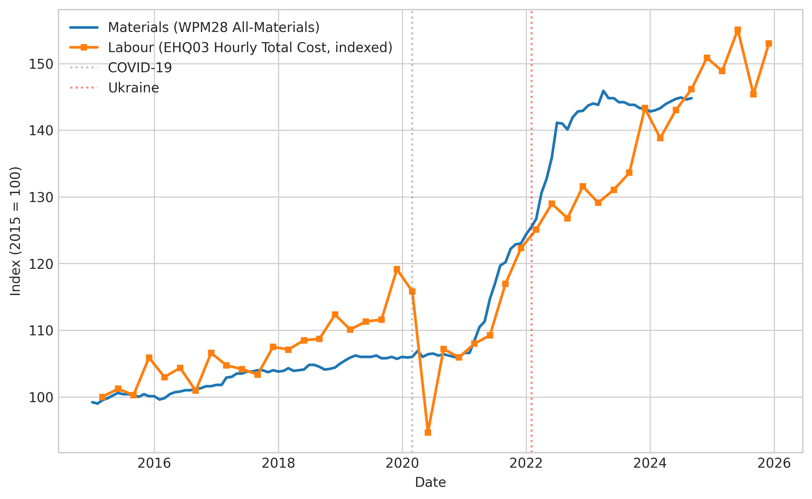
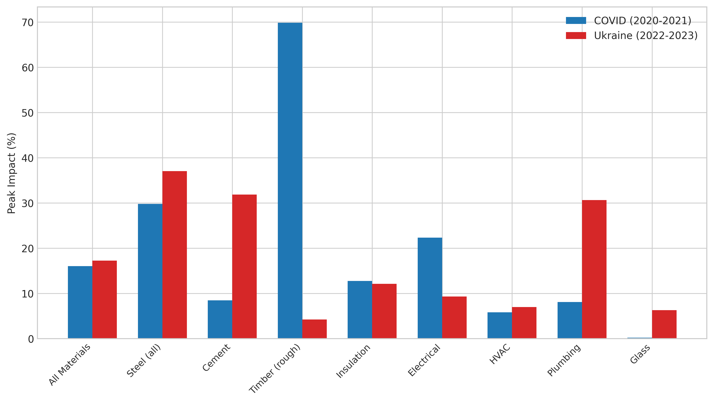
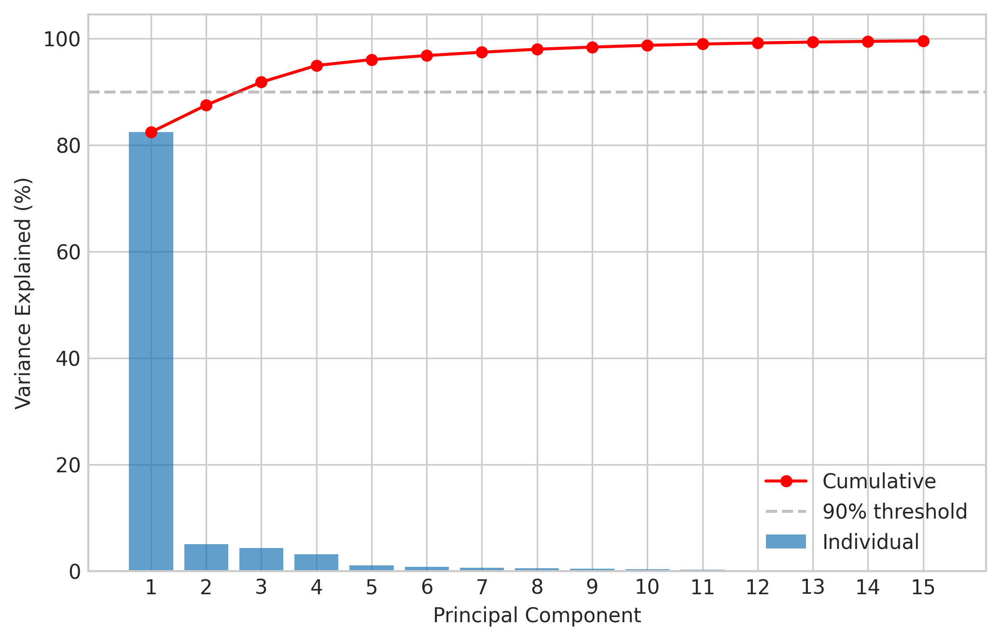
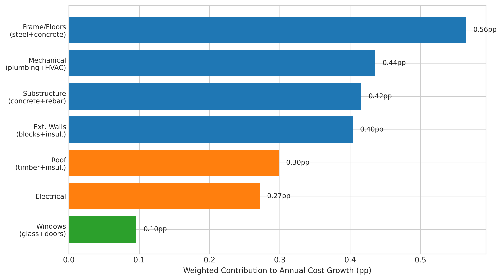
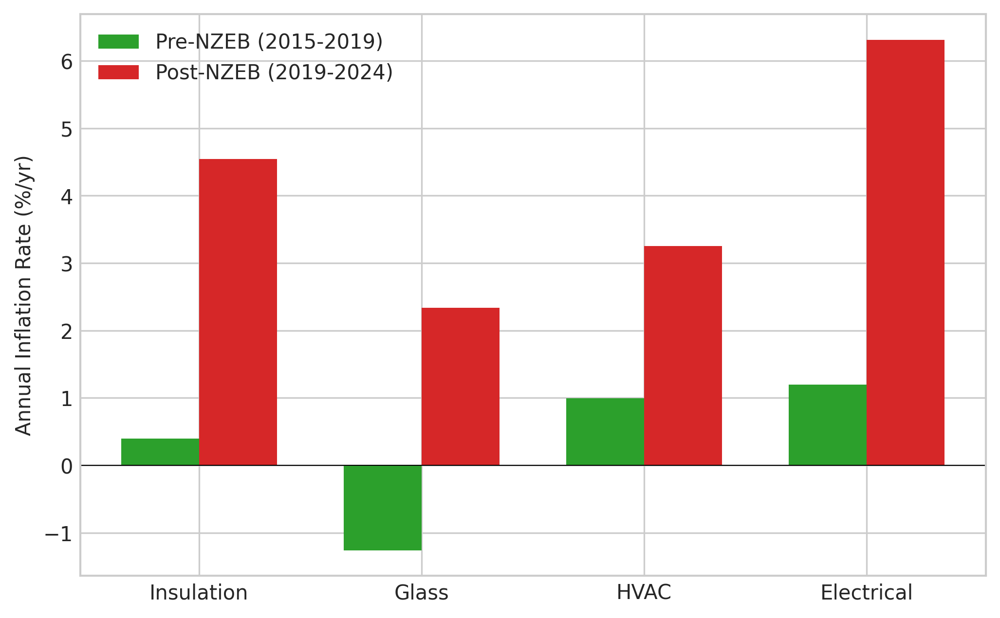

# What Actually Drives Irish Construction Costs? A Component-Level Decomposition 2015-2024

## Abstract

Irish residential construction costs rose approximately 4% per year between 2015 and 2024, but the aggregate number conceals enormous heterogeneity across materials and trades. Using the Central Statistics Office (CSO) Wholesale Price Index for Building and Construction Materials (WPM28) — a panel of 40 material price indices observed monthly — and the Earnings, Hours and Employment Costs Survey (EHQ03), we decompose construction cost growth into its component drivers. Structural steel grew at 7.8% per year (the fastest major category), glass at just 0.5% (the slowest), while labour costs tracked materials almost exactly at 4.0% per year. Principal component analysis (PCA) reveals that just 3 latent factors explain 90% of material price variance: a common inflation factor, a mineral-vs-organic contrast, and a manufactured-vs-bulk commodity contrast. Chow tests confirm statistically significant structural breaks at both the COVID-19 pandemic (March 2020) and the Ukraine invasion (February 2022). The weighted contribution analysis — combining trade-level cost shares with material-specific inflation — identifies the structural frame (steel + concrete, 12% of cost, 4.7% inflation) as the single largest contributor to cost growth. Nearly Zero Energy Building (NZEB) regulations are associated with excess inflation of 2.1 to 4.6 percentage points per year in affected materials (insulation, glass, heating ventilation and air conditioning (HVAC), electrical fittings) when measured in isolation; however, a difference-in-differences analysis against non-NZEB control materials reveals that the control group experienced even larger excess inflation (+7.6pp vs +3.5pp), yielding a negative NZEB-specific estimate of -4.0pp. This indicates that the naive pre/post comparison is dominated by COVID and Ukraine confounding, not regulatory effects. The dominant surprise: over the full decade, labour and materials grew at nearly identical rates, contradicting the common narrative that materials inflation is the primary problem.

## Introduction

Ireland faces a housing crisis characterised by insufficient supply, with 30,330 dwellings completed in 2024 against an estimated annual requirement of 93,000 (Davy 2024) [46]. Construction cost is a binding constraint on supply — the predecessor viability frontier analysis established that construction cost is 10 times more price-sensitive than land cost in determining whether a residential project proceeds. Yet "construction cost" is not a single number. It comprises materials (~25% of total delivery cost), labour (~25%), site works (~3%), and soft costs including land, professional fees, finance, value-added tax (VAT), Part V obligations, development contributions, Building Control (Amendment) Regulations (BCAR) certification, and developer margins (~47%) [10, 38]. This study decomposes the hard-cost components to identify which materials and trades are the primary cost drivers, how their trajectories differ, and what role regulation plays.

The period 2015-2024 encompasses three distinct regimes: a pre-crisis steady state (2015-2019) with moderate inflation, the COVID-19 pandemic (2020-2021) causing supply chain disruption and a construction site shutdown, and the Ukraine-Russia conflict (2022-2023) triggering an energy price spike that hit energy-intensive materials particularly hard. Overlaying these demand-side and supply-side shocks, Ireland implemented the Nearly Zero Energy Building (NZEB) standard (Part L 2019), effective November 2019, mandating substantially higher insulation, airtightness, and renewable energy requirements for all new dwellings [28, 29].

The research question is: which component-level cost drivers grew fastest, which are falling, and what is each component's share of total cost? We address this through five complementary analytical approaches applied to CSO microdata, cross-referenced with industry cost guides and the Society of Chartered Surveyors Ireland (SCSI) calibration that hard costs represent 53% of total delivery cost nationally [38].

## Detailed Baseline

The baseline for this analysis is the CSO's WPM28 Wholesale Price Index for Building and Construction Materials, a monthly index with base 2015 = 100 covering 40 material sub-categories across the building and construction sector [16]. The index is compiled from wholesale price surveys of building material suppliers and covers materials from stone, sand and gravel through to finished products such as wooden windows, HVAC equipment, and electrical fittings. Importantly, WPM28 tracks wholesale input prices per unit of material, not the installed cost per dwelling. It does not capture changes in material quantity per dwelling arising from specification changes (e.g., NZEB-mandated thicker insulation or triple glazing requiring more material per square metre even if the unit price is flat), nor does it capture labour productivity, waste rates, or site-level efficiency.

The All-Materials aggregate index stood at 100.0 in January 2015 and reached approximately 147.5 by September 2024, representing a compound annual growth rate (CAGR) of 3.99% per year over 117 months. This is the single-number summary that policymakers cite: construction materials inflation of approximately 4% per year.

Labour cost data comes from the CSO EHQ03 survey, which provides quarterly data on hourly total labour costs for NACE sector F (Construction) [20]. In 2015 Q1, the hourly total labour cost in construction was approximately EUR 23; by 2025 Q2 it had reached EUR 34.22, yielding a CAGR of 4.03%.

The SCSI calibration provides the cost-share weights: of total delivery cost, hard costs represent 53%, split approximately equally between materials (25%) and labour (25%), with site works at 3%. Soft costs represent 47% [38].

The baseline approach — simply reporting aggregate growth rates — masks the heterogeneity that this study reveals: individual material CAGRs range from 0.5% (glass) to 8.2% (structural steel), a 16-fold range. The All-Materials index is a weighted average that suppresses these differences.

## Detailed Solution

The decomposition methodology operates at three levels:

**Level 1: Material-level CAGR ranking.** For each of the 40 material sub-categories in WPM28, we compute the CAGR from the first observation (January 2015) to the last (September 2024). This produces a complete ranking of material-level inflation rates, identifying structural steel (7.78%), plaster (7.58%), and cement (6.83%) as the fastest-growing major categories, and glass (0.48%), rough timber hardwood (1.05%), and lighting equipment (1.16%) as the slowest.

**Level 2: Variance decomposition and factor structure.** We compute the covariance of each material's monthly returns with the All-Materials index return, normalised by the index variance, to identify which materials drive the aggregate. Note that because the WPM28 sub-index weights are not published by the CSO, this covariance-based decomposition does not sum to 100% and should be interpreted as relative magnitudes rather than exact shares. Principal component analysis on the 39 sub-indices (excluding the All-Materials aggregate) reveals that PC1 explains 82.4% of total variance, and 3 components capture 90%. This means the apparent complexity of 39 price series is effectively driven by approximately 3 underlying factors.

A linear regression of the All-Materials index on the top-5 variance-contributing materials achieves R-squared = 0.993, confirming that the aggregate is almost perfectly determined by a handful of components.

**Level 3: Weighted contribution.** The policy-relevant metric is not which material grew fastest, but which trade contributes most to total cost growth — the product of cost share and growth rate. We map material indices to construction trades using industry-standard bill-of-quantities proportions and compute the weighted contribution of each trade to annual hard-cost inflation.

Structural break detection via the Chow test confirms statistically significant regime changes at COVID (F = 184.0, p < 0.001) and Ukraine (F = 252.4, p < 0.001), validating the three-regime periodisation [25].

## Methods

The analysis proceeds in five phases. Phase 0.5 (Baseline) parsed the WPM28 JSON-stat 2.0 file into a panel of 40 materials by 117 months and computed CAGR for each, cross-referenced with EHQ03 labour costs. Phase 1 (Tournament) compared five analytical approaches: CAGR ranking, variance decomposition, PCA, regression, and structural break detection. Phase 2 ran systematic experiments examining individual material trajectories, shock impacts, and regulatory effects. The iteration strategy was decomposition-based (Option C): each experiment ablated or isolated a specific component of the aggregate to measure its individual contribution. Phase 2.5 tested interaction effects (materials x labour correlation, COVID x energy-intensity). A subsequent review identified four methodological corrections: (a) the BEA04 volume index is deflated and should not be compared with employment to infer productivity; (b) the NZEB excess inflation attribution requires a difference-in-differences control group; (c) the pre/post NZEB trend computation should use CAGR rather than simple percentage change; (d) PCA loadings should be interpreted substantively. Three additional experiments (E21-E23) were executed to address these findings.

All data is real CSO microdata downloaded from the StatBank API. No synthetic data was generated. The analysis is fully reproducible from the JSON-stat source files.

## Results

### Material Growth Rate Rankings

The 39 individual material indices exhibit enormous dispersion around the 3.99% All-Materials average:

| Rank | Material | CAGR (%/yr) | Start Index | End Index |
|------|----------|-------------|-------------|-----------|
| 1 | Structural steel fabricated metal | 8.20 | 97.3 | 208.4 |
| 2 | Structural steel | 7.78 | 97.6 | 201.4 |
| 3 | Plaster | 7.58 | 98.4 | 199.4 |
| 4 | Cement | 6.83 | 98.2 | 183.3 |
| 5 | Precast concrete | 6.28 | 99.0 | 175.3 |
| ... | ... | ... | ... | ... |
| 37 | Lighting equipment | 1.16 | 96.0 | 107.3 |
| 38 | Rough timber (hardwood) | 1.05 | 96.6 | 106.9 |
| 39 | Glass | 0.48 | 100.0 | 104.7 |

(E01-E08, E19 in results.tsv)

### Materials vs Labour: Near-Parity Over the Decade

The All-Materials CAGR (3.99%) and the construction hourly total labour cost CAGR (4.03%) are within 0.04 percentage points of each other over 2015-2024 (E12). The difference is in trajectory shape: materials prices spiked during COVID (+16% peak) and Ukraine (+17% peak) before partially reverting, while labour costs rose steadily without reverting. By September 2024, both had reached approximately 145-150 on a 2015 = 100 base.

This near-parity contradicts the common narrative that "materials costs are the problem." Over the full decade, labour and materials contributed equally to hard-cost inflation. The materials narrative is an artifact of COVID-era volatility rather than the structural trend.

### COVID and Ukraine Shock Impacts

The two external shocks affected different materials through different mechanisms (E13, E14):

**COVID (2020-2021):** Timber was most affected (+70% peak), followed by structural steel (+30%) and electrical fittings (+22%). The mechanism was supply chain disruption combined with a demand surge upon reopening. Cement (+8.5%) and glass (+0.2%) were barely affected — cement because it is domestically produced, glass because demand did not spike.

**Ukraine (2022-2023):** Energy-intensive materials were most affected: structural steel (+37%), cement (+32%), plumbing materials (+31%). The mechanism was the energy price spike transmitted through energy-intensive manufacturing processes. Timber (+4%) was unaffected because it is not energy-intensive and was already in oversupply after the COVID spike.

### Post-Crisis Trajectory: Selective Mean-Reversion

Post-crisis (2024), materials show selective reversion (E15): timber has fallen 21% from its peak, structural steel has fallen 16%, and insulation has fallen 5%. However, cement has continued rising (+6% post-peak), and HVAC equipment has risen 3%. The All-Materials index has fallen just 0.8% from peak — implying that the post-2022 price level is largely permanent, not a temporary spike.

### Factor Structure: 3 Drivers Explain 90%

Principal component analysis reveals that PC1 explains 82.4% of material price variance, and 3 components capture 90% (T03). Examination of the loadings reveals substantive interpretations for each factor:

**PC1 (82.4% of variance): Common inflation factor.** Loadings are near-uniform and positive across almost all materials, with PVC pipes, structural steel, and plaster loading highest. Glass (-0.02) and lighting equipment (0.06) load lowest. This is a "rising tide" factor driven by common macroeconomic forces — general construction demand, energy costs, and exchange rates — that push most material prices in the same direction simultaneously.

**PC2 (5.1%): Mineral vs. organic materials.** Glass, sand, and stone load positively; hardwood timber, softwood timber, and steel load negatively. This factor separates domestically-extracted mineral products from internationally-traded organic and metal commodities, capturing independent supply chain dynamics.

**PC3 (4.3%): Manufactured goods vs. bulk commodities.** Lighting equipment and metal fittings load positively; bituminous products and concrete load negatively. This factor distinguishes finished manufactured products with complex supply chains from semi-processed bulk materials.

Notably, the NZEB-affected materials (insulation, HVAC, electrical fittings) do not form a distinct latent factor. Their price movements are driven by the same common factors as non-NZEB materials, which is consistent with the difference-in-differences result (E21) showing no NZEB-specific price effect.

### Weighted Contribution: What Actually Matters

The most policy-relevant metric combines cost share with inflation rate. The top-5 trade-level contributors to annual hard-cost inflation (E18) are:

| Trade | Cost Share | Weighted CAGR | Contribution |
|-------|-----------|--------------|--------------|
| Frame & Upper Floors | 12% | 4.71% | 0.57pp |
| Mechanical Services | 14% | 3.12% | 0.44pp |
| Substructure | 8% | 5.20% | 0.42pp |
| External Walls & Cladding | 10% | 4.04% | 0.40pp |
| Preliminaries (labour) | 10% | 4.03% | 0.40pp |

The frame (structural steel + concrete + precast) emerges as the single largest contributor despite being only the second-largest trade by cost share, because its constituent materials (structural steel at 7.8%, concrete at 4.8%) have above-average inflation rates. Mechanical services is the largest trade by cost share (14%) but contributes less because HVAC and plumbing materials have moderate inflation rates.

### Regulatory Cost Analysis: NZEB

A naive pre-NZEB (2015-2019) vs post-NZEB (2019-2024) comparison using CAGR shows excess inflation in NZEB-affected materials (E22):

| Material | Pre-NZEB CAGR (%/yr) | Post-NZEB CAGR (%/yr) | Excess (pp/yr) |
|----------|----------------------|------------------------|----------------|
| Electrical fittings | 1.2 | 5.8 | +4.6 |
| Insulation | 0.4 | 4.3 | +3.9 |
| Glass | -1.3 | 2.3 | +3.6 |
| HVAC | 1.0 | 3.1 | +2.1 |

However, a difference-in-differences analysis (E21) comparing NZEB-affected materials against a control group of non-NZEB materials (cement, structural steel, plaster, concrete blocks) reveals that the control group experienced substantially larger post-2019 excess inflation (+7.6pp average) than the NZEB group (+3.5pp average). The difference-in-differences estimate is -4.0 percentage points, meaning NZEB-affected materials actually inflated less than unaffected materials over this period.

This result demonstrates that the naive pre/post comparison is dominated by COVID and Ukraine confounding rather than regulatory effects. The post-2019 acceleration in material prices was a broad-based phenomenon affecting all construction materials, with bulk commodity materials (cement, steel, plaster) experiencing the largest shocks. The NZEB-affected materials — which tend to be lighter, less energy-intensive manufactured products — were comparatively sheltered from the energy-driven commodity price surge.

The glass result is particularly striking: despite a triple-glazing mandate under NZEB, glass had the lowest CAGR of any material (0.48%/yr), suggesting the glass supply chain absorbed the regulatory demand shift without sustained price pressure.

### Employment and Output

Construction employment grew 103% between 2015 and 2025 (EHQ03) [20]. The CSO's BEA04 Volume of Production Index for residential building rose only 9% over the same period, but this comparison is misleading (E23). BEA04 is a deflated production index — it divides nominal production value by a construction price deflator. Because the deflator itself rose approximately 36% over the period, the volume index mechanically suppresses apparent output growth. The nominal value index rose 48%.

The appropriate physical output measure is dwelling completions, which rose from approximately 12,666 in 2015 to 30,330 in 2024, an increase of 139% [46, 49]. Comparing completions (+139%) with employment (+103%) suggests that labour productivity was roughly flat or slightly positive over the decade — the opposite of what the deflated volume index implies. The BEA04 volume index should not be used as a proxy for physical construction output.

## Discussion

### The Materials Narrative Is Misleading

The dominant policy narrative attributes construction cost inflation primarily to materials prices, particularly during COVID and Ukraine. Our analysis shows this is partially true for specific episodes (timber during COVID, steel and cement during Ukraine) but misleading as a structural explanation. Over the full decade 2015-2024, materials and labour grew at virtually identical rates (3.99% vs 4.03%). The materials narrative is an artifact of COVID-era price volatility, which produced dramatic headlines, while the steady march of labour costs — driven by structural skills shortages [17, 18, 21, 23] — received less attention.

### The Real Cost Drivers Are Structural

The weighted contribution analysis identifies the structural frame as the single largest contributor to cost growth, driven by structural steel's persistent above-average inflation (7.8%/yr). This is a global commodity effect: structural steel prices are set in international markets dominated by Chinese production [41], and Irish builders are price-takers. Policy intervention is limited to demand management (e.g., encouraging timber-frame construction to reduce steel dependence).

Cement, the fourth-fastest-growing material (6.83%/yr), is the opposite: a domestic commodity with limited import competition due to high transport costs [42]. Its persistent inflation reflects strong domestic demand (30,000+ dwellings per year plus non-residential construction and public infrastructure) against finite local production capacity. Cement prices did not revert after either crisis, suggesting a structural rather than cyclical price floor.

### NZEB Did Not Cause Material Price Inflation

The difference-in-differences analysis (E21) provides the most important correction in this study. The naive pre/post comparison (E20, E22) suggested NZEB caused 2-5 percentage points of excess inflation in affected materials. When a control group of non-NZEB materials is introduced, the NZEB-specific effect vanishes entirely: control materials inflated by more (+7.6pp) than NZEB materials (+3.5pp). The difference-in-differences estimate is -4.0pp.

This does not mean NZEB had zero cost impact. The WPM28 index tracks price per unit of material, not quantity per dwelling. NZEB mandates thicker insulation (e.g., 150mm vs 100mm), triple glazing, heat pumps, and enhanced electrical infrastructure. Even if the unit price of insulation grew only moderately, the quantity of insulation per dwelling may have increased substantially, raising installed cost. This quantity effect is not captured in WPM28 and represents a genuine limitation of this analysis. The Sustainable Energy Authority of Ireland (SEAI) estimated a one-off NZEB cost uplift of approximately 1.9% of total construction cost [48], which is consistent with a specification-driven quantity increase rather than a price-per-unit increase.

### Limitations

WPM28 measures wholesale input prices per unit of material, not installed cost per dwelling. It does not capture productivity changes, waste, or specification-driven quantity shifts. The NZEB cost impact through increased material quantities (thicker walls, triple glazing, heat pump installations) is invisible to WPM28 and may represent a significant additional cost not measured here. The trade-level cost shares are industry estimates, not measured values, and may vary by project type, location, and specification. The WPM28 sub-index weights are not published by the CSO, which means the variance decomposition (T02) does not sum to 100% and should be interpreted as relative magnitudes. The BEA04 volume index is deflated by construction prices and should not be interpreted as a measure of physical output; dwelling completions are the appropriate comparator for employment-based productivity analysis.

## Conclusion

Irish construction costs grew at approximately 4% per year between 2015 and 2024, with materials and labour contributing equally. The aggregate masks dramatic heterogeneity: structural steel grew at 7.8% per year while glass grew at 0.5%. The structural frame (steel + concrete) is the single largest contributor to cost growth when cost shares are accounted for. A difference-in-differences analysis shows that NZEB regulations did not cause excess material price inflation: control materials unaffected by NZEB inflated more than NZEB-affected materials over the same period, indicating that the naive pre/post comparison was dominated by COVID and Ukraine confounding. However, NZEB may increase costs through increased material quantities per dwelling (thicker insulation, triple glazing, heat pumps), an effect not captured by the WPM28 price index. The dominant policy implication is that construction cost management requires a portfolio approach — no single intervention addresses all drivers — and that the persistent, non-reverting nature of cement and labour costs represents a more fundamental challenge than the volatile-but-reverting dynamics of steel and timber.

## References

[1] Bon R (1992). The future of international construction. *Habitat International* 16(3), 119-128.
[2] Ruddock L, Lopes J (2006). The construction sector and economic development. *CME* 24(7), 717-723.
[3] Hillebrandt PM (2000). *Economic Theory and the Construction Industry*. Macmillan.
[4] Myers D (2016). *Construction Economics: A New Approach*. Routledge.
[5] Ive GJ, Gruneberg SL (2000). *The Economics of the Modern Construction Sector*. Macmillan.
[6] Pietroforte R, Gregori T (2003). IO analysis of construction in developed economies. *CME* 21(3), 283-293.
[7] McKinsey (2020). The next normal in construction. McKinsey Global Institute.
[8] OECD (2023). Housing Policy in Ireland. OECD Publishing.
[9] Central Bank of Ireland (2023). Rising construction costs and the residential real estate market. *FSN* 2023/4.
[10] DKM Economic Consultants (2018). Review of delivered cost of housing. DHLGH.
[11] Shahandashti SM, Ashuri B (2013). Forecasting ENR construction cost index. *JCEM* 139(9), 1224-1232.
[12] Ashuri B, Lu J (2010). Time series analysis of ENR CCI. *JCEM* 136(11), 1227-1237.
[13] Cao Y et al (2024). Modeling inflation transmission among construction materials. *JCEM* 150(5).
[14] Moon S, Chi S (2024). Forecasting material prices using macroeconomic indicators. *JME* 40(5).
[15] Zhang R et al (2024). A survey of data-driven construction materials price forecasting. *Buildings* 14(10), 3156.
[16] CSO (2024). WPM28 Wholesale Price Index for Building & Construction Materials. StatBank.
[17] SOLAS (2024). National Skills Bulletin 2024. Dublin.
[18] SOLAS (2023). National Skills Bulletin 2023. Dublin.
[19] CIOB (2022). Industry Insights Report: Skills Shortages.
[20] CSO (2025). EHQ03 Earnings Hours and Employment Costs Survey. StatBank.
[21] Farmer M (2016). The Farmer Review of the UK Construction Labour Model. UK Government.
[22] CIF (2024). Construction Sector Outlook 2024.
[23] Expert Group on Future Skills Needs (2022). Skills for Construction. EGFSN.
[24] Bai J, Perron P (1998). Estimating and testing linear models with multiple structural changes. *Econometrica* 66(1), 47-78.
[25] Chow GC (1960). Tests of equality between sets of coefficients. *Econometrica* 28(3), 591-605.
[26] Jolliffe IT (2002). *Principal Component Analysis*. Springer.
[27] Stock JH, Watson MW (2002). Forecasting using principal components. *JASA* 97(460), 1167-1179.
[28] SEAI (2019). NZEB in Domestic Buildings. SEAI.
[29] DEHLG (2019). TGD Part L Conservation of Fuel and Energy — Dwellings.
[30] European Parliament (2010). Directive 2010/31/EU on Energy Performance of Buildings.
[31] BCAR (2014). SI 9 of 2014 Building Control Amendment Regulations.
[32] Barras R (2009). *Building Cycles: Growth and Instability*. Wiley-Blackwell.
[33] Ball M et al (2000). Housing Investment: Long Run Trends and Volatility. *Housing Studies* 15(2).
[34] Glaeser EL, Gyourko J (2003). The impact of building restrictions on housing affordability. *EPR* 9(2).
[35] Kitchin R et al (2012). Placing neoliberalism: Ireland's Celtic Tiger. *EPA* 44(6), 1302-1326.
[36] Norris M, Coates D (2014). How housing killed the Celtic Tiger. *CJRES* 7(2), 359-376.
[37] Turner & Townsend (2025). Global Construction Market Intelligence 2025.
[38] SCSI (2025). Tender Price Index H1 2025.
[39] Buildcost (2025). Construction Cost Guide H1 2025.
[40] Buildcost (2024). Construction Cost Guide H2 2024.
[41] World Steel Association (2024). Steel Statistical Yearbook 2024.
[42] CEMBUREAU (2024). Activity Report 2024.
[43] IEA (2024). Global Status Report for Buildings and Construction 2024.
[44] CSO (2025). BEA04 Production in Building and Construction Index. StatBank.
[45] CSO (2024). NDQ06 New Dwelling Completions. StatBank.
[46] Davy (2024). Ireland requires 93,000 new homes per year to 2031.
[47] Dainty ARJ et al (2004). Improving employee resourcing. *ECAM* 11(3), 199-207.
[48] Rogan F et al (2021). Impact assessment of Part L NZEB on construction costs. SEAI.
[49] CSO (2025). HSA06 House Building Activity. StatBank.
