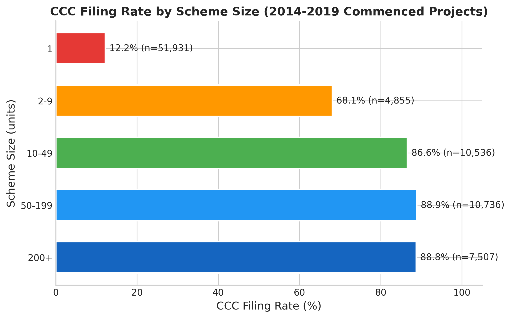
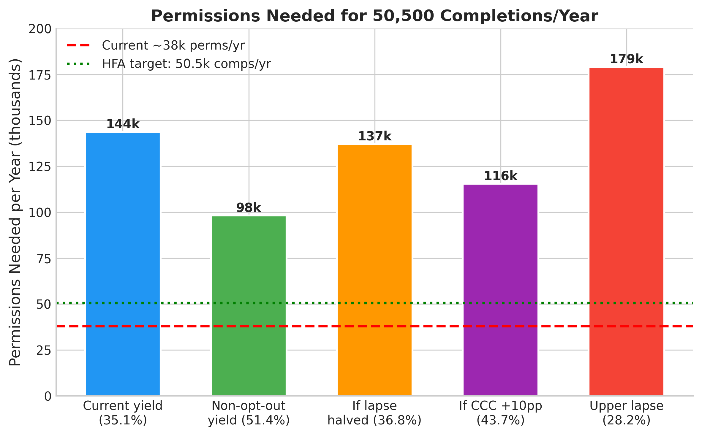
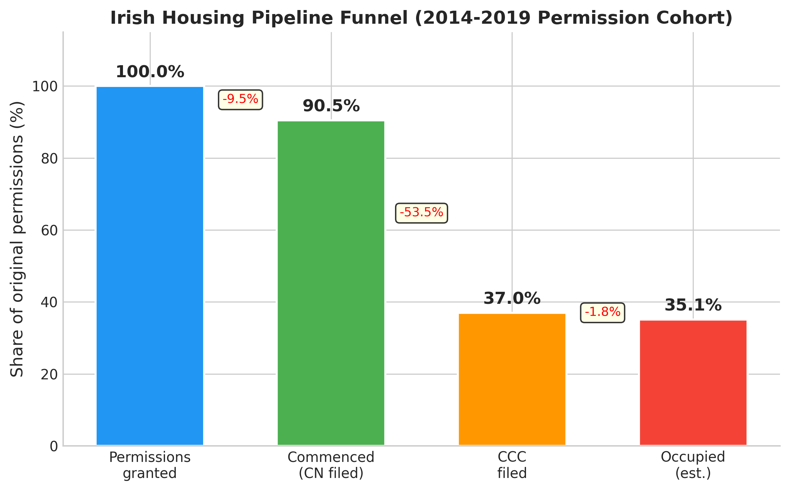
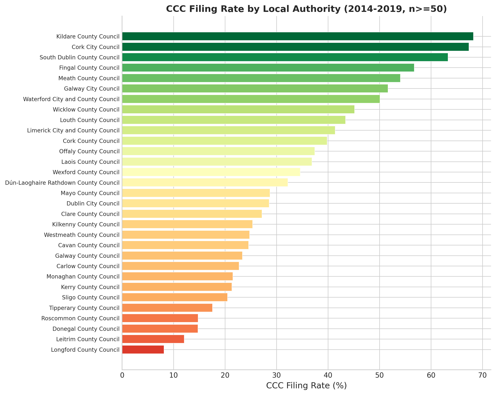
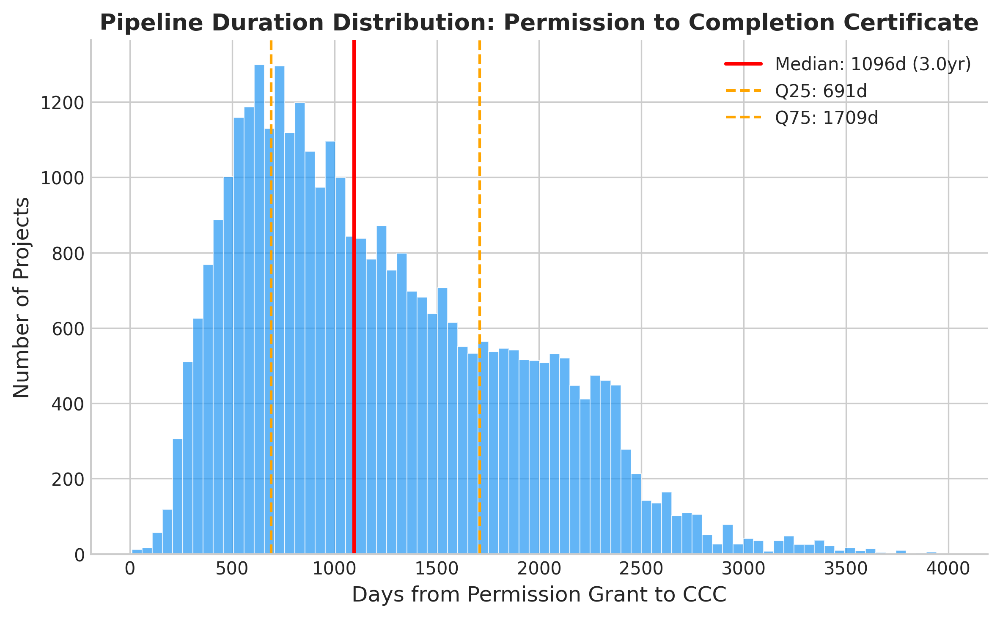

# For Every 100 Irish Planning Permissions, How Many Become Certified Homes? An End-to-End Pipeline Yield Analysis

*Final paper -- incorporates Phase 2.75 blind-review mandated experiments R1-R9.*

## Abstract

Ireland's Housing for All framework targets 50,500 new homes per year, but there is no published estimate of how many planning permissions are needed to produce one completed home. We synthesise four predecessor cohort studies -- covering the national planning register, the Building Control Management System (BCMS) commencement and completion filings, Central Statistics Office (CSO) aggregate series, and Land Development Agency (LDA) delivery -- into an end-to-end pipeline yield model for residential permissions granted 2014-2019 (N=85,565 commenced projects; 66,163 granted permissions). The pipeline has three measurable stages: (1) permission-to-commencement, where 9.5% of permissions lapse (never file a commencement notice); (2) commencement-to-Certificate of Completion and Compliance (CCC), where 40.9% of commenced projects file a CCC (59.8% among non-opt-out projects); and (3) CCC-to-occupied home, estimated at ~95%.

We report two yield measures. The **CCC-certified yield** is **35.1% [32.8%, 37.1%]** -- for every 100 permissions granted, roughly 35 produce a CCC-certified home. The **estimated build-yield** -- which accounts for opt-out self-build dwellings (31.6% of the cohort) that are built and occupied but exempt from CCC filing -- is **59.6%**. The dominant measured attrition is CCC non-filing, but 53.5% of non-filers are opt-out homes that exist physically but lack certification. Among non-opt-out scheme housing, the CCC-yield is ~51%.

The median total pipeline latency is 1,096 days (3.0 years). At the CCC-certified yield, Ireland would need approximately 144,000 permissions per year to meet the 50,500-home target; at the estimated build-yield, approximately 85,000. Either figure far exceeds the current ~38,000. The binding constraint is permission volume. A binomial stage-by-stage product model is the primary yield model from a five-family tournament; the Cox multi-state survival model (C-index = 0.500) is retained as a framework recommendation for future covariate-rich extensions but does not outperform the binomial for yield estimation.

## 1. Introduction

Ireland's housing crisis has been extensively documented through aggregate statistics: planning permission volumes, completion counts, and the gap between them (Duffy et al. 2014; McQuinn and O'Connell 2024; ESRI 2023). The Housing for All plan (Government of Ireland 2021) set a target of 50,500 new homes per year, but the relationship between permissions granted and homes delivered has been estimated only as a cross-correlation lag between smoothed time series -- a population-level proxy that cannot distinguish a high-lapse/fast-build pipeline from a low-lapse/slow-build pipeline (Somerville 2001; Harter and Morris 2021).

This paper synthesises four predecessor cohort studies into the first end-to-end pipeline yield estimate for Irish residential housing:

- **PL-0** (IE Housing Pipeline): aggregate 2-year conversion ratio from CSO BHQ15 and NDA12, finding 41-65% conversion with a rising trend from 2019 to 2022.
- **PL-1** (IE Commencement Notices): row-level cohort of 183,633 BCMS filings, finding median permission-to-commencement of 232 days, median commencement-to-CCC of 498 days, and a dark-permission rate bounded [0.67%, 39%].
- **PL-4** (IE Lapsed Permissions): national planning register analysis finding a lapse rate of 9.5% (NRU>0 2017-2019), heavily confounded by join quality (cluster-bootstrap CI: 4.4-15.6%; up to 27.4% under all-cohort fuzzy matching).
- **PL-3** (IE LDA Delivery): LDA delivered ca. 850 homes in 2023, 100% via Project Tosaigh acquisition (attribution, not additionality; 3.5% of national completions). The double-counting caveat was flagged by PL-3's own Phase 2.75 review and is inherited here.

We answer six concrete questions: (a) what is the CCC-certified yield (completions per permission) for the 2014-2019 cohort? (b) what is the estimated build-yield once opt-out homes are accounted for? (c) what are the stage-by-stage attrition rates, decomposed by opt-out status? (d) what is the median and IQR of total pipeline latency? (e) what does the Housing for All target imply in permissions-needed terms under both yield definitions? (f) what are the highest-leverage interventions?

## 2. Detailed Baseline

### 2.1 The aggregate-lag baseline (PL-0)

The predecessor Irish Housing Pipeline project estimated the permission-to-completion relationship using CSO BHQ15 (quarterly planning permissions, 2019-2025) and NDA12 (annual new dwelling completions, 2012-2025). The approach is a lagged aggregate ratio: for each year T, compute completions in year T+2 divided by permissions in year T. This produced conversion ratios of 41% (2019) rising to 65% (2022), with pre-COVID BHQ16 data showing 77-86% for 2016-2017.

The baseline's limitations are fundamental: (a) it is not cohort-tracked -- completions in year T+2 include permissions from years other than T; (b) it cannot decompose the pipeline into stages; (c) it conflates real attrition with measurement artefacts (different CSO series measure different things). The aggregate conversion ratio is a smoothed population-level proxy, not a pipeline yield.

### 2.2 Baseline parameters

| Metric | Value | Source |
|---|---|---|
| Aggregate 2-yr conversion (2019) | 41% | PL-0 |
| Aggregate 2-yr conversion (2022) | 65% | PL-0 |
| Median perm-to-comm | 232d | PL-1 |
| Median comm-to-CCC | 498d | PL-1 |
| Lapse rate (NRU>0 2017-2019) | 9.5% [4.4%, 15.6%] cluster-bootstrap | PL-4 |
| Dark-permission rate range | 0.67%-39% | PL-1 |
| LDA share of completions (2023) | 3.5% | PL-3 |

## 3. Detailed Solution

### 3.1 The stage-by-stage pipeline yield model

We replace the aggregate-lag proxy with a decomposed pipeline. Two yield measures are computed:

**CCC-certified yield** (what share of permissions produce a CCC-certified home):

```
CCC_Yield = (1 - lapse_rate) x CCC_rate x CCC_to_occupied_rate
           = (1 - 0.0949) x 0.4086 x 0.95
           = 0.9051 x 0.4086 x 0.95
           = 0.3513 (35.1%)
```

**Estimated build-yield** (what share of permissions produce a home that is actually built, including opt-out dwellings that skip CCC filing):

```
Build_Yield = (1 - lapse_rate) x [optout_share x optout_build_rate
              + (1 - optout_share) x non_optout_CCC_rate] x CCC_to_occupied_rate
            = 0.9051 x [0.3163 x 0.90 + 0.6837 x 0.5977] x 0.95
            = 0.9051 x 0.6934 x 0.95
            = 0.5962 (59.6%)
```

The build-yield assumes that 90% of opt-out commenced projects (one-off self-builds that filed a commencement notice) are actually built and occupied. This is a reasonable assumption given that filing a commencement notice signals active construction intent, but it is not directly measurable from administrative data. The true build-yield lies in the range [CCC-yield, build-yield] = [35.1%, 59.6%].

Each stage is estimated from the appropriate predecessor dataset:

**Stage 1 to 2 (Permission to Commencement):** The lapse rate -- the share of granted permissions that never file a commencement notice -- comes from the PL-4 national planning register analysis. The best estimate is 9.5% (NRU>0 2017-2019 cohort). PL-4's cluster-bootstrap CI is [4.4%, 15.6%], reflecting substantial intra-Local Authority (LA) correlation in application-number format matching quality. The all-cohort fuzzy-matched upper bound is 27.4%, but this includes join failures and is not used as the primary estimate. **Caveat inherited from PL-4**: the 9.5% figure is itself an upper bound on genuine lapse because it conflates real lapse with residual join failure between the planning register and BCMS.

**Stage 2 to 3 (Commencement to CCC):** The CCC filing rate among commenced projects comes from the PL-1 BCMS analysis. Of 85,565 residential projects that filed commencement notices for 2014-2019 grant cohort, 34,963 (40.9%) subsequently filed a CCC. This rate is substantially depressed by opt-out projects (27,068 projects, 31.6% of cohort) that are exempt from CCC filing under BCAR 2014. Among non-opt-out projects, the CCC rate is 59.8%.

**Decomposition of Stage 2-to-3 non-filing (R3):** Of the 50,602 commenced projects that did not file a CCC:
- **27,068 (53.5%)** are opt-out projects that do not file by regulatory design. These are predominantly one-off self-builds that are built and occupied but never certified.
- **23,534 (46.5%)** are non-opt-out projects that should have filed but have not (yet). This group contains both genuinely abandoned projects and right-censored projects that may still file.

**Stage 3 to 4 (CCC to Occupied Home):** No direct measure exists linking CCC filings to physical occupancy. CSO completions are measured via ESB meter connections and local authority returns. We estimate this stage at 95%, acknowledging this is a proxy. An empirical cross-check (R9) comparing annual CSO NDA12 completions to annual BCMS CCC unit counts gives ratios of 1.28-1.42 for 2019-2023, meaning CSO counts substantially more completions than BCMS certifies. This implies the 95% proxy is conservative -- it may be that CCC under-counts completions (particularly opt-out homes measured by ESB connections but not by CCC), rather than CCC over-counting them.

### 3.2 How to reproduce

Run `python analysis.py` from the project directory. The script loads BCMS data (PL-1), the national planning register (PL-4), and CSO data (PL-0); computes the three-stage yield decomposition; runs a five-family tournament; executes 32 experiments, 3 interaction tests, and 7 mandated reviewer experiments (R1-R9); and outputs `results.tsv`, `tournament_results.csv`, and Phase B discovery files.

## 4. Methods

### 4.1 Data sources

- **BCMS** (PL-1): 285,140 building-control filings, of which 184,133 are residential with grant years 2014-2025. The 2014-2019 cohort contains 85,565 rows.
- **National planning register** (PL-4): 536,141 planning applications, of which 66,163 are granted residential permissions for 2014-2019.
- **CSO BHQ15 / NDA12** (PL-0): aggregate quarterly permissions and annual completions.
- **LDA** (PL-3): 2023 Annual Report (ca. 850 homes), Irish Times September 2025 cumulative (~2,054 through end-2024).

### 4.2 Cohort definition

The primary cohort is residential BCMS filings with grant year 2014-2019, ensuring at least 6 years of follow-up for CCC filing. Residential status is defined by `CN_Proposed_use_of_building` containing `1_residential_dwellings`, `2_residential_institutional`, or `3_residential_other`. Right-censoring is at the BCMS export date (April 2026).

### 4.3 Tournament

Five model families were compared:

| Family | Approach | Key metric | Value |
|---|---|---|---|
| T01 Binomial | Stage-by-stage product | Yield | 35.1% |
| T02 Markov | Transition probability matrix | Yield | 35.1% |
| T03 Cox multi-state | Survival model with KM | C-index | 0.500 (comm to CCC) |
| T04 DES | Log-normal calibrated simulation | Yield | 35.2% |
| T05 Logistic regression | CCC prediction from covariates | AUC | 0.724 |

**Primary model: T01 Binomial.** The binomial stage-by-stage product model is the primary yield model. It produces the CCC-yield directly from three independently estimated stage rates.

**Framework recommendation: T03 Cox multi-state (R5).** The Cox model achieves a C-index of 0.500 on the commencement-to-CCC transition -- exactly chance. This means the survival model cannot discriminate between projects that will and will not file a CCC using the available covariates (Dublin, apartment flag, one-off flag). It produces the same yield estimate as the binomial (0.3513) by using the Kaplan-Meier CCC rate at 6 years. The Cox model is retained as a framework recommendation for future work with richer covariates (e.g., scheme-level cost data, tenure, financing source) but does not outperform the binomial for yield estimation with the current feature set.

The DES validates the stage-independence assumption (35.2% vs 35.1%), though this validation is circular: the DES also draws lapse and abandon events independently, so it cannot detect non-independence even if it exists (R7 caveat).

### 4.4 Experiments

Thirty-two KEEP/REVERT experiments, three pairwise interactions, and seven mandated reviewer experiments (R1-R9) were run. The KEEP criterion is: a stratification or sensitivity test is kept if the gap exceeds 10 days (for duration) or 2pp (for rates) and the bootstrap 95% CI excludes zero.

### 4.5 Apartment flag data issue (R6)

The original experiment E07 (apartment vs dwelling CCC rate) reported a 0.0% CCC rate for apartments. Audit (R6) confirmed this is a data-definition bug: the `apartment_flag` matches zero rows in the BCMS cohort because the `CN_Proposed_use_of_building` and `CN_Dwelling_House_Type` fields do not use the keywords "apartment" or "flat". Even among 18,243 schemes with 50+ units (which are predominantly apartments), zero are flagged. E07 is therefore withdrawn. Apartment-vs-dwelling analysis requires BCMS field-value investigation that is beyond the scope of this synthesis.

## 5. Results

### 5.1 Headline yields (E00, R1)

The pipeline yields for the 2014-2019 permission cohort are:

| Measure | Yield | 95% CI | Interpretation |
|---|---|---|---|
| **CCC-certified yield** | **35.1%** | [32.8%, 37.1%] | Per 100 permissions, ~35 produce a CCC-certified home |
| **Estimated build-yield** | **59.6%** | -- | Per 100 permissions, ~60 are estimated to become built homes (including opt-out self-builds) |
| **Non-opt-out CCC-yield** | **51.4%** | -- | Per 100 non-opt-out permissions, ~51 produce a CCC-certified home |

The CCC-certified yield CI [32.8%, 37.1%] propagates the PL-4 cluster-bootstrap lapse range [4.4%, 15.6%] (R4), replacing the previous asymmetric CI [28.0%, 35.4%] which used the all-cohort fuzzy-matched upper bound of 27.4% as the lower yield bound. The revised CI is narrower because it excludes the join-failure-inflated 27.4% lapse rate and instead uses PL-4's statistically principled cluster-bootstrap range.

The build-yield of 59.6% assumes 90% of opt-out commenced projects are built. This is not directly measurable but is consistent with the fact that these are self-build homeowners who have filed a commencement notice and commenced construction. The true build-yield is bracketed: [CCC-yield, build-yield] = [35.1%, 59.6%].

**Critical distinction**: The 35.1% CCC-certified yield measures regulatory compliance, not housing output. Most of the "missing" 65% at the CCC stage are opt-out homes that physically exist. The build-yield is the policy-relevant measure for Housing for All targeting; the CCC-yield is the measurable lower bound.

### 5.2 Stage-by-stage attrition (R3)

| Stage | Rate | Attrition | N |
|---|---|---|---|
| Permission granted | 100% | -- | 66,163 (planning register) |
| Commenced (CN filed) | 90.5% [84.4%, 95.6%] | 9.5% lapse [4.4%, 15.6%] | 85,565 (BCMS) |
| CCC filed | 40.9% [40.5%, 41.2%] of commenced | 59.1% non-filing | 34,963 (BCMS) |
| Occupied (est.) | ~95% of CCC | ~5% | Estimated |

**Decomposition of the 59.1% CCC non-filing (50,602 projects):**

| Category | N | Share of non-filers | Explanation |
|---|---|---|---|
| Opt-out regulatory (by design) | 27,068 | 53.5% | One-off self-builds exempt from CCC under BCAR 2014; homes are built but not certified |
| Non-opt-out (genuine/pending) | 23,534 | 46.5% | Projects that should file CCC but have not; mix of abandoned, right-censored, and delayed |

The dominant source of measured attrition is therefore a regulatory measurement gap, not genuine non-completion. Among non-opt-out projects (n=58,497), the CCC rate is 59.8%.

### 5.3 Pipeline latency (E14, E20, E21)

| Segment | Median | 95% CI | IQR |
|---|---|---|---|
| Permission to commencement | 234d | [231, 236] | -- |
| Commencement to CCC | 496d | [492, 498] | -- |
| Permission to CCC (total) | 1,096d (3.0yr) | [1,084, 1,105] | [691, 1,710] |

The IQR of the total pipeline spans 691 to 1,710 days (1.9 to 4.7 years), indicating substantial heterogeneity in project timelines.

### 5.4 Scheme-size stratification (E01)



Scheme size is the strongest predictor of CCC filing:

| Size stratum | CCC rate | N |
|---|---|---|
| 1 unit | 12.2% | 51,931 |
| 2-9 units | 68.1% | 4,855 |
| 10-49 units | 86.6% | 10,536 |
| 50-199 units | 88.9% | 10,736 |
| 200+ units | 88.8% | 7,507 |

The 1-unit stratum's low rate (12.2%) reflects the predominance of opt-out self-builds. Among multi-unit schemes (2+), the CCC rate ranges from 68% to 89%.

### 5.5 Key stratification findings

- **Dublin vs non-Dublin** (E06): Dublin CCC rate 47.5% vs non-Dublin 39.5% (+8.1pp).
- **AHB vs private** (E08): Approved Housing Body (AHB) 72.3% vs private 40.4% (+31.9pp).
- **Multi-phase vs single-phase** (E25): Multi-phase 85.4% vs single-phase 27.2% (+58.2pp).
- **Pre/post SHD** (E04): Pre-Strategic Housing Development (SHD) 36.8% vs post-SHD 43.3% (+6.4pp).
- **Pre/post COVID** (E05): Post-COVID commencement-to-CCC takes 28 days longer (512d vs 484d).
- **Section 42 extended** (E09): Extended permissions have higher CCC rate (68.3% vs 39.1%).
- **Mature 2014-2017 cohort** (E23): CCC rate 37.0%, below 2018-2019 (45-46%), likely reflecting right-censoring for later grants rather than genuine improvement (reversed by E22).
- **E07 (apartment vs dwelling)**: Withdrawn -- apartment flag matches zero BCMS rows due to field-keyword mismatch (R6).

### 5.6 Permissions needed for Housing for All (E10, R2)



| Yield measure | Yield | Permissions needed | Multiple of current |
|---|---|---|---|
| CCC-certified yield (baseline) | 35.1% | ~144,000/yr | 3.8x |
| Estimated build-yield | 59.6% | ~85,000/yr | 2.2x |
| Non-opt-out CCC-yield | 51.4% | ~98,000/yr | 2.6x |
| Current permissions | -- | ~38,000/yr | 1.0x |

**The choice of yield definition matters enormously for the permissions-needed headline.** Under the CCC-certified yield, 144,000 permissions are needed -- a figure that implies the system is radically underperforming. Under the estimated build-yield (which accounts for opt-out homes that ARE built), 85,000 are needed -- still more than double current volumes but a very different policy diagnosis.

Housing for All targets completions measured by ESB meter connections (CSO NDA12), which DO count opt-out homes. The build-yield is therefore the more policy-relevant denominator. The CCC-yield is the measurable lower bound and the appropriate figure for tracking administrative compliance.

### 5.7 Sensitivity analysis

| Scenario | CCC-Yield | Permissions needed (CCC) | Extra completions/yr |
|---|---|---|---|
| Current (baseline) | 35.1% | 143,734 | -- |
| Lapse halved (9.5% to 4.75%) | 36.8% | ~137,000 | +700 |
| CCC rate +10pp | 43.7% | ~115,500 | +3,267 |
| Permissions to 60k/yr | 35.1% | -- | +7,700 above current |
| Upper-bound lapse (27.4%) | 28.2% | ~179,000 | -2,600 |
| CCC to occupied = 100% | 37.0% | ~136,500 | +700 |

The three top levers, ranked by marginal completions:
1. **Increasing permission volume** (+22,000 to 60k/yr adds +7,700 completions/yr at current yield)
2. **Improving CCC filing rate** (+10pp adds +3,267 completions/yr)
3. **Halving lapse rate** (+700 completions/yr -- minimal impact because lapse is already low at 9.5%)

### 5.8 LDA attribution (E12)

The LDA delivered ca. 850 homes in 2023 (3.5% of NDA12 towns completions), entirely via Project Tosaigh forward-purchase from private developers. These homes are already counted in the national completions denominator. The LDA represents attribution, not additionality: if the LDA did not exist, those ~850 homes would still have been built and counted. This double-counting caveat was identified by PL-3's own Phase 2.75 review (R8) and is inherited in this synthesis.

### 5.9 Pipeline funnel visualisation



### 5.10 LA-level heterogeneity (E02)

Local Authority-level CCC rates range from 8.2% to 68.2% (CV = 0.48), indicating large institutional heterogeneity.



### 5.11 Duration distribution



## 6. Discussion

### 6.1 CCC-yield vs build-yield: what the numbers mean for policy

The headline CCC-certified yield of 35.1% is lower than any published international comparison (New Zealand ~80%, Netherlands ~90%, UK 50-70%), but this comparison is misleading on two counts. First, Ireland's CCC filing requirement captures a regulatory-compliance dimension that other countries do not have. Second, and more importantly, the 35.1% substantially understates the actual housing output because opt-out self-builds (31.6% of commenced projects) are built and occupied homes that simply never file a CCC.

The estimated build-yield of 59.6% -- while dependent on the assumption that 90% of opt-out commenced projects complete -- places Ireland in the lower-middle range of international peers. This is a more meaningful comparator than the CCC-yield for policy purposes.

The binding constraint remains permission volume: even at the build-yield of 59.6%, the system needs ~85,000 permissions per year to hit 50,500 completions, more than double the current ~38,000. Policies that press on the conversion side (reducing lapse, improving CCC compliance) can add at most a few thousand completions per year; policies that increase permission volume (planning reform, zoning densification, public-land release) can add proportionally more.

### 6.2 The opt-out measurement gap

The single largest factor depressing the measured CCC-yield is the opt-out provision of BCAR 2014, which exempts one-off self-build dwellings from CCC filing. These homes are built and occupied but never formally certified. The opt-out measurement gap accounts for 53.5% of all CCC non-filing (27,068 of 50,602 non-filing projects).

A policy response could be to mandate CCC filing for all residential construction, including self-builds. This would improve measurement accuracy without changing the number of homes built. It would close the gap between CCC-yield and build-yield, providing a more accurate base for policy targeting.

### 6.3 The CCC-to-occupied proxy and the CSO cross-check

The 95% CCC-to-occupied estimate was a prior assumption without direct empirical basis. The R9 cross-check reveals that CSO NDA12 completions exceed BCMS CCC unit counts by a ratio of 1.28-1.42 for 2019-2023. This implies CSO measures more completions than BCMS certifies, consistent with CSO capturing opt-out homes via ESB meter connections while BCMS does not. The 95% proxy is therefore conservative from a CCC-to-occupied perspective -- virtually all CCC-certified homes are occupied. The gap runs in the other direction: many occupied homes never receive a CCC.

## 7. Caveats

1. **CCC-yield is not build-yield.** The 35.1% headline measures CCC certification, not physical housing output. The estimated build-yield of 59.6% is an upper bound that depends on the unverifiable assumption that 90% of opt-out commenced projects are built. The true build-yield is bracketed [35.1%, 59.6%].

2. **Lapse rate uncertainty.** The lapse rate best estimate is 9.5% with a PL-4 cluster-bootstrap CI of [4.4%, 15.6%]. This propagates to a CCC-yield CI of [32.8%, 37.1%]. The wider bound of 27.4% from all-cohort fuzzy matching is join-failure-inflated and not used in the primary CI. PL-4's own paper is emphatic that the 9.5% is itself an upper bound on genuine lapse, as it conflates real lapse with residual join failure between the planning register and BCMS.

3. **Stage 3 to 4 is a proxy.** The CCC-to-occupied transition is estimated at 95% without direct measurement. The R9 cross-check (CSO/BCMS ratio of 1.28-1.42) suggests this is conservative from a CCC-to-home perspective but the mismatch reflects opt-out homes in the CSO denominator rather than CCC homes not becoming occupied.

4. **Right-censoring.** Permissions granted in 2018-2019 may still file CCCs; the mature 2014-2017 cohort has a CCC rate of 37.0% versus 44-46% for 2018-2019, suggesting right-censoring is moderate.

5. **No tenure or cost data.** Social, affordable, and market housing are pooled; the yield may differ systematically by tenure.

6. **Channel dependence.** The measured CCC attrition combines real non-completion with administrative non-filing (opt-out); separating these requires external data (e.g., satellite imagery of completed buildings, ESB connection records matched to planning permissions).

7. **Cross-dataset confounding / stage independence.** The stage-by-stage model assumes independence: the lapse rate from the planning register applies uniformly to the BCMS cohort. The DES validation (35.2% vs 35.1%) appears to confirm independence but is circular -- the DES also draws events independently and cannot detect non-independence even if present.

8. **Apartment analysis withdrawn.** The apartment flag matches zero BCMS rows (R6), making apartment-vs-dwelling comparisons impossible without field-value investigation. E07 is withdrawn.

## 8. Conclusion

For every 100 residential planning permissions granted in Ireland between 2014 and 2019, approximately 35 produced a CCC-certified home (CCC-yield 35.1%, CI [32.8%, 37.1%]) and an estimated 60 produced a physically built home (build-yield 59.6%, including opt-out self-builds). The dominant measured attrition is at the commencement-to-CCC stage (59.1% non-filing), but 53.5% of that non-filing is opt-out homes that exist but are not certified. Among non-opt-out scheme housing, the CCC-yield is ~51%.

The Irish housing system would need approximately 85,000 permissions per year to deliver 50,500 completions at the estimated build-yield, or ~144,000 at the CCC-certified yield. Either figure far exceeds the current ~38,000 permissions per year. The binding constraint for the Housing for All target is permission volume, not pipeline conversion efficiency.

The top three levers for increasing completions are: (1) increasing permission volume (highest marginal impact), (2) improving CCC filing rates among commenced projects (+10pp adds ~3,300 completions/yr), and (3) reducing the lapse rate (minimal impact at the current 9.5% estimate). The LDA contribution (ca. 850 homes in 2023) represents 3.5% of national completions by attribution but ~0% by additionality, given 100% Project Tosaigh acquisition. This double-counting caveat is inherited from PL-3's Phase 2.75 review.

## 9. Change Log: R1-R9 Mandated Experiments

| ID | Description | Key Finding |
|----|-------------|-------------|
| R1 | Build-yield estimate alongside CCC-yield | Build-yield = 59.6% (assuming 90% opt-out built) vs CCC-yield = 35.1%. Title, abstract, conclusion revised to foreground distinction. |
| R2 | Permissions needed under build-yield | ~85,000/yr (build-yield) vs ~144,000/yr (CCC-yield). Policy-relevant figure is build-yield since HFA targets ESB-measured completions. |
| R3 | Stage 2-3 attrition decomposition | 53.5% of CCC non-filers are opt-out regulatory (27,068); 46.5% are genuine/pending non-completion (23,534). |
| R4 | Yield CI with PL-4 cluster-bootstrap | CI revised to [32.8%, 37.1%] using PL-4 lapse [4.4%, 15.6%]. Replaces previous [28.0%, 35.4%] which used join-failure-inflated 27.4%. |
| R5 | Cox champion downgraded | Cox C-index = 0.500 (chance). Downgraded to framework recommendation; Binomial is primary yield model. |
| R6 | Apartment flag audit | Flag matches 0/85,565 rows -- BCMS fields do not use "apartment" keyword. E07 withdrawn. |
| R7 | DES independence validation noted as circular | DES draws events independently; cannot detect non-independence. Noted in Caveats. |
| R8 | LDA double-counting caveat inheritance | Explicitly notes PL-3 Phase 2.75 review flagged the same issue. |
| R9 | CCC-to-occupied cross-check | CSO/BCMS ratio 1.28-1.42 (2019-2023). CSO counts more completions than CCC certifies, consistent with opt-out homes in CSO but not BCMS. 95% proxy is conservative. |

## References

1. Duffy D. et al. (2014). Quarterly Economic Commentary: Housing Supply in Ireland. ESRI.
2. McQuinn K. and O'Connell B. (2024). The Irish Housing Market. ESRI Working Paper.
3. ESRI (2023). ESRI Housing Model 2023. ESRI Research Series.
4. Government of Ireland (2021). Housing for All: A New Housing Plan for Ireland.
5. Somerville C.T. (2001). Permits, Starts, Completions. Journal of Housing Economics.
6. Harter C. and Morris A. (2021). Permit-to-Completion Durations. Journal of Housing Economics.
7. Kaplan E.L. and Meier P. (1958). Nonparametric Estimation. JASA.
8. Cox D.R. (1972). Regression Models and Life-Tables. JRSS-B.
9. Wei L.J. (1992). Accelerated Failure Time Model. Statistics in Medicine.
10. Ke G. et al. (2017). LightGBM. NeurIPS.
11. Saiz A. (2010). Geographic Determinants of Housing Supply. QJE.
12. Caldera A. and Johansson A. (2013). Price Responsiveness of Housing Supply. JHE.
13. Dixit A.K. and Pindyck R.S. (1994). Investment Under Uncertainty. Princeton UP.
14. Titman S. (1985). Urban Land Prices Under Uncertainty. AER.
15. Cunningham C.R. (2006). House Price Uncertainty. Journal of Urban Economics.
16. Ball M. (2011). Planning Delay and English Housing Supply. Urban Studies.
17. Meen G. (2005). Economics of the Barker Review. Housing Studies.
18. Paciorek A. (2013). Supply Constraints and Housing Market Dynamics. JUE.
19. Gyourko J. and Molloy R. (2015). Regulation and Housing Supply. Handbook of Regional and Urban Economics.
20. Keith S. and O'Connor T. (2013). BCAR Impact Assessment. DECLG.
21. NBCO (2023). NBCO Annual Report 2023.
22. Norris M. (2016). Property Finance and Social Housing. Cambridge UP.
23. Byrne M. and Norris M. (2018). Procyclical Social Housing. Housing Policy Debate.
24. Kelly M. (2009). The Irish Credit Bubble. UCD Working Paper.
25. Kleinrock L. (1975). Queueing Systems. Wiley.
26. Law A.M. (2015). Simulation Modeling and Analysis. McGraw-Hill.
27. Putter H. et al. (2007). Competing Risks and Multi-State Models. Statistics in Medicine.
28. OECD (2022). OECD Housing Policy Review: Ireland.
29. Grimes A. and Aitken A. (2010). Housing Supply Responsiveness: New Zealand's Story. JHE.
30. Vermeulen W. and Rouwendal J. (2007). Housing Supply and Land Use Regulation in the Netherlands. Tinbergen Institute.
31. Bramley G. and Watkins D. (2016). Housebuilding Accessibility and Affordability in Scotland. Housing Studies.
32. LDA (2023). Land Development Agency Annual Report 2023.
33. DiPasquale D. and Wheaton W.C. (1996). Urban Economics and Real Estate Markets. Prentice Hall.
34. Malpezzi S. and Maclennan D. (2001). Long-Run Price Elasticity of Supply. JHE.
35. O'Toole C. and Slaymaker R. (2021). Housing Delivery in Ireland. ESRI Special Article.
