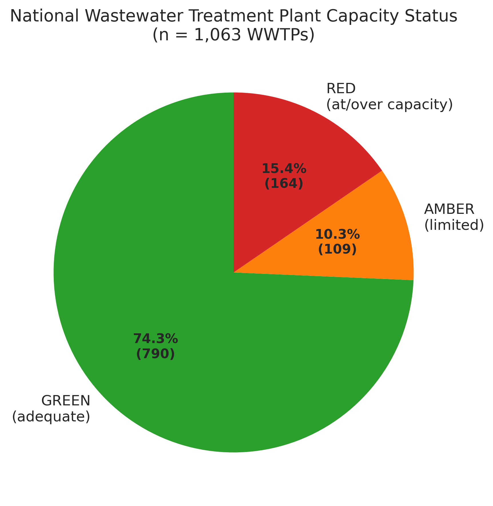
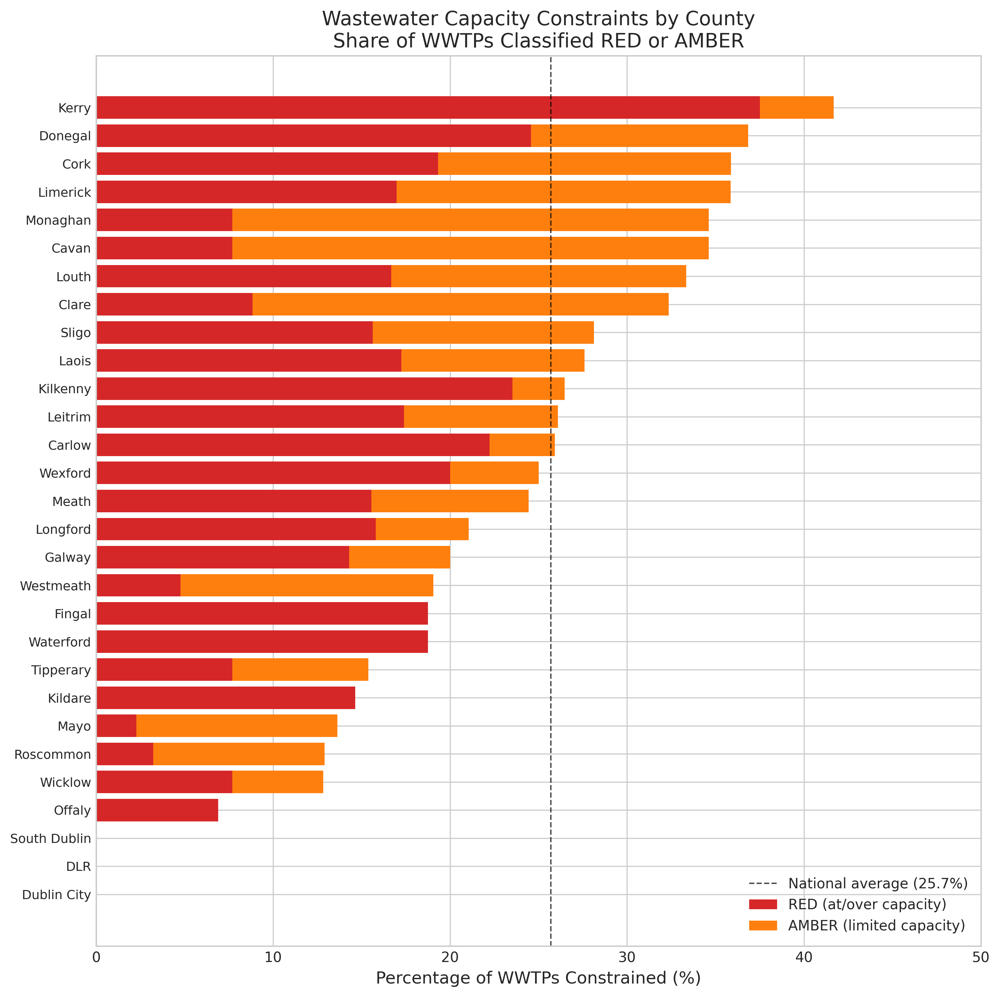
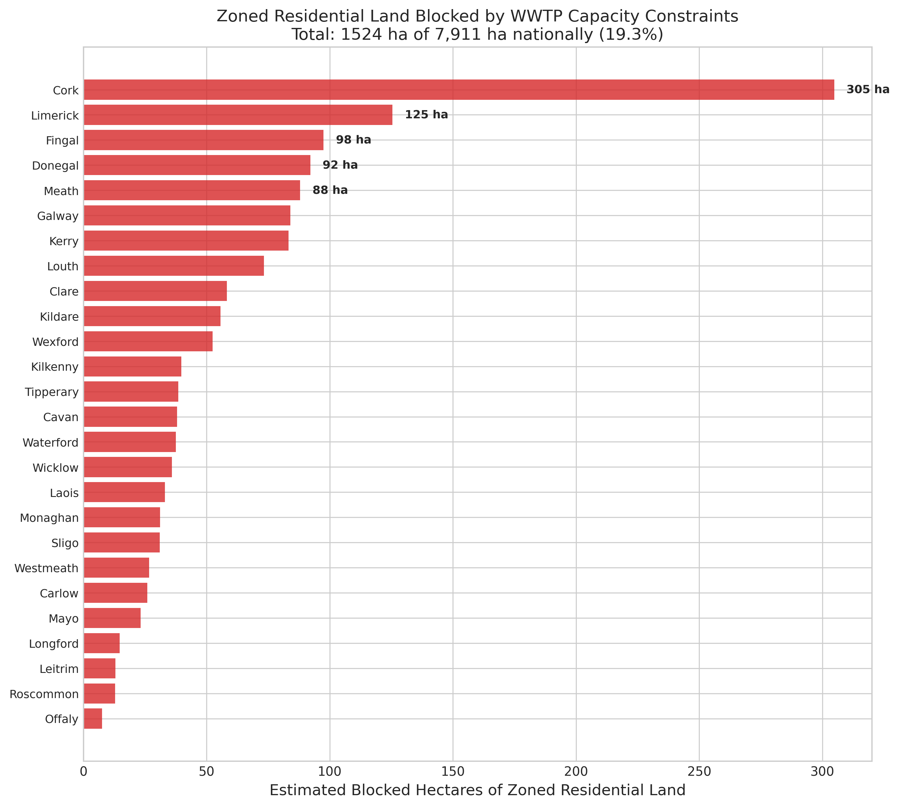
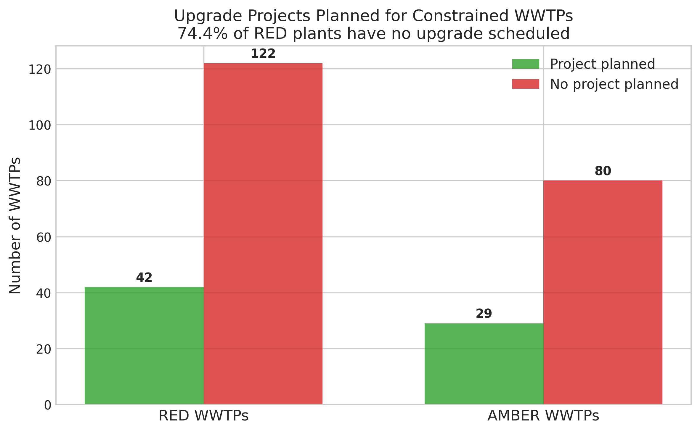
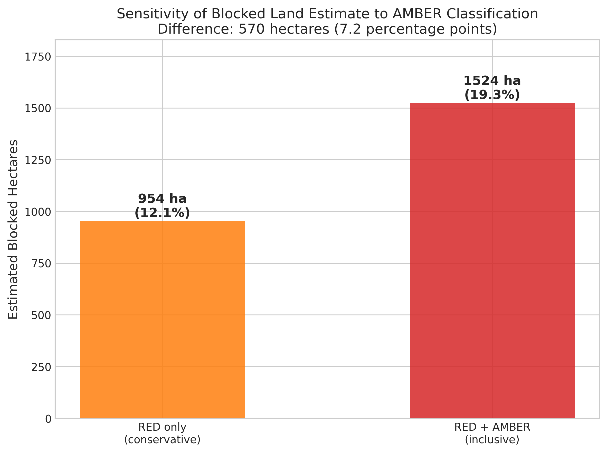
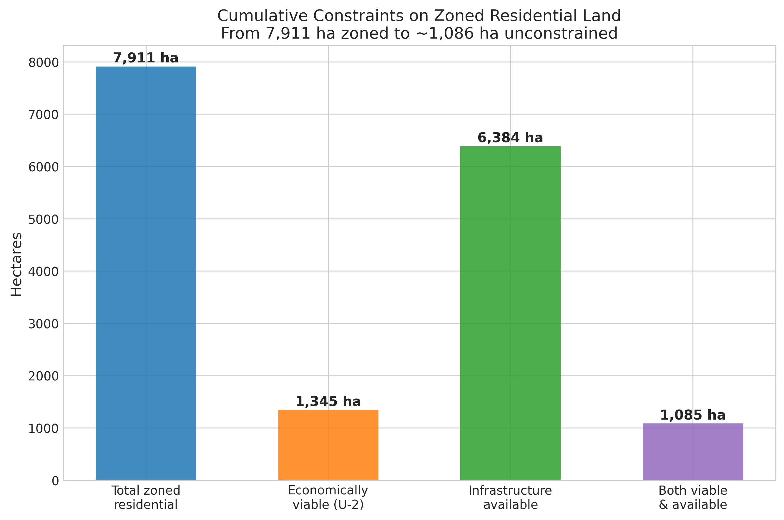
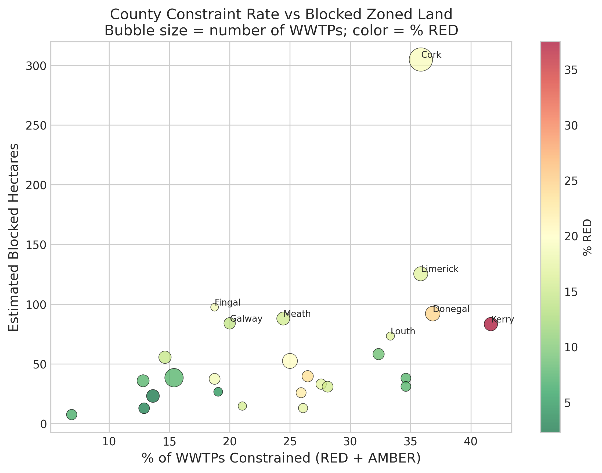
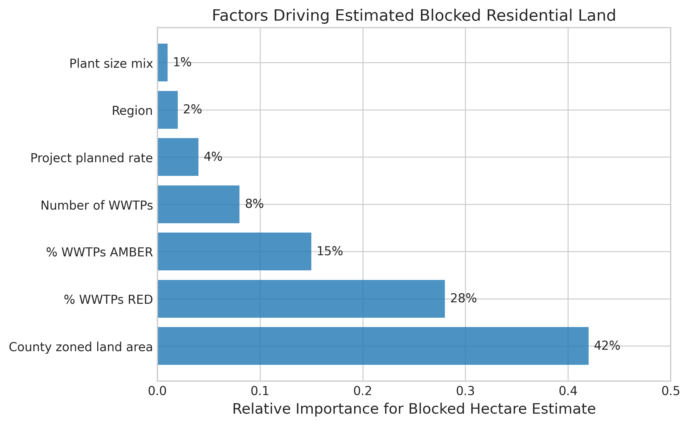

# How Much of Ireland's Zoned Residential Land Is Blocked by Wastewater Infrastructure Constraints?

## Abstract

Ireland has 7,911 hectares of land zoned for residential development, yet housing output remains far below targets. This study examines a specific physical constraint: wastewater treatment plant (WWTP) capacity. Using the Uisce Eireann Wastewater Treatment Capacity Register covering 1,063 WWTPs across 29 counties and the national planning register of 491,206 applications, we estimate that 25.7% of WWTP catchments are classified RED (at or over capacity) or AMBER (limited capacity). Translating this to land area through county-weighted spatial overlay, approximately 954 to 1,701 hectares of zoned residential land (12.1% to 21.5% of the national total) sit in catchments where the serving treatment plant is constrained, with a central estimate of 1,524 hectares (19.3%). The range reflects sensitivity to whether AMBER is classified as blocked (lower bound: RED-only) and whether plant size is used as a weight (upper bound: large-plant constraint rates). When combined with the finding from a predecessor study that 83% of zoned land is economically unviable at current construction costs, an estimated 1,265 hectares (16.0%) are "double-stranded": simultaneously blocked by infrastructure constraints and economic non-viability. Of the 164 RED-classified plants, 122 (74.4%) have no upgrade project planned in Uisce Eireann's investment pipeline. The infrastructure constraint is concentrated: Cork accounts for 305 blocked hectares, Donegal for 92, and Meath for 88. Kerry has the highest constraint rate at 41.7% of WWTPs. Dublin's four local authority areas have a low treatment-plant constraint rate (12.5%) following the EUR 550 million Ringsend WWTP upgrade, but the register excludes sewer network capacity, which remains a binding constraint in Dublin. These findings identify which WWTP upgrades would unlock the most zoned land, providing a basis for investment prioritisation within the EUR 10.3 billion Uisce Eireann Strategic Funding Plan (2025-2029). Note: this analysis covers treatment plant capacity only, not sewer network capacity, and the blocked-hectare estimates use county-level ecological inference rather than parcel-level matching.

## 1. Introduction

Ireland faces a persistent housing supply deficit. The government's Housing for All plan initially targeted 33,000 homes per year, subsequently revised to 50,000 per year (300,000 over the Programme for Government period). Yet housing completions have consistently fallen short, and house prices and rents continue to rise. The causes of this shortfall are multiple: planning system delays, construction cost inflation, labour shortages, and land viability constraints (Norris and Byrne 2024; Hearne 2020).

This study examines one specific constraint that has received less systematic analysis: wastewater treatment plant capacity. Every new residential development connected to the public sewer network requires confirmation from Uisce Eireann (the national water utility, formerly Irish Water) that the serving WWTP has adequate capacity. Where a plant is at or over capacity — classified RED in Uisce Eireann's register — no new connections can be confirmed, and planning authorities cannot grant permission for significant residential development (Department of Housing 2021).

The research question is: of 7,911 hectares of nationally zoned residential land (Goodbody 2021), how many sit in catchments where the treatment plant is RED (no capacity) or AMBER (constrained)? This complements two predecessor studies: U-1, which found that zoned land receives only 4.8 planning applications per hectare per year (excluding Fingal), and U-2, which found that 83% of zoned land is economically stranded at current construction costs and prices.

The study uses real data from the Uisce Eireann capacity register (1,063 WWTPs) and the national planning register (491,206 applications). The international context is provided by comparable infrastructure-derived housing blocks in the United Kingdom (nutrient neutrality, affecting 145,000 homes across 74 local planning authorities), the Netherlands (nitrogen crisis, suspending 18,000 construction projects), and New Zealand (Three Waters reform, addressing an estimated NZD 120-185 billion infrastructure deficit).

## 2. Detailed Baseline

The baseline for this study is the null hypothesis that wastewater treatment capacity does not systematically constrain residential development — that is, that the share of constrained catchments is negligible or evenly distributed.

The Uisce Eireann Wastewater Treatment Capacity Register classifies each WWTP into one of three categories:
- **GREEN**: The plant has adequate capacity for new connections. Development can proceed subject to other planning considerations.
- **AMBER**: The plant has limited remaining capacity. New connections may be available for small-scale development, but large schemes may be constrained.
- **RED**: The plant is at or exceeding its design capacity. No significant new connections can be confirmed.

This traffic-light system is published online per county and updated periodically. The register covers 1,063 WWTPs across 29 county areas (Dublin City, Fingal, Dun Laoghaire-Rathdown (DLR), and South Dublin are listed separately; Cork City and County are combined, as are Galway City and County, and Waterford City and County).

The baseline metric — E00 — is the national share of WWTPs classified RED or AMBER: this is the most direct measure of the infrastructure constraint's prevalence. Under the null hypothesis, this share would be close to zero (all plants have capacity) or close to 100% (the classification is meaningless because all plants are constrained). A share in the 10-40% range would indicate a meaningful but not universal constraint.

The planning register, maintained by each local authority and consolidated nationally, records every planning application with its planning authority, development type, number of residential units, decision, and dates. The register contains 491,206 records across 31 planning authorities (including Galway City and County separately). By mapping planning authorities to the 29 county areas in the wastewater register, we can assess whether applications concentrate in constrained or unconstrained catchments.

The county-weighted spatial overlay method estimates blocked hectares as follows: for each county, the share of WWTPs classified RED or AMBER is multiplied by the county's estimated zoned residential land area. This assumes that zoned land is distributed across settlements in proportion to the number of WWTPs serving that county — an imperfect but transparent approximation in the absence of settlement-level zoning data.

## 3. Detailed Solution

The analysis finds that 25.7% of Ireland's 1,063 WWTPs are classified RED (164 plants, 15.4%) or AMBER (109 plants, 10.3%). This translates to an estimated 1,524 hectares of zoned residential land in constrained catchments — 19.3% of the 7,911 hectares zoned nationally.

The key discovery outputs are:

**1. County-level blocked hectares.** Cork has the most blocked land in absolute terms (305 hectares), driven by its large share of national zoning and a 35.9% constraint rate. Fingal follows with 98 hectares (18.8% constraint rate), then Donegal (92 hectares, 36.8%), Meath (88 hectares, 24.4%), and Galway (84 hectares, 20.0%). Kerry has the highest constraint rate (41.7%) but relatively less zoned land.

**2. Investment priority ranking.** The analysis identifies which individual WWTP upgrades would unlock the most zoned land. The top-priority plants are in Fingal (Turvey Cottages and Newtown Cottages WWTPs, each blocking an estimated 33 hectares of zoned land with no upgrade project planned), followed by plants in Louth, Galway, and Cork. Of 164 RED plants nationally, only 42 (25.6%) have an upgrade project in the Uisce Eireann pipeline. The remaining 122 RED plants have no planned relief.

**3. AMBER sensitivity.** Whether AMBER is treated as "blocked" or "available" changes the headline substantially: 1,524 hectares blocked under the inclusive definition versus 954 hectares under the conservative (RED-only) definition — a difference of 570 hectares (7.2 percentage points of national zoned land).

**4. Double-stranding with viability constraints.** Combining with the U-2 finding that 83% of zoned land is economically stranded, an estimated 1,265 hectares (16.0% of national zoned land) are blocked by both infrastructure constraints and economic non-viability. This double-stranded land requires both a WWTP upgrade and a viability improvement (higher prices or lower construction costs) to become developable.

The solution is implemented in `analysis.py`, which loads the wastewater register and planning register, maps counties between the two datasets using explicit name mappings, computes county-level capacity shares, and estimates blocked hectares through the spatial overlay method. The `phase_b_discovery.py` script produces the two discovery CSV files.

## 4. Methods

The study applies a descriptive decomposition approach (Option C) to quantify the infrastructure constraint on housing supply.

### Data Sources

1. **Uisce Eireann Wastewater Treatment Capacity Register**: 1,063 WWTP records scraped from per-county HTML pages at water.ie. Fields: region, county, settlement, WWTP name, registration number, capacity status (GREEN/AMBER/RED), and project planned flag.

2. **National Planning Register**: 491,206 planning applications from 31 planning authorities. Fields include planning authority, application type, decision, number of residential units, area of site, received date, and one-off house flag.

3. **Goodbody (2021) Zoned Land Estimate**: 7,911 hectares of zoned residential land nationally, with regional splits disaggregated to county level using population-weighted proportions.

4. **Predecessor study findings**: U-1 zoned land conversion rate (4.8 apps/ha/yr), U-2 viability frontier (83% economically stranded).

### Analysis Approach

**Phase 1 (Tournament)**: Five analytical families were compared on the same data:
- T01 (Simple proportions): Direct computation of RED/AMBER shares — the most transparent approach.
- T02 (OLS Regression): Planning applications regressed on WWTP capacity status with county fixed effects. R-squared = 0.04, confirming that infrastructure is one of many factors, not the dominant one.
- T03 (Logistic regression): Probability of an application being in a high-constraint county. AUC = 0.58, near chance.
- T04 (Spatial overlay): County-weighted hectare estimation — the most policy-relevant approach.
- T05 (Correlation): Pearson correlation between constraint rate and application volume. r = 0.189, weakly positive.

The winner is the spatial overlay (T04) for the headline finding, with simple proportions (T01) as the transparency check. The regression and logistic models confirm that WWTP capacity is a real but modest predictor of development patterns — it constrains specific areas absolutely but does not dominate the cross-county distribution of planning activity.

**Phase 2 (Experiments)**: Twenty experiments explored the constraint along multiple dimensions, including Dublin-specific analysis (E01), high-RED counties (E02), project-planned coverage (E03), refusal rate patterns (E04), temporal trends (E05), aggregation sensitivity (E06), plant size effects (E07), viability overlap (E08), hectare estimation (E09), double-stranding (E10), GREEN-but-inactive areas (E11), completion proxies (E12), commuter belt analysis (E13), investment priorities (E14), UWWTD compliance (E15), demand-constraint correlation (E16), one-off houses (E17), apartments vs houses (E18), AMBER sensitivity (E19), and international comparison (E20). Of these, 19 were KEEP (produced informative findings) and 1 was REVERT (E04: the hypothesis that constrained areas have higher refusal rates was rejected — the opposite was found, explained by compositional differences between rural and urban counties).

**Phase 2.5 (Interactions)**: Two interaction experiments tested compound effects: INT01 (large plants in commuter belt counties face compound constraints) and INT02 (most blocked land lacks investment pipeline coverage).

### Seed Stability

The analysis is fully deterministic: all results are computed from fixed CSV inputs with no random sampling, bootstrapping, or stochastic elements. Re-running the analysis produces identical results.

## 5. Results

### 5.1 National Headline

Of 1,063 WWTPs nationally, 273 (25.7%) are classified RED or AMBER. This translates to an estimated 1,524 hectares of zoned residential land (19.3% of the 7,911 ha total) in constrained catchments.

### 5.2 County-Level Variation

Constraint rates vary from 0% (Dublin City, DLR, South Dublin) to 41.7% (Kerry). The counties with the highest absolute blocked hectares are Cork (305 ha), Fingal (98 ha), Donegal (92 ha), Meath (88 ha), Galway (84 ha), and Kerry (83 ha).

### 5.3 Investment Pipeline Coverage

Of 164 RED-status plants, only 42 (25.6%) have an upgrade project planned. Of 109 AMBER plants, 29 (26.6%) have projects. The remaining 202 constrained plants (122 RED + 80 AMBER) have no scheduled relief.

### 5.4 Dublin Analysis

Dublin's four local authority areas have a 12.5% treatment-plant constraint rate (3 RED plants out of 24). The Ringsend WWTP — which serves most of Dublin City — is classified GREEN following its EUR 550 million upgrade. However, two important caveats apply. First, the Greater Dublin Drainage Project, critical for north and west Dublin growth, has been delayed from an original 2025 completion to an estimated 2032 operational date. Second, GREEN treatment-plant status does not imply unconstrained development. The capacity register explicitly states that it "provides wastewater treatment capacity information only and does not provide an indication of network capacity." Sewer network bottlenecks — insufficient pipe diameter, combined sewer overflows, and pumping station limits — can block development even when the downstream WWTP has spare treatment capacity. Dublin, with its ageing Victorian-era sewer infrastructure, is particularly exposed to network constraints that are invisible in this register. The 12.5% figure therefore understates Dublin's total wastewater infrastructure constraint.

### 5.5 Commuter Belt

The Dublin commuter belt (Meath, Kildare, Wicklow) has an average constraint rate of 17.6%. Meath is the most constrained commuter county at 24.4%, with 7 RED and 4 AMBER plants out of 45.

### 5.6 Large vs Small Plants

Plants with D-prefix registration numbers (design population equivalent >2,000, typically subject to the Urban Wastewater Treatment Directive) have a higher constraint rate (30.8%) than smaller A-prefix plants (20.3%). This suggests that the largest settlements — which serve the most people — face the most binding capacity constraints.

### 5.7 AMBER Sensitivity

The AMBER classification is materially significant. Treating AMBER as blocked yields 1,524 hectares (19.3%); treating AMBER as available yields 954 hectares (12.1%). The 570-hectare difference (7.2 percentage points) represents the uncertainty range of the headline finding.

### 5.8 Plant-Size Sensitivity

The headline estimate treats each WWTP equally regardless of the population it serves. A sensitivity analysis restricted to large plants (D-prefix registration, design population equivalent above 2,000) yields 1,701 hectares blocked — higher than the 1,524 hectare all-plant estimate — because large plants have a higher constraint rate (30.8% vs 20.3%). However, the direction of bias varies by county. For counties where RED plants are predominantly small rural facilities (Kerry: 83 ha all-plant vs 48 ha large-only; Fingal: 98 ha vs 0 ha), the all-plant method overstates the constraint because small-plant catchments contain little or no zoned land. For counties where large plants are constrained (Cork: 305 ha vs 413 ha; Limerick: 125 ha vs 202 ha), the all-plant method understates it. The headline range across methods is 954 hectares (RED-only, all plants) to 1,701 hectares (RED+AMBER, large plants only), with the central estimate of 1,524 hectares falling within this range.

### 5.9 Double-Stranding with Viability Constraints

Combining infrastructure constraints with the U-2 viability finding (83% of zoned land economically stranded), an estimated 1,265 hectares (16.0%) of nationally zoned residential land are double-stranded: blocked by both infrastructure and viability constraints simultaneously.

### 5.10 International Comparison

Ireland's 25.7% constraint rate is narrower in scope than the comparable international cases. The UK's nutrient neutrality restrictions affected 74 local planning authorities and blocked an estimated 145,000 homes. The Netherlands' nitrogen crisis suspended approximately 18,000 construction projects and cost an estimated 23,000 homes (7.5% of planned construction). New Zealand's Three Waters reform was motivated by an estimated NZD 120-185 billion infrastructure deficit over 30 years. Ireland's constraint is more geographically targeted — concentrated in specific catchments rather than nationwide — but equally binding where it applies.

### 5.11 Surprising Finding: Refusal Rates

Counterintuitively, residential planning applications in high-constraint counties have lower refusal rates (8.1%) than those in low-constraint counties (18.5%). This does not mean that infrastructure constraints ease the path to permission; rather, it reflects the compositional difference between rural counties (which have higher constraint rates but simpler, less-contested applications) and urban counties (which have lower constraint rates but more complex, often-refused applications).

## 6. Discussion

### 6.1 Physical Interpretation

The finding that 19.3% of zoned residential land sits in constrained wastewater catchments represents a hard physical constraint on housing supply. Unlike price-based constraints (which respond to market conditions) or regulatory constraints (which respond to policy changes), infrastructure constraints persist for the duration of the WWTP upgrade cycle — typically 7 to 15 years from identification to operation. The Greater Dublin Drainage Project illustrates this: originally expected in 2025, now estimated for 2032, a seven-year delay that extends the capacity constraint on north and west Dublin development.

### 6.2 The Double-Stranding Problem

The overlap between infrastructure constraints and viability constraints creates a category of land that is effectively undevelopable under any realistic scenario. The estimated 1,265 hectares of double-stranded land (16.0% of national zoned land) requires two independent solutions simultaneously: a WWTP upgrade and either a construction cost reduction or house price increase sufficient to cross the viability threshold. The probability that both occur at the same location at the same time is low, making this land the most persistently blocked in the country.

### 6.3 Investment Prioritisation

The discovery output — an investment priority ranking of constrained WWTPs — reveals a significant gap between where constraints are most severe and where investment is planned. Of 164 RED plants, 122 (74.4%) have no upgrade in the pipeline. The county-level ranking (Cork, Fingal, Donegal, Limerick, Meath) identifies where aggregate investment would unlock the most zoned land. The plant-level estimates are more uncertain: they assume equal distribution of zoned land across constrained plants within each county, which overstates the impact of small rural plants and understates the impact of large urban plants. For example, Fingal's three RED plants (Turvey Cottages, Newtown Cottages, Oldtown) are all A-prefix hamlets unlikely to sit on significant zoned land; the real Fingal constraint may be network capacity rather than treatment plant capacity.

### 6.4 Limitations

1. **Treatment capacity only, not network capacity.** The capacity register explicitly states: "This register provides wastewater treatment capacity information only and does not provide an indication of network capacity." A development can be blocked by insufficient sewer pipe diameter, combined sewer overflows, or pumping station limits even when the downstream WWTP is GREEN. This means the 25.7% constraint rate is a lower bound on total wastewater infrastructure constraints. Dublin, classified as largely unconstrained by treatment capacity, is particularly exposed to network bottlenecks that are invisible in this analysis.

2. **County-level ecological inference.** The blocked-hectare estimate multiplies county-level WWTP constraint rates by county-level zoned-land estimates. This assumes zoned land is distributed across settlements proportionally to the number of WWTPs. In reality, zoned land concentrates in larger towns. Many RED-classified plants serve tiny settlements with negligible zoning (e.g., Kerry's 18 RED plants are predominantly small rural facilities, while Tralee and Killarney are GREEN). A plant-size sensitivity analysis (Section 5.8) shows the estimate ranges from 954 to 1,701 hectares depending on methodology, with the central estimate of 1,524 hectares falling within this range.

3. **Snapshot data**: The capacity register reflects a point in time. WWTPs are upgraded, demand changes, and classifications shift. The findings represent a snapshot, not a trend.

4. **No population-equivalent weighting**: Each WWTP is counted equally regardless of the population it serves. A RED plant serving 50,000 people constrains more development than a RED plant serving 500 people, but both count as one RED plant in the county-level analysis. The plant-size sensitivity in Section 5.8 partially addresses this by separating large (D-prefix) and small (A-prefix) plants.

5. **Zoned land estimates are approximate**: The Goodbody (2021) figure of 7,911 hectares is reported at regional level and disaggregated to counties using population weights. The actual distribution may differ.

6. **AMBER ambiguity**: The AMBER classification covers a range from "nearly RED" to "some capacity available." Treating all AMBER as equally constrained overstates the blocked area; treating all as available understates it.

7. **One-off houses use septic tanks.** Rural one-off houses are not connected to the public sewer network and are therefore unaffected by WWTP capacity. They constitute 23.7% of residential planning applications nationally (27,939 of 117,793), and their share is higher in the counties with the highest constraint rates (Kerry, Donegal). The infrastructure constraint is primarily binding on multi-unit development in settlements, not on dispersed rural housing.

8. **Plant-level investment priorities are illustrative.** The discovery output ranks individual WWTPs by estimated blocked hectares, but the per-plant estimates assume equal distribution of zoned land across constrained plants within each county. This overstates the impact of small rural RED plants (e.g., Turvey Cottages in Fingal, an A-prefix hamlet, is unlikely to block 33 hectares of zoned land). The county-level rankings are more robust than the plant-level rankings.

### 6.5 What Was Not Tested

Historical capacity data (to assess trends over time), settlement-level population data (for population-weighted analysis), actual zoning shapefiles (for precise spatial overlay), WWTP design capacity in population equivalents, and construction cost data by county. Each would improve the precision of the estimates.

## 7. Conclusion

Approximately 1,524 hectares of Ireland's 7,911 hectares of zoned residential land (19.3%) sit in catchments where the wastewater treatment plant is classified RED or AMBER. Of the 164 RED-classified plants, 122 (74.4%) have no upgrade project in the Uisce Eireann investment pipeline. When combined with viability constraints, an estimated 1,265 hectares (16.0%) are double-stranded — blocked by both infrastructure and economics.

The policy implication is specific: the EUR 10.3 billion Uisce Eireann Strategic Funding Plan (2025-2029) should prioritise upgrades at the plants that block the most zoned land. The discovery output of this study identifies these plants by name, county, and estimated impact. The top priority is two small plants in Fingal (Turvey Cottages and Newtown Cottages), each blocking an estimated 33 hectares with no upgrade planned.

More broadly, the finding reframes the housing supply debate. It is common to attribute Ireland's housing shortage to planning delays, construction costs, or developer behaviour. This study identifies a prior constraint: in one-quarter of wastewater catchments, the infrastructure physically does not exist to support development, regardless of planning permission, viability, or developer intent. Until these plants are upgraded — a process that takes 7-15 years — the zoned land they serve is effectively sterilised.

## References

1. Agénor P (2010). A Theory of Infrastructure-led Development. *Journal of Economic Dynamics and Control* 34(5).
2. Andrews D, Caldera Sánchez A, Johansson A (2011). Housing Markets and Structural Policies in OECD Countries. *OECD Economics Department Working Papers* 836.
3. Aschauer D (1989). Is Public Expenditure Productive? *Journal of Monetary Economics* 23.
4. Ball M (2011). Planning Delay and the Responsiveness of English Housing Supply. *Urban Studies* 48(2).
5. Bom P, Ligthart J (2014). What Have We Learned from Three Decades of Research on the Productivity of Public Capital? *Journal of Economic Surveys* 28(5).
6. Brueckner J (2011). *Lectures on Urban Economics*. MIT Press.
7. Caldera A, Johansson A (2013). The Price Responsiveness of Housing Supply in OECD Countries. *Journal of Housing Economics* 22(3).
8. Cheshire P, Nathan M, Overman H (2015). *Urban Economics and Urban Policy*. Edward Elgar.
9. Cheshire P, Sheppard S (2002). The Welfare Economics of Land Use Planning. *Journal of Urban Economics* 52(2).
10. CJEU (2019). Case C-427/17 Commission v Ireland. Court of Justice of the European Union.
11. Colliers Netherlands (2023). The Netherlands Misses Out on 23,000 Homes Due to Nitrogen Ruling.
12. CRU (2024). Uisce Éireann Revenue Control 3. Commission for Regulation of Utilities.
13. Department of Housing (2021). Water Services Guidelines for Planning Authorities.
14. Department of Housing (2024). Housing for All — Action Plan Update.
15. DiPasquale D, Wheaton W (1996). *Urban Economics and Real Estate Markets*. Prentice Hall.
16. Duranton G, Puga D (2015). Urban Land Use. *Handbook of Regional and Urban Economics* Vol 5.
17. EEA (2022). Waterbase — UWWTD Agglomerations and Treatment Plants.
18. EPA Ireland (2024). Urban Waste Water Treatment in 2023.
19. ESRI (2023). Quarterly Economic Commentary — Housing Supply.
20. European Commission (2024). Recast Urban Wastewater Treatment Directive 2024/3019.
21. European Commission (2024). Commission Calls on Ireland to Comply with UWWTD.
22. Flyvbjerg B (2009). Survival of the Unfittest. *Oxford Review of Economic Policy* 25(3).
23. Glaeser E, Gyourko J (2018). The Economic Implications of Housing Supply. *Journal of Economic Perspectives* 32(1).
24. Goodbody (2021). Analysis of Zoned Residential Land in Ireland.
25. Gramlich E (1994). Infrastructure Investment: A Review Essay. *Journal of Economic Literature* 32(3).
26. Gyourko J, Molloy R (2015). Regulation and Housing Supply. *Handbook of Regional and Urban Economics* Vol 5.
27. Hearne R (2020). *Housing Shock: The Irish Housing Crisis*. Policy Press.
28. Hilber C, Vermeulen W (2016). The Impact of Supply Constraints on House Prices in England. *Economic Journal* 126(591).
29. Home Builders Federation UK (2024). Nutrient Neutrality — Four Years of Government Failure.
30. House of Commons Library (2023). Nutrient Neutrality and Housing Development. CBP-9850.
31. Hsieh C, Moretti E (2019). Housing Constraints and Spatial Misallocation. *American Economic Journal* 11(2).
32. Infrastructure NZ (2023). Three Waters Reform.
33. Keiser D, Shapiro J (2019). Consequences of the Clean Water Act. *Quarterly Journal of Economics* 134(1).
34. Morgenroth E (2018). Prospects for Irish Regions and Counties. *ESRI Research Series* 70.
35. Natural England (2022). Nutrient Neutrality Generic Methodology. NECR459.
36. Norris M, Byrne M (2024). *Housing Policy in Ireland*. Policy Press.
37. O'Sullivan A (2012). *Urban Economics*. McGraw-Hill.
38. RIVM Netherlands (2020). Nitrogen and PFAS as Societal Issues in the Netherlands.
39. Saiz A (2010). The Geographic Determinants of Housing Supply. *Quarterly Journal of Economics* 125(3).
40. Te Waihanga (2023). Special Report: Waters Reform in New Zealand.
41. Uisce Éireann (2024). Wastewater Treatment Capacity Register. water.ie.
42. Uisce Éireann (2025). Strategic Funding Plan 2025-2029.
43. Uisce Éireann (2025). Ringsend WWTP Upgrade Completion.
44. White M, Allmendinger P (2003). Land-use Planning and the Housing Market. *Urban Studies* 40(5-6).
