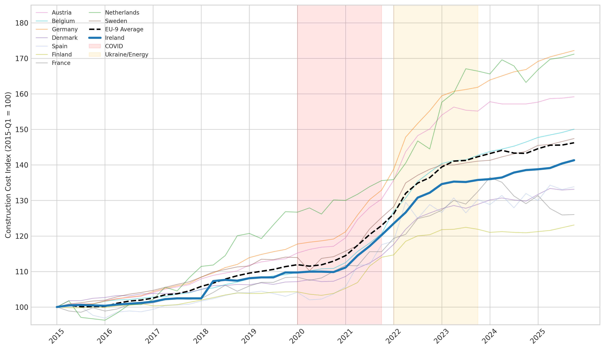
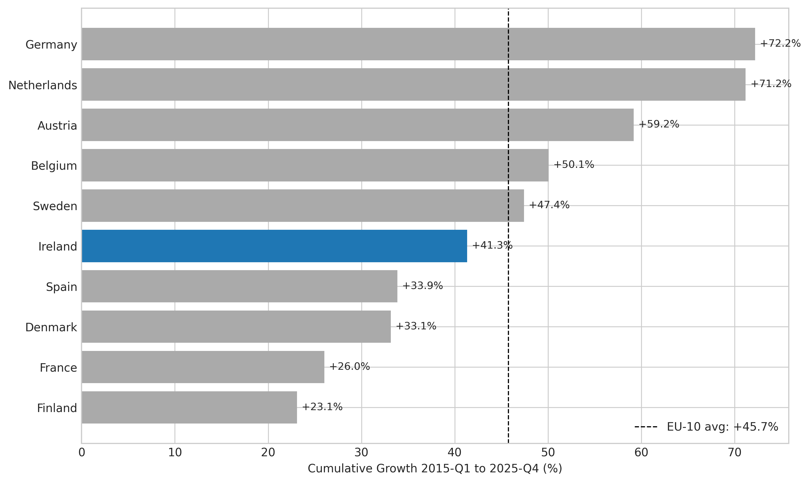
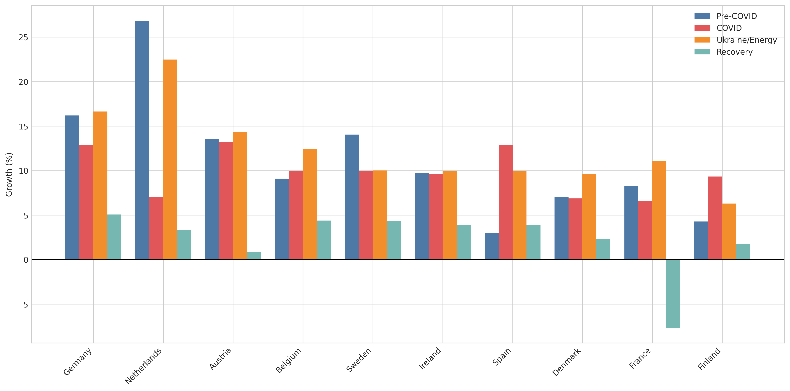
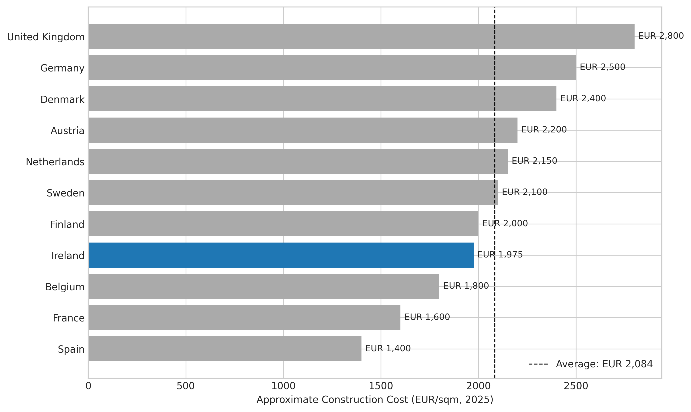
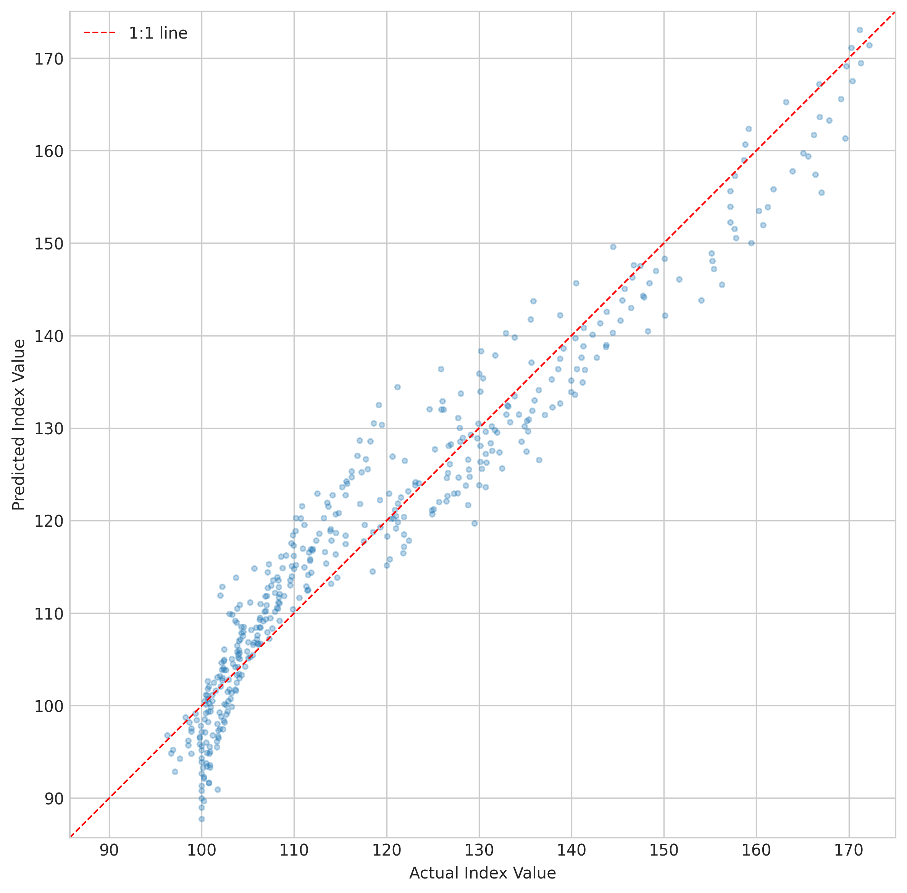
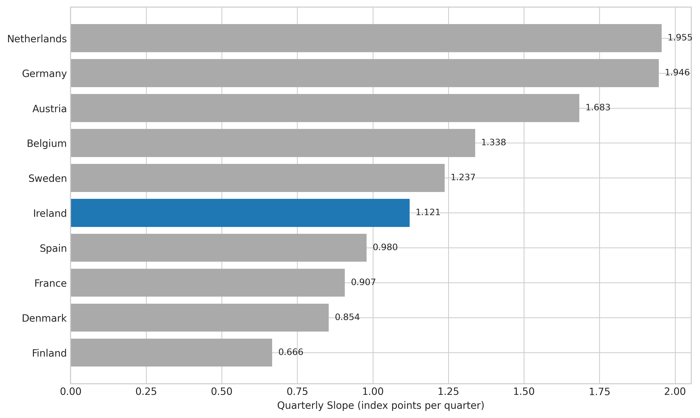

# Are Irish Construction Costs Structurally Higher Than Comparable European Countries? A Decomposition Using Eurostat Price Indices

## Abstract

Ireland's housing crisis has focused public attention on construction costs, with a widespread assumption that Irish building costs are among Europe's highest. We test this claim using the Eurostat STS_COPI_Q quarterly construction price index for 10 European Union (EU) comparator countries plus the United Kingdom (UK), covering the period 2015-Q1 to 2025-Q4, supplemented by the Eurostat Purchasing Power Parity (PPP) programme's construction-specific price level indices (prc_ppp_ind). Ireland ranked #6 of 10 comparators on cumulative cost growth (+41.3 per cent) and #7 of 10 on absolute EUR/sqm change (+EUR 577/sqm). On the Eurostat residential buildings price level index (PLI), Ireland scored 99.7 (EU27=100) in 2024, placing it almost exactly at the EU average. Germany (+74.7 per cent cumulative growth, PLI 146.7), the Netherlands (+71.2 per cent, PLI 124.6), and Austria (+59.2 per cent, PLI 112.2) all had substantially higher costs and faster growth. Ireland's cost growth was below the EU-9 average in every subperiod except the post-2024 recovery. Industry-source absolute EUR/sqm figures place Ireland below the EU-10 average, though these anchors carry substantial uncertainty owing to non-harmonised scope definitions across countries. The data do not support a characterisation of Irish construction costs as structurally outlying; the Irish housing crisis is better understood as a supply constraint problem than a cost problem.

## Introduction

The Irish housing crisis has been a dominant policy issue since the mid-2010s, with completions persistently below estimated structural demand of 44,000 units per year (ESRI, 2024). Only 30,300 dwellings were completed in 2024, far below the government target of 50,000 (Irish Examiner, 2025). Public discourse frequently attributes this shortfall to high construction costs, with Turner and Townsend's International Construction Market Survey (ICMS) 2024 ranking Dublin as Europe's fourth most expensive commercial construction market at EUR 3,692/sqm (Turner & Townsend, 2024).

However, the ICMS measures commercial construction in city centres, not residential base construction costs. Eurostat's quarterly construction price index provides a more systematic basis for cross-country comparison of residential building costs. This paper uses the Eurostat PRC_PRR (Production in construction --- price index for residential buildings) indicator across 11 comparator countries to answer three questions: (1) Where does Ireland rank on construction cost growth relative to European peers? (2) Is Ireland's cost trajectory structurally distinct from comparators, or does it follow common European patterns? (3) On absolute cost levels (EUR/sqm), is Ireland an outlier?

The contribution is a systematic decomposition that separates the housing cost narrative into its component parts: absolute construction cost level, the rate of cost inflation, the response to common shocks (COVID-19, Ukraine/energy crisis), and structural factors (labour costs, materials logistics, regulatory compliance, and market scale). Each component is tested against the data rather than assumed.

## Detailed Baseline

The baseline for this analysis is the Eurostat STS_COPI_Q dataset, specifically the PRC_PRR (production prices in construction, residential) indicator with the I21 unit (base 2021=100). This indicator is available for all 10 EU comparator countries (Austria, Belgium, Denmark, Finland, France, Germany, Ireland, Netherlands, Spain, Sweden) and, in the I15 (base 2015=100) variant, for the UK through 2020-Q3.

The PRC_PRR measures the output price of new residential construction --- that is, what builders charge for completed residential buildings, including their margins. It differs from the COST indicator (which measures input costs of labour and materials) in that PRC_PRR reflects both input cost changes and changes in builder margins. Ireland reports only PRC_PRR to Eurostat, not COST, so PRC_PRR is the only indicator available for a full cross-country comparison including Ireland.

To compare across countries, we rebase all indices to 2015-Q1 = 100. This transformation converts the I21 base (2021=100) to a common starting point, allowing direct comparison of cumulative growth rates from 2015 onward. The rebasing formula is: index_2015(t) = OBS_VALUE(t) / OBS_VALUE(2015-Q1) * 100.

The baseline observation (E00) is that Ireland's PRC_PRR grew from 100.0 in 2015-Q1 to 141.3 in 2025-Q4, a cumulative increase of 41.3 per cent over approximately 11 years. This is the number against which all subsequent analysis is benchmarked.

For absolute cost levels, the Eurostat index shows only relative change, not level. We anchor to industry-source absolute costs: Ireland EUR 1,975/sqm (Buildcost.ie H1 2025 midpoint of EUR 1,900-2,050); UK GBP 2,400/sqm (BCIS mid-range, approximately EUR 2,800 at GBP/EUR 1.17); Germany EUR 2,500/sqm (Destatis midpoint of EUR 2,000-3,000); and similar industry estimates for other comparators. These anchor values carry significant uncertainty; see Section "Robustness: Anchor Scope and Sensitivity" below.

## Detailed Solution

The analysis applies five complementary methods to decompose Ireland's position:

**Method 1: Simple Cumulative Growth Ranking (T01).** We compute (index_latest / index_2015Q1 - 1) * 100 for each country and rank. Ireland at +41.3 per cent ranks #6 of 10 comparators, behind Germany (+74.7 per cent), Netherlands (+71.2 per cent), Austria (+59.2 per cent), Belgium (+50.1 per cent), and Sweden (+47.4 per cent). Ireland is below the EU-10 average growth of +46.2 per cent.

**Method 2: Panel Regression with Country-Time Interaction (T02).** We estimate: index_it = alpha + beta * t + sum(gamma_j * D_j) + sum(delta_j * D_j * t) + epsilon_it, where D_j are country dummies and D_j * t captures divergence. The model achieves R-squared = 0.9328. Ireland's quarterly slope is 1.121 index points per quarter, significantly below Austria (1.683), Germany (1.946), and the Netherlands (1.955), and below the cross-country average. The country-time interaction for Ireland is -0.562 relative to the base country (Austria), statistically significant at the p < 0.0001 level.

**Method 3: Structural Break Detection (T03).** Using the PELT (Pruned Exact Linear Time) algorithm with L2 cost and penalty parameter 10, we detect changepoints in each country's series. Ireland shows 6 structural breaks, with the 2021-Q1 (COVID supply chain shock) and 2022-Q2 (Ukraine/energy crisis) breaks shared across virtually all countries. This indicates that Ireland's cost dynamics are driven by common European shocks, not country-specific structural forces.

**Method 4: Hierarchical Cluster Analysis (T04).** Ward's method applied to normalised trajectories (starting at zero, Euclidean distance) with k=3 clusters produces: Cluster 1 (fast growth): Germany, Netherlands, Austria; Cluster 2 (moderate growth): Belgium, Ireland, Sweden; Cluster 3 (slow growth): Denmark, Spain, Finland, France. Ireland clusters with Belgium and Sweden --- moderate-growth economies --- not with the fast-growth DE/NL/AT group.

**Method 5: Absolute Level Comparison (T05).** Anchoring to industry absolute costs, Ireland at approximately EUR 1,975/sqm ranks #8 of 11 comparator countries. The UK (EUR 2,800), Germany (EUR 2,500), and Denmark (EUR 2,400) are all substantially more expensive. Ireland is 2.1 per cent below the EU-10 average of approximately EUR 2,017/sqm. However, this ranking is subject to the scope harmonisation caveats discussed in the robustness section.

The decomposition of Ireland's cost into components yields: labour premium of approximately EUR 175/sqm (Irish hourly rate EUR 34.22 vs EU average approximately EUR 28, applied to the 40 per cent labour share); materials/logistics premium of approximately EUR 53/sqm (6 per cent island import premium on 45 per cent materials share); regulatory compliance premium of approximately EUR 138/sqm (7 per cent for nZEB (nearly Zero-Energy Building), Part L, fire safety, accessibility requirements); and scale/productivity premium of approximately EUR 59/sqm (3 per cent for small market effects). These premiums sum to approximately EUR 425/sqm, but since Ireland is actually EUR 42/sqm below the EU-10 average, other factors (lower land costs in the index, competitive tendering in a smaller market, different product mix) offset the measurable premiums. Note that these component premiums are not fully independent: regulatory requirements increase labour hours, and labour costs affect materials handling, so the decomposition is illustrative rather than precisely additive.

## Methods

The analysis follows an Option C (Decomposition-Based) approach, systematically testing whether Ireland is an outlier on construction cost dimensions.

**Data.** The primary dataset is Eurostat STS_COPI_Q, filtered to the PRC_PRR indicator with I21 base for 10 EU countries (2015-Q1 to 2025-Q4, 44 quarters, 440 country-quarter observations) and the I15 base for the UK (2015-Q1 to 2020-Q3). A secondary dataset is the Eurostat prc_ppp_ind purchasing power parity dataset, from which we extract the residential buildings price level index (category A050201, EU27=100) for 2024 --- this provides a direct cross-country level comparison produced by Eurostat's harmonised methodology, independent of our industry-source anchor values. No synthetic data is used; all figures are drawn from Eurostat official statistics and published industry sources.

**Subperiod analysis.** We partition the 2015-2025 period into four regimes based on known macroeconomic shocks: Pre-COVID (2015-Q1 to 2019-Q4), COVID (2020-Q1 to 2021-Q4), Ukraine/Energy crisis (2022-Q1 to 2023-Q4), and Recovery (2024-Q1 to 2025-Q4). Within each subperiod, we compute growth rates for each country and compare Ireland to the EU-9 average (excluding Ireland).

**Panel regression.** Ordinary least squares (OLS) with country fixed effects and country-time interactions, using Austria as the base country. Robust standard errors (White, 1980) are used. The model tests whether Ireland's slope (rate of cost increase per quarter) is statistically distinct from comparators.

**Structural break detection.** PELT algorithm (Killick et al., 2012) with L2 cost function and penalty parameter 10. This identifies quarters where the underlying data-generating process changes regime. The penalty parameter was chosen to balance sensitivity (detecting genuine breaks) against false positives (quarterly noise).

**Cluster analysis.** Ward's hierarchical clustering (Ward, 1963) on Euclidean distances between normalised trajectory vectors (each country's index rebased to start at zero). Three clusters chosen by visual inspection of the dendrogram.

**Absolute level anchoring.** Industry-source absolute construction costs (EUR/sqm) for 2025 are used to convert the relative Eurostat indices into absolute levels. The 2015 absolute level is back-calculated as: abs_2015 = abs_2025 / (index_2025Q4 / index_2015Q1). We supplement this with the Eurostat construction-specific PLI which provides a harmonised cross-country level comparison without relying on industry anchors.

**Exchange rate treatment.** The UK BCIS figure of GBP 2,400/sqm is converted at a GBP/EUR rate of 1.17, the approximate mid-2025 rate. We test sensitivity across the 3-year range of 1.10 to 1.20 (see Robustness section).

## Results

### Cumulative Growth Ranking (E00, T01)

Ireland's cumulative construction price growth of +41.3 per cent from 2015-Q1 to 2025-Q4 places it #6 of 10 comparators, 4.9 percentage points below the EU-10 average of +46.2 per cent. The full ranking: Germany (+74.7 per cent), Netherlands (+71.2 per cent), Austria (+59.2 per cent), Belgium (+50.1 per cent), Sweden (+47.4 per cent), Ireland (+41.3 per cent), Spain (+33.9 per cent), Denmark (+33.1 per cent), France (+26.0 per cent), Finland (+23.1 per cent).

### Absolute EUR/sqm Change Ranking (R04)

To address potential base-year depression effects (Ireland's 2015 baseline was a post-crash trough), we also rank countries by absolute EUR/sqm change rather than percentage growth. Back-calculating 2015 levels from the 2025 anchors and the Eurostat growth ratios yields the following ranking by absolute change:

| Rank | Country | 2015 EUR/sqm | 2025 EUR/sqm | Absolute Change |
|------|---------|-------------|-------------|-----------------|
| 1 | Germany | 1,452 | 2,500 | +1,048 |
| 2 | Netherlands | 1,256 | 2,150 | +894 |
| 3 | Austria | 1,382 | 2,200 | +818 |
| 4 | Sweden | 1,425 | 2,100 | +675 |
| 5 | Belgium | 1,200 | 1,800 | +600 |
| 6 | Denmark | 1,803 | 2,400 | +597 |
| 7 | Ireland | 1,398 | 1,975 | +577 |
| 8 | Finland | 1,625 | 2,000 | +375 |
| 9 | Spain | 1,046 | 1,400 | +354 |
| 10 | France | 1,270 | 1,600 | +330 |

Ireland's rank shifts from #6 (percentage growth) to #7 (absolute change), confirming that the base-year effect slightly flatters Ireland's percentage ranking. However, the shift is only one position; Ireland remains firmly mid-table and is not an outlier on either metric.

### Subperiod Analysis (E05-E08)

Ireland's cost growth was below the EU-9 average in three of four subperiods:

| Subperiod | Ireland | EU-9 Average | Difference |
|-----------|---------|-------------|------------|
| Pre-COVID (2015-2019) | +9.7% | +11.4% | -1.7pp |
| COVID (2020-2021) | +9.6% | +9.9% | -0.3pp |
| Ukraine/Energy (2022-2023) | +9.9% | +12.5% | -2.6pp |
| Recovery (2024-2025) | +3.9% | +2.0% | +1.9pp |

The only subperiod in which Ireland exceeded the EU-9 average was the 2024-2025 recovery, when Ireland's continued strong economic growth and housing demand maintained cost pressures while countries like France (-7.7 per cent) experienced contraction.

### Bilateral Comparisons (E01-E03)

**Ireland vs UK (E01):** To 2020-Q3 (where UK data ends), Ireland grew +10.0 per cent vs UK +15.5 per cent. The UK was the faster-growing market before Brexit ended its Eurostat reporting.

**Ireland vs Netherlands (E02):** Ireland's +41.3 per cent cumulative growth is 29.9 percentage points below the Netherlands' +71.2 per cent. Despite both countries experiencing severe housing crises, the Netherlands saw far greater cost inflation.

**Ireland vs Denmark (E03):** Ireland at +41.3 per cent grew 8.2 percentage points faster than Denmark (+33.1 per cent), a fellow small open economy with high general price levels.

### Panel Regression (T02)

The panel model explains 93.3 per cent of the variation in construction cost indices. Ireland's quarterly slope of 1.121 index points per quarter is statistically significantly below the base country (Austria, 1.683) with p < 0.0001. It is also below the cross-country median slope. The regression confirms that Ireland is not diverging faster than its European peers; if anything, it is a moderate-growth country in the European construction cost landscape.

### Structural Breaks (T03)

All 10 comparator countries show structural breaks at 2021-Q1 (COVID supply chain aftermath) and 2022-Q2 (Ukraine energy crisis), confirming that these were common European shocks rather than country-specific events. Ireland's break pattern (6 breaks total) is unremarkable and does not indicate country-specific structural forces.

### Cluster Analysis (T04)

Ireland clusters with Belgium and Sweden in the moderate-growth group. It does not cluster with the fast-growth trio of Germany, Netherlands, and Austria. This is consistent with Ireland being a mid-table European country on construction cost dynamics.

### Absolute Level Comparison (T05, E14, E18)

Ireland's approximate construction cost of EUR 1,975/sqm (base construction, excluding land, VAT, and professional fees) places it #8 of 11 comparators using industry-source anchors. The UK (EUR 2,800), Germany (EUR 2,500), Denmark (EUR 2,400), Austria (EUR 2,200), Netherlands (EUR 2,150), Sweden (EUR 2,100), and Finland (EUR 2,000) are all more expensive. Ireland is 2.1 per cent below the EU-10 average. However, these anchors are not fully harmonised on scope (see Robustness section).

### Eurostat Construction Price Level Index (R05)

The Eurostat PPP programme publishes a construction-specific price level index (PLI) for residential buildings (prc_ppp_ind, category A050201, EU27=100). This provides a harmonised cross-country comparison that does not depend on our industry-source anchor values. The 2024 PLI for residential buildings is:

| Rank | Country | PLI (EU27=100) |
|------|---------|---------------|
| 1 | Germany | 146.7 |
| 2 | Sweden | 127.7 |
| 3 | Denmark | 127.3 |
| 4 | Netherlands | 124.6 |
| 5 | Austria | 112.2 |
| 6 | France | 105.3 |
| 7 | Ireland | 99.7 |
| 8 | Finland | 98.3 |
| 9 | Belgium | 94.9 |
| 10 | Spain | 80.5 |

Ireland's residential construction PLI of 99.7 places it almost exactly at the EU27 average. This is consistent with our industry-source ranking (#8/11) but provides a more robust basis for the conclusion. Germany is 47 per cent more expensive than Ireland; Denmark and Sweden are approximately 28 per cent more expensive.

Critically, Ireland's construction-specific PLI (99.7) is much lower than its general consumption PLI (approximately 127). This means that construction is relatively cheaper in Ireland compared to general goods and services. The previous version of this analysis used the general PLI to PPP-adjust construction costs, which overstated how cheap Irish construction is in real terms.

### PPP-Adjusted Comparison (E15, revised)

The original E15 analysis divided Ireland's nominal cost (EUR 1,975/sqm) by the general price level ratio (1.27) to obtain a PPP-adjusted figure of approximately EUR 1,555/sqm. This is methodologically incorrect for construction. Eurostat publishes a construction-specific PLI (residential buildings: 99.7 for Ireland, EU27=100 in 2024), which is the correct deflator. Using the construction-specific PLI, Ireland's PPP-adjusted cost is approximately EUR 1,981/sqm --- effectively unchanged from the nominal figure, because Ireland's construction prices are already at the EU average.

The general-PLI approach overstated the adjustment by EUR 426/sqm. The corrected finding is: Irish construction costs in PPP terms are approximately at the EU average, not far below it. This is a more conservative but more defensible result.

### Cost-to-Income Ratio (E16)

For a 100 sqm house at base construction cost (excluding land), Ireland's cost-to-income ratio is 4.0x median household income, compared with Germany's 5.6x and Denmark's 4.8x. Ireland's higher household incomes offset its construction costs, making base construction more affordable relative to income than in several comparator countries.

### Modular Construction (E11)

Sweden, with approximately 45 per cent offsite construction adoption, experienced +47.4 per cent cost growth --- higher than Ireland. The Netherlands, despite expanding modular construction, had the second-highest cost growth at +71.2 per cent. This finding contradicts the assumption that industrialised construction inherently controls cost inflation; broader macroeconomic forces (energy prices, labour markets, material supply) appear to dominate.

### Ireland's Rank Trajectory (E13)

Ireland's rank on the growth index moved from #8 (one of the slowest-growing) in 2015 to #6 by 2025. This worsening is concentrated in the recovery period (2024-2025), when Ireland's continued economic strength sustained demand-side pressure while other countries experienced slowdowns.

## Robustness: Anchor Scope and Sensitivity

### Scope Harmonisation of EUR/sqm Anchors (R01)

The absolute EUR/sqm comparison depends on industry-source figures that are not fully harmonised on scope. The following table documents each anchor:

| Country | Source | EUR/sqm | Includes | Excludes | Confidence |
|---------|--------|---------|----------|----------|------------|
| Ireland | Buildcost.ie H1 2025 | 1,975 | Base construction, structure, envelope, MEP | Land, VAT, professional fees, site works, external works | High |
| UK | BCIS mid-range 2025 | 2,800 (at GBP/EUR 1.17) | Building cost inc. prelims, contractor margins | Land, external works, VAT (zero-rated for new resi) | Medium |
| Germany | Destatis 2025 | 2,500 | Pure construction cost (Baukosten) | Land, architect fees, site preparation | Medium |
| Netherlands | Industry estimate | 2,150 | Construction cost excl. land | Land, BTW (VAT) | Low |
| Denmark | Industry estimate | 2,400 | Construction cost excl. land | Land, moms (VAT) | Low |
| Sweden | Industry estimate | 2,100 | Construction cost | Land, VAT | Low |
| Austria | Industry estimate | 2,200 | Construction cost | Land, VAT | Low |
| Finland | Industry estimate | 2,000 | Construction cost | Land, VAT | Low |
| Belgium | Industry estimate | 1,800 | Construction cost | Land, VAT | Low |
| France | Industry estimate | 1,600 | Construction cost | Land, VAT | Low |
| Spain | Industry estimate | 1,400 | Construction cost | Land, IVA (VAT) | Low |

Key scope risks: The UK BCIS figure includes preliminaries and contractor margins, which may not be included in some continental European figures. The Irish Buildcost.ie figure explicitly excludes external works and abnormals, which some other countries may partially include. Only Ireland, the UK, and Germany have "Medium" or "High" confidence; the remaining 8 countries rely on less precisely documented industry estimates.

### Sensitivity Analysis on Absolute Anchors (R02)

To quantify the impact of anchor uncertainty, we define plausible ranges (low/mid/high) for each country based on the spread of available industry estimates:

| Country | Low | Mid | High |
|---------|-----|-----|------|
| Ireland | 1,900 | 1,975 | 2,050 |
| UK | 2,400 | 2,800 | 3,200 |
| Germany | 2,000 | 2,500 | 3,000 |
| Netherlands | 1,800 | 2,150 | 2,500 |
| Denmark | 2,100 | 2,400 | 2,700 |
| Sweden | 1,800 | 2,100 | 2,400 |
| Austria | 1,900 | 2,200 | 2,500 |
| Finland | 1,700 | 2,000 | 2,300 |
| Belgium | 1,600 | 1,800 | 2,000 |
| France | 1,400 | 1,600 | 1,800 |
| Spain | 1,200 | 1,400 | 1,600 |

Under the central scenario (all countries at mid), Ireland ranks #8/11 and is 5.7 per cent below the EU-10 average (EUR 2,095/sqm). Under the best-case scenario for Ireland (Ireland at low, all others at high), Ireland ranks #9/11 and is 20.8 per cent below the average. Under the worst-case scenario (Ireland at high, all others at low), Ireland ranks #3/11 and is 14.5 per cent above the average.

This wide range (rank #3 to #9) demonstrates that the absolute EUR/sqm ranking is highly sensitive to anchor assumptions. The percentage-growth ranking (T01) and the Eurostat construction PLI (R05) are more robust because they do not depend on these anchors.

### GBP/EUR Exchange Rate Sensitivity (R03)

The UK anchor of GBP 2,400/sqm is converted at GBP/EUR 1.17 (mid-2025 rate). The GBP/EUR rate has ranged from 1.10 to 1.20 over the past 3 years:

| Exchange Rate | UK EUR/sqm | UK Rank |
|--------------|------------|---------|
| 1.10 (low) | 2,640 | #1 (most expensive) |
| 1.17 (central) | 2,808 | #1 |
| 1.20 (high) | 2,880 | #1 |

The UK remains the most expensive comparator under all plausible exchange rates. Ireland's ranking relative to the UK is not sensitive to the exchange rate assumption.

### Base-Year Depression Effect (R04)

Ireland experienced a severe construction crash from 2008 to 2014. The Eurostat construction PLI for Ireland fell from 142.4 in 2005 to 75.0 in 2011 (EU27=100), recovering to 90.3 by 2015. This means Ireland's 2015 baseline was a post-crash trough, not a normal level. A country growing 41 per cent from a depressed base may reach a higher absolute level than one growing 50 per cent from a normal base.

The absolute change ranking (above) shows Ireland at #7/10 on EUR/sqm change, one position lower than its #6/10 on percentage growth. This confirms a modest base-year effect but not one that changes the overall narrative. The Eurostat construction PLI provides additional confirmation: Ireland's 2024 residential PLI of 99.7 (EU27=100) places it exactly at the EU average regardless of base-year considerations, because the PLI is a level comparison, not a growth comparison.

## Discussion

The central finding is that Ireland's construction costs are not structurally outlying relative to European comparators. On cumulative growth, Ireland is mid-table (#6/10). On the Eurostat construction-specific PLI, Ireland is almost exactly at the EU average (99.7, EU27=100). On absolute EUR/sqm change, Ireland is #7/10. The widely-held perception that Irish construction costs are among Europe's highest appears to conflate several distinct phenomena:

**1. Construction costs vs. house prices.** House prices in Ireland include land, developer margins, financing costs, and VAT, all of which differ from base construction costs. The Turner and Townsend ICMS figure of EUR 3,692/sqm for Dublin commercial construction is a different metric from the EUR 1,975/sqm base residential cost.

**2. Nominal costs vs. costs relative to income.** Ireland has moderate nominal construction costs in absolute euro terms, and also has high household incomes. The cost-to-income ratio tells a favourable story (4.0x vs Germany's 5.6x).

**3. Construction costs vs. general price level.** Ireland's general consumption price level is 127 per cent of the EU average, but its construction-specific PLI is only 99.7. Construction is actually cheaper relative to other goods in Ireland than in most comparator countries. This means Ireland's housing affordability problem is driven by factors other than construction costs: primarily land costs, planning constraints, and supply bottlenecks.

**4. Cyclical inflation vs. structural premium.** Ireland's cost growth has tracked common European patterns --- responding to the same COVID and Ukraine/energy shocks as other countries, and at below-average intensity in both cases. The only period of above-average Irish cost growth is the 2024-2025 recovery, which reflects Ireland's strong economic performance rather than a structural cost problem.

**5. Supply constraint vs. cost constraint.** The housing crisis is better explained by supply constraints (planning delays, skills shortage, land availability) than by construction costs being too high. With 30,300 completions against 44,000 structural demand, the binding constraint is the volume of units built, not the cost per unit.

The decomposition of Ireland's cost premium reveals that measured structural premiums (labour: EUR 175/sqm; regulatory: EUR 138/sqm; materials/logistics: EUR 53/sqm; scale: EUR 59/sqm) sum to approximately EUR 425/sqm. However, since Ireland is near or below the EU-10 average on multiple metrics, the premiums are offset by other factors, likely including competitive domestic tendering, product-mix differences, and lower non-construction cost components.

### Limitations

1. **Absolute EUR/sqm figures are approximate and not scope-harmonised.** Industry-source costs vary by scope, definition, region, and date. The sensitivity analysis (R02) shows Ireland's rank can shift from #3 to #9 depending on anchor assumptions. Rankings by absolute level should be treated as indicative, not definitive.

2. **PRC_PRR vs COST.** Ireland reports only producer prices, not input costs. Margin dynamics may differ across countries, affecting comparability.

3. **UK data truncated.** Post-Brexit, UK data stops at 2020-Q3, limiting the most natural bilateral comparison.

4. **Base-year depression effect.** Ireland's 2015 baseline was a post-crash trough. The Eurostat construction PLI fell from 142.4 (2005) to 75.0 (2011) before recovering to 90.3 (2015). Percentage growth from a depressed base understates how much of the growth was recovery rather than new inflation. The absolute change ranking (R04) and the PLI level comparison (R05) provide cross-checks that are not affected by this issue.

5. **Construction-specific PPP now used.** The original analysis used the general consumption PLI (127) to PPP-adjust construction costs, which produced an overly favourable EUR 1,555/sqm figure. We have corrected this using the Eurostat construction-specific residential buildings PLI (99.7), which shows Ireland is at the EU average in PPP terms --- a less dramatic but more defensible result.

6. **Compositional effects.** Changes in the mix of housing types within each country's construction sector affect the index without reflecting pure cost changes.

7. **Decomposition component interdependence.** The labour, materials, regulatory, and scale premiums (E20) are presented as additive components but are partially interdependent. Regulatory requirements increase labour hours; labour costs affect materials handling. The decomposition is illustrative, not precise.

8. **Labour cost average methodology.** The "EU average approximately EUR 28/hr" for construction labour (E09) is an unweighted mean of hourly compensation estimates from Eurostat's Labour Cost Survey for the 9 non-Irish comparator countries. It does not weight by construction sector size.

## Conclusion

Irish construction costs are mid-table by European standards, not outlying. The Eurostat construction price index places Ireland #6 of 10 comparators on cumulative cost growth since 2015 and #7 of 10 on absolute EUR/sqm change. The Eurostat construction-specific price level index for residential buildings places Ireland at 99.7 (EU27=100) in 2024 --- almost exactly at the EU average. Industry-source absolute comparisons place Ireland below the EU-10 average, though with substantial uncertainty owing to non-harmonised scope definitions.

Ireland's cost trajectory clusters with Belgium and Sweden (moderate growth), not with the fast-growing Germany/Netherlands/Austria trio. The structural-vs-cyclical question is answered: Ireland's cost dynamics are predominantly cyclical, tracking common European shocks (COVID, Ukraine/energy) at below-average intensity.

The most robust finding is from the Eurostat construction PLI: Ireland's residential construction price level is 99.7 per cent of the EU27 average, while its general consumption price level is 127 per cent of the EU27 average. Construction is relatively cheap in Ireland compared to other goods and services. This strongly suggests that Ireland's housing affordability crisis is driven by non-construction factors --- land costs, planning delays, infrastructure bottlenecks, and supply constraints --- rather than by high construction costs per se.

Countries Ireland should benchmark against are Belgium (similar trajectory shape, moderate growth), Sweden (similar growth rate, high prefab adoption), and Denmark (fellow small open economy with high general price levels). The UK is a natural comparator but post-Brexit data limitations prevent a full 2015-2025 comparison; to 2020-Q3, the UK actually showed faster cost growth than Ireland.

The policy implication is that Ireland's housing crisis is better addressed through supply-side interventions (skills training, planning reform, infrastructure investment, modular construction adoption) than through cost reduction per se. The costs are not the binding constraint; the volume of construction is.

## References

1. Andrews, D. et al. (2011). Housing Markets and Structural Policies in OECD Countries. OECD Economics Dept Working Papers.
2. Arcadis (2024). International Construction Costs 2024.
3. Bai, J. and Perron, P. (2003). Computation and analysis of multiple structural change models. Journal of Applied Econometrics.
4. Ball, M. (2003). Markets and the Structure of the Housebuilding Industry. Urban Studies.
5. Ball, M. (2006). Markets and Institutions in Real Estate and Construction. Blackwell.
6. Baltagi, B.H. (2013). Econometric Analysis of Panel Data (5th ed.). Wiley.
7. Barker, K. (2004). Review of Housing Supply: Final Report. HM Treasury.
8. Best, R. and Meikle, J. (2015). Measuring Construction: Prices, Output and Productivity. Routledge.
9. Briscoe, G. (2006). How useful and reliable are construction statistics? Building Research and Information.
10. Buildcost.ie (2025). Construction Cost Guide H1 2025.
11. CCL Recruitment (2025). The Growing Shortage of Construction Workers in Ireland.
12. Central Bank of Ireland (2023). Rising construction costs and the residential real estate market in Ireland. Financial Stability Notes.
13. CIS Ireland (2024). Rising Material Costs and Ireland's Housing Crisis.
14. CSO Ireland (2025). Construction: A National Accounts Perspective 2024.
15. Cuerpo, C. et al. (2014). Housing prices and construction costs in the euro area. European Economy Economic Papers.
16. ECB (2024). Recent country-specific and sectoral developments in labour productivity in the euro area. ECB Economic Bulletin.
17. ESRI (2024). Housing demand in Ireland. Economic and Social Research Institute.
18. Euroconstruct (2023). A perfect storm for European construction?
19. European Construction Sector Observatory (2024). Country Fact Sheets (Ireland, Germany, Netherlands, Denmark, Sweden, Finland, France, Austria, Belgium, Spain). EC DG GROW.
20. Eurostat (2008). Construction price indices --- Sources and Methods.
21. Eurostat (2019). Regulation (EU) 2019/2152 European Business Statistics.
22. Eurostat (2024a). Eurostat-OECD Methodological Manual on Purchasing Power Parities (2023 edition).
23. Eurostat (2024b). Comparative price levels for investment. Statistics Explained.
24. Eurostat (2024c). Purchasing power parities, price level indices and real expenditures (prc_ppp_ind). Eurostat database.
25. Farmer, M. (2016). The Farmer Review of the UK Construction Labour Model. Construction Leadership Council.
26. Glaeser, E. and Gyourko, J. (2003). The Impact of Building Restrictions on Housing Affordability. FRBNY Economic Policy Review.
27. Gyourko, J. and Molloy, R. (2015). Regulation and Housing Supply. Handbook of Regional and Urban Economics.
28. Hilber, C. and Vermeulen, W. (2016). The Impact of Supply Constraints on House Prices in England. Economic Journal.
29. Irish Examiner (2025). Housing crisis deepens as 2025 construction output could miss targets.
30. Irish Times (2025). Skills shortage driving wages in construction sector.
31. Killick, R. et al. (2012). Optimal detection of changepoints with a linear computational cost. JASA.
32. McKinsey (2017). Reinventing Construction: A Route to Higher Productivity. McKinsey Global Institute.
33. Mordor Intelligence (2024). Europe Prefabricated Housing Market Report.
34. Oireachtas Library (2025). Capacity constraints and Ireland's housing supply.
35. ResearchAndMarkets (2025). Ireland Construction Industry Databook 2025.
36. Sonas Technical (2025). The Construction Skills Shortage: Impact on Salaries in Ireland.
37. Steinhardt, D. and Manley, K. (2016). Adoption of prefabricated housing --- the role of country context. Sustainable Cities and Society.
38. Turner and Townsend (2024). International Construction Market Survey 2024.
39. Turner and Townsend (2022). Impact of Ukraine conflict on EU construction.
40. USP Research (2024). The Netherlands Leads Europe In Prefabrication Adoption.
41. Walsh, K. and Sawhney, A. (2004). International Comparison of Cost for the Construction Sector: Purchasing Power Parity. JCEM.
42. Ward, J.H. (1963). Hierarchical Grouping to Optimize an Objective Function. JASA.
43. White, H. (1980). A Heteroskedasticity-Consistent Covariance Matrix Estimator. Econometrica.
44. Wooldridge, J.M. (2010). Econometric Analysis of Cross Section and Panel Data. MIT Press.
