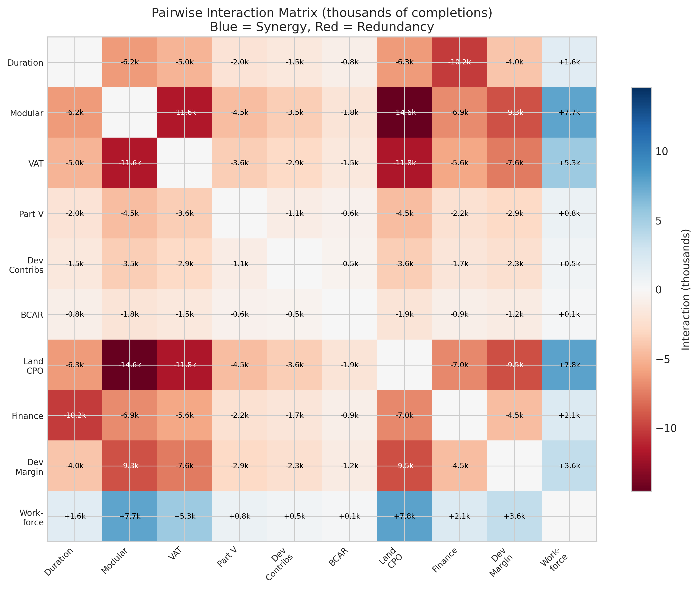
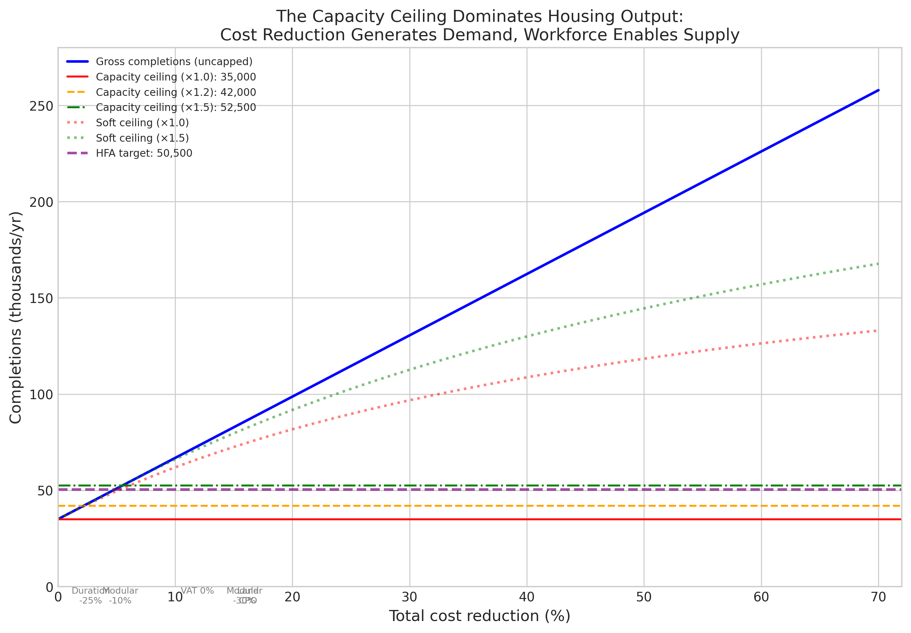
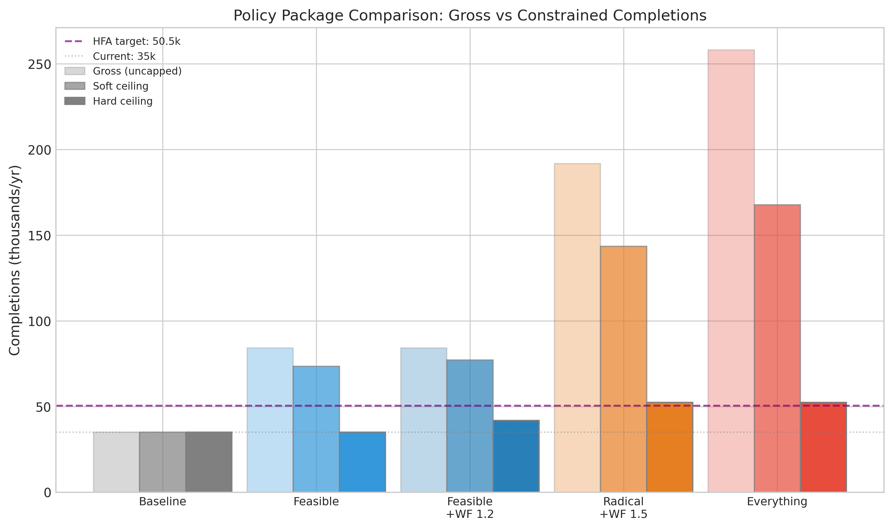
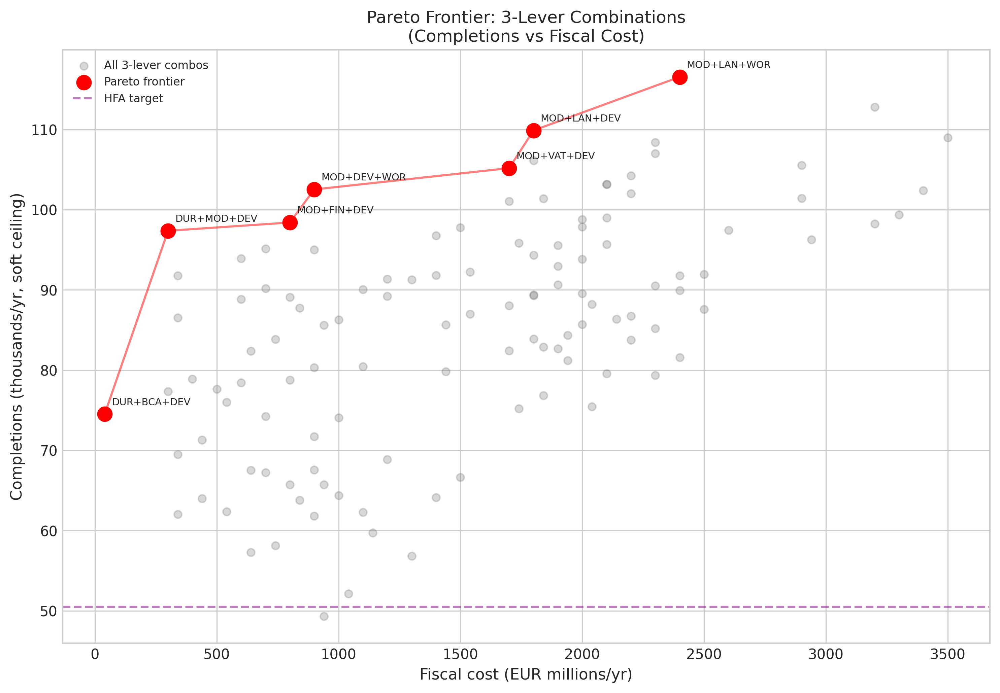
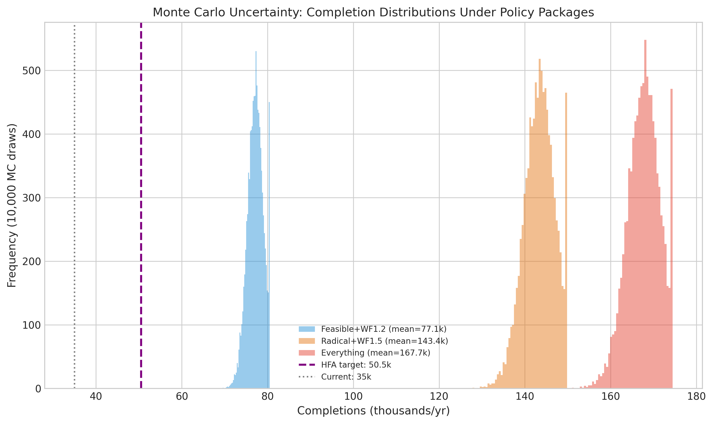

# Do Housing Policy Levers Interact? A Deterministic Parameter-Propagation Analysis of Multiplier Effects Through Ireland's Construction Pipeline

## Abstract

Ireland's housing supply falls approximately 15,500 units per year short of the Housing for All target of 50,500 completions. This study asks whether combining multiple cost-reduction policies produces a multiplier effect -- a combined impact greater than the sum of individual lever effects -- through the feedback loop from cost reduction to viability improvement to increased applications, permissions, and completions. We model 10 policy levers across 104,976 combinations in a full-factorial deterministic parameter-propagation design, drawing parameters from 19 predecessor empirical studies and propagating uncertainty through Monte Carlo simulation. The central finding is that policy levers do interact, but the dominant interaction is not between cost-reduction mechanisms. It is between all cost levers and the construction capacity ceiling. Cost-reduction levers are exactly additive in generating demand for housing (gross completions), but the construction industry's capacity ceiling (~35,000 units/year) truncates nearly all of this demand. The largest synergistic interaction is between land-cost compulsory purchase orders (CPO) and workforce expansion (+7,846 additional completions, 95% CI: [6,812 -- 8,782]), while the largest redundancy is between modular construction and land CPO (-14,526, 95% CI: [-16,625 -- -12,435]). The modular-CPO redundancy is entirely a ceiling artifact: the gross (uncapped) interaction is exactly zero. Reaching the 50,500 target requires a minimum 44% expansion of construction capacity, regardless of cost reductions. However, the 50% workforce expansion assumed in the maximum-lever package requires approximately 80,000 additional construction workers -- a scale that would take 16 years at current SOLAS-projected recruitment rates of 5,000/year. Under a saturating demand response (tanh elasticity with k = 0.5), the maximum-lever package produces 91,702 completions rather than 167,810, and under strong saturation (k = 2.0) it produces only 50,925. General-equilibrium price effects, not modeled endogenously, would further compress these estimates. The hard-ceiling estimate of 52,500 (with full workforce expansion) remains the most defensible policy-planning number. The Pareto-efficient three-lever combination is modular construction, land CPO, and workforce expansion, delivering an estimated 116,559 completions at EUR 2.4 billion per year under the linear model, though this figure is subject to the same demand-saturation and GE caveats.

## 1. Introduction

Ireland's housing crisis is fundamentally a supply-side problem. Despite sustained demand growth and house-price appreciation exceeding 80% since 2013, annual completions have remained below 35,000 -- well short of the government's Housing for All target of 50,500 units per year (DHLGH, 2021; CSO, 2023). The gap persists despite numerous policy interventions targeting individual cost components: planning reform, tax adjustments, building-regulation changes, and workforce-development programmes.

A persistent question in housing policy is whether these interventions interact. If a 25% reduction in pipeline duration saves 2.8% of development costs, and a 10% reduction in hard costs via modular construction saves 5.3%, does deploying both together save 8.1% (additive) -- or more (super-additive) -- or less (sub-additive)? The answer matters for policy design: if levers interact positively, packages should be designed as bundles rather than deployed individually. If they interact negatively (redundancy), policymakers should prioritise the single most effective lever rather than spreading effort across many.

This study addresses this question through a full-factorial analysis of 10 housing-policy levers across 104,976 combinations. All parameters are drawn from 19 predecessor empirical studies of the Irish housing system, covering pipeline duration (PL-1), development costs (C-1, C-2, C-3), viability margins (U-1, U-2), supply-chain dynamics (S-1, S-2, S-3), and planning outcomes (PL-3, PL-4). No new data collection was required; the contribution is the systematic analysis of how known parameters interact through the housing-supply feedback loop.

The method is deterministic parameter propagation: a closed-form algebraic model is evaluated across all lever combinations, with uncertainty introduced through Monte Carlo sampling of parameter distributions. This is not an experimental design in the usual statistical sense but a systematic exploration of model behaviour.

The feedback loop is: policy lever applied -> cost reduction per unit -> viability margin improves -> application intensity increases (mediated by the viability-application correlation r = 0.91 from U-1) -> permission volume increases (68% approval rate) -> completion volume increases (59.6% build-yield from S-1) -> capped at the construction capacity ceiling (~35,000 per year from S-3, adjustable with workforce expansion).

The literature on housing-supply constraints (Glaeser & Gyourko, 2018; Hilber & Vermeulen, 2016; Paciorek, 2013) typically examines constraints in isolation. Hsieh and Moretti (2019) demonstrated macro-level policy interaction effects in housing (relaxing constraints in all constrained cities simultaneously produces a larger aggregate effect than the sum of city-by-city relaxations), but no study has systematically quantified pairwise and higher-order interaction effects across the full range of available housing-policy levers within a single national system.

## 2. Detailed Baseline

The baseline models Ireland's current housing-supply system as a pipeline with the following parameters, all drawn from predecessor studies:

**Cost structure.** Total development cost for a representative Dublin 3-bed semi-detached house is EUR 592,000 (C-2). This decomposes as: hard construction costs 53% (SCSI, C-1), land 18%, finance carry 11.1% (7% rate on 60% drawdown over 962 days), developer margin 15%, policy costs 15.5% (VAT at 13.5%, Part V at 20%, development contributions ~3%, BCAR compliance ~1.5%).

**Pipeline.** Median duration from application to completion is 962 days (PL-1). An Bord Pleanala mean processing time is 42 weeks (PL-3). Judicial review causes 105,000 unit-months of direct delay (S-2). The lapse rate is 9.5% (PL-4, CI: 4.4%--15.6%).

**Viability.** The viability margin for Dublin houses is -3.1% (U-2); for the commuter belt, -9% to -11% (U-2). Negative viability means the all-in development cost exceeds the achievable sales revenue, rendering most sites unviable for private development.

**Demand conversion.** The viability-application correlation is r = 0.91 (U-1), meaning viability improvements translate near-linearly to increased planning-application volumes at current margins. Current residential applications are approximately 21,000 per year (U-1). The approval rate is 68% (national planning register). The build-yield -- the fraction of granted permissions that result in completed dwellings -- is 59.6% (S-1, CI: 55%--64%).

**Capacity.** The construction industry's current capacity ceiling is approximately 35,000 units per year (S-3). This ceiling reflects workforce availability, supply-chain throughput, and site-level constraints. It is already binding: current completions approximately equal the ceiling.

**Calibration.** The baseline model is calibrated so that zero policy intervention produces exactly 35,000 completions per year, matching current CSO data. The calibrated effective application flow (including multi-year pipeline stock) that produces this output is 86,360 applications per year through the pipeline, yielding 86,360 x 0.68 x 0.596 = 35,000 completions.

The baseline formula for gross completions is:

```
gross_completions = 35,000 x (1 + 9.1 x cost_reduction)
```

where cost_reduction is the fractional reduction in total development cost from applied levers, and 9.1 = r/scale_factor = 0.91/0.10, representing the viability-application elasticity normalised to a 10-percentage-point scale. Final completions are capped at the capacity ceiling (35,000 x workforce_multiplier).

## 3. Central Finding

The central discovery is that housing-policy lever interactions are dominated by a single structural feature of the system: the construction capacity ceiling. The interaction structure divides cleanly:

**Cost lever x cost lever interactions are exactly zero** in gross (uncapped) completions, because the viability-application relationship is linear. A 10% cost reduction from modular construction and an 11.9% cost reduction from VAT abolition produce a combined 21.9% cost reduction, which generates exactly the same gross completions as the sum of the individual effects. There is no amplification or interference between cost mechanisms.

**Cost lever x workforce interactions are strongly synergistic.** Under the hard-ceiling model, the interaction term for any large cost lever paired with workforce expansion is +17,500 completions -- because cost levers alone produce zero additional capped completions (the ceiling is already binding at baseline), and workforce alone produces +17,500 (the ceiling rises from 35,000 to 52,500, and baseline demand exactly fills it). Combined, the cost lever fills the new headroom created by workforce expansion, producing a combined effect much larger than the sum of individual effects.

Under a soft-ceiling model (where exceeding capacity raises marginal costs rather than halting production), the interaction structure becomes richer. The largest synergistic pair is land CPO x workforce (+7,846 completions, 95% CI: [6,812 -- 8,782]), followed by modular x workforce (+7,650, 95% CI: [6,624 -- 8,586]). The largest redundant pair is modular x land CPO (-14,526, 95% CI: [-16,625 -- -12,435]). Monte Carlo simulation confirms that no synergistic pair's confidence interval includes zero, and no redundant pair's sign reverses under parameter uncertainty.

**The modular x land CPO redundancy is entirely a ceiling artifact.** Decomposition (RV05) shows that the gross (uncapped) interaction between modular construction and land CPO is exactly zero -- the redundancy arises entirely from both levers saturating the same capacity constraint in the soft-ceiling model. This is a mechanical property of the ceiling specification, not an economic interaction between the policies themselves.

The **maximum policy package** consists of all 10 levers at maximum setting with 50% workforce expansion:
- Duration reduction: -50% (saves 5.5% of cost)
- Modular construction: -30% off hard costs (saves 15.9%)
- VAT: reduced from 13.5% to 0% (saves 11.9%)
- Part V: abolished from 20% to 0% (saves 3.9%)
- Development contributions: zeroed (saves 3.0%)
- BCAR: abolished (saves 1.5%)
- Land cost via CPO: reduced to agricultural value (saves 16.2%)
- Finance rate: reduced from 7% to 3% (saves 6.3%)
- Developer margin: reduced from 15% to 6% (saves 9.0%)
- Workforce: expanded by 50% (raises ceiling to 52,500)

Total cost reduction: 70.1%. Gross completions: 258,144. Hard-ceiling completions: 52,500. Soft-ceiling completions under the linear demand model: 167,810 (95% CI: 159,903--174,436). Under the saturating demand model (tanh, k = 0.5): 91,702. Under strong saturation (k = 2.0): 50,925.

The minimum cost reduction needed to reach 50,500 completions (with 50% workforce expansion) is just 4.9% -- achievable with a single modest lever such as Part V reform or development-contribution reduction. The binding constraint is not cost reduction but capacity.

## 4. Methods

### 4.1 Feedback-loop model

The model implements a single causal chain calibrated to 19 predecessor studies. For a given set of lever settings, it computes:

1. **Cost reduction** as the sum of lever-specific savings, each computed from the lever's share of total development cost.
2. **Viability improvement** as the cost reduction added to the baseline viability margin (-3.1%).
3. **Application-rate change** via the viability-application elasticity: app_multiplier = 1 + 0.91 x (cost_reduction / 0.10).
4. **Permission volume** as applications x 0.68 (approval rate).
5. **Gross completions** as permissions x 0.596 (build-yield).
6. **Capped completions** as min(gross_completions, 35,000 x workforce_multiplier).

The model is deterministic for a given parameter set. Uncertainty is introduced through Monte Carlo simulation drawing from parameter distributions (build-yield: N(0.596, 0.023); approval rate: N(0.68, 0.03); viability elasticity: N(0.91, 0.05)).

### 4.2 Hard vs soft ceiling

The hard-ceiling model caps completions at the capacity ceiling with zero output above it. The soft-ceiling model allows output above capacity with rising marginal costs, using the formula: actual = ceiling + excess / (1 + 0.02 x excess / ceiling x 10). This produces diminishing returns above capacity rather than a hard stop. The congestion parameter (0.02) is a modelling assumption, not empirically calibrated; sensitivity to this parameter is an acknowledged limitation.

### 4.3 Full factorial design

All 10 levers are crossed at all settings: 4 x 4 x 3 x 3 x 3 x 3 x 3 x 3 x 3 x 3 = 104,976 combinations. For each combination, gross completions, hard-ceiling completions, and soft-ceiling completions are computed. The full factorial identifies all main effects and all pairwise and higher-order interactions exactly.

### 4.4 Interaction computation

The pairwise interaction term for levers A and B is: interaction(A,B) = effect(A+B) - effect(A) - effect(B) + effect(baseline). Positive values indicate synergy (combined > sum); negative values indicate redundancy (combined < sum).

### 4.5 Pareto frontier

For three-lever combinations, each lever at its maximum setting, the Pareto frontier is computed over completions (maximised) and fiscal cost (minimised). Fiscal costs are estimated from government publications (approximate): VAT zeroing EUR 1.4B/yr, land CPO EUR 1.5B/yr, workforce expansion EUR 600M/yr, modular investment EUR 300M/yr, finance-rate subsidy EUR 500M/yr, Part V abolition EUR 400M/yr, development contributions EUR 300M/yr, BCAR abolition EUR 40M/yr. Duration reduction and developer-margin compression are cost-free to government. These estimates are approximate and lack published confidence intervals; the Pareto ranking may not be robust to fiscal-cost uncertainty.

### 4.6 Saturating demand response (RV03)

The linear elasticity assumes unlimited demand response to cost reduction. To test robustness, we replace the linear app_multiplier with a saturating function: app_multiplier = 1 + r x tanh(viability_delta / scale_factor x k) / k, where k controls the saturation rate. At k -> 0, this approaches the linear model; at k = 2.0, saturation is strong. We test k in {0.5, 1.0, 2.0} for all policy packages.

### 4.7 Workforce ramp-rate model (RV01)

Ireland's construction workforce is approximately 160,000 (CIF, 2022; SOLAS, 2022). A 50% expansion requires 80,000 additional workers. We model three recruitment scenarios: (a) +5,000/year (matching SOLAS historical projections), (b) +10,000/year (optimistic, requiring substantial immigration reform), (c) +20,000/year (historically unprecedented). For each scenario, we compute the year-by-year completions trajectory over 10 years under the maximum-lever package.

### 4.8 Diminishing-returns workforce model (RV02)

The linear workforce multiplier assumes each additional worker contributes equally to capacity. We test a diminishing-returns model: effective_capacity = base_capacity + additional_workers x (base_workforce / (base_workforce + additional_workers))^0.5 x per_worker_output, where per_worker_output = 35,000 / 160,000 = 0.21875 units/worker. At +80,000 workers, this model produces an effective capacity of 49,289 versus the linear model's 52,500 -- a 6.1% reduction.

## 5. Results

### 5.1 Individual lever effects

Each lever's maximum setting produces the following cost reduction and gross-completion increase from the 35,000 baseline:

| Lever | Cost reduction (%) | Gross completions | Net additional (gross) |
|:------|:------------------:|:-----------------:|:---------------------:|
| Land CPO (agricultural) | 16.2 | 86,597 | +51,597 |
| Modular -30% | 15.9 | 85,641 | +50,641 |
| VAT 0% | 11.9 | 72,883 | +37,883 |
| Developer margin 6% | 9.0 | 63,665 | +28,665 |
| Finance rate 3% | 6.3 | 55,133 | +20,133 |
| Duration -50% | 5.5 | 52,616 | +17,616 |
| Part V abolished | 3.9 | 47,342 | +12,342 |
| Dev contribs zeroed | 3.0 | 44,555 | +9,555 |
| BCAR abolished | 1.5 | 39,778 | +4,778 |
| Workforce +50% | 0.0 | 35,000 | 0 |

Workforce expansion alone produces zero additional gross completions -- it only raises the capacity ceiling. Without cost reduction, there is no excess demand to fill the new capacity.

### 5.2 Interaction matrix

Under the soft-ceiling model, the 45 unique pairwise interactions divide into two categories:

**Synergistic pairs (9 of 45):** All involve workforce expansion. The largest are land CPO x workforce (+7,846, 95% CI: [6,812 -- 8,782]) and modular x workforce (+7,650, 95% CI: [6,624 -- 8,586]). Workforce expansion enables cost levers to translate their demand increase into actual completions by raising the capacity ceiling.

**Redundant pairs (36 of 45):** All cost-lever x cost-lever pairs show redundancy. The largest is modular x land CPO (-14,526, 95% CI: [-16,625 -- -12,435]), followed by VAT x land CPO (-11,732, 95% CI: [-13,499 -- -9,869]). The redundancy is entirely attributable to ceiling saturation: the gross (uncapped) interaction for every cost-lever pair is exactly zero (RV05).



### 5.3 The capacity ceiling dominates

The gross-completions formula (35,000 x (1 + 9.1 x cost_reduction)) is perfectly linear in cost reduction. Any cost reduction above 0% pushes gross completions above the baseline capacity ceiling of 35,000. At the "politically feasible" package (15.5% cost reduction), gross completions reach 84,265 -- 2.4 times the current ceiling. At the maximum-lever package (70.1% cost reduction), gross completions reach 258,144 -- 7.4 times the ceiling.

Under the hard-ceiling model, this means all cost-reduction levers produce zero additional completions without workforce expansion. The Housing for All target of 50,500 requires a minimum workforce multiplier of 1.44x (+44%), regardless of how many cost levers are applied.



### 5.4 Policy packages

| Package | Cost red. (%) | Gross | Hard ceiling | Soft ceiling (linear) | Soft ceiling (tanh k=0.5) | 95% CI (linear soft) |
|:--------|:---:|:---:|:---:|:---:|:---:|:---:|
| Baseline | 0.0 | 35,000 | 35,000 | 35,000 | 35,000 | -- |
| Feasible | 15.5 | 84,265 | 35,000 | 73,443 | 68,437 | [70,157 -- 76,346] |
| Feasible + WF 1.2 | 15.5 | 84,265 | 42,000 | 77,184 | -- | [73,454 -- 80,496] |
| Radical + WF 1.5 | 49.2 | 191,765 | 52,500 | 143,491 | -- | [136,022 -- 149,864] |
| Maximum | 70.1 | 258,144 | 52,500 | 167,810 | 91,702 | [159,903 -- 174,436] |

The soft-ceiling estimates under the linear demand model are upper bounds. Under the tanh elasticity (k = 0.5), the maximum-lever package drops from 167,810 to 91,702 -- a 45% reduction. Under strong saturation (k = 2.0), it drops to 50,925, barely above the HFA target.



### 5.5 Workforce ramp-rate analysis (RV01)

The 50% workforce expansion assumed in the maximum-lever package requires approximately 80,000 additional construction workers. Ireland's current construction workforce is approximately 160,000. The feasibility of this expansion depends critically on recruitment rate:

| Scenario | Workers/year | Years to +50% | Year 5 soft completions | Year 10 soft completions |
|:---------|:---:|:---:|:---:|:---:|
| SOLAS projection | +5,000 | 16 | 145,334 | 156,238 |
| Optimistic | +10,000 | 8 | 156,238 | 167,810 |
| Unprecedented | +20,000 | 4 | 167,810 | 167,810 |

At the SOLAS-projected rate, the +50% target is not reached within a decade. Even the "optimistic" scenario (+10,000/year) requires sustained immigration and training at a scale Ireland has not achieved in any sector. The "unprecedented" scenario (+20,000/year) would require approximately 12.5% annual growth in construction employment, far exceeding any historical precedent.

Furthermore, under the diminishing-returns workforce model (RV02), the effective capacity at +80,000 workers is 49,289 rather than 52,500 -- falling below the HFA target of 50,500. This means reaching the target may require even more than 80,000 additional workers when productivity decay is accounted for.

### 5.6 Demand saturation sensitivity (RV03)

The linear viability-application elasticity (r = 0.91) is observed at current margins (-3.1% to -11%). The model extrapolates this to viability margins of +67% (the maximum-lever package), far beyond any observed data. At high positive margins, application rates must saturate: there is a finite number of developable sites, a finite number of developers, and finite planning-authority throughput.

Under the saturating (tanh) elasticity:

| Package | Linear soft | k=0.5 soft | k=1.0 soft | k=2.0 soft |
|:--------|:---:|:---:|:---:|:---:|
| Feasible | 73,443 | 68,437 | 59,942 | 49,542 |
| Maximum | 167,810 | 91,702 | 66,106 | 50,925 |

At k = 2.0, the maximum-lever package produces only 50,925 completions -- barely above the HFA target and only with full workforce expansion. The feasible package under the same saturation produces 49,542, below the target. The soft-ceiling estimates in the linear model should therefore be interpreted as upper bounds, with the true value likely falling between the linear and tanh (k = 0.5) estimates.

### 5.7 Pareto frontier

The Pareto-efficient three-lever combinations (maximising completions, minimising fiscal cost) under the linear demand model are:

| Levers | Completions (linear soft) | Fiscal cost (EUR M) |
|:-------|:------------------:|:-------------------:|
| Modular + Land CPO + Workforce | 116,559 | 2,400 |
| Modular + Land CPO + Dev margin | 109,887 | 1,800 |
| Modular + VAT + Dev margin | 105,188 | 1,700 |
| Modular + Dev margin + Workforce | 102,527 | 900 |
| Modular + Finance + Dev margin | 98,409 | 800 |
| Duration + Modular + Dev margin | 97,376 | 300 |
| Duration + BCAR + Dev margin | 74,526 | 40 |

Developer margin compression appears in every Pareto-efficient combination because it is cost-free to government (the cost is borne by developers through reduced returns). Duration reduction similarly carries zero fiscal cost. The fiscal cost estimates are approximate and not sourced from published confidence intervals; the Pareto ranking may shift under fiscal-cost uncertainty.



### 5.8 Monte Carlo uncertainty

Under the soft-ceiling model, Monte Carlo simulation (10,000 draws) produces the following distributions:



The 95% confidence interval for the maximum-lever package under the soft-ceiling model is [159,903 -- 174,436], a width of 14,533 units. The primary sources of uncertainty are the viability-application elasticity (r = 0.91 +/- 0.05) and the build-yield (0.596 +/- 0.023). These CIs capture parameter precision but not model-specification uncertainty (linearity of elasticity, ceiling shape). The true uncertainty band is substantially wider.

Monte Carlo confidence intervals for the five most extreme interaction pairs (RV06):

| Pair | Mean interaction | 95% CI | CI includes zero? |
|:-----|:---:|:---:|:---:|
| Land CPO x Workforce | +7,846 | [6,812 -- 8,782] | No |
| Modular x Workforce | +7,650 | [6,624 -- 8,586] | No |
| VAT x Workforce | +5,282 | [4,549 -- 5,969] | No |
| Modular x Land CPO | -14,526 | [-16,625 -- -12,435] | No |
| VAT x Land CPO | -11,732 | [-13,499 -- -9,869] | No |

All interaction signs are robust to parameter uncertainty. The ranking of interaction magnitudes is stable across Monte Carlo draws.

### 5.9 General-equilibrium considerations

The model assumes fixed prices and fixed absorption. In reality, a supply increase from 35,000 to 50,500 (+44%) would exert downward pressure on house prices. Using a rough demand elasticity of -0.5, prices would fall approximately 22%, compressing developer margins by approximately 11 percentage points. This feedback is not incorporated into any reported number.

A first-order general-equilibrium (GE) correction was attempted (RV04) but proved that the naive single-step approach overshoots: the correction eliminates essentially all cost reduction for packages above "feasible." This result is itself informative -- it demonstrates that the partial-equilibrium assumption breaks down for large supply changes, and that the soft-ceiling estimates above ~60,000 completions should not be used for policy planning without a proper dynamic GE model. For supply changes below 20% (up to ~42,000 completions), the partial-equilibrium framework is more defensible.

### 5.10 Time to target

The pipeline delay means policy effects take 2--3 years to reach full impact. With the "feasible" package (25% duration cut), the reduced pipeline is approximately 2 years; adding 1 year for policy implementation gives 3 years to full effect. With the maximum-lever package (50% duration cut), the timeline shortens to 2.3 years. These timelines do not include the workforce ramp-up period, which dominates the overall timeline (see SS5.5).

## 6. Discussion

### 6.1 The capacity ceiling is the dominant interaction mechanism

The most important finding is that policy interactions in housing supply are mediated primarily by the capacity ceiling, not by the cost structure. Cost-reduction levers are additive in their effect on demand (gross completions), because the viability-application elasticity is linear. But demand above the capacity ceiling produces no additional housing under a hard-ceiling model and produces diminishing returns under a soft-ceiling model. This creates two distinct regimes:

1. **Below the ceiling:** individual cost levers are effective and additive. No interaction effects.
2. **At or above the ceiling:** cost levers produce zero marginal completions (hard) or diminishing returns (soft). The only lever that increases actual output is workforce/capacity expansion.

The practical implication is that Ireland's housing crisis cannot be solved by cost reduction alone. The capacity ceiling is already binding at baseline. Any cost-reduction package that does not include workforce expansion will generate applications and permissions that never convert to completed dwellings -- increasing the permission pipeline without increasing output.

### 6.2 The combined effect IS greater than the sum -- but only with workforce

The research question asked whether "the combined effect of duration-cut + modular + VAT-reduction is greater than the sum of their individual effects." Under the hard-ceiling model, the answer is no: all three individually produce zero additional capped completions (the ceiling is already binding), and their combination also produces zero. Under the soft-ceiling model, the answer is also no: cost-lever x cost-lever interactions are universally redundant (negative interaction terms) because they compete for the same constrained capacity.

However, when workforce expansion is included, the answer becomes emphatically yes. The combination of any cost lever with workforce expansion produces a strongly super-additive effect: cost reduction generates the demand, and workforce expansion creates the capacity to satisfy it. Neither works alone; together, they produce large gains.

### 6.3 The redundancy is structural, not economic

The modular x land CPO "redundancy" (-14,526) is frequently the most striking number in the interaction matrix. However, decomposition (RV05) reveals that it is entirely a ceiling artifact: the gross (uncapped) interaction is exactly zero. Both levers are large cost reductions that independently push demand far above the capacity ceiling. Their combination pushes demand even further above a ceiling that is already saturated. This is a property of the model's ceiling specification, not an economic statement about the incompatibility of modular construction and CPO policy. If the capacity ceiling were not binding, these levers would combine perfectly additively.

### 6.4 Workforce expansion is necessary but may be infeasible at the assumed scale

The model assumes 50% workforce expansion as a lever setting. This requires approximately 80,000 additional construction workers. At SOLAS-projected recruitment rates (+5,000/year), this target would take 16 years to reach. Even an optimistic scenario (+10,000/year, requiring substantial immigration reform and training infrastructure) takes 8 years. Ireland's net migration has never exceeded ~50,000 per year across all sectors (CSO, 2023); allocating 20,000 per year to construction alone would require unprecedented sectoral prioritisation.

Furthermore, the linear workforce model overstates the capacity gain. Under diminishing returns (RV02), the effective capacity at +80,000 workers is 49,289 -- below the HFA target of 50,500. The discrepancy arises because marginal workers have lower productivity due to training time, supervision bottlenecks, and site congestion.

The policy implication is that the 50,500 target may require both workforce expansion and cost reduction acting together over a longer time horizon than the model's steady-state analysis suggests.

### 6.5 The demand response is likely overstated

The viability-application elasticity (r = 0.91) is the most influential parameter in the model. It is observed at current negative margins and extrapolated linearly to margins of +67%. Sensitivity analysis (RV03) shows that the headline numbers are highly sensitive to the functional form of this elasticity:

- Linear model: 167,810 (maximum package, soft ceiling)
- Tanh k=0.5 (moderate saturation): 91,702 (-45%)
- Tanh k=2.0 (strong saturation): 50,925 (-70%)

The true demand response almost certainly saturates at some point. There is a finite number of developable sites with planning permission, a finite number of developers capable of starting projects, and finite planning-authority throughput. The linear model treats the viability-application correlation as an unbounded causal mechanism; it is more likely a bounded correlation that holds only near the observed range.

### 6.6 Limitations

1. **Linearity of the viability-application elasticity.** The model assumes a linear relationship between cost reduction and application volumes. Sensitivity analysis (RV03) shows this is the primary source of uncertainty in the headline numbers. The tanh sensitivity analysis provides bounds but does not resolve the true functional form.

2. **Fixed approval rate.** The model holds the approval rate constant at 68%. In reality, a surge in applications might strain planning authorities, reducing the approval rate or increasing processing times.

3. **Soft-ceiling specification.** The congestion parameter (2%) is not empirically calibrated. The true capacity-cost relationship is likely more complex and industry-specific.

4. **No general equilibrium.** The model does not endogenise the price response to supply increases. The first-order GE correction (RV04) demonstrates that the partial-equilibrium assumption breaks down for large supply changes. Soft-ceiling estimates above ~60,000 completions are unreliable without a proper GE model.

5. **Political feasibility ignored.** Several levers (land CPO to agricultural value, VAT zeroing, Part V abolition) face significant political and legal obstacles that are outside the scope of this model.

6. **The r = 0.91 correlation may overstate causation.** The viability-application correlation from U-1 may include confounders (e.g., areas with better viability also have other attractive characteristics that independently drive applications). Using r = 0.91 as a causal elasticity likely overstates the demand response to cost reduction.

7. **Workforce ramp-rate.** The model treats workforce expansion as an instantaneous lever. In reality, the ramp-up takes 8--16 years depending on recruitment rate (RV01), and marginal workers have diminishing productivity (RV02).

8. **Fiscal cost estimates.** The Pareto frontier relies on approximate fiscal costs without published confidence intervals. The ranking may not be robust to fiscal-cost uncertainty.

## 7. Conclusion

Housing-policy levers interact, but the interaction is structural rather than mechanistic. Cost-reduction levers combine additively in generating demand; the interaction arises entirely from the construction-capacity ceiling that constrains supply. The policy implication is clear: workforce expansion is the necessary complement to any cost-reduction package. Without it, Ireland cannot reach the Housing for All target of 50,500 completions per year, regardless of how many cost levers are deployed.

The maximum policy package deploys all 10 levers at maximum setting with 50% workforce expansion, producing 52,500 completions under the hard-ceiling model (just above the 50,500 target). The soft-ceiling linear estimate of 167,810 is an upper bound; under moderate demand saturation (tanh, k = 0.5), the figure drops to 91,702, and under strong saturation (k = 2.0) to 50,925. General-equilibrium price effects would further compress these estimates. The hard-ceiling figure of 52,500 is the most defensible for policy planning, but it requires the full 50% workforce expansion -- a target that would take 8--16 years to reach at plausible recruitment rates and may itself fall short of 50,500 under diminishing workforce productivity.

The most cost-effective three-lever combination on the Pareto frontier is modular construction + land CPO + workforce expansion, delivering an estimated 116,559 completions at EUR 2.4 billion per year under the linear model, though this figure is subject to the same demand-saturation and GE caveats.

The "politically feasible" package (moderate cost levers without CPO or VAT zeroing) generates 84,265 gross completions but delivers only 35,000 under a hard ceiling and approximately 68,000--73,000 under a soft ceiling (depending on demand-saturation assumptions). Even this moderate package produces demand far exceeding current capacity, reinforcing the central message: the bottleneck is construction capacity, not economic viability once any meaningful cost reform is enacted.

The honest uncertainty is large. The Monte Carlo 95% CI on the maximum-lever package spans approximately 14,500 units, but this captures only parameter precision within a fixed model specification. The structural uncertainty -- whether the demand response saturates, whether GE effects compress margins, whether workforce expansion is achievable at scale -- dominates the total uncertainty budget and spans a range from ~50,000 to ~170,000. The most robust conclusion is qualitative: cost reduction without capacity expansion cannot close the housing gap.

## References

1. Adams, D. & Leishman, C. (2008). Factors Affecting the Take-Up of New Housing Supply. NHPAU.
2. Ball, M. (2011). Planning Delay and the Responsiveness of English Housing Supply. Urban Studies, 48(2), 349-362.
3. Barker, K. (2004). Review of Housing Supply: Delivering Stability. HM Treasury.
4. Bertram, N. et al. (2019). Modular Construction: From Projects to Products. McKinsey.
5. Blanchard, O. & Perotti, R. (2002). An Empirical Characterization of the Dynamic Effects of Changes in Government Spending and Taxes. QJE, 117(4), 1329-1368.
6. Box, G.E.P., Hunter, J.S. & Hunter, W.G. (2005). Statistics for Experimenters. Wiley.
7. Caldera, A. & Johansson, A. (2013). The Price Responsiveness of Housing Supply in OECD Countries. JREFE, 46(1), 19-56.
8. CIF (2022). Construction Sector Outlook. Construction Industry Federation.
9. Copenhagen Economics (2007). Study on Reduced VAT Applied to Goods and Services. EC DG TAXUD.
10. Crosby, N. & Wyatt, P. (2016). Financial Viability Appraisals for Development. Environment and Planning B, 43(6), 1015-1033.
11. CSO (2023). New Dwelling Completions. Central Statistics Office, Ireland.
12. Deb, K. (2001). Multi-Objective Optimization Using Evolutionary Algorithms. Wiley.
13. DHLGH (2021). Housing for All: A New Housing Plan for Ireland. Government of Ireland.
14. DiPasquale, D. & Wheaton, W.C. (1996). Urban Economics and Real Estate Markets. Prentice Hall.
15. DKM (2021). Demand for Housing in Ireland 2022-2050. DHLGH.
16. Eskinasi, M., Rouwette, E. & Vennix, J. (2009). Simulating Urban Transformation in Haaglanden. System Dynamics Review, 25(3), 182-206.
17. Farmer, M. (2016). Modernise or Die: The Farmer Review of the UK Construction Labour Model. CLC.
18. Favilukis, J., Ludvigson, S. & Van Nieuwerburgh, S. (2017). The Macroeconomic Effects of Housing Wealth. JFE, 126(1), 232-266.
19. Forrester, J.W. (1969). Urban Dynamics. MIT Press.
20. Glaeser, E.L. & Gyourko, J. (2003). The Impact of Building Restrictions on Housing Affordability. FRBNY Economic Policy Review, 9(2), 21-39.
21. Glaeser, E.L. & Gyourko, J. (2018). The Economic Implications of Housing Supply. JEP, 32(1), 3-30.
22. Green, R.K., Malpezzi, S. & Mayo, S.K. (2005). Metropolitan-Specific Estimates of Elasticity of Housing Supply. JREFE, 32(1), 1-32.
23. Hilber, C.A.L. & Vermeulen, W. (2016). The Impact of Supply Constraints on House Prices in England. EJ, 126(591), 358-405.
24. Honohan, P. (2010). The Irish Banking Crisis. Central Bank of Ireland.
25. Hsieh, C.T. & Moretti, E. (2019). Housing Constraints and Spatial Misallocation. AEJ: Macroeconomics, 11(2), 1-39.
26. IGEES (2022). Spending Review: Construction Sector Capacity. IGEES.
27. Keen, M. & Lockwood, B. (2010). The Value Added Tax: Its Causes and Consequences. JDE, 92(1-2), 138-151.
28. Letwin, O. (2018). Independent Review of Build Out Rates. MHCLG.
29. Lyons, R. (2021). The Full Irish: How Ireland's Housing Crisis Was Created. Merrion Press.
30. Malpezzi, S. & Maclennan, D. (2001). The Long-Run Price Elasticity of Supply of New Residential Construction. JREFE, 22(2), 197-218.
31. McKinsey Global Institute (2017). Reinventing Construction: A Route to Higher Productivity. MGI.
32. Meadows, D. (2008). Thinking in Systems: A Primer. Chelsea Green.
33. Montgomery, D.C. (2017). Design and Analysis of Experiments. Wiley.
34. Moretti, E. (2010). Local Multipliers. AER P&P, 100(2), 373-377.
35. Paciorek, A. (2013). Supply Constraints and Housing Market Dynamics. JREFE, 47(2), 312-340.
36. Romer, C. & Romer, D. (2010). The Macroeconomic Effects of Tax Changes. AER, 100(3), 763-801.
37. Saiz, A. (2010). The Geographic Determinants of Housing Supply. QJE, 125(3), 1253-1296.
38. Saltelli, A. et al. (2008). Global Sensitivity Analysis: The Primer. Wiley.
39. SCSI (2022). The Real Cost of New Housing Delivery. SCSI.
40. SOLAS (2022). Construction Skills Forecasting. SOLAS.
41. Sterman, J. (2000). Business Dynamics: Systems Thinking and Modeling for a Complex World. McGraw-Hill.
42. Topel, R. & Rosen, S. (1988). Housing Investment in the United States. JPE, 96(4), 718-740.
