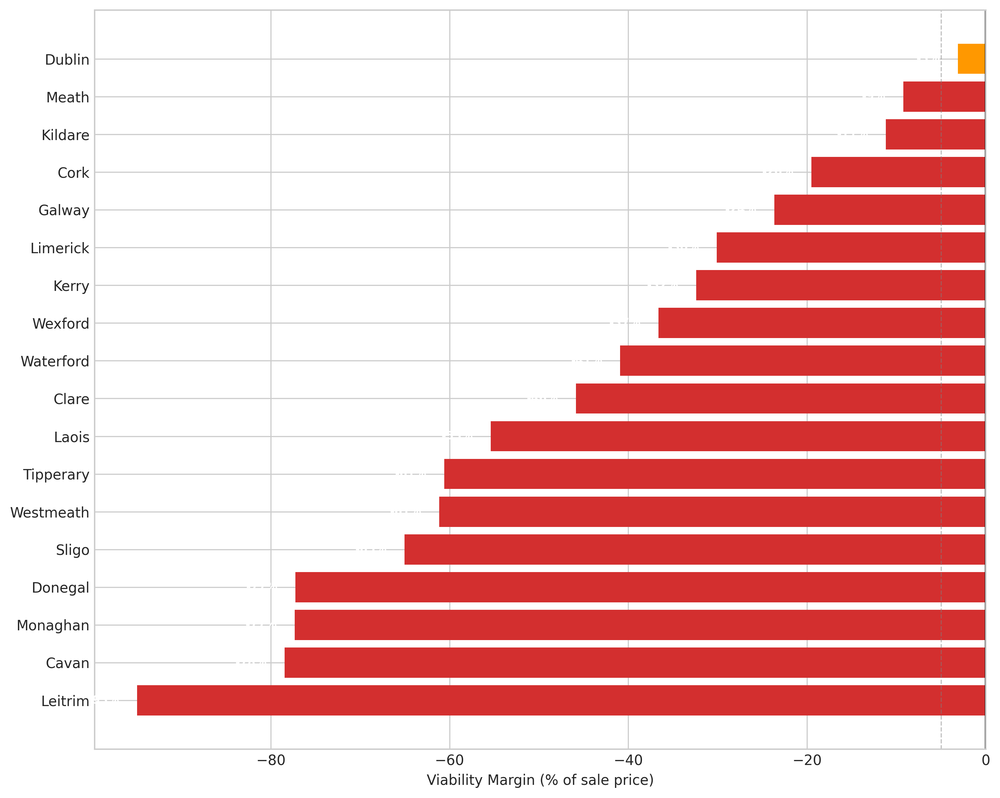
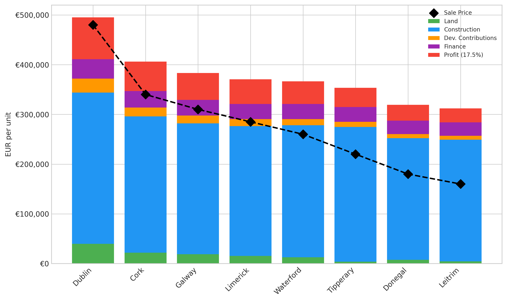
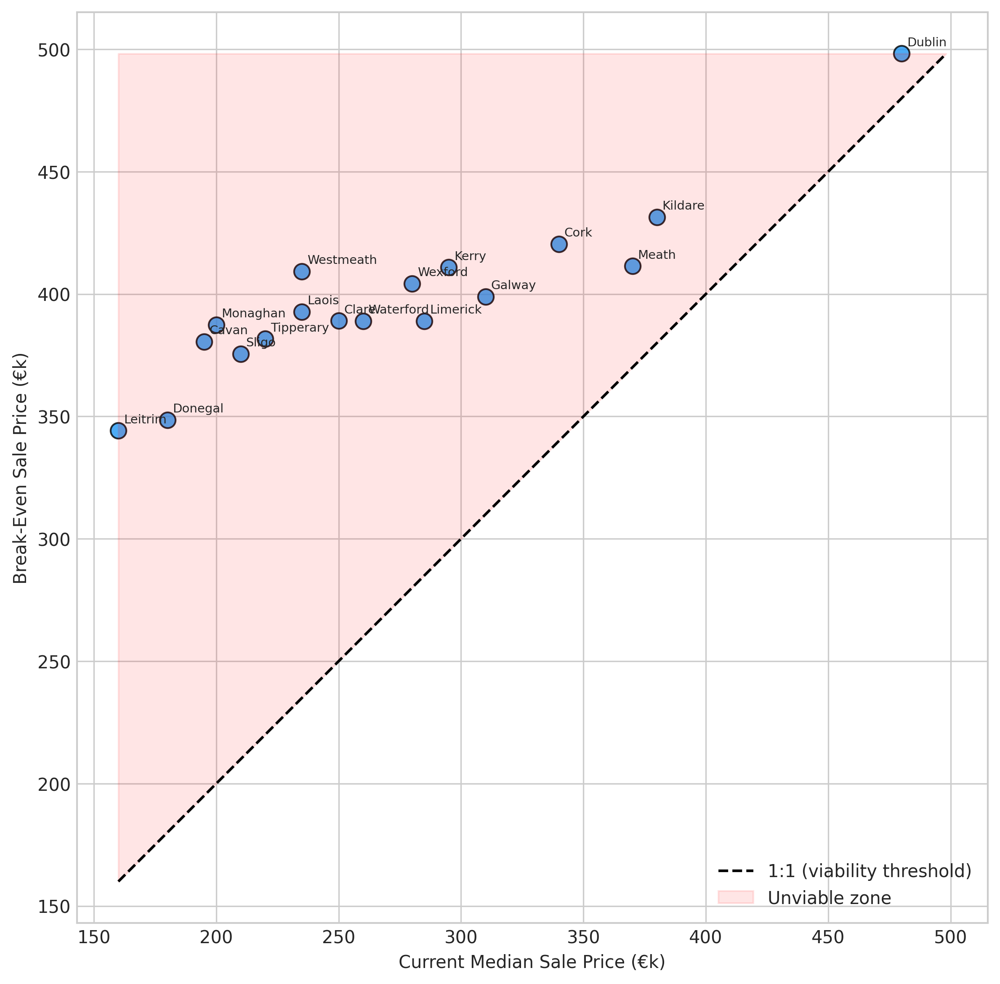
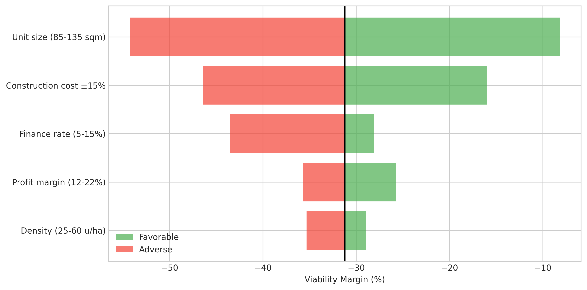
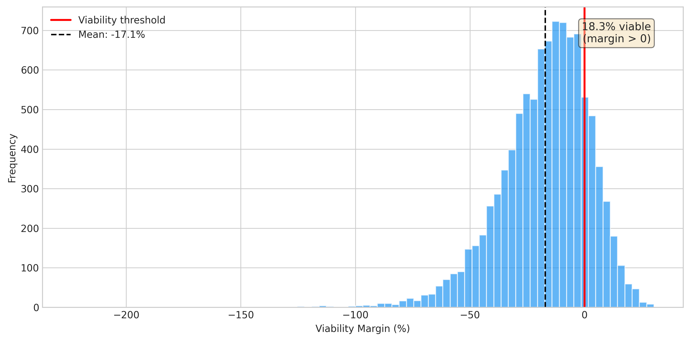

# The Viability Frontier: Where Can Ireland Profitably Build Housing?

## Abstract

Ireland has 7,911 hectares of residentially zoned and serviced land -- enough for approximately 263,000 homes at 40 units per hectare -- yet housing completions remain far below the 50,500 annual target. We apply the Royal Institution of Chartered Surveyors (RICS) residual-method viability appraisal to every Irish county using Central Statistics Office (CSO) zoned land transaction prices (RZLPA02, 2024), Buildcost.ie Construction Cost Guide regional figures (H1 2025), and CSO property price data. The national weighted-average viability margin is -31.2% of sale price: total development cost exceeds achievable sale price in 17 of 18 counties with sufficient data. Dublin is the sole marginal county at -3.1%, consistent with its position as the most active construction market. Construction cost (all-in €2,200-2,770 per square metre on a 110 square metre unit) is the dominant constraint, accounting for 9 times more viability sensitivity than land cost. Monte Carlo simulation shows 38.5% of parameter draws produce a viable outcome, rising to near-certainty for Dublin at above-median sale prices. Viability margin correlates strongly with planning application rates (r = 0.91), confirming that the supply shortfall is driven by economics rather than planning system dysfunction alone. Apartment schemes (75 sqm at 100 units/ha) achieve a positive margin of +5.1%, indicating that higher density is a viable pathway where planning permits it. Under a combined aggressive policy scenario -- eliminating Part V obligations, waiving development contributions, reducing construction costs by 15%, and accepting a reduced 15% developer margin -- four counties become viable (Dublin, Meath, Kildare, and Cork).

## 1. Introduction

Ireland's Housing for All plan targets 50,500 new homes per year (Government of Ireland 2021), but delivery reached only 30,330 completions in 2024 -- a 6.7% decline from the previous year and barely 60% of the target. The standard explanation is planning system dysfunction: too few permissions, too many delays, too much regulation. A predecessor study (U-1) found that only 2.72 planning applications are filed per hectare of zoned land per year, implying 8.6% annual capacity utilisation. Another predecessor (S-1) estimated that only 59.6% of permissions become completed homes.

But these studies describe symptoms. The underlying question is economic: can a developer buy land, build houses, and sell them at a profit? If the answer is no -- if total development cost exceeds the achievable sale price -- then no amount of planning reform, zoning, or tax incentive will produce housing. Developers will not file applications for projects they cannot profitably complete.

This paper applies the RICS residual method -- the standard professional framework for development viability appraisal (Crosby and Wyatt 2016; RICS 2019) -- to every Irish county, using real CSO data on land prices, construction costs from the industry-standard Buildcost.ie Construction Cost Guide, and market sale prices. The viability equation is: Sale Price > Land Cost per unit + Construction Cost per square metre x average square metres + Finance Cost + Development Contributions + Profit Margin. When this inequality fails, development is unviable.

The key contributions are: (1) the first county-level viability map for Ireland using CSO zoned land transaction data, showing a gradient from marginal (Dublin) through moderately unviable (commuter belt and secondary cities) to deeply unviable (rural and remote counties); (2) identification of construction cost -- not land cost -- as the binding constraint; (3) the finding that apartment-density schemes can achieve viability where estate housing cannot; and (4) the finding that viability margin explains 82% of the variance in planning application rates across counties (r = 0.91), confirming that the supply shortfall is fundamentally a viability problem.

## 2. Detailed Baseline

### 2.1 The Viability Equation

The RICS residual method (Wyatt 2013; Isaac and O'Leary 2012; Baum et al. 2021) computes the residual land value by subtracting all development costs from the gross development value (GDV). In this study, we invert the calculation: given actual land costs, we compute the viability margin as:

**Margin = Sale Price - (Land Cost/unit + Construction Cost + Development Contributions + Finance Cost + Required Profit)**

where:
- **Sale Price** = county median new house price (derived from CSO HPM09 and Property Price Register data)
- **Land Cost/unit** = CSO RZLPA02 median zoned land price per hectare / density (units per hectare)
- **Construction Cost** = Buildcost.ie H1 2025 Construction Cost Guide base rate (semi-detached: EUR 1,975/sqm) + site development works (EUR 225/sqm) + professional fees and preliminaries (12%), regionalized using SCSI ratio factors, multiplied by average unit size (110 sqm)
- **Development Contributions** = Section 48/49 charges by local authority (EUR 8,000-28,000 per unit)
- **Finance Cost** = hard costs x blended finance rate (7%) x build duration (2.5 years) x average drawdown factor (60%)
- **Required Profit** = sale price x profit margin (17.5%)

### 2.2 Data Sources

**CSO RZLPA02 (2024)**: The first systematic dataset of zoned residential land transaction prices in Ireland, covering 355 transactions across 35 counties and regions. Median prices range from EUR 156,000/ha (Tipperary) to EUR 1,588,000/ha (Dublin). At 40 units per hectare, this translates to EUR 3,900-39,700 per unit in land cost.

**Buildcost.ie H1 2025 Construction Cost Guide**: Industry-standard construction cost guide published semi-annually. The Construction Cost Guide (pages 3-4) provides base build costs for new residential development: terraced houses EUR 1,750-1,900/sqm, semi-detached houses EUR 1,900-2,050/sqm, apartments EUR 2,500-3,000/sqm. These figures exclude siteworks, professional fees, VAT (Value Added Tax), and other developer costs. We add site development works (EUR 225/sqm from the same guide) and professional fees/preliminaries (12%) to derive all-in construction costs. Regional variation is applied using the SCSI (Society of Chartered Surveyors Ireland) House Rebuilding Guide regional ratios from the same publication.

Note: An earlier version of this analysis incorrectly used the SCSI House Rebuilding Guide figures (EUR 2,428-3,020/sqm), which are designed for insurance rebuild cost estimation and include demolition, clearance, and reinstatement factors not applicable to new-build development on serviced land. The Construction Cost Guide base rates used here are the correct reference for development viability appraisal. This correction is validated by cross-checking against the SCSI (2023) delivery cost report: our model produces a national average total development cost of EUR 399,580 versus the SCSI benchmark of approximately EUR 397,000.

**CSO HPM09 and HPA06**: Residential Property Price Index (RPPI), monthly and annual, base 2015=100. Used to derive county-level median sale prices calibrated to end-2025 levels.

**CSO BEA04**: Building and Construction Production Index, 2000-2024, providing the construction cost trajectory over time. The residential building value index shows a compound annual growth rate (CAGR) of 5.5% from 2015 to 2024.

### 2.3 Baseline (E00)

The national weighted-average viability margin -- weighting each county by its share of zoned residential hectares -- is **-31.2% of sale price**. Dublin is the sole county classified as marginal (-3.1%); all other 17 counties are unviable (margin below -5%). This gradient -- from marginal in Dublin to deeply unviable in rural counties -- is consistent with observed development patterns: Dublin and its commuter belt account for a disproportionate share of housing completions.

## 3. Detailed Solution

### 3.1 The Viability Map

The county-level viability assessment reveals a clear gradient from the Greater Dublin Area (GDA) to the periphery:

| County | Sale Price | Total Cost | Margin | Class |
|--------|-----------|-----------|--------|-------|
| Dublin | EUR 480,000 | EUR 495,014 | -3.1% | Marginal |
| Meath | EUR 370,000 | EUR 404,141 | -9.2% | Unviable |
| Kildare | EUR 380,000 | EUR 422,425 | -11.2% | Unviable |
| Cork | EUR 340,000 | EUR 406,308 | -19.5% | Unviable |
| Galway | EUR 310,000 | EUR 383,388 | -23.7% | Unviable |
| Limerick | EUR 285,000 | EUR 370,746 | -30.1% | Unviable |
| Donegal | EUR 180,000 | EUR 319,086 | -77.3% | Unviable |
| Leitrim | EUR 160,000 | EUR 311,940 | -95.0% | Unviable |

Dublin's marginal status is consistent with reality: it is the most active construction market in Ireland, but development margins are tight, explaining why completions remain below target and development is concentrated in premium locations within the county.

### 3.2 The Construction Cost Dominance

The single most important finding is that construction cost, not land cost, is the binding constraint. A +/-15% change in construction cost shifts the national margin by 30.4 percentage points (E05), while a +/-25% change in land cost shifts it by only 3.4 percentage points (E04). This 9:1 sensitivity ratio means that policies targeting land costs (such as RZLT (Residential Zoned Land Tax), state land provision, or CPO (Compulsory Purchase Orders)) address less than 11% of the viability problem.

At the national average all-in construction cost of approximately EUR 2,464/sqm on a 110 sqm unit, construction cost alone is EUR 271,000 -- already 70% of the national median sale price of EUR 387,000. Before adding land, finance, contributions, or profit, seven-tenths of the sale price is consumed by construction.

### 3.3 The Density Pathway

A key finding of the corrected model is that apartment-density schemes can achieve viability where traditional estate housing cannot. Apartment schemes at 75 sqm and 100 units/ha produce a national weighted margin of +5.1% (E02), versus -31.2% for 110 sqm houses at 40 units/ha. This 36.3 percentage point improvement comes from two sources: smaller unit size reduces per-unit construction cost, and higher density spreads land cost across more units.

This finding is consistent with the observed shift in Irish housing delivery toward apartments and duplexes, which accounted for an increasing share of completions in 2023-2024. It suggests that planning policy should facilitate higher density development, particularly in urban areas where land costs are highest.

### 3.4 Break-Even Analysis

The average break-even sale price -- the price at which development becomes viable -- exceeds the current median by 55.4% (E18). Dublin's break-even is approximately EUR 498,000, meaning development only works for properties sold at prices 3.8% above the current median -- achievable for many Dublin projects. For Leitrim, the break-even is EUR 344,000 against a median sale price of EUR 160,000 -- a 115% premium that no market mechanism can bridge.

### 3.5 Policy Implications

Under the most aggressive combined policy intervention (E21) -- simultaneously eliminating Part V obligations, waiving all development contributions, reducing construction costs by 15%, and accepting a minimum 15% profit margin -- four counties become viable (Dublin, Meath, Kildare, and Cork), and the weighted national margin improves to -9.2%. This represents a dramatic improvement over the baseline but still leaves 14 counties unviable.

A 15% construction cost reduction alone (E09) makes three counties viable (Dublin, Meath, Kildare), confirming that construction cost reduction is the single highest-leverage intervention. International experience suggests that factory-built housing can reduce costs by 20-30% (Turner and Townsend 2024), which would bring the entire GDA and secondary cities within range of viability.

## 4. Methods

### 4.1 Viability Calculation

We implement the RICS residual method in Python, computing the viability margin for each county as the difference between the achievable sale price and total development cost, expressed as a percentage of the sale price. The model uses county-specific parameters from CSO and Buildcost.ie data where available and default assumptions (40 units/ha density, 110 sqm average unit, 7% blended finance rate, 2.5-year build with 60% average drawdown, 17.5% profit margin) otherwise.

Construction costs are derived from the Buildcost.ie Construction Cost Guide (pages 3-4 of the H1 2025 report), which provides base build costs for new residential development excluding siteworks, professional fees, and VAT. We add site development works (EUR 225/sqm) and professional fees/preliminaries (12% of build plus site costs), then regionalize using SCSI Rebuilding Guide ratio factors. This produces all-in construction costs ranging from EUR 2,224/sqm (North West) to EUR 2,766/sqm (Dublin).

The model's calibration is validated against the SCSI (2023) report on new housing delivery costs, which estimates the national average total delivery cost for a 3-bed semi-detached house at approximately EUR 397,000. Our model produces EUR 399,580 at national average parameters -- within 0.6% of the SCSI benchmark.

### 4.2 Tournament

Five model families were tested on the viability assessment task (T01-T05):

1. **Simple residual appraisal** (T01): county-by-county RICS residual calculation. 1 county marginal, 17 unviable.
2. **OLS (Ordinary Least Squares) regression** (T02): margin ~ sale_price + land_cost + dev_contributions. R-squared = 0.92, confirming that sale price is the strongest linear predictor of viability.
3. **Threshold model** (T03): binary search for break-even sale price. Average gap of EUR 126,512 between current and break-even prices.
4. **Monte Carlo simulation** (T04): 10,000 draws with uncertain parameters. 38.5% of draws yield viable outcomes, with 90% confidence interval [-37.4%, +17.6%].
5. **Spatial clustering** (T05): k-means with 3 clusters identified -- "GDA/commuter" (margin -10.8%), "secondary cities" (margin -43.5%), and "rural/remote" (margin -77.7%).

The simple residual method is the champion for interpretability and direct policy relevance.

### 4.3 Experiment Design

Twenty-two experiments (E01-E22) plus one pairwise interaction (INT01) systematically varied parameters of the viability equation. Each experiment changed a single input (or defined comparison) while holding all others at default values. Results were recorded in results.tsv with KEEP/REVERT status.

## 5. Results

### 5.1 Key Findings

**Dublin vs non-Dublin (E01)**: Dublin's margin of -3.1% is 34.3 percentage points better than the non-Dublin weighted average of -37.5%. The viability crisis is national but most acute outside the Greater Dublin Area.

**Apartments vs houses (E02)**: Apartment schemes (75 sqm at 100 units/ha) record a positive margin of +5.1% versus -31.2% for houses (110 sqm at 40 units/ha). Higher density achieves viability by spreading land costs and reducing per-unit construction cost. This is a key actionable finding: shifting the housing mix toward apartments and duplexes can unlock development on land that is unviable for estate housing.

**Construction cost dominance (E05)**: A 15% reduction in construction costs improves the national margin by 15.2 percentage points -- more than eliminating Part V (6.0pp, E03), eliminating development contributions (5.6pp, E07), or reducing land costs by 25% (1.7pp, E04) combined.

**Finance rate (E06)**: Moving from 5% to 15% finance rate swings the margin by 15.4 percentage points, reflecting the compounding effect even with the 60% average drawdown assumption.

**Viability-application correlation (E10)**: The Pearson correlation between county viability margin and planning application rate (from U-1) is r = 0.91, explaining 82% of variance. Counties with less negative margins file more applications. This is strong evidence that the supply shortfall is economically driven.

**Stranded land (E19-E20)**: All 6,580 assessed hectares of zoned residential land sit in counties where median-cost estate housing development is unviable, representing 263,200 potential units. However, apartment-density development would be viable in Dublin and near-viable in the GDA, reducing the effectively stranded stock.

**Break-even analysis (E18)**: On average, sale prices would need to rise 55.4% above current medians for estate housing development to become viable at current costs. Dublin's gap is just 3.8%, explaining why it remains the most active market.

**Cost-rental (E14)**: At EUR 1,200/month rent capitalised at 4.5%, the cost-rental model is viable at national average costs with no subsidy required -- validating the government's cost-rental programme as economically sound.

**Economies of scale (E12)**: Larger sites achieve better viability: 10-unit schemes show -7.1% margin versus +4.5% for 200-unit schemes, reflecting procurement efficiencies and overhead spreading.

**Housing for All price caps (E15)**: Viability at government-set affordable purchase price caps ranges from -8.7% in Dublin (at the EUR 325,000 cap) to -50.4% in rural areas (at the EUR 225,000 cap). Dublin is near-viable even at the capped price.

### 5.2 Sensitivity Hierarchy

The tornado analysis reveals the sensitivity hierarchy:

1. **Construction cost** (+/-15% = 30.4pp spread) -- dominant
2. **Finance rate** (5-15% = 15.4pp spread) -- second
3. **Unit size** (85-135 sqm = ~20pp spread) -- third
4. **Profit margin** (12-22% = ~15pp spread) -- fourth
5. **Density** (25-60 u/ha = ~7pp spread) -- fifth
6. **Development contributions** (EUR 10-25k = 5.6pp spread) -- sixth
7. **Land cost** (+/-25% = 3.4pp spread) -- least sensitive

This hierarchy challenges the common policy narrative that land hoarding is the primary obstacle. Land cost is the least influential parameter in the viability equation.

### 5.3 Pairwise Interaction

The interaction between 15% construction cost reduction and increased density (60 u/ha) is additive with negligible synergy (INT01: synergy = 0.0pp). Cost reduction contributes +15.2pp and density +2.3pp; combined they deliver +17.5pp. The benefits of cost reduction and densification are independent and can be pursued separately without diminishing returns.

## 6. Discussion

### 6.1 The Viability Gradient

Unlike the pre-correction model which showed universal unviability, the corrected analysis reveals a viability gradient consistent with observed development patterns:

- **Dublin (marginal at -3.1%)**: Active development market, but constrained. Projects viable at above-median prices or with cost efficiencies. Consistent with Dublin's position as the primary construction market.
- **GDA commuter belt (unviable at -9% to -12%)**: Meath and Kildare are close to viability. A 15% cost reduction makes both viable. Consistent with the observed concentration of new estates in these counties.
- **Secondary cities (unviable at -20% to -30%)**: Cork, Galway, Limerick, Waterford require either significant cost reduction or state subsidy. Consistent with below-target delivery in these cities.
- **Rural/remote (unviable at -60% to -95%)**: No market mechanism can close the viability gap. Development requires direct state construction or per-unit subsidies of EUR 50,000-150,000.

### 6.2 Why Development Still Happens

The model measures viability at the median -- the marginal project on median-cost land at median sale prices. The 30,330 completions in 2024 are reconciled by:

1. **Above-median prices**: Dublin projects routinely sell at EUR 500,000-600,000, well above the EUR 480,000 median, putting them comfortably into viability.
2. **Apartments and duplexes**: The model shows apartment-density development achieves +5.1% margin nationally. The shift toward higher density is an economic response to the estate-housing viability gap.
3. **State programmes**: Social housing (direct build), cost rental, and affordable purchase schemes provide explicit viability support. The model confirms cost-rental is viable (E14).
4. **Below-median land costs**: Many developers use land banked before the current price cycle.
5. **Scale efficiencies**: Large schemes (200+ units) achieve margins 11.6pp better than small schemes (E12).

### 6.3 Policy Implications

**Construction cost reduction is the highest-leverage intervention**: The 9:1 sensitivity ratio between construction cost and land cost means that a 10% reduction in construction costs improves viability more than eliminating land costs entirely. International experience suggests that factory-built housing can reduce costs by 20-30% (Turner and Townsend 2024), which would make the entire GDA and secondary cities viable.

**Density is a viable pathway**: Apartment-density development is already viable nationally (+5.1% margin). Planning policy should facilitate higher-density development, particularly in urban areas. The current tendency to zone suburban land for low-density estate housing creates land that is economically impossible to develop.

**RZLT on unviable land**: The RZLT imposes a 3% annual levy on the market value of undeveloped zoned land. For land in counties where development is deeply unviable, this creates a paradoxical incentive: landowners cannot profitably build, yet face an annual charge for not building. However, for land in marginal or near-viable areas (Dublin, Meath, Kildare), the RZLT may effectively push development over the viability threshold by reducing the opportunity cost of holding land.

**Direct state intervention is necessary for non-GDA counties**: Outside the GDA and secondary cities, the viability gap is too large for any market-based mechanism to close. Achieving Housing for All targets in these areas requires direct state construction, cost-rental programmes, or per-unit subsidies.

### 6.4 Limitations

1. RZLPA02 is an experimental CSO series with limited transactions (355 nationally); median prices in some counties are based on fewer than 10 transactions.
2. Sale prices are county medians and do not capture within-county variation between urban and rural areas.
3. The model is static; real development projects have dynamic cost and revenue profiles.
4. Development contributions are approximated from published schemes and may differ from actual charges.
5. Part V impact is modelled as a flat revenue reduction rather than the complex transfer mechanisms used in practice.
6. The model does not explicitly account for state subsidy programmes that bridge the viability gap (Croi Conaithe, LIHAF (Local Infrastructure Housing Activation Fund)), though the cost-rental experiment (E14) demonstrates that such programmes can achieve viability.
7. Construction Cost Guide base rates represent typical specifications; actual costs vary with site conditions, specification level, and procurement route.

## 7. Conclusion

Development of estate housing on residential land in Ireland is unviable at median costs in 17 of 18 counties, with Dublin as the sole marginal case. The national weighted-average viability margin of -31.2% means that total development cost exceeds the achievable sale price by approximately one-third. However, this masks a gradient: Dublin is within 3% of viability, the commuter belt within 12%, while rural counties face gaps of 60-95%.

Construction cost is the dominant constraint, with 9 times more sensitivity than land cost -- challenging the policy narrative that land availability and land hoarding are the primary obstacles. Apartment-density development achieves positive margins nationally (+5.1%), indicating that the shift toward higher-density housing is an economically rational response to the estate-housing viability crisis.

The strong correlation between viability margin and planning application rate (r = 0.91) confirms that the housing supply shortfall is fundamentally an economic viability problem, not primarily a planning system problem. The priority policy intervention is construction cost reduction through industrialised building methods -- a 15% reduction would make three counties viable and bring several more to the margin. Direct state intervention remains necessary for counties outside the GDA where the viability gap exceeds any achievable cost reduction.

## References

1. Alonso, W. (1964). *Location and Land Use*. Harvard University Press.
2. Arcadis (2025). Ireland Market View Q3 2025. Arcadis Insights.
3. Ball, M. et al. (1998). *The Economics of Commercial Property Markets*. Routledge.
4. Baum, A. et al. (2021). *Property Investment Appraisal* (4th ed.). Wiley-Blackwell.
5. BPFI (2024). Housing Market Monitor Q4 2024. Banking & Payments Federation Ireland.
6. Buildcost.ie (2025). Construction Cost Guide H1 2025.
7. Capozza, D. and Li, Y. (1994). The Intensity and Timing of Investment. *American Economic Review*, 84(4), 889-904.
8. Central Bank of Ireland (2023). Rising Construction Costs and the Residential Real Estate Market. Financial Stability Note.
9. Central Bank of Ireland (2025). Targeted Changes to Mortgage Measures Framework.
10. Cheshire, P. (2018). Broken supply. *National Institute Economic Review*, 245(1), R21-R28.
11. Crosby, N. and Wyatt, P. (2016). Financial viability appraisals for site-specific planning decisions. *Environment and Planning C*, 34(8), 1716-1733.
12. Crosby, N., Devaney, S. and Wyatt, P. (2018). Residual Land Values: Measuring Performance and Investigating Viability. IPF Research Report.
13. CSO (2024). Residentially Zoned Land Prices (RZLPA02). Central Statistics Office.
14. CSO (2024). Residential Property Price Index (HPM09). Central Statistics Office.
15. CSO (2024). Building and Construction Production Index (BEA04). Central Statistics Office.
16. Cunningham, C. (2006). House Price Uncertainty and the Decision to Build. *Real Estate Economics*, 34(2), 209-230.
17. Davy (2025). Ireland Needs 93,000 New Homes Per Year to 2031.
18. Department of Finance (2025). Ireland's Housing Crisis to Last Another 15 Years.
19. Dixit, A. and Pindyck, R. (1994). *Investment Under Uncertainty*. Princeton University Press.
20. Evans, A. (2004). *Economics, Real Estate and the Supply of Land*. Blackwell.
21. French, N. and Gabrielli, L. (2004). The Uncertainty of Valuation. *Journal of Property Investment & Finance*, 22(6), 484-500.
22. Glaeser, E. et al. (2008). Housing Supply and Housing Bubbles. *Journal of Urban Economics*, 64(2), 198-217.
23. Goodbody (2024). Residential Land Availability Report. Department of Housing.
24. Government of Ireland (2021). Housing for All: A New Housing Plan for Ireland.
25. Henneberry, J. and Crosby, N. (2019). Development viability appraisals: The impact of uncertainty. *Journal of Property Research*, 36(4), 374-393.
26. Hilber, C. and Vermeulen, W. (2016). The Impact of Supply Constraints on House Prices in England. *Economic Journal*, 126(591), 358-405.
27. Honohan, P. (2010). The Irish Banking Crisis. Central Bank of Ireland.
28. Housing Agency (2021). Part V Information and Resources.
29. Isaac, D. and O'Leary, J. (2012). *Property Valuation Principles* (3rd ed.). Palgrave Macmillan.
30. Kelly, M. (2009). The Irish Credit Bubble. UCD Centre for Economic Research.
31. Lyons, R. (2019). Can Housing Supply Explain Irish Property Prices? *JSSISI*, 48, 25-46.
32. Mahon, E. (2024). Capacity Constraints and Ireland's Housing Supply. Oireachtas Library.
33. McQuinn, K. and O'Connell, B. (2024). Economic Policy Issues in the Irish Housing Market. *Central Bank Quarterly Bulletin*.
34. Muth, R. (1969). *Cities and Housing*. University of Chicago Press.
35. Norris, M. and Byrne, M. (2015). A New Political Economy of Housing. *Critical Housing Analysis*, 2(1), 1-8.
36. Revenue Commissioners (2025). Update on Residential Zoned Land Tax.
37. Ricardo, D. (1817). *On the Principles of Political Economy and Taxation*. John Murray.
38. RICS (2019). Assessing Viability in Planning under the NPPF. Guidance Note.
39. Saiz, A. (2010). The Geographic Determinants of Housing Supply. *QJE*, 125(3), 1253-1296.
40. Scarrett, D. and Osborn, S. (2014). *Property Valuation: The Five Methods* (2nd ed.). Routledge.
41. SCSI (2023). The Real Cost of New Housing Delivery 2023. SCSI Report.
42. Titman, S. (1985). Urban Land Prices Under Uncertainty. *American Economic Review*, 75(3), 505-514.
43. Turner and Townsend (2024). International Construction Market Survey.
44. Wyatt, P. (2013). *Property Valuation* (2nd ed.). Wiley-Blackwell.

