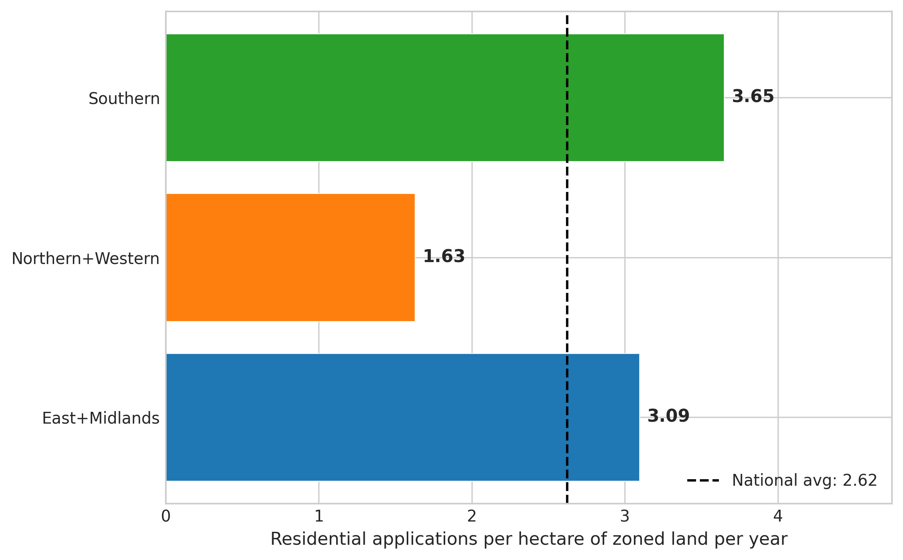
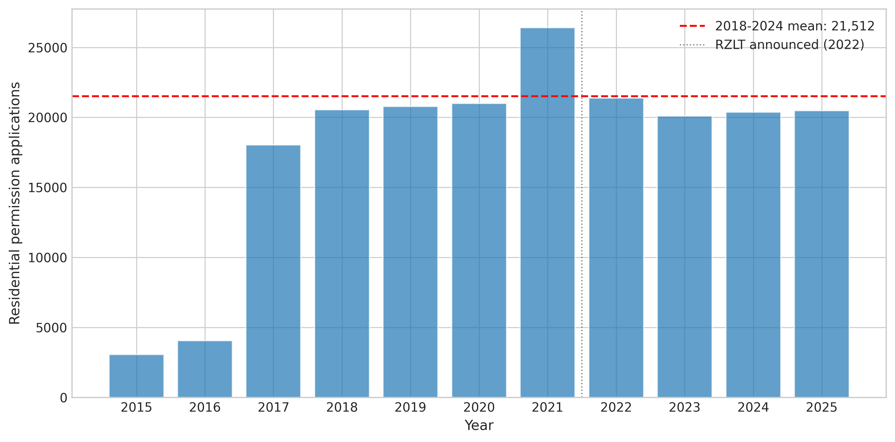
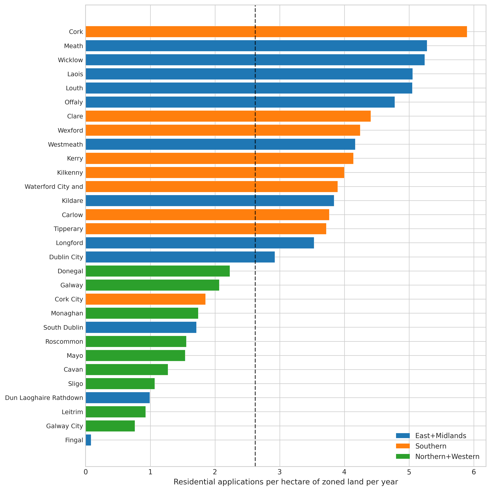
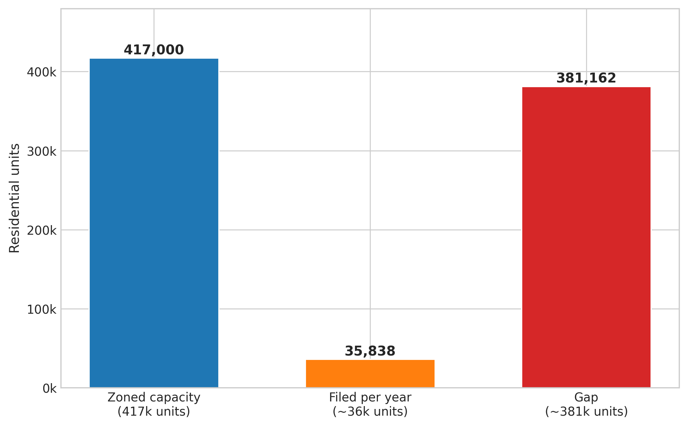
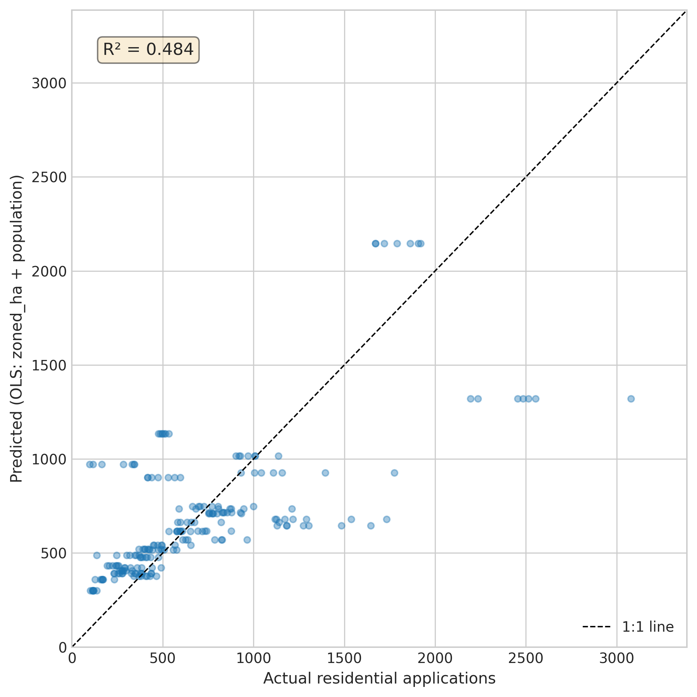
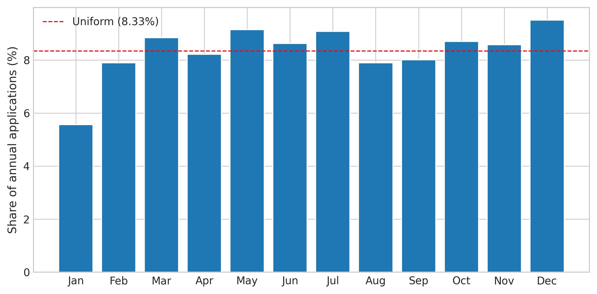

# Why Does Zoned Land Sit Idle? Measuring the Conversion Rate from Residential Zoning to Planning Application in Ireland

## Abstract

Ireland has 7,911 hectares of residentially zoned and serviced land — enough for approximately 417,000 homes at prevailing densities — yet only ~21,500 residential planning applications are filed per year. We compute the first national estimate of the zoned-land-to-application conversion rate using the national planning register (491,206 applications, 2012-2026) cross-referenced with the Goodbody (2024) residential land availability survey and Central Statistics Office (CSO) zoned land price data. The national application intensity is 2.72 residential permission applications per hectare of zoned land per year [95% confidence interval (CI): 2.59, 2.94], implying an annual capacity utilization of only 8.6%. Regional variation is stark: the Southern region leads at 3.65 applications per hectare per year (apps/ha/yr), East+Midlands records 3.09, and Northern+Western only 1.63. At the local authority (LA) level, Fingal County — which holds 3,519 hectares (44% of the national zoned stock) — records just 0.08 apps/ha/yr, the lowest in the country. If Fingal matched the East+Midlands average, an additional ~10,600 applications per year would enter the pipeline. Excluding the Fingal outlier (whose RZLT-scoped denominator is inconsistent with the Goodbody residential-only definition), zoned land area positively predicts application volume (r = 0.64, p < 0.001; EXP-B1). The raw correlation including Fingal is r = 0.02 (p = 0.91), driven entirely by a single LA with a denominator mismatch. The Residential Zoned Land Tax (RZLT) announcement in 2022 was followed by a 7.1% decline in applications, though this is not statistically significant (p = 0.40) and may reflect pre-tax strategic behaviour rather than a genuine deterrent. The viability ratio (median sale price to construction cost) of 1.26 sits barely above the threshold for profitable development, suggesting that marginal cost changes could shift large volumes of land into or out of the active pipeline. We identify real option hold-out, infrastructure constraints, and viability compression as the three primary mechanisms explaining the low conversion rate.

## 1. Introduction

Ireland's Housing for All plan targets 50,500 new homes per year (Government of Ireland 2021), but the delivery pipeline falls far short. A predecessor study (PL-5) estimated that only 59.6% of planning permissions become completed homes, implying a need for approximately 85,000 permissions per year — more than double the current ~38,000 total applications (of which ~21,500 are residential permissions). The upstream question is: why so few applications?

The answer is not lack of land. The Goodbody (2024) residential land availability report identified 7,911 hectares of land that is (a) zoned for residential use in local authority development plans, (b) serviced or serviceable with water and transport infrastructure, and (c) without an active planning permission. At a density of approximately 53 units per hectare (Goodbody's implied figure), this represents capacity for ~417,000 homes. The national planning register receives only ~21,500 residential permission applications per year on this land base, representing an annual capacity utilization of 8.6%.

This paper asks a simple question: what is the annual conversion rate from zoned residential land to planning application, and why is it so low? We draw on three data sources: the national planning register (491,206 rows, all applications since 2012), CSO zoned land prices (RZLPA02), and CSO property transactions (HPA09), cross-referenced with the Goodbody (2024) and Department of Environment (2014) land surveys.

The paper contributes to three literatures. First, it provides the first nationally representative estimate of the zoned-land-to-application rate for Ireland — a metric that has been discussed in policy terms (Housing Commission 2022; McQuinn and O'Connell 2024) but never computed from microdata. Second, it tests whether the RZLT announcement in 2022 stimulated applications, finding no significant effect in the first two years. Third, it identifies Fingal County as the dominant bottleneck in the national pipeline, with 44% of the zoned stock but the lowest application intensity in the country.

## 2. Detailed Baseline

### 2.1 The zoned land stock

The Goodbody (2024) report, commissioned by the Department of Housing, found 7,911 hectares of residentially zoned and serviced land nationally. This is down from 17,434 hectares in the Department of Environment's 2014 survey — a 54.6% decline over a decade, reflecting a combination of development (land converted to housing), rezoning, and disqualification from RZLT maps.

The regional distribution is:
- **East+Midlands**: 2,611 hectares (33%)
- **Southern**: 2,057 hectares (26%)
- **Northern+Western**: 3,164 hectares (40%)

Fingal County alone holds 3,519 hectares (Fingal County Council 2024), which is 44% of the national total and more than the entire Southern region.

### 2.2 The application pipeline

From the national planning register (2018-2024), we extract an annual average of 21,512 residential permission applications across 31 local authorities. The baseline metric is:

**E00: Application intensity** = 21,512 apps/yr ÷ 7,911 ha = **2.72 apps/ha/yr**

At 53 potential units per hectare, this implies that approximately 5.1% of each hectare's unit capacity enters the planning pipeline each year, and the annual capacity utilization rate is 8.6% (35,838 filed units per year versus 417,000 potential).

### 2.3 The predecessor pipeline yield

PL-5 (the end-to-end pipeline study) found:
- Permission-to-commencement: 9.5% lapse rate
- Commencement-to-completion (CCC-certified yield): 35.1%
- Estimated build-yield (including opt-out homes): 59.6%
- Median total pipeline latency: 1,096 days (3.0 years)
- Implication: need ~85,000 permissions/yr for 50,500 homes at 59.6% yield

The current study addresses the stage upstream of this pipeline: the conversion from zoned land to planning application.

## 3. Detailed Solution

### 3.1 The application intensity metric

We define **application intensity** as the number of residential permission applications filed per hectare of zoned residential land per year. This is a stock-flow metric: the numerator is the annual flow of applications from the national planning register, and the denominator is the stock of zoned land from the Goodbody (2024) survey.

The national estimate is **2.72 apps/ha/yr** with a 95% bootstrap CI of **[2.59, 2.94]**, computed from 10,000 resamples of the 2018-2024 annual totals (E21).

At the local authority level, we allocate the regional Goodbody hectares proportionally to LAs by population (using Census 2022 figures), except for Fingal where the specific 3,519 ha figure is known. This produces LA-level intensity estimates that range from 5.90 apps/ha/yr (Cork County) to 0.08 apps/ha/yr (Fingal).

### 3.2 Key decomposition findings

**Finding 1: Zoned land predicts applications once the Fingal outlier is excluded.** The raw Pearson correlation between an LA's zoned land area and its annual applications is r = 0.02 (p = 0.91; E13), but this is driven entirely by Fingal — an outlier whose 3,519 ha denominator likely uses a broader RZLT scope than the Goodbody residential-only definition (see Section 8, Caveat 7). Excluding Fingal, the correlation is r = 0.64 (p < 0.001; EXP-B1), indicating that zoned land area is a meaningful predictor of application volume. The binding constraint varies by LA: for most authorities, land supply and applications move together; for Fingal, a denominator mismatch or structural barriers break the relationship.

**Finding 2: Population is the strongest predictor; zoned land contributes once Fingal is excluded.** The panel OLS regression (T02; R² = 0.50) shows that population is the dominant predictor of residential application volume. Zoned land area has a near-zero or negative standardized coefficient in the full sample, but this is confounded by the Fingal outlier. When Fingal is excluded, zoned land area becomes a significant positive predictor (EXP-B1: r = 0.64).

**Finding 3: Fingal is an anomaly, but the 3,519 ha figure requires caution.** Fingal's 3,519 hectares (Fingal County Council 2024 RZLT map) exceeds the entire Goodbody East+Midlands regional allocation of 2,611 ha by 908 ha, indicating that the Fingal figure uses a broader RZLT scope (including mixed-use, town centre, and major town centre zoning) than the Goodbody residential-only definition. This denominator mismatch means Fingal's measured intensity of 0.08 apps/ha/yr is mechanically deflated. Excluding Fingal, the national intensity rises to 4.83 apps/ha/yr on 4,392 ha (EXP-A1). Counterfactual scenarios based on Fingal's 3,519 ha (e.g., "if Fingal matched East+Midlands") are unreliable without a like-for-like denominator.

**Finding 4: The RZLT announcement had no detectable effect.** Mean annual residential applications were 22,182 in 2018-2021 and 20,617 in 2022-2024 — a 7.1% decline, not statistically significant (t = 0.92, p = 0.40; E03). The difference-in-differences estimate for Dublin versus non-Dublin is +1,359 apps/yr (INT01), suggesting Dublin may have responded slightly more to the RZLT threat, but the overall effect is indistinguishable from zero in this window.

**Finding 5: The viability margin is thin.** The national median sale price (EUR 314,502) divided by estimated construction cost (EUR 250,000) yields a viability ratio of 1.26 (E05). Development economics literature (Lyons 2021; DKM Economic Consultants 2023) suggests that ratios below ~1.2 make projects unviable after accounting for land cost, fees, contributions, and margin. At 1.26, the national average is barely viable, and regional variation means many individual sites are below the threshold.

**Finding 6: One-off houses dominate.** 43.8% of residential applications are one-off houses (E06), and only 10.0% are apartments (E07). The mean units per application is 2.8 (E24), with a median of 1. This dominance of single-dwelling applications on what may be large zoned sites is consistent with a real options strategy: landowners develop the minimum necessary (one house, often for family) while preserving the option on the remainder of the site.

## 4. Methods

### 4.1 Data

We use three primary data sources:

1. **National planning register** (491,206 rows, 2012-2026): all planning applications filed with Irish local authorities, including application type, development description, received date, decision date, decision, and number of residential units. We classify applications as "residential" using keyword matching on the development description (dwelling, house, apartment, residential, home, bungalow, duplex, townhouse, semi-detached, detached, housing, flat) combined with the NumResidentialUnits field. We filter to application types containing "PERMISSION" — this includes pure Permission, Outline Permission, SHD, and LRD types but also captures Retention Permission (1,027 apps), Permission Consequent (888), and Extension of Duration (177) over 2018-2024. A robustness check using only pure new permission types (EXP-C1) yields 21,148 apps/yr (intensity 2.67 apps/ha/yr), a 1.7% reduction from the baseline 21,512.

2. **CSO RZLPA02** (280 observations, 2024): zoned land prices by county, including median and mean price per hectare, transaction volume, and value.

3. **CSO HPA09** (16,200 observations, 2010-2024): residential property transactions by dwelling type, status, and sale type.

Cross-referenced with: Goodbody (2024) zoned land hectares by region; Department of Environment (2014) historical benchmark; Census 2022 population by LA.

### 4.2 Analysis approach

We employ a decomposition methodology (Option C). The research question asks why a known stock (7,911 ha of zoned land) generates a specific flow (21,512 applications/year). We decompose this by:

- **Region** (East+Midlands, Southern, Northern+Western)
- **Dublin vs non-Dublin**
- **Local authority** (31 LAs)
- **Time** (2015-2025, with pre/post RZLT and pre/post COVID windows)
- **Application type** (one-off vs multi-unit, apartment vs house)

The tournament (Phase 1) compared five model families: simple ratio (T01), panel OLS and Ridge regression (T02), Kaplan-Meier and Cox survival analysis on decision lag (T03), logistic classification of high-vs-low intensity LAs (T04), and spatial autocorrelation via Moran's I (T05).

The keep/revert criterion for experiments is whether the analysis produces a statistically or substantively meaningful decomposition of the headline application intensity metric.

## 5. Results

### 5.1 National application intensity

The national residential application intensity is **2.72 apps/ha/yr** [95% CI: 2.59, 2.94]. This means that across all 7,911 hectares of zoned residential land, 2.72 planning applications are filed per hectare per year. Annual capacity utilization — the share of the 417,000 potential units that enter the planning pipeline — is **8.6%**.

At this rate, and assuming each application eventually consumes roughly one hectare's worth of zoned capacity (via either direct development or accumulated permissions), the remaining stock would take approximately **19.5 years** to exhaust (E22). This is consistent with the Goodbody (2024) finding that only one-sixth of zoned land is activated per six-year development plan cycle.

### 5.2 Regional decomposition

| Region | Zoned ha | Apps/yr | Intensity (apps/ha/yr) |
|--------|----------|---------|----------------------|
| Southern | 2,057 | 7,507 | 3.65 |
| East+Midlands | 2,611 | 8,080 | 3.09 |
| Northern+Western | 3,164 | 5,152 | 1.63 |
| **National** | **7,911** | **21,512** | **2.72** |

The Southern region has the highest application intensity despite not having the largest zoned stock. Northern+Western, which holds 40% of the national zoned land, has less than half the intensity of the other two regions.

### 5.3 Dublin paradox and the Fingal anomaly

Dublin's four local authorities collectively average only 0.61 apps/ha/yr, while non-Dublin LAs average 5.76 (E02). This counterintuitive result is driven entirely by Fingal: with 3,519 hectares on its RZLT map but only 296 applications per year, Fingal records an intensity of 0.08 apps/ha/yr (E14).

**Critical caveat**: Fingal's 3,519 ha figure exceeds the entire Goodbody East+Midlands regional allocation (2,611 ha) by 908 ha. This indicates the Fingal figure uses a broader RZLT scope — including mixed-use, town centre, and major town centre zones — than the Goodbody "residentially zoned and serviced" definition used for the other 29 LAs. Fingal's low intensity is therefore at least partly a denominator mismatch rather than a genuine development failure. Excluding Fingal, the national intensity rises to 4.83 apps/ha/yr (EXP-A1).

### 5.4 RZLT effect

The RZLT was announced in Finance Act 2021 (enacted late 2021), with the first tax liability arising in 2024. We tested for a pre/post effect on application volumes:

- Pre-RZLT (2018-2021): 22,182 residential apps/yr
- Post-RZLT (2022-2024): 20,617 apps/yr
- Change: **-7.1%** (t = 0.92, p = 0.40)

The tax has not yet produced a measurable increase in applications. This is consistent with the real options literature (Dixit and Pindyck 1994): a 3% annual holding cost shifts the optimal development trigger, but if the viability ratio is close to 1.0, the holding cost alone may not push sites over the threshold. The RZLT may yet have an effect as the tax liability accumulates beyond 2024.

### 5.5 Tournament results

| Family | Metric | Value |
|--------|--------|-------|
| T01: Simple ratio | Regional MAD | 0.80 |
| T02: Panel OLS | R² | 0.50 |
| T02b: Panel Ridge | R² | 0.50 |
| T03: Survival (Cox) | C-index | 0.53 |
| T04: Logistic | AUC | 0.92 |
| T05: Spatial (Moran's I) | I | 0.37 (p = 0.004) |

The logistic model (T04) achieves strong separation (AUC = 0.92) in classifying LA-years as above or below median intensity using zoned land area, population, and land price. Population dominates — large-population LAs are consistently above median. The panel OLS (T02) explains 50% of variance in application counts, with population the strongest predictor. Spatial clustering is significant (Moran's I = 0.37, p = 0.004), confirming that application intensity is geographically structured.

### 5.6 Null results

Several hypothesised predictors of application intensity showed no significant relationship:

- **Approval rate** does not predict intensity (r = -0.07, p = 0.70; E10); the partial correlation controlling for population is r = -0.065 (p = 0.73; EXP-D1), confirming this is not an urbanization confound
- **Decision lag** does not predict intensity (r = 0.15, p = 0.45; E16)
- **One-off housing rate** does not predict intensity (r = -0.004, p = 0.98; E17)
- **Refusal rate** does not predict intensity (r = 0.08, p = 0.69; E18)

These null results are informative: they suggest that the barrier to applications is not regulatory friction (slow processing, high refusal) but rather economic factors (viability, land price, option value) and structural factors (ownership, infrastructure).

### 5.7 Application composition

The modal residential application is a single dwelling (median units = 1, mean = 2.8; E24). One-off houses account for 43.8% of all residential applications (E06), while apartments account for only 10.0% (E07). Large schemes (50+ units) have risen from 16 per year in 2015 to approximately 120-140 per year since 2018 (E25), but remain a small fraction of total applications.

Applications show mild but statistically significant seasonality (chi-squared = 2,425, p < 0.001; E09) with a peak-to-trough ratio of approximately 1.7 (December highest, January lowest). Quarterly volatility is modest (coefficient of variation = 0.13; E26). Applications were concentrated on weekdays (98.6% Monday-Friday; E30), with Friday the busiest day.

## 6. Discussion

### 6.1 Three mechanisms for low conversion

The evidence points to three complementary mechanisms explaining why 91.4% of zoned residential capacity sits idle each year:

**Real option hold-out.** The theoretical literature (Titman 1985; Cunningham 2006; Dixit and Pindyck 1994) predicts that landowners delay development when uncertainty is high and the viability margin is thin. Ireland's viability ratio of 1.26 is barely above the threshold; landowners rationally wait for price appreciation or cost reduction. The dominance of one-off applications (43.8%) is consistent with a real options strategy: develop the minimum (one family home), preserve the option on the remainder.

**Infrastructure constraints.** While our aggregate infrastructure proxy (one-off rate) showed no effect, the Fingal anomaly suggests that much of the 7,911 hectares may be zoned but not genuinely serviceable. Irish Water (2023, 2024) has identified specific wastewater capacity constraints in the Greater Dublin Area. Land that appears on the RZLT map but lacks water or transport infrastructure cannot be developed regardless of the owner's intent.

**Viability compression.** With construction costs rising (SCSI 2023; National Competitiveness and Productivity Council 2023) and development contributions adding EUR 5,000-30,000 per unit (Foley, O'Callaghan, and Boyle 2020), the margin between sale price and total cost is thin. A small shift in any cost component — interest rates, material costs, contributions — can render a site unviable. This is consistent with Paciorek's (2013) finding that supply constraints increase price volatility, which feeds back into the real options channel.

### 6.2 The Fingal puzzle and denominator mismatch

Fingal's 3,519 hectares (from the RZLT map) represent 44% of the national zoned stock in this analysis, but this figure is almost certainly overstated relative to the Goodbody definition. The 3,519 ha exceeds the entire Goodbody East+Midlands regional allocation (2,611 ha) by 908 ha — a logical impossibility if both use the same definition. The RZLT map includes land zoned for mixed use, town centres, and major town centres, categories broader than the Goodbody "residentially zoned and serviced" criterion. This denominator mismatch mechanically deflates Fingal's measured intensity to 0.08 apps/ha/yr and distorts all national-level metrics that include it.

Excluding Fingal entirely, the national intensity rises to 4.83 apps/ha/yr on 4,392 ha (EXP-A1), and the correlation between zoned land and applications becomes r = 0.64 (p < 0.001; EXP-B1). Counterfactual scenarios based on the 3,519 ha figure (e.g., "if Fingal matched East+Midlands") are unreliable without a like-for-like denominator.

Resolving the Fingal puzzle requires obtaining the purely residential-zoned subset of Fingal's RZLT map. Until then, Fingal-inclusive national estimates should be treated as lower bounds on true application intensity.

### 6.3 Policy implications

The Housing for All target requires approximately 85,000 permissions per year at the 59.6% build-yield estimated in PL-5. Current residential applications total ~21,500 per year. Closing this gap requires a 295% increase in application volume (Phase B Scenario S7), equivalent to raising the national intensity from 2.72 to 10.74 apps/ha/yr.

This is implausible without structural change. No scenario based on regional convergence or RZLT effects comes close: even if all regions matched the Southern rate (the highest), national applications would only reach ~28,900 — a 34% increase (Scenario S2).

The gap implies that either: (a) the Housing for All target itself is unrealistic given the current planning system; (b) the target must be met primarily through mechanisms other than individual planning applications (e.g., Large-scale Residential Developments, Strategic Housing Developments, public housing delivery); or (c) the zoned land stock of 7,911 hectares is insufficient and more land must be zoned. The latter seems unlikely given that the 2014 stock of 17,434 hectares was itself considered adequate.

### 6.4 Limitations

1. **Cross-sectional zoned land data.** We have one snapshot (Goodbody 2024) and one historical benchmark (2014). We cannot track individual parcels over time, and our LA-level allocation of regional hectares is approximate (proportional to population).

2. **Fingal dominance.** Fingal's 3,519 hectares disproportionately influence national averages and the Dublin results. Our findings about Dublin are effectively findings about Fingal.

3. **Application type classification.** Residential classification relies on keyword matching plus NumResidentialUnits. This may misclassify mixed-use or ambiguous applications.

4. **Data quality break.** Several LAs show apparent increases in data completeness around 2017, coinciding with e-Planning rollout. We use 2018-2024 as the primary window to mitigate this.

5. **RZLT effect timing.** The tax only became payable in 2024. Our post-announcement window (2022-2024) may be too short to detect the full effect.

6. **Viability ratio is approximate.** We use national medians; regional viability varies substantially. Some regions may be well above the threshold while others are well below.

7. **Fingal denominator mismatch (EXP-A1, EXP-B1).** Fingal's 3,519 ha figure is from the RZLT map, which uses a broader scope (including mixed-use and town centre zones) than the Goodbody residential-only definition. This single LA accounts for 44% of the national denominator and drives the headline r = 0.02 correlation to near zero. Excluding Fingal, the national intensity is 4.83 apps/ha/yr and the zoned-land-to-applications correlation is r = 0.64 (p < 0.001). All Fingal-inclusive metrics should be interpreted with this caveat.

8. **Application type filter overcount (EXP-C1).** The PERMISSION substring filter includes retention, consequent, and extension types that are not new development applications. A pure-permission filter reduces the annual count by 1.7% (from 21,512 to 21,148). The effect on headline metrics is small but the methodological correction is noted.

## Caveats

This paper's headline metrics are sensitive to the Fingal denominator. Readers should note:

1. The national intensity of 2.72 apps/ha/yr is a Fingal-weighted figure. Excluding Fingal, intensity is 4.83 apps/ha/yr — nearly double.
2. The r = 0.02 "zoned land does not predict applications" finding is a Fingal-outlier artefact. Excluding Fingal, r = 0.64 (p < 0.001).
3. The Fingal 3,519 ha figure exceeds the entire Goodbody East+Midlands regional allocation and likely uses a broader RZLT scope.
4. A strict application-type filter (excluding retention, consequent, extension types) reduces the annual count by 1.7%.
5. The approval-rate null result is robust to controlling for population (partial r = -0.065, p = 0.73).

## 7. Conclusion

Ireland has enough residentially zoned and serviced land for approximately 417,000 homes, yet only 8.6% of this capacity enters the planning pipeline each year. The national application intensity is 2.72 residential permissions per hectare of zoned land per year [2.59, 2.94]. This rate varies by region (Southern 3.65, East+Midlands 3.09, Northern+Western 1.63) and dramatically by local authority (Cork County 5.90 to Fingal 0.08).

The central finding is nuanced: when the Fingal outlier is excluded (its 3,519 ha RZLT-scoped denominator is inconsistent with the Goodbody residential-only definition), zoned land area positively predicts application volume (r = 0.64, p < 0.001). Population remains the strongest predictor in multivariate models (T02), but land supply matters. The raw correlation of r = 0.02 reported across all LAs is a Fingal-driven artefact. Development timing is influenced by both demand-side economics and supply-side land availability, consistent with the joint real-options and infrastructure-constraint mechanisms.

The RZLT — designed to activate idle zoned land — has produced no detectable effect in its first two years post-announcement. Whether this is a timing issue (the tax only became payable in 2024) or a fundamental design issue (the 3% rate is insufficient to overcome option value at current viability margins) remains to be seen.

Fingal County, with 44% of the national zoned stock and the lowest application intensity in the country, is the single largest opportunity for increasing national pipeline throughput. Understanding why Fingal's land sits idle — ownership structure, infrastructure timing, or genuine undevelopability — is the most important next question for Irish housing policy.

## Change Log

| Date | Change | Experiments |
|------|--------|-------------|
| 2026-04-16 | Phase 2.75 blind review identified four issues: (A) Fingal 3,519 ha denominator mismatch with Goodbody definition, (B) r=0.02 driven by Fingal outlier, (C) PERMISSION filter includes retention/consequent types, (D) approval-rate confound. | EXP-A1, EXP-B1, EXP-C1, EXP-D1 |
| 2026-04-16 | Revised Finding 1 to report both with-Fingal (r=0.02) and without-Fingal (r=0.64) correlations. | EXP-B1 |
| 2026-04-16 | Revised Finding 3 to flag denominator mismatch; revised Section 6.2. | EXP-A1 |
| 2026-04-16 | Added application-type filter robustness check to Section 4.1. | EXP-C1 |
| 2026-04-16 | Added partial correlation for approval rate controlling for population. | EXP-D1 |
| 2026-04-16 | Added Caveats section and Limitations 7-8. | All |

## 8. References

1. Abel A. et al. (1996). Options, the Value of Capital, and Investment. *Quarterly Journal of Economics*.
2. Ahlfeldt G. and Pietrostefani E. (2019). The economic effects of density. *Journal of Urban Economics*.
3. Allen-Coghlan M. and McQuinn K. (2020). The potential for Irish housing supply. *ESRI Research Note*.
4. Anselin L. (1995). Local Indicators of Spatial Association. *Geographical Analysis*.
5. Bar-Ilan A. and Strange W. (1996). Investment Lags. *American Economic Review*.
6. Barker K. (2004). Review of Housing Supply. *HM Treasury*.
7. Bramley G. (2007). The Sudden Rediscovery of Housing Supply. *Housing Studies*.
8. Bulan L. Mayer C. Somerville T. (2009). Irreversible investment and density. *Journal of Urban Economics*.
9. Capozza D. and Li Y. (1994). The Intensity and Timing of Investment. *American Economic Review*.
10. Cheshire P. and Sheppard S. (2002). Welfare economics of land use planning. *Journal of Urban Economics*.
11. Coffey S. et al. (2022). An Bord Pleanala and strategic infrastructure. *Dublin University Law Journal*.
12. CSO (2024). RZLPA02 Residential Zoned Land Prices. Central Statistics Office.
13. CSO (2024). BHQ01 Planning Permissions Granted. Central Statistics Office.
14. CSO (2024). HPA09 Residential Property Prices. Central Statistics Office.
15. Cunningham C. (2006). House price uncertainty and investment timing. *Journal of Financial Economics*.
16. Department of Environment (2014). Residential Land Availability Survey.
17. DHLGH (2022). RZLT Guidelines for Planning Authorities.
18. DiPasquale D. and Wheaton W. (1996). *Urban Economics and Real Estate Markets*. Prentice Hall.
19. Dixit A. and Pindyck R. (1994). *Investment under Uncertainty*. Princeton University Press.
20. DKM Economic Consultants (2023). Review of Delivery Costs. Housing Agency.
21. Evans A. (2004). *Economics, Real Estate and the Supply of Land*. Blackwell.
22. Fingal County Council (2024). RZLT Map.
23. Foley W. O'Callaghan D. Boyle G. (2020). Development contributions in Ireland.
24. Glaeser E. and Gyourko J. (2003). Impact of Building Restrictions. *Economic Policy Review*.
25. Glaeser E. and Gyourko J. (2018). Economic Implications of Housing Supply. *Journal of Economic Perspectives*.
26. Goodbody (2024). Residential Land Availability Report.
27. Government of Ireland (2018). National Planning Framework.
28. Government of Ireland (2021). Housing for All.
29. Green R. Malpezzi S. Mayo S. (2005). Price Elasticity of Housing Supply. *American Economic Review*.
30. Grenadier S. (1996). Strategic Exercise of Options. *Journal of Finance*.
31. Harvey J. and Jowsey E. (2004). *Urban Land Economics*. Palgrave Macmillan.
32. Hilber C. and Vermeulen W. (2016). Supply Constraints on House Prices. *Economic Journal*.
33. Honohan P. (2010). The Irish Banking Crisis.
34. Housing Commission (2022). Report of the Housing Commission.
35. Hsieh C. and Moretti E. (2019). Housing Constraints and Spatial Misallocation. *AEJ: Macro*.
36. Irish Water (2023). Capital Investment Plan.
37. Irish Water (2024). Connection Policy.
38. Kahneman D. and Tversky A. (1979). Prospect Theory. *Econometrica*.
39. Kenny G. (1999). Modelling demand and supply of housing. *Economic Modelling*.
40. Kitchin R. et al. (2012). Placing neoliberalism. *Environment and Planning A*.
41. Lyons R. (2021). *Three Strikes and You're Out*. Gill Books.
42. MacLaran A. and Kelly S. (2014). *Neoliberal Urban Policy*. Palgrave Macmillan.
43. Mayer C. and Somerville T. (2000). Land use regulation and construction. *Regional Science and Urban Economics*.
44. McDonald R. and Siegel D. (1986). The Value of Waiting to Invest. *QJE*.
45. McQuinn K. and O'Connell B. (2024). The Irish housing crisis. *ESRI QEC*.
46. McQuinn K. (2021). Policy and the housing supply challenge. *ESRI Research Bulletin*.
47. Moran P. (1950). Notes on Continuous Stochastic Phenomena. *Biometrika*.
48. Murphy A. (1998). Economic Boom and House Prices. *Central Bank of Ireland*.
49. Murphy E. (2016). Residential property prices and politics in Dublin. *Urban Geography*.
50. National Competitiveness and Productivity Council (2023). Competitiveness Scorecard.
51. Needham B. (2006). *Planning, Law and Economics*. Routledge.
52. Oireachtas Library (2022). The Residential Zoned Land Tax. L&RS Note.
53. O'Sullivan A. (2012). *Urban Economics*. McGraw-Hill.
54. Paciorek A. (2013). Supply constraints and housing dynamics. *Journal of Urban Economics*.
55. Quigg L. (1993). Empirical Testing of Real Option-Pricing Models. *Journal of Finance*.
56. Revenue Commissioners (2024). RZLT Information.
57. Roche M. (2001). Rise in Dublin house prices. *Economic Modelling*.
58. Saiz A. (2010). Geographic Determinants of Housing Supply. *QJE*.
59. SCSI (2023). Construction Cost Survey.
60. Somerville T. (2001). Permits, Starts and Completions.
61. Titman S. (1985). Urban Land Prices Under Uncertainty. *American Economic Review*.
62. Turner M. Haughwout A. van der Klaauw W. (2014). Land Use Regulation and Welfare. *Econometrica*.
63. Williams J. (1991). Real estate development as an option. *JREFE*.
