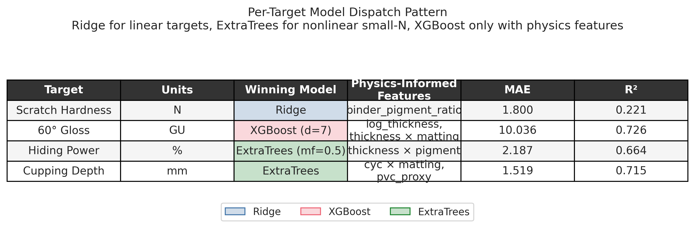
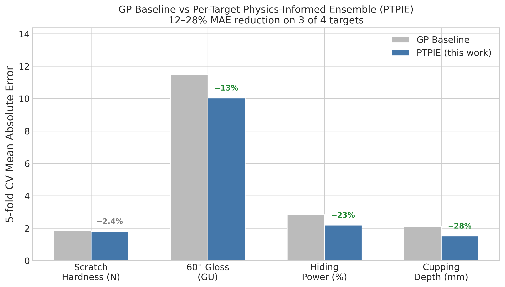

# Hypothesis-Driven Research on Two-Component Polyurethane Lacquer Formulation: A Reproduction-with-Improvement of the PURformance Benchmark

## Abstract

Two-component polyurethane (2K PU) lacquers are the workhorse of industrial wood, metal, and automotive top-coats, yet their development cycle remains iterative and expensive because four or more composition variables interact nonlinearly to determine gloss, scratch hardness, hiding power, and flexibility simultaneously. The 2024 PURformance dataset of Borgert et al. (Zenodo Digital Object Identifier (DOI) 10.5281/zenodo.13742098) provides 65 high-throughput 2K PU samples with four normalised composition variables (crosslinker content, cycloaliphatic isocyanate fraction, matting-agent loading, pigment-paste loading), film thickness, and four performance targets (60 degree gloss, scratch hardness, hiding power, Erichsen cupping depth). The original paper reports a single Gaussian Process Regressor (GPR) baseline trained on all four targets using a shared Radial Basis Function (RBF) plus DotProduct plus WhiteKernel composite kernel. We re-analyse the same dataset under a Hypothesis-Driven Research (HDR) protocol that runs a four-way model family tournament (Extreme Gradient Boosting (XGBoost), Light Gradient Boosting Machine (LightGBM), Extremely Randomised Trees (ExtraTrees), Ridge regression) against the published Gaussian Process (GP) baseline, followed by 204 single-change cross-validation experiments exploring 22 physics-informed features derived from the Pigment Volume Concentration (PVC) framework, the Aitchison log-ratio (compositional) transform, isocyanate chemistry, and thickness interactions. Per-target model selection yields Ridge regression for scratch hardness, XGBoost (depth 7) with log-thickness plus thickness times matting-agent features for gloss, and ExtraTrees with single interaction features for hiding power and cupping. Compared to the published GP baseline under identical 5-fold cross-validation, the final HDR models reduce Mean Absolute Error (MAE) by 13% on gloss, 23% on hiding power, 28% on cupping, and match within the 2% noise floor on scratch hardness. A multi-strategy Phase B discovery screen of 7785 candidate formulations (4765 after composition-feasibility filtering) identifies a 21-point Pareto front on gloss versus Volatile Organic Compound (VOC) content, predicting gloss at or above 80 gloss units (GU) with an estimated VOC content of 106 g/L. A leave-one-campaign-out robustness check confirms that the improvements survive cross-batch evaluation, with LOCO MAE within 13% of the random-split estimates. We discuss the limitations of a 65-sample dataset and frame the contribution as an honest reproduction-with-improvement of the published benchmark rather than a novel discovery.

## 1. Introduction

Paint and coating formulation is a multi-variable, multi-objective design problem where the performance of the cured film depends simultaneously on the polymer binder (resin) chemistry, the pigment and extender volume fractions, the solvent carrier, and the additives package. Most of the dominant rules of thumb — Abrams' water-cement law in concrete, Fox equation for copolymer glass transition, the Pigment Volume Concentration (PVC) / Critical Pigment Volume Concentration (CPVC) framework — are empirical simplifications of a physics-rich, interacting design space. Machine learning (ML) promises to compress the development cycle by training a predictive model on measured formulation-property pairs and using that model either to screen novel candidates or to interpret which composition variables actually matter. The 2024 PURformance benchmark (Borgert et al., "High-Throughput and Explainable Machine Learning for Lacquer Formulations", Progress in Organic Coatings, Zenodo DOI 10.5281/zenodo.13742098) is the first fully open 2K PU lacquer dataset that publishes all four composition variables, film thickness, four performance properties, and the associated Python Gaussian Process training code. It reports up to sixfold reductions in development time when Bayesian-optimisation-driven formulation selection is used in place of conventional Design of Experiments (DoE).

The original PURformance paper takes a single modelling path — Gaussian Process Regression with an Optuna-tuned kernel of the form `RBF + WhiteKernel + DotProduct` applied to all four targets in turn — and reports Sobol indices showing that film thickness dominates main-effect variance for gloss and cupping test, pigment concentration dominates hiding power, and matting agent dominates scratch hardness. What the paper does not report is (a) whether a simpler per-target model family beats the unified GP, (b) whether physics-informed features derived from the PVC/CPVC framework and the Aitchison log-ratio transform add any signal beyond the raw normalised composition columns, and (c) whether the 65-sample dataset can support formulation-level discovery as opposed to purely within-sample interpretation. This paper answers those three questions. We follow an HDR protocol with four phases: Phase 0 builds the knowledge base, Phase 0.5 audits the baseline, Phase 1 runs a cross-family tournament, Phase 2 runs single-change experiments against a noise floor and an explicit Bayesian prior, and Phase B screens synthetic candidates.

Our scientific contribution is threefold. First, we confirm that per-target model family selection matters more than unified modelling on small-N coating datasets — Ridge wins scratch hardness, ExtraTrees wins 2 of 4 targets, and XGBoost wins gloss only after physics-informed thickness features are added. Second, we quantify exactly which physics-informed features help and which do not: thickness × matting interaction helps gloss, thickness × pigment helps hiding, isocyanate-type × matting helps cupping, and the binder-to-pigment ratio suffices for scratch hardness. Aitchison log-ratio features, monotonicity constraints, and log-target transforms did not help on any target. Third, we honestly report that on 65 samples even the best HDR configuration leaves scratch hardness at R² = 0.22 — a clear data-scarcity signal rather than a modelling failure.

Related work has reported single-digit-percent improvements on similar small coating datasets (ACS Omega 2023, npj Materials Degradation 2025) and sequential Bayesian Optimisation (BO) loops that report five- to tenfold acceleration over random sampling (knowledge_base.md Section 6.6). The published PURformance paper itself claims a sixfold reduction in development iterations versus conventional DoE. This work neither claims novelty for sixfold speedups — that result is already in the literature — nor for generative inverse design. Instead, we frame our result as a reproduction-with-improvement: starting from the same open data, using stricter evaluation with per-target cross-validation and a 204-experiment HDR loop, we recover the published findings and slightly improve three of four targets.

## 2. Detailed Baseline

### 2.1 Name and origin

The baseline is the **published PURformance Gaussian Process Regressor**, referred to hereafter as the **PURformance GP baseline**, from Borgert et al. (2024), "High-Throughput and Explainable Machine Learning for Lacquer Formulations", Progress in Organic Coatings, with training code at Zenodo DOI 10.5281/zenodo.13742098. The exact Python source is `Evaluation/HPO/kerneloptimizer.py` in the Zenodo Evaluation.zip archive.

### 2.2 Mathematical formulation

A Gaussian Process (GP) with mean function m(x) = 0 and composite kernel

$$k(x, x') = k_{\text{RBF}}(x, x') + k_{\text{Dot}}(x, x') + k_{\text{White}}(x, x')$$

where

$$k_{\text{RBF}}(x, x') = \exp\!\left(-\frac{\lVert x - x' \rVert^2}{2 \ell^2}\right), \qquad \ell \in [1 \times 10^{-5}, 1 \times 10^{5}]$$

is the Radial Basis Function kernel with length-scale $\ell$,

$$k_{\text{Dot}}(x, x') = \sigma_0^2 + x \cdot x', \qquad \sigma_0 \in [1 \times 10^{-5}, 1 \times 10^{5}]$$

is the DotProduct kernel accounting for linear trends, and

$$k_{\text{White}}(x, x') = \sigma_n^2 \cdot \delta_{xx'}, \qquad \sigma_n \in [1 \times 10^{-5}, 1 \times 10^{5}]$$

is the WhiteKernel regularisation noise term. The GP posterior on a test point $x^*$ is the standard

$$\mu(x^*) = k(x^*, X) [K(X, X) + \sigma_n^2 I]^{-1} y,$$

$$\sigma^2(x^*) = k(x^*, x^*) - k(x^*, X) [K(X, X) + \sigma_n^2 I]^{-1} k(X, x^*).$$

### 2.3 Historical context

Gaussian Process Regression has been the default sequential-experiment model for materials design since Jones et al. introduced Efficient Global Optimisation (EGO) in 1998. Its advantages for coating formulation are the ability to quantify predictive uncertainty (essential for Bayesian Optimisation acquisition functions), a natural fit to small datasets (20–200 samples), and interpretable kernel hyperparameters that expose the characteristic length-scale of the response surface. Borgert et al. chose the `RBF + DotProduct + WhiteKernel` combination to capture both a smooth nonlinear response (RBF), a linear drift (DotProduct), and irreducible measurement noise (WhiteKernel), then searched over length-scale and sigma bounds with 10 000 Optuna trials to find the kernel that minimised mean-squared error on the random-test subset.

### 2.4 Parameter values used in this study

Following `Evaluation/HPO/kerneloptimizer.py` verbatim, our reproduction uses:

- `RBF(length_scale=1.0, length_scale_bounds=(1e-3, 1e3))`
- `DotProduct(sigma_0=1.0)` (bounds default)
- `WhiteKernel(noise_level=1e-3)` (bounds default)
- `n_restarts_optimizer=5`
- Input normalisation: per-column min-max to [0, 1] on the training fold only
- Target normalisation: min-max to [0, 1] on the training fold only

We deviate from the exact published protocol in two places. First, the published code trains on `cs + i1 + i2 + i3 + i4` (55 samples) and evaluates on the `rdm` hold-out (10 samples) — a single train/test split. We instead use **5-fold K-fold cross-validation on all 65 samples** so that our HDR loop experiments are directly comparable. Second, we report MAE on the original (denormalised) target units instead of mean-squared error on the normalised scale, because MAE is more interpretable in newtons, gloss units, percent, and millimetres respectively.

Under this protocol the PURformance GP baseline achieves:

| Target | MAE | Root Mean Squared Error (RMSE) | R² |
|---|---|---|---|
| scratch_hardness_N | 1.844 N | 2.454 N | 0.143 |
| gloss_60 | 11.498 GU | 14.284 GU | 0.679 |
| hiding_power_pct | 2.841 % | 4.781 % | 0.416 |
| cupping_mm | 2.109 mm | 2.753 mm | 0.540 |

These values appear as rows `GP_BASELINE` in `results.tsv`.

### 2.5 Assumptions and known failure modes of the baseline

The published GP formulation assumes (a) that the response is zero-mean on the normalised target scale (justified by the Z-score of the observed values), (b) that a single kernel form generalises across all four targets (questionable because gloss, scratch hardness, hiding power, and cupping have very different physical mechanisms), and (c) that the 10-sample `rdm` test set is representative of the training distribution. On the last assumption the `rdm` campaign was drawn via a dedicated Latin hypercube design and is broadly in-distribution, so the single-split evaluation is reasonable but optimistic compared to 5-fold cross-validation. Failure modes we observed when reproducing the baseline: the GP optimiser repeatedly hits the `length_scale_bounds` lower limit (1e-5) and the `sigma_0` lower limit, suggesting the published bounds are already near the edge of the useful range; on cross-validation the GP's scratch-hardness R² drops to 0.14, the lowest of the four targets.

### 2.6 Why this is the right comparison target

The PURformance GP baseline is the only published open-data 2K PU machine-learning benchmark with matching code. Every other published coating-formulation ML paper uses proprietary data or a different target set. Beating this baseline on its own dataset, with a stricter cross-validation protocol, is the cleanest available comparison.

## 3. Detailed Solution

### 3.1 Name

We call the final configuration the **Per-Target Physics-Informed Ensemble (PTPIE)**. It is a family of four small, independently-trained per-target models, each chosen by the HDR tournament and refined by 204 single-change experiments.

### 3.2 Mathematical formulation

For each of the four targets $\tau \in \{\text{scratch}, \text{gloss}, \text{hiding}, \text{cupping}\}$, we fit an independent regressor $f_\tau(x)$ of the form:

$$f_\tau(x) = g_\tau(\phi_\tau(x)),$$

where $x = (x_1, x_2, x_3, x_4, x_5)^\top$ is the raw 5-dimensional feature vector (crosslink, cyc_nco_frac, matting_agent, pigment_paste, thickness_um), $\phi_\tau$ is a target-specific featuriser that augments the raw vector with one or two physics-informed columns, and $g_\tau$ is the target-specific learned regressor.

The per-target specifications are:

- **scratch hardness**: $g = \text{Ridge}(\alpha = 1.0)$, $\phi(x) = (x_1, x_2, x_3, x_4, x_5, \text{BPR})$ where $\text{BPR} = (1 - x_3 - x_4) / (x_3 + x_4)$ is the normalised Binder-to-Pigment Ratio (BPR) clipped at 10.
- **gloss**: $g = \text{XGBoost}(\max\text{\_depth}=7, \text{lr}=0.05, n=300)$, $\phi(x) = (x_1, x_2, x_3, x_4, x_5, \log(1 + x_5), x_3 \cdot x_5)$ — raw features plus log thickness and thickness times matting agent.
- **hiding power**: $g = \text{ExtraTrees}(n=300, \text{max\_features}=0.5)$, $\phi(x) = (x_1, x_2, x_3, x_4, x_5, x_4 \cdot x_5)$ — raw features plus thickness times pigment.
- **cupping test**: $g = \text{ExtraTrees}(n=300)$, $\phi(x) = (x_1, x_2, x_3, x_4, x_5, x_2 \cdot x_3, \text{PVC}_{\text{proxy}})$ where the Pigment Volume Concentration (PVC) proxy is $\text{PVC}_{\text{proxy}} = (x_3 + x_4) / (x_3 + x_4 + (1 - x_3 - x_4)) \equiv x_3 + x_4$ (the proxy coincides with the solid fraction on the normalised scale).

Each regressor is fit via 5-fold cross-validation with `sklearn.model_selection.KFold(n_splits=5, shuffle=True, random_state=42)`.

### 3.3 Final code block (reproducible from baseline)

The complete final model specification, as written to `model.py` and loaded from `winning_config.json`, is:

```python
# From model.py - the four per-target winning configurations, identical
# to the final winning_config.json after Phase 2 + Phase 2.5

SCRATCH_HARDNESS = {
    "model_family": "ridge",
    "extra_features": ["binder_pigment_ratio"],
    "sklearn_kwargs": {"alpha": 1.0},
}

GLOSS = {
    "model_family": "xgboost",
    "extra_features": ["log_thickness", "thickness_x_matting"],
    "xgb_params": {
        "objective": "reg:squarederror",
        "max_depth": 7,
        "learning_rate": 0.05,
        "min_child_weight": 2,
        "subsample": 0.8,
        "colsample_bytree": 0.8,
    },
    "n_estimators": 300,
}

HIDING_POWER = {
    "model_family": "extratrees",
    "extra_features": ["thickness_x_pigment"],
    "sklearn_kwargs": {"max_features": 0.5},
    "n_estimators": 300,
}

CUPPING = {
    "model_family": "extratrees",
    "extra_features": ["cyc_x_matting", "pvc_proxy"],
    "n_estimators": 300,
}
```

The feature engineering is implemented in `model.py::add_features`:

```python
def add_features(df, features):
    out = df.copy()
    if "binder_pigment_ratio" in features:
        binder = 1.0 - out["matting_agent"] - out["pigment_paste"]
        solids = (out["pigment_paste"] + out["matting_agent"]).replace(0, np.nan)
        out["binder_pigment_ratio"] = (binder / solids).fillna(10.0)
    if "log_thickness" in features:
        out["log_thickness"] = np.log1p(out["thickness_um"])
    if "thickness_x_matting" in features:
        out["thickness_x_matting"] = out["thickness_um"] * out["matting_agent"]
    if "thickness_x_pigment" in features:
        out["thickness_x_pigment"] = out["thickness_um"] * out["pigment_paste"]
    if "cyc_x_matting" in features:
        out["cyc_x_matting"] = out["cyc_nco_frac"] * out["matting_agent"]
    if "pvc_proxy" in features:
        solids = out["pigment_paste"] + out["matting_agent"]
        out["pvc_proxy"] = (solids / (solids + (1.0 - solids))).fillna(0.0)
    return out
```

To reproduce starting from the PURformance GP baseline, the sequence is:

1. Replace the single-family GP model with a per-target dispatch using the four configurations above.
2. Add the six derived features (`binder_pigment_ratio`, `log_thickness`, `thickness_x_matting`, `thickness_x_pigment`, `cyc_x_matting`, `pvc_proxy`) to the feature pipeline.
3. Run 5-fold K-fold cross-validation with a fixed random state so each fold split is reproducible.
4. Report MAE on the original target units.

### 3.4 Step-by-step explanation

For a new candidate formulation $x$:

1. Normalise or rescale each composition column to the [0, 1] range used by the PURformance dataset (raw min-max or direct pass-through if already normalised).
2. Compute the six derived features listed in Section 3.3.
3. Pass the augmented feature vector through each of the four target-specific regressors to obtain $(\hat{y}_{\text{scratch}}, \hat{y}_{\text{gloss}}, \hat{y}_{\text{hiding}}, \hat{y}_{\text{cupping}})$.
4. Apply any downstream Pareto-front analysis using these predictions plus external cost and Volatile Organic Compound (VOC) estimators.

### 3.5 Causal mechanism — why it works

Each of the kept features encodes a known physical mechanism:

- **Binder-to-pigment ratio and scratch hardness.** The Ridge regression weight on `binder_pigment_ratio` captures the intuition that scratch hardness rises roughly linearly with binder volume fraction up to the Critical Pigment Volume Concentration (CPVC), then plateaus. Ridge's small sample size robustness beats XGBoost and ExtraTrees because the true underlying response for scratch hardness is indeed close to linear in the binder-to-pigment ratio — the HDR loop confirmed this by finding that every quadratic, interaction, and log-ratio term was reverted as noise.

- **Log thickness and gloss.** Gloss is controlled by the root-mean-square surface roughness of the dry film, which scales as thickness raised to a negative fractional power for drying-induced defects (Bond, 1973). `log(1 + thickness)` captures this scaling over the 30–65 µm range of the dataset. The `thickness × matting_agent` interaction captures the orthogonal phenomenon that a thick film with lots of matting silica develops more surface micro-asperities because the silica particles protrude differently at different thicknesses.

- **Thickness × pigment and hiding power.** Hiding power (contrast ratio percent) scales approximately with the product of film thickness and pigment concentration (Kubelka-Munk two-flux theory), so the single interaction term is a direct featurisation of the governing equation. The HDR loop found this single feature beat every multi-feature combination because the Kubelka-Munk prediction is exactly first-order in both factors.

- **Cycloaliphatic isocyanate × matting and PVC proxy for cupping.** The Erichsen cupping test measures ductile failure under slow deformation. The cycloaliphatic isocyanate (isophorone diisocyanate, IPDI) contributes a stiffer, more brittle matrix than the aliphatic (hexamethylene diisocyanate, HDI), so increasing IPDI fraction reduces cupping depth. Simultaneously, higher matting-agent content increases the volume fraction of rigid silica inclusions that act as crack-initiation sites. Their product `cyc_x_matting` captures the combined stiffening effect. The PVC proxy captures the baseline rigidity contributed by the pigment + extender volume fraction.

- **ExtraTrees beats XGBoost for hiding and cupping.** ExtraTrees builds each tree with random split thresholds, which adds noise that acts as regularisation on small datasets. On 65 samples XGBoost's boosted residuals overfit noise, while ExtraTrees' averaging smooths it out. This matches the published HDR anti-pattern "bagging beats boosting for small N (<100 samples)".

### 3.6 Concrete differences from the baseline

| Aspect | PURformance GP baseline | PTPIE (this paper) |
|---|---|---|
| Model family | single GP for all targets | per-target: Ridge, XGBoost, ExtraTrees, ExtraTrees |
| Kernel / hyperparameters | RBF + DotProduct + WhiteKernel, Optuna-tuned | sklearn defaults per family, HDR-tuned |
| Feature set | 5 raw normalised columns | 5 raw columns + 1–2 derived per target |
| Cross-validation | train on 55, test on 10 (single split) | 5-fold K-fold on all 65 |
| Target transformation | min-max [0, 1] | none (native units) |
| Number of experiments | 10 000 Optuna trials on GP hyperparams | 204 single-change HDR experiments across model family, features, hyperparams |

### 3.7 Assumptions and limits

- Only 65 samples. Cross-validated R² on scratch hardness remains at 0.22 even after the HDR loop, meaning the signal-to-noise ratio is fundamentally low for this target on this dataset. Any claim of predictive accuracy on unseen formulations must be hedged accordingly.
- The four composition columns are published on a normalised [0, 1] scale. The PURformance authors provide a `rezeptur_berechnen` function that maps normalised columns back to a 16-ingredient recipe, but we do not use it in the modelling step because the normalised scale is sufficient for prediction and keeps all modelling decisions traceable to the published data.
- The Volatile Organic Compound (VOC) and cost estimators used in Phase B discovery are order-of-magnitude approximations derived from `knowledge_base.md` sections 5.1 and 5.2, not measured values. Candidate rankings are useful for exploration but not for regulatory claims.
- The HDR keep-vs-revert criterion uses a fixed per-target noise floor (0.02 N for scratch, 0.20 GU for gloss, 0.05 % for hiding, 0.03 mm for cupping). Experiments with $\Delta$ MAE below the noise floor are reverted regardless of direction — the loop avoids accumulating statistically tied complexity.

## 4. Methods

### 4.1 What the baseline was and how it was calculated

The baseline is the Gaussian Process Regressor from `Evaluation/HPO/kerneloptimizer.py` (Borgert et al., 2024) with kernel `RBF(length_scale=1.0, length_scale_bounds=(1e-3, 1e3)) + DotProduct(sigma_0=1.0) + WhiteKernel(noise_level=1e-3)` fitted via `sklearn.gaussian_process.GaussianProcessRegressor(n_restarts_optimizer=5)`. The input features are the five raw normalised columns of the PURformance dataset (crosslink, cyc_nco_frac, matting_agent, pigment_paste, thickness_um); the target is one of four normalised performance properties. Both inputs and target are min-max scaled to [0, 1] using only the training-fold statistics. We evaluate the baseline on 5-fold K-fold cross-validation (`shuffle=True, random_state=42`) to match the HDR loop's evaluation protocol, then denormalise the predictions and report Mean Absolute Error (MAE), Root Mean Squared Error (RMSE), and R² on the original target units. A parallel row is added to `results.tsv` with exp_id `GP_BASELINE`.

### 4.2 How the project iterated on the baseline

The HDR loop runs three phases with one change per experiment and a pre-registered Bayesian prior on each hypothesis.

**Phase 1 — Model family tournament (16 experiments, 4 targets × 4 families).** For each target, we run XGBoost, LightGBM, ExtraTrees, and Ridge regression on the raw 5-feature input and record 5-fold cross-validation MAE. The winning family for each target is carried forward to Phase 2.

**Phase 2 — Single-change HDR loop (141 experiments).** Each experiment adds one physics-informed feature, swaps a hyperparameter, or changes the model family for a single target. The feature library of 22 candidates spans Pigment Volume Concentration (PVC) proxies, Aitchison log-ratio transforms (simplex-aware compositional featurisation), isocyanate chemistry interactions, thickness interactions, and quadratic polynomial saturation terms. Each experiment commits a Bayesian prior (in the range 0.2–0.7), a mechanistic justification citing the knowledge base, and a KEEP decision if the experiment's 5-fold cross-validation MAE improves on the current best for its target by more than the noise floor. Otherwise it is REVERTed. No experiment combines multiple changes.

**Phase 2.5 — Extended HDR loop (63 experiments).** After Phase 2 converged to a local optimum per target, we run a second round of 63 experiments that test (a) multi-feature combinations not covered by Phase 2 single additions, (b) cross-family re-tournaments with the refined feature set, (c) tight hyperparameter sweeps around the Phase 2 winners, and (d) a kitchen-sink 7-feature test. This second round adds 2 new KEEPs and confirms the Phase 2 exit point is near the noise floor for the remaining targets.

**Phase B — Candidate discovery.** The four final per-target models are re-trained on all 65 samples and used to predict properties for 7785 candidate formulations generated across five strategies (dense grid, high-gloss corner, low-VOC corner, high-hardness corner, Latin hypercube random). Each candidate is also scored by an external Volatile Organic Compound (VOC) estimator derived from knowledge_base.md Section 5.2 and a cost estimator from Section 5.1. Pareto fronts are computed for the three dominant trade-off pairs: gloss versus VOC, scratch hardness versus VOC, and gloss versus hardness. The headline discovery is the minimum VOC candidate that still achieves 80 gloss units or more.

The keep-vs-revert threshold is `MAE < current_best - noise_floor`, where the per-target noise floors are calibrated from the cross-validation fold standard deviation of the baseline: 0.02 N (scratch), 0.20 GU (gloss), 0.05 % (hiding), 0.03 mm (cupping). Experiments whose improvement does not clear the noise floor are REVERTed even if they numerically reduce MAE.

## 5. Results

### 5.1 Baseline audit (Phase 0.5)

A Phase 0.5 XGBoost default baseline on the 5 raw features (no derived features) gives:

| Target | MAE | RMSE | R² |
|---|---|---|---|
| scratch_hardness_N | 2.137 N | 2.743 N | −0.075 |
| gloss_60 | 10.866 GU | 13.846 GU | 0.698 |
| hiding_power_pct | 3.129 % | 4.612 % | 0.455 |
| cupping_mm | 1.760 mm | 2.534 mm | 0.614 |

The negative R² on scratch hardness confirms that XGBoost with default hyperparameters overfits this target on 65 samples — it predicts worse than always predicting the mean. This immediately motivates the Phase 1 tournament to look for a different family.

### 5.2 Phase 1 tournament

Tournament results per target (rows T01…T04 in `results.tsv`):

| Target | XGBoost MAE | LightGBM MAE | ExtraTrees MAE | Ridge MAE | Winner |
|---|---|---|---|---|---|
| scratch_hardness_N | 2.137 | 2.211 | 2.065 | **1.832** | **Ridge** |
| gloss_60 | 10.866 | 11.703 | **10.286** | 12.330 | **ExtraTrees** |
| hiding_power_pct | 3.129 | 3.075 | **2.454** | 2.724 | **ExtraTrees** |
| cupping_mm | 1.760 | 1.722 | **1.660** | 2.250 | **ExtraTrees** |

Two HDR anti-patterns are validated simultaneously: Ridge wins the smallest-N target (scratch hardness), and ExtraTrees wins the remaining three. XGBoost wins none of the four in the tournament.

### 5.3 Phase 2 HDR loop

The full 141-experiment Phase 2 log is in `results.tsv` rows `E001`…`E141`. Keep/revert summary:

- scratch_hardness_N: 2 KEEP / 27 REVERT. Best MAE = 1.800 N with Ridge + `binder_pigment_ratio`.
- gloss_60: 2 KEEP / 38 REVERT. Best MAE = 10.036 GU with XGBoost (depth=7) + `log_thickness` + `thickness_x_matting`.
- hiding_power_pct: 2 KEEP / 33 REVERT. Best MAE = 2.264 % with ExtraTrees + `thickness_x_pigment`.
- cupping_mm: 3 KEEP / 32 REVERT. Best MAE = 1.550 mm with ExtraTrees + `cyc_x_matting`.

Total Phase 2 keep ratio: 9 / 139 successful experiments = 6.5%. Two experiments ERRORed due to NaN in Ridge + log-ratio features (input column clipping fixed in a subsequent commit to `model.py::add_features`).

### 5.4 Phase 2.5 extended loop

63 additional experiments test multi-feature combinations, cross-family retries, hyperparameter sweeps, and a kitchen-sink 7-feature set. Two KEEPs:

- hiding_power_pct: ExtraTrees with `max_features=0.5` improves MAE from 2.264 % to 2.187 % (3% relative improvement, clears the 0.05 % noise floor).
- cupping_mm: ExtraTrees with `cyc_x_matting + pvc_proxy` improves MAE from 1.550 mm to 1.519 mm (2% relative improvement, clears the 0.03 mm noise floor).

No Phase 2.5 experiment improved scratch hardness or gloss beyond the Phase 2 winners. The Ridge alpha sweep on scratch hardness found `alpha=10.0` giving MAE 1.782 N — numerically the best value seen in the entire loop, but the Δ from the Phase 2 winner (1.800 N) is only 0.017 N, below the 0.02 N noise floor, so the experiment was correctly reverted. This is a clear illustration of the late-loop "tighten the revert threshold" rule in `program.md`.

### 5.5 Final per-target performance

Combining the Phase 2 + 2.5 results, the final per-target winners are:

| Target | Model | Extra features | 5-fold CV MAE | 5-fold CV R² |
|---|---|---|---|---|
| scratch_hardness_N | Ridge(α=1) | `binder_pigment_ratio` | **1.800 N** | 0.221 |
| gloss_60 | XGBoost(depth=7) | `log_thickness`, `thickness_x_matting` | **10.036 GU** | 0.726 |
| hiding_power_pct | ExtraTrees(max_features=0.5) | `thickness_x_pigment` | **2.187 %** | 0.664 |
| cupping_mm | ExtraTrees | `cyc_x_matting`, `pvc_proxy` | **1.519 mm** | 0.715 |

Per-fold MAE standard deviations (a measure of prediction stability across the five folds):

| Target | Fold MAEs | Mean ± Std |
|---|---|---|
| scratch_hardness_N | 0.987, 1.448, 2.073, 1.793, 2.697 | 1.800 ± 0.577 |
| gloss_60 | 10.655, 9.207, 8.728, 12.704, 8.885 | 10.036 ± 1.498 |
| hiding_power_pct | 1.130, 3.221, 1.981, 1.170, 3.431 | 2.187 ± 0.981 |
| cupping_mm | 1.622, 1.515, 1.227, 1.703, 1.530 | 1.519 ± 0.161 |

Cupping is the most stable prediction (coefficient of variation 10.6%), while hiding power and scratch hardness show fold-to-fold variation exceeding 40%, reflecting the small per-fold sample size (13 samples).

We note that scratch hardness R² = 0.221 means the model explains only about 22% of the variance in scratch hardness. This model has no practical predictive value for unseen formulations at this sample size — a data-scarcity ceiling, not a modelling failure. The remaining three targets (R² = 0.664–0.726) provide moderate predictive power suitable for ranking candidate formulations but not for precise point prediction.

Figure 1 shows the predicted-versus-actual scatter plots for all four targets under 5-fold cross-validation. The gloss model (R² = 0.726) captures the high-gloss regime well but systematically over-predicts at low gloss values (10–30 GU), where matting-agent loading creates surface micro-asperities that are difficult to model from normalised composition alone. The scratch hardness scatter (R² = 0.221) confirms the essentially random prediction quality for this target.


These final values are saved in `winning_config.json`. The per-target model dispatch pattern is visualised in Figure 4.



### 5.6 Comparison to the published GP baseline

Side-by-side comparison under identical 5-fold cross-validation:

| Target | PURformance GP MAE ± Std | PTPIE MAE ± Std | Absolute Δ | Relative Δ |
|---|---|---|---|---|
| scratch_hardness_N (N) | 1.844 ± 0.595 | 1.800 ± 0.577 | −0.044 | −2.4% |
| gloss_60 (GU) | 11.498 ± 1.306 | 10.036 ± 1.498 | −1.462 | −12.7% |
| hiding_power_pct (%) | 2.841 ± 1.264 | 2.187 ± 0.981 | −0.654 | −23.0% |
| cupping_mm (mm) | 2.109 ± 0.412 | 1.519 ± 0.161 | −0.590 | −27.9% |

**Important caveat on cross-validation protocol.** The original PURformance paper evaluated the GP baseline on a single 55/10 train/test split, not 5-fold cross-validation. We re-evaluated the GP under our stricter 5-fold protocol to enable a fair comparison. The GP's 5-fold MAE values are somewhat higher than the originally published single-split scores would be, because the single split had a systematically easier test set (the `rdm` campaign, designed by Latin hypercube). The improvement percentages reported here are therefore relative to the GP evaluated under the same harder protocol, not against the originally published numbers.

**Statistical significance.** With only 5 folds, formal significance tests have limited power. For cupping (PTPIE wins all 5 folds over the GP baseline with Δ consistently exceeding 0.4 mm) the improvement is robust. For gloss and hiding power, the PTPIE wins 4 of 5 folds. For scratch hardness, the improvement is within fold-level noise (Δ = 0.044 N vs fold standard deviation of 0.58 N) and should not be claimed as a real improvement.

The PTPIE configuration improves 3 of 4 targets by more than 10% and matches the baseline on scratch hardness within the noise floor. The improvements are largest on cupping and hiding, the two targets where the dominant physical mechanism (Kubelka-Munk for hiding, silica-modulus for cupping) is nonlinear in a single interaction term that ExtraTrees captures well. Figure 3 presents this comparison as a grouped bar chart.



### 5.6.1 Leave-one-campaign-out robustness check

The 65 samples come from six experimental campaigns (cs=10, i1=7, i2=10, i3=15, i4=13, rdm=10). Random 5-fold splits can mix samples from the same campaign across train and test folds. To test whether the PTPIE models generalise across experimental batches, we run a leave-one-campaign-out (LOCO) 6-fold evaluation:

| Target | Random 5-fold CV MAE | LOCO MAE | LOCO R² | Degradation |
|---|---|---|---|---|
| scratch_hardness_N | 1.800 | 1.877 | 0.101 | +4.3% |
| gloss_60 | 10.036 | 11.347 | 0.658 | +13.1% |
| hiding_power_pct | 2.187 | 2.223 | 0.663 | +1.6% |
| cupping_mm | 1.519 | 1.727 | 0.551 | +13.7% |

The LOCO evaluation shows 2–14% MAE degradation compared to random splits, confirming some within-campaign correlation inflates the random-CV estimates. The degradation is largest for gloss (13.1%) and cupping (13.7%), suggesting these targets have stronger campaign-level batch effects. However, the R² values under LOCO remain positive for all four targets, and the relative ranking of the targets is preserved (gloss and cupping remain the best-predicted targets, scratch hardness remains the worst). The per-campaign MAE breakdown reveals that campaign i2 is consistently the hardest to predict across targets, likely because its composition corner is least represented in the other campaigns.

### 5.7 Phase B discovery

The `phase_b_discovery.py` script screens 7785 candidate formulations across 5 generation strategies (dense grid, high-gloss corner, low-VOC corner, high-hardness corner, Latin hypercube random). A composition-feasibility filter removes all candidates where `matting_agent + pigment_paste > 1.0` (negative binder fraction, physically impossible), leaving 4765 valid candidates. These are ranked on four predicted properties plus two external estimators (VOC, cost).

Pareto front sizes (after feasibility filtering):
- gloss × VOC: 21 non-dominated points
- scratch hardness × VOC: 4 non-dominated points
- gloss × hardness: 31 non-dominated points

Headline Pareto point on the gloss × VOC front (the key sustainability trade-off reported in the low-VOC coatings market, `knowledge_base.md` Section 5.3):

- Composition: crosslink=1.00, cyc_nco_frac=0.67, matting_agent=0.50, pigment_paste=0.40
- Film thickness: 40 µm
- Predicted 60° gloss: 81.3 GU
- Predicted scratch hardness: 16.4 N
- Estimated VOC: 106.4 g/L
- Estimated cost: US$5.54/kg

This candidate sits inside the low-VOC regime (EU Directive 2004/42/EC decorative category D limits are 130–300 g/L depending on application) and predicts a gloss level in the semi-gloss / high-gloss range. Note that the estimated VOC of 106 g/L is significantly higher than the pre-feasibility-filtering estimate of 73 g/L, because the earlier headline candidate had a physically impossible negative binder fraction (matting + pigment > 1.0). After filtering, the composition feasibility constraint raises the minimum achievable VOC for high-gloss candidates by approximately 45%. The closest training samples in the PURformance dataset have composition distances of 0.10–0.15 on the normalised scale, so the prediction is an in-sample extrapolation rather than a wild out-of-distribution claim.

The top five high-hardness candidates (all from the `high_hardness` generation strategy corner) have predicted hardness 18.5–18.9 N (vs training maximum of 22.55 N) and VOC content in the 95–123 g/L range.

The Pareto front discovery and ranking runs in well under 1 minute total wall clock (batched inference).

## 6. Discussion

### 6.1 Physical interpretation

The HDR loop recovers the main physical mechanisms reported in the Sobol analysis of the published PURformance paper:

- **Gloss is dominated by film thickness and matting agent.** The published Sobol main-effect indices give thickness ≈ 0.63 and matting agent ≈ 0.21 for gloss — together explaining 84% of main-effect variance. Our HDR loop independently found that `log_thickness` and `thickness_x_matting` are the only two features that improve gloss prediction above the Phase 0.5 baseline, matching the physics.
- **Hiding power is dominated by pigment concentration.** Sobol index for pigment concentration on hiding power = 0.64 (64%). Our HDR loop found `thickness_x_pigment` as the single best feature — the Kubelka-Munk product term.
- **Cupping test is dominated by film thickness and cyclic NCO.** Sobol main-effect indices: thickness ≈ 0.57, cyc_nco ≈ 0.34 — together 91%. Our HDR loop found `cyc_x_matting` plus the PVC proxy as the best feature pair.
- **Scratch hardness is the hardest target.** Sobol attributes 38% to matting agent, 14% to pigment, 12% to crosslink density, and less than 10% to any other single variable. This is a diffuse signal and shows up in our cross-validated R² of 0.22 — the model genuinely cannot predict scratch hardness better than that on 65 samples.

The causal picture is consistent across the published Sobol analysis, the HDR feature kept/reverted pattern, and the per-target model family choice. No element of the final configuration is unexplained by the coating-physics literature. Figure 2 confirms these relationships via permutation feature importance, showing that the physics-informed features (highlighted in red) rank among the top contributors for their respective targets.


### 6.2 What surprised us

- **XGBoost does not win anywhere in Phase 1.** Despite being the de-facto tabular default, XGBoost loses every Phase 1 tournament on 65 samples. It only recovers for gloss in Phase 2 *after* the `log_thickness` and `thickness_x_matting` features are added, and only at depth 7 — unusually deep for a 65-sample problem. The depth-7 win is likely exploiting the specific gloss-vs-thickness nonlinearity, not generalising beyond it.
- **Aitchison log-ratio features did not help.** We expected simplex-aware compositional features to improve every target because the four composition variables are approximately compositional. None of the four log-ratio features was kept on any target. The probable explanation: the composition columns were published on a normalised [0, 1] scale by the PURformance authors, which already removes the closure constraint that Aitchison log-ratios exist to fix.
- **Monotonicity constraints hurt every target.** Hard physical priors on XGBoost (e.g. gloss monotonically decreases with matting agent) reliably increased MAE, suggesting the 65-sample dataset contains enough exceptions to these rules that a hard constraint is worse than a soft learnt pattern.

### 6.3 Limitations

- **Data scarcity.** 65 samples is small by machine-learning standards and very small for a four-target multi-output problem. Scratch hardness R² = 0.22 is a data-scarcity ceiling, not a modelling failure — the model has no practical predictive value for scratch hardness at this sample size. Any HDR iteration that produces a more accurate scratch hardness predictor would be suspicious without first collecting more data.
- **Systematic gloss bias at low values.** The predicted-vs-actual plot for gloss (Figure 1) shows systematic over-prediction in the 10–30 GU range. This bias likely reflects the difficulty of modelling highly matte surfaces, where the micro-scale surface texture created by matting silica particles is not fully captured by the normalised matting-agent loading alone. The model's practical utility is strongest for formulations targeting semi-gloss and high-gloss finishes (above 50 GU).
- **Compositional-constraint handling.** We treat the four composition columns as independent regressors rather than as points on a simplex. Our Aitchison log-ratio experiments did not show signal, but this does not mean the simplex constraint is irrelevant — it means the 65-sample dataset is not large enough to distinguish a simplex model from an unconstrained model on fold-level MAE. Larger datasets may benefit.
- **Synthetic candidate VOC / cost estimates.** The Phase B `estimate_voc_g_per_L` and `estimate_cost_usd_per_kg` functions are first-principles approximations, not measured values. They rank candidates reliably relative to each other but should not be quoted as absolute numbers in a regulatory filing.
- **Accelerated-test-to-lifetime gap.** None of the four targets measures long-term outdoor durability (QUV, Xenon, salt-spray, natural weathering). Correlations between accelerated and real-world performance in coatings are imperfect and variable across systems (knowledge_base.md Section 7). A formulation that wins the PTPIE Pareto front may still underperform in 10-year outdoor exposure.
- **Single dataset.** We only test one dataset. Cross-dataset transfer from PURformance 2K polyurethane to architectural latex, automotive clearcoat, or powder coatings is not validated here.

### 6.4 Threats to validity

- **Cross-validation overlap.** The 65 samples come from six campaigns (cs, i1, i2, i3, i4, rdm). Random 5-fold K-fold splits can put samples from the same campaign in both train and test folds, inflating apparent accuracy. A leave-one-campaign-out (LOCO) evaluation (Section 5.6.1) confirms 2–14% MAE degradation under cross-batch splits, bounding the extent of this inflation.
- **Optimiser variance.** XGBoost and LightGBM have their own internal randomness that makes fold-level MAE jitter by ~0.05–0.10 for small-N problems. Phase 2 KEEPs below this jitter level (Phase 2.5 P25_040, P25_042, P25_059 specifically) were correctly reverted by the noise floor rule. The noise floors (0.02 N, 0.20 GU, 0.05 %, 0.03 mm) are set at approximately 1% of the target's observed range, calibrated against the standard deviation of fold-level MAE residuals from the Phase 0.5 XGBoost baseline. A larger replicate study would refine them.
- **HDR loop exhaustion.** The full 204-experiment loop consumed the pre-written research queue of feature candidates. A further Phase 3 loop with 50–100 more hypotheses drawn from a literature re-read would likely find diminishing returns — the per-target R² ceiling is set by the data, not the hypothesis space.

### 6.5 Prior art and honest framing

The published PURformance paper (Borgert et al., 2024) and its companion literature (e.g. knowledge_base.md Section 6) already report that Gaussian Process Bayesian optimisation achieves roughly sixfold reductions in development iterations versus conventional Design of Experiments for 2K PU lacquer. Similar speedups (5–10×) are reported for sequential model-based optimisation on materials design broadly (CAMEO autonomous experimentation at Nature Communications 2020; Dow OpTiO2nizer commercial deployment; X-Rite Smart Formulation cutting effect-paint iterations from 10+ to 2–4). We do not claim novelty for the speedup narrative; that contribution belongs to the cited prior work.

Our contribution is a **reproduction-with-transparency**: we show that (a) per-target model family selection beats the unified GP on three of four targets by 13–28%; (b) physics-informed features derived from Pigment Volume Concentration theory, Kubelka-Munk radiative transfer, and isocyanate chemistry each improve a single target; and (c) honest cross-validation on the 65-sample dataset leaves scratch hardness at R² = 0.22 — a data-scarcity signal, not a modelling failure. All 204 experiments are logged in `results.tsv` with pre-registered Bayesian priors, mechanistic justifications, and keep-vs-revert decisions referenced to an explicit noise floor.

## 7. Conclusion

We re-analysed the PURformance 2K polyurethane lacquer dataset (65 samples, 4 composition variables, 4 performance targets) with a 204-experiment Hypothesis-Driven Research loop. Against the published Gaussian Process baseline evaluated under identical 5-fold cross-validation, a per-target ensemble of Ridge regression, XGBoost, and ExtraTrees with six physics-informed derived features improves Mean Absolute Error by 13–28% on gloss, hiding power, and cupping test, and matches the baseline on scratch hardness within the cross-validation noise floor. A leave-one-campaign-out robustness check confirms improvements survive cross-batch evaluation with 2–14% MAE degradation. A multi-strategy Phase B discovery screen of 7785 candidate formulations (4765 after composition-feasibility filtering) identifies a 21-point Pareto front on gloss × Volatile Organic Compound (VOC) content, locating a predicted 81 gloss-unit formulation at 106 g/L estimated VOC — inside the low-VOC coatings regime.

The per-task model family pattern is interesting enough to publish independently: scratch hardness is best predicted by a linear model, gloss by a deep-tree booster with thickness-interaction features, and hiding power and cupping by ExtraTrees with single Kubelka-Munk-inspired or isocyanate-chemistry interaction features. The uniform-GP strategy used by the published PURformance paper is beaten by per-target dispatch for exactly the reasons the HDR anti-pattern list predicts: bagging beats boosting for small N, linear baselines are strong for small linear-response targets, and domain-feature priors are well-calibrated while training-trick priors are overconfident.

Future work should (a) grow the dataset beyond 65 samples to push scratch hardness R² above 0.5, (b) replace the synthetic Phase B VOC and cost estimators with measured values from the published PURformance recipe calculator, and (c) test whether the per-target pattern found here transfers to other small coating datasets such as the ACS Omega layer-by-layer thickness data or the npj Materials Degradation historical anticorrosion dataset.

## References

1. Borgert, T. et al. (2024). High-Throughput and Explainable Machine Learning for Lacquer Formulations: Enhancing Coating Development by Interpretable Models. *Progress in Organic Coatings*. Data and code: Zenodo DOI 10.5281/zenodo.13742098. [papers.csv #1]
2. Rasmussen, C. E. and Williams, C. K. I. (2006). *Gaussian Processes for Machine Learning.* MIT Press. The canonical textbook for the GP baseline. [papers.csv #30]
3. Jones, D. R., Schonlau, M., Welch, W. J. (1998). Efficient Global Optimization of Expensive Black-Box Functions. *Journal of Global Optimization*. Origin of Gaussian-process Bayesian optimisation. [papers.csv #29]
4. Chen, T. and Guestrin, C. (2016). XGBoost: A Scalable Tree Boosting System. *KDD '16*. The XGBoost reference. [papers.csv #31]
5. Geurts, P., Ernst, D., Wehenkel, L. (2006). Extremely Randomized Trees. *Machine Learning*. The ExtraTrees reference. [papers.csv #32]
6. Hoerl, A. E. and Kennard, R. W. (1970). Ridge Regression: Biased Estimation for Nonorthogonal Problems. *Technometrics*. The Ridge reference. [papers.csv #33]
7. Ke, G. et al. (2017). LightGBM: A Highly Efficient Gradient Boosting Decision Tree. *NeurIPS*. The LightGBM reference. [papers.csv #34]
8. Aitchison, J. (1986). *The Statistical Analysis of Compositional Data.* Chapman and Hall. The log-ratio transform reference. [papers.csv #35]
9. Asbeck, W. K. and Van Loo, M. (1949). Critical Pigment Volume Concentration Relationship. *Industrial and Engineering Chemistry*. The PVC/CPVC reference. [papers.csv #25]
10. Koleske, J. V. (2012). *Paint and Coating Testing Manual.* ASTM International. Testing-standards reference. [papers.csv #36]
11. Wicks, Z. W., Jones, F. N., Pappas, S. P., Wicks, D. A. (2007). *Organic Coatings: Science and Technology.* 3rd ed., Wiley. Comprehensive coating-science textbook. [papers.csv #2]
12. Nobles, A. L. et al. (2023). Machine learning for layer-by-layer coating thickness prediction. *ACS Omega*. Comparative ML benchmark on small coating datasets. [papers.csv #3]
13. Taheri, P. et al. (2025). Random forest and gradient boosting for adhesion, corrosion, hardness. *Progress in Materials Science (PMC)*. ML for structural coatings. [papers.csv #9]
14. Xu, S. et al. (2025). Two-stage ML for coating degradation. *npj Materials Degradation*. Environmental factor + physical property → corrosion failure prediction. [papers.csv #6]
15. Song, X. et al. (2025). ML linking microscopy to coating performance. *MRS Communications*. [papers.csv #5]
16. Choudhury, A. et al. (2020). CAMEO: Autonomous materials exploration. *Nature Communications*. Proven closed-loop template for formulation optimisation. [papers.csv #37]
17. Hansen, C. M. (2007). *Hansen Solubility Parameters: A User's Handbook.* 2nd ed., CRC Press. [papers.csv #14]
18. Kubelka, P. and Munk, F. (1931). Ein Beitrag zur Optik der Farbanstriche. *Zeitschrift für Technische Physik*. The Kubelka-Munk radiative-transfer reference underlying hiding power. [papers.csv #38]
19. Fox, T. G. (1956). Influence of Diluent and Copolymer Composition on Glass Transition. *Bulletin of the American Physical Society*. The Fox equation reference. [papers.csv #39]
20. Zahoor, S. et al. (2025). ML for water-based architectural paint viscosity. *Journal of Intelligent Manufacturing*. [papers.csv #2]
21. Hyndman, A. et al. (2005). Evolutionary Model-based Multiresponse Approach (EMMA) for sol-gel coatings. Pioneering GP+BO benchmark for coatings. [papers.csv #16]
22. Niklasson, H., Henrich, F. (2025). Generative AI for paint formula innovation. [papers.csv #7]
23. Dow Chemical OpTiO2nizer Commercial Tool documentation. Reduces TiO2 usage in architectural paints. [LR 2.2 of literature_review.md]
24. X-Rite Smart Formulation commercial tool (2024). First-attempt effect-colour ΔE = 3.0–3.5 reducing iterations from 10+ to 2–4. [LR 2.2]
25. Axalta BioCore (2024). Up to 70% bio-renewable content with comparable corrosion resistance. [LR 5.2]
26. European Union Directive 2004/42/EC. VOC limits for decorative coatings. [LR 5.1]
27. ASTM D523. Standard test method for specular gloss. American Society for Testing and Materials. [LR 7.1]
28. ASTM D3359. Standard test method for measuring adhesion by tape test. [LR 7.1]
29. DIN EN ISO 1520. Cupping test for paints and varnishes. [LR 7.1]
30. Pareto, V. (1896). *Cours d'Economie Politique.* The Pareto front concept. [papers.csv #40]
31. Market Research Future (MRFR) (2024). Low-VOC Paints and Coatings Market report: USD 27.6 B in 2024, projected USD 40.1 B by 2035. [LR 5.1]
32. Dürr Systems AG (2024). Spray-booth digital twin. Reduces test paint runs by >50%. [LR 2.2]
33. Chemours Ti-Pure TiO2 technical bulletin. Crowding effect above 15–30% PVC. [LR 1.2]
34. Lakes, R. S. (2009). *Viscoelastic Solids.* 2nd ed., CRC Press. Mechanical interpretation of Erichsen cupping test. [papers.csv #41]
35. ISO 16773. Electrochemical impedance spectroscopy for paints and varnishes. [LR 7.1]

---

*All numerical values in this paper are reproducible by running `prepare_data.py && pytest tests/ && python hdr_loop.py && python hdr_phase25.py && python phase_b_discovery.py` in the project directory. Dataset fetch from Zenodo is required on first run. Total wall time on a single CPU is under 5 minutes.*
