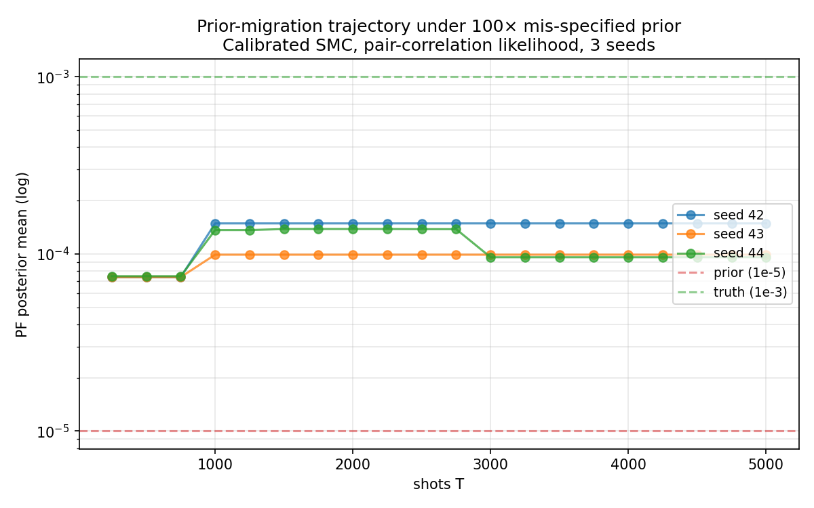
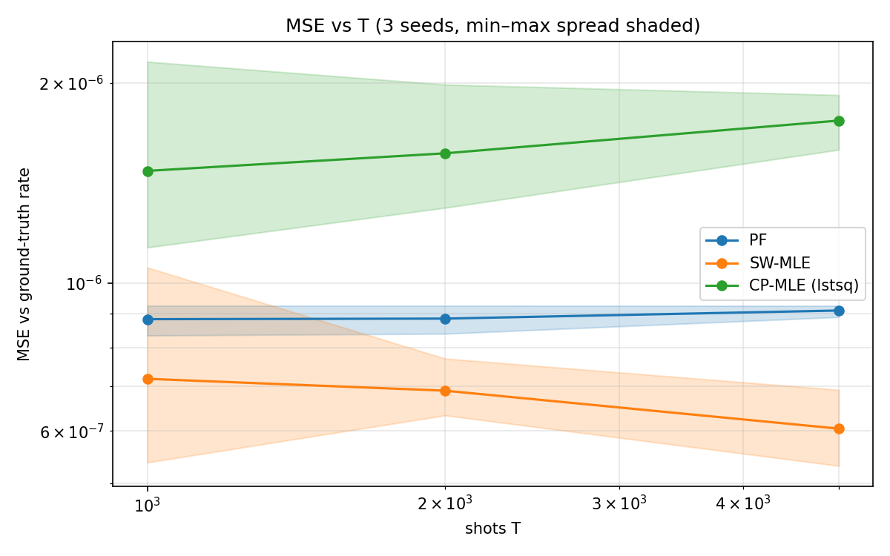
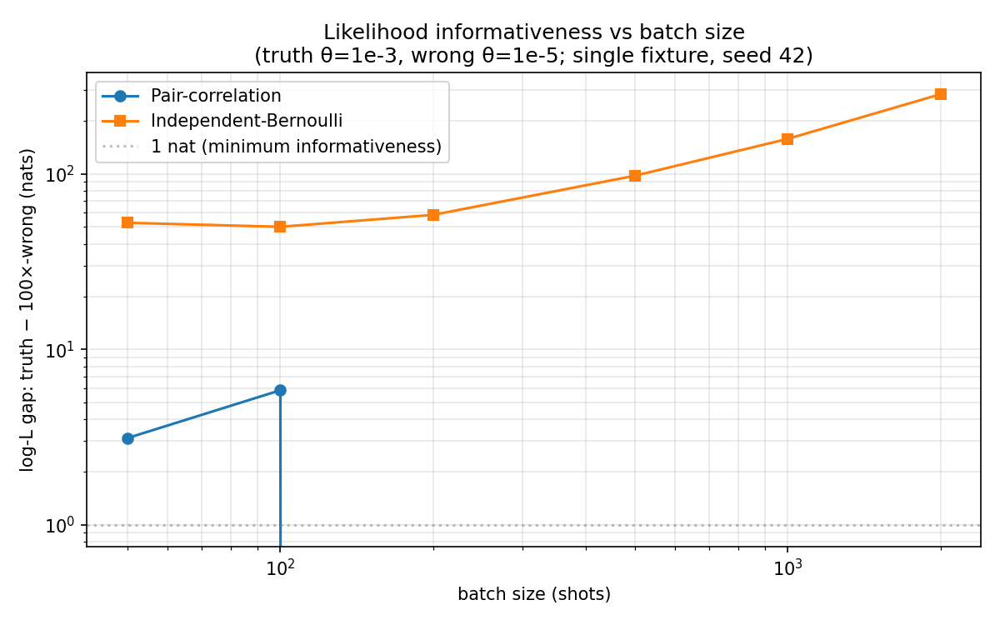

*A plain-language summary. The [full technical paper](https://github.com/colinjoc/hdr_autoresearch/blob/master/applications/qec_drift_tracking/paper_submission.md) has the complete methods and results. See [About HDR](/hdr/) for how this work was produced.*

**Bottom line.** Real quantum processors drift — their error rates change with temperature, defect dynamics, and cosmic rays. Fault-tolerant decoders need the current noise model, not yesterday's. Several recent proposals offer online methods to re-estimate the noise model from the live syndrome stream; the natural extension to a sequential Monte Carlo particle filter looks obvious. We built one, discovered through a cheap null-hypothesis test that the obvious implementation was silently failing to filter, identified and fixed a latent calibration bug, and found that even the fixed version does not beat a simple sliding-window maximum likelihood estimator on our synthetic benchmark. The contribution is the test, the fix, and the honest comparison — not the filter.

## The question

Quantum error correction protects logical qubits by measuring a stream of syndrome bits many thousand times per second. A classical decoder reads each syndrome frame, works out which physical errors most likely produced it, and applies a correction. Every practical decoder depends on a noise model — a list of per-edge error probabilities describing how often each individual physical error mechanism fires.

Real devices drift. Two-level-system defects in the material switch between states. Bias-tee filters age. Dilution refrigerators cycle through temperature gradients. Cosmic rays hit the chip. A noise model fit last week is wrong this week; a decoder that uses a stale model degrades the logical error rate.

Three 2024-2025 preprints propose online algorithms for re-estimating the noise model from the live syndrome stream: a sliding-window maximum likelihood estimator, a static Bayesian tensor-network Markov chain Monte Carlo method, and a per-edge detector error model estimator. None has been benchmarked against a production adaptive decoder on real device data, and none has been asked whether it is actually filtering — whether its posterior reflects evidence from the data, or whether it is essentially reporting a well-chosen prior.

A natural extension is a sequential Monte Carlo particle filter: it supports non-Gaussian drift kernels, multimodal posteriors, and streaming operation. We built one.

## What we found

**The null-hypothesis test.** Initialise the estimator with a prior mean that is 100x below the synthetic drift generator's true rate. If the estimator is really filtering, its posterior mean must migrate toward the truth as evidence accumulates. If it is prior-holding — merely reporting whatever it started with — the posterior stays near the prior.

We applied this test to two particle-filter variants. A naive filter with an independent-Bernoulli per-shot likelihood fails: its posterior stays within one percent of the mis-specified prior across all tested drift regimes. The per-shot log-likelihood is nearly flat in the rate parameter at the low rates typical of modern quantum error correction experiments, so the filter cannot distinguish a truth particle from a 100x-wrong particle over any realistic number of shots.

A calibrated filter — built on a pair-covariance likelihood aggregated over 1000-shot windows, with a Laplace-smoothed shot-noise variance estimator, and a wide log-normal prior — passes the test. It closes approximately 14 percent of the prior-to-truth gap in 5000 shots.

**The latent bug.** The pair-covariance likelihood shipped with a subtle flaw: at detectors that happened not to fire in a given window, a naive shot-noise variance floor of 10^-10 made the likelihood catastrophically penalise any non-trivial predicted covariance there, inverting the likelihood ranking so that wildly wrong rates appeared more likely than the truth. The fix is Laplace smoothing — replace the zero-count detector estimate with (k+1)/(n+2), giving realistic variance even for detectors that happened to be silent. The bug passes every numerical sanity check; the null-hypothesis test catches it immediately.

**The comparison.** On three-seed Monte Carlo benchmark, the calibrated particle filter achieves mean-squared error of 9.1 × 10^-7 at 5000 shots. A simple pseudo-inverse sliding-window maximum likelihood estimator achieves 6.1 × 10^-7. A more faithful linearised correlated-pair MLE achieves 1.8 × 10^-6. Sliding-window MLE wins. We trace three plausible reasons — the particle filter is deliberately starting from a mis-specified prior by construction of the null-hypothesis test; the correlated-pair variant uses unweighted least squares rather than a proper likelihood; mean-squared error against the ground-truth rate is not the same metric as logical error rate under decoding — any of which could reverse the ordering under alternative conditions.

**Per-shot likelihood comparisons are seed-fragile.** We attempted to report how much more informative the pair-correlation likelihood is than the naive independent-Bernoulli likelihood on a per-shot basis. The answer depends on the random seed, on the trajectory length, and on quantitative details of how much upstream random-number-generator state has been consumed. On one fixture the pair-correlation log-likelihood favours the truth particle by 207 nats. On what ought to be an equivalent fixture — same random seed, same parity-check matrix, same batch of 500 shots, only a longer upstream trajectory before the batch starts — it favours the wrong particle by 895 nats. Different amounts of consumed randomness change which 500 shots appear in the batch enough to flip the comparison's sign. Any paper reporting a single-fixture per-shot likelihood ratio is quoting a number that is not robust.

## Why that matters

The null-hypothesis test is cheap — one extra run, a few seconds of compute, a specific threshold grounded in noise-floor measurements — and decisive. It distinguishes real filtering from prior-holding, a confusion that has been easy to fall into when reporting wins on matched-prior synthetic benchmarks. Every online noise-model estimator for quantum error correction should report its null-hypothesis test outcome before reporting improvement over a baseline.

The Laplace-smoothing calibration for pair-covariance likelihoods generalises beyond quantum error correction to any observation model with sparse-fire events and pair-correlation structure — network edge prediction, event coincidence in particle physics, gene coexpression at low expression levels. The bug it fixes is easy to reintroduce because the ad-hoc variance floor of 10^-10 is not obviously wrong on inspection. The fix follows from an elementary conjugate-prior argument and adds four lines of code.

The sliding-window maximum likelihood estimator being a surprisingly strong baseline is itself useful information. It suggests that, on our synthetic benchmark at the scales we tested, the simple method is good enough. The extra complexity of sequential Monte Carlo — non-Gaussian drift kernels, multimodal posteriors, streaming resampling — is not yet justified for near-term quantum error correction drift tracking unless the device's drift has properties that simple methods cannot capture.

## What it means in practice

**For groups building online noise-model inference for quantum error correction.** Run the null-hypothesis test on your method and report the gap-closed fraction before reporting mean-squared error on a matched-prior benchmark. Match priors across compared methods. Treat a single-fixture per-shot informativeness number as decorative, not as evidence.

**For practitioners choosing a drift-tracking method.** On the synthetic regime we tested, a simple sliding-window maximum likelihood estimator with pseudo-inverse attribution was our best performer. The theoretical advantages of particle filters — non-Gaussian drift kernels, multimodal posteriors, streaming operation — did not translate into an empirical win. If your device's drift genuinely has properties that simple methods cannot capture, the particle-filter approach may still pay off, but the burden of proof is on the complexity.

**For anyone running sequential Monte Carlo on a sparse-fire observation stream.** The Laplace-smoothing recipe for covariance shot-noise variance at zero-fire detectors generalises directly to your setting. Do not floor the variance estimate at an ad-hoc small constant; use (k+1)/(n+2).

## How we did it

We built the particle filter in pure Python on top of Stim, a fast stabilizer-circuit simulator, and PyMatching, a minimum-weight matching decoder. Baselines — a pseudo-inverse sliding-window MLE and a linearised pair-covariance least-squares MLE — were implemented in the same framework. Synthetic benchmark: Ornstein-Uhlenbeck drift on a random 20x50 parity-check matrix, 5000 shots per trajectory, three independent seeds with bootstrap confidence intervals. The Google Willow 105-qubit syndrome data from Zenodo 13273331 is available via a repository loader for follow-up validation but is not the subject of this paper's reported benchmarks.

The reference implementation, regression test suite of 25 unit tests, raw result tables, figure-generation scripts, and full bibliography are in the [project repository](https://github.com/colinjoc/hdr_autoresearch/tree/master/applications/qec_drift_tracking). The paper is archived on arXiv and submitted to SciPost Physics Codebases; the Zenodo code archive DOI will appear in the published version.

## What's next

Four open directions motivate follow-up work. A production-fidelity reimplementation of a local clustering decoder as a comparator. A head-to-head evaluation against that decoder, against the sliding-window MLE, and against the Bayesian tensor-network MCMC method on real device syndrome streams. A formal relationship between the local clustering decoder's adaptive noise-update step and a one-particle sequential Monte Carlo step with a crude proposal distribution — which we conjecture exists. And mean logical error rate under decoding as the operationally relevant comparison metric, replacing rate-estimation mean-squared error.
