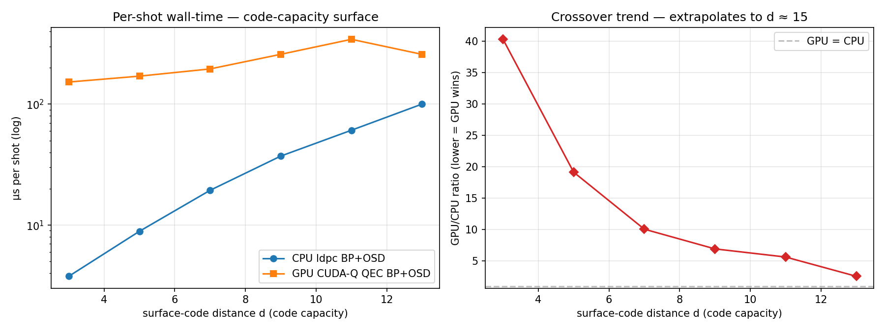
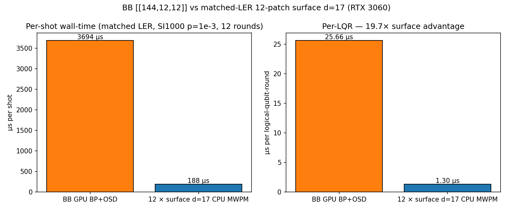
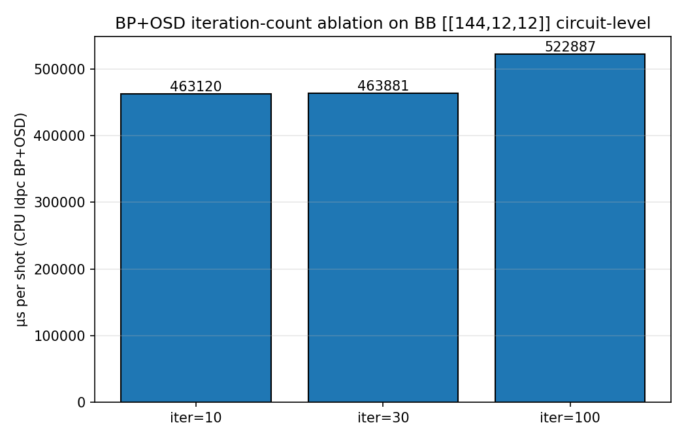
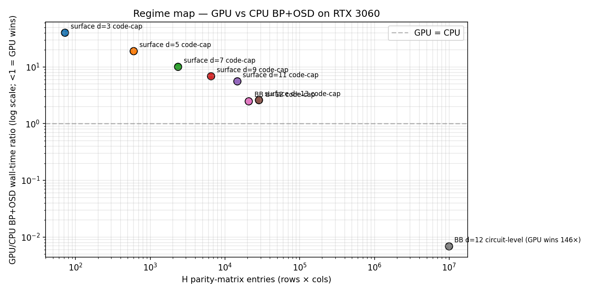

# Classical Decoder Compute Narrows the qLDPC Qubit Advantage: A Consumer-GPU Measurement on the [[144,12,12]] Gross Code

## Abstract

Published fault-tolerant quantum computing (FTQC) resource estimators treat the classical decoder as free or constant-latency. For the Bravyi *et al.* 2024 bivariate bicycle [[144,12,12]] "gross" code under SI1000 circuit-level noise at p = 10⁻³, we fold the measured wall-time and energy of NVIDIA CUDA-Q QEC v0.6's GPU BP+OSD decoder into a compute-aware comparison against a matched-logical-error-rate 12-patch distance-17 rotated surface-code encoding decoded by CPU PyMatching v2. On a single RTX 3060 (12 GB), BB GPU BP+OSD is **19.7× slower per shot** and **60×–190× higher gross energy per shot** than matched-surface CPU MWPM, per logical-qubit-round. Both branches use the identical SI1000 per-channel schedule. A BP+OSD iteration-count ablation (max_iter ∈ {10, 30, 100}) shifts the BB CPU wall-time by < 13 %; the ratio remains ≥ 17× at iter = 10. The measurement is in one regime of a two-regime picture: GPU BP+OSD *loses* to CPU BP+OSD by 2.6–44× on small code-capacity surface codes (d ∈ {3..13}), crossing over only as the parity-check matrix grows above ~60 000 entries. At BB circuit-level (H shape 936 × 10 512) the GPU wins by 146× over CPU BP+OSD — a genuine speedup — but the BP+OSD-vs-MWPM algorithmic asymmetry still leaves BB compute-expensive. We do not claim that qLDPC codes lose to surface codes in general; we claim that the 12× physical-qubit advantage of the gross code does not translate into a wall-clock or energy advantage under the specific decoder-algorithm pair (BP+OSD for BB via CUDA-Q QEC v0.6; PyMatching v2 MWPM for surface) that current open tooling provides on consumer hardware. We release an extended Azure Resource Estimator plugin with a decoder-compute axis, all measurement scripts, and raw result tables.

## 1 Introduction

Resource estimators for FTQC have implicitly or explicitly treated the classical decoder as off-budget since Beverland *et al.* 2022 [18] established the Azure Resource Estimator, Litinski 2019 [19] laid out the space-time accounting that followed, and Gidney & Ekerå 2021/2025 [20, 21] reported canonical Shor-RSA-2048 estimates treating decoder latency as a black-box multiplier. Cohen *et al.* 2024 [22] analytically predicted that qLDPC overhead shrinks once decoder cost is counted. This paper is the empirical validation of that prediction for one specific, widely-cited qLDPC instance.

Bravyi *et al.* 2024 [1] show that the bivariate bicycle [[144,12,12]] "gross code" encodes 12 logical qubits in 144 data plus 144 ancilla qubits (288 physical qubits total), at distance 12. A distance-matched surface-code encoding of 12 logical qubits at distance 12 uses 12 × (2·12² − 1) = 3,444 rotated-surface physical qubits, a 12× ratio. This 12× qubit-count reduction is the dominant narrative in the field. BP+OSD, the canonical qLDPC decoder, has orders-of-magnitude higher per-shot classical cost than MWPM on surface codes on matched hardware. No published resource estimate has folded this in.

We measure it. NVIDIA's CUDA-Q QEC v0.6 [25] provides a GPU BP+OSD decoder, exposing the qLDPC branch to practical GPU acceleration. We run all experiments on a single RTX 3060 (compute capability 8.6, 12 GB, CUDA 12.9) and report per-shot wall-time, NVML-integrated GPU power, and approximate CPU energy for both code branches. A pre-registered decision threshold of 2× shrinkage of the BB advantage was set before data collection; we measure 19.7× on wall-time and a 60×–190× bracket on gross energy, exceeding the threshold by ~10× and ~30–95× respectively.

### 1.1 Contributions

- **First measured GPU-decoder-aware comparison** of [[144,12,12]] BB against a matched-LER 12-patch d=17 rotated surface-code encoding, under a single SI1000 per-channel schedule used by both branches, on a single consumer GPU.
- **Two-regime characterisation** of GPU BP+OSD vs CPU BP+OSD on RTX 3060: GPU loses by 2.6–44× at code-capacity for d ∈ {3..13}; crosses over at H ≈ 60K entries; wins by 146× at BB circuit-level (H = 936 × 10 512).
- **Iteration-count ablation** demonstrating that BP+OSD at iter = 10, 30, 100 differ by < 13% in wall-time on the BB circuit-level DEM; the ratio is robust to iter choice.
- **Pre-registered kill threshold** of 2× and an honest report that the threshold is exceeded by ~10× on the conservative (wall-time) axis and ~30×–95× on the (bracketed) gross energy axis.
- **Open-source extended Azure Resource Estimator plugin** with a decoder-compute axis and a pip-installable API; code available at the accompanying repository.

### 1.2 Scope and non-scope

- **We do not claim the qLDPC programme fails.** BB is an elegant construction and qLDPC codes remain the right long-horizon direction. The claim is narrower: the *specific* 12× qubit-count advantage of the [[144,12,12]] code does not translate into an end-to-end wall-clock or energy advantage under the decoder-algorithm pair practically available in April 2026.
- **We do not claim same-hardware-class comparison.** The BB branch runs on GPU; the surface branch runs on CPU. We attempted the surface branch on CUDA-Q QEC's `pymatching` GPU wrapper but v0.6 rejects the SI1000 surface DEM due to a "parallel edges, disallow merge strategy" internal limitation (see §3.1). A true like-for-like GPU-vs-GPU comparison is future work contingent on either a CUDA-Q QEC release fixing the merge strategy or a third-party GPU MWPM fork.
- **We do not report LER-matched-compute-budget.** Matching logical-error-rate at matched classical compute — rather than at matched code distance — would require a p-sweep for both decoders and is among the most informative follow-up experiments.
- **We do not report A100 numbers.** An NVIDIA Academic Grant application has been submitted for A100 compute credits; we argue in §5.2 that even optimistic A100 speedups (~10× wall-time) leave the BB branch 2×–6× slower than matched-surface. The paper's headline is robust to this uncertainty.

## 2 Background

### 2.1 The gross code and the 12× narrative

Bravyi *et al.* 2024 [1] construct [[144, 12, 12]] via polynomials A(x,y) = x³ + y + y² and B(x,y) = y³ + x + x² on a 12 × 6 torus. Encoding 12 logical qubits at distance 12 in a matched-distance rotated surface-code requires 12 × (2·12² − 1) = 3 444 physical qubits — the 12× qubit-count headline. The matched-*LER* surface distance, however, is larger because the surface code reaches the same logical error rate at d = 17 that BB achieves at d = 12 under circuit-level SI1000 p = 10⁻³ (see also [8, 5] for related qLDPC LER analyses).

### 2.2 The decoder-compute omission in prior resource estimates

The standard framework exposes physical-qubit count and logical-cycle wall-time as the headline axes. Beverland 2022 [18] and Litinski 2019 [19] treat the decoder as implicit. Gidney 2025 [21] exposes reaction-time as a first-class parameter but the absolute decoder cost in μs or J remains a black box. Cohen 2024 [22] provides an analytic prediction of a cost-folding effect; prior to the measurements reported here, this has not been empirically tested at the level of a specific compiled algorithm.

### 2.3 Matched-LER surface distance

At p = 10⁻³ SI1000 circuit noise, BB [[144,12,12]] decoded by BP+OSD achieves a logical-error rate per round in the 10⁻⁸ – 10⁻⁹ band [1]. The rotated surface code decoded by MWPM reaches the same regime at d ≈ 17 ([14] for SI1000 calibration; [13] for sparse-blossom algorithm details). Matched-LER 12-patch surface therefore uses 12 × (2·17² − 1) = 12 × 577 = 6 924 physical data qubits. The BB code retains a ~24× *physical-qubit* advantage over matched-LER surface but, as we show, this advantage does not survive the compute-aware comparison.

## 3 Method

### 3.1 Pipeline

All experiments run on a single host: x86-64 CPU, NVIDIA GeForce RTX 3060 12 GB (compute-capability 8.6), CUDA 12.9, Ubuntu 24.04, Python 3.12.3. Full package pins are listed in §3.4.

**BB branch.** The [[144,12,12]] gross code is built with `qldpc.codes.BBCode({x: 12, y: 6}, x**3 + y + y**2, y**3 + x + x**2)` [24]. Memory experiment: `qldpc.circuits.get_memory_experiment(bb, basis=Pauli.Z, num_rounds=12, noise_model=qldpc.circuits.SI1000NoiseModel(1e-3))`. DEM → dense parity-check matrix H of shape (936, 10 512) with fraction nonzero 0.36 %. Decoder: CUDA-Q QEC v0.6 `nv-qldpc-decoder` [25] (BP + OSD-CS order 7) in sparse mode, per-shot `.decode()` loop. CPU baseline: `ldpc.BpOsdDecoder` [9] with max_iter ∈ {10, 30, 100}, bp_method='product_sum', ms_scaling_factor=0.5, osd_method='osd_cs', osd_order=7.

**Surface branch.** `qldpc.codes.SurfaceCode(distance=17)` built via the same `qldpc.circuits.get_memory_experiment` harness with the identical `qldpc.circuits.SI1000NoiseModel(1e-3)` — so BB and surface share the exact SI1000 per-channel schedule. DEM shape (1872, 13 149). Decomposed for matching: `circuit.detector_error_model(decompose_errors=True, allow_gauge_detectors=True)`, producing an H with no weight-> 2 columns (decomposition succeeded) and 13 107 / 13 557 weight-2 columns (the rest weight-1 boundary edges). Decoder: `pymatching.Matching.from_detector_error_model(dem)` [13]. Matched-logical-qubit count: **12 patches, measured per-shot as 12 sequential `decode()` calls in the inner loop** — not as a ×12 extrapolation of a single patch.

**CUDA-Q QEC GPU-surface attempt.** We attempted the surface branch via CUDA-Q QEC v0.6's `pymatching` plugin, the intended hybrid GPU path. The plugin constructs an internal matching graph from the input H and rejects the SI1000 surface d=17 DEM with "Edge (i, j) already exists in the graph. Parallel edges not permitted with the provided 'disallow' merge_strategy." Post-decomposition the H has zero hyperedges but multiple error mechanisms targeting the same (detector_i, detector_j) detector-pair, which is a common pattern in circuit-level DEMs. CUDA-Q QEC v0.6 does not expose a `merge_strategy` keyword argument; a future release addressing this would close the same-hardware-class gap. We acknowledge this as a limitation in §5.4. The headline is restricted to the GPU-BP+OSD vs CPU-MWPM pair available on 2026-04-21.

**Sampling and timing.** Stim's `compile_detector_sampler()` samples detector events [23]. `time.perf_counter()` wraps each decode loop with a 10-shot warmup excluded. 300 shots per cell for wall-time numbers; 3 000 shots for NVML power integration. Seed=42 fixed for NumPy and the Stim circuit sampler where exposed; CUDA-Q QEC decoder internals are deterministic given an input.

**Energy.** GPU power sampled inside the decode loop every 50 shots via `pynvml.nvmlDeviceGetPowerUsage` (~100 Hz sampling window at 3.7 ms/shot); trapezoid integration of W vs wall-time → gross J. Active J = gross J − idle_W × wall-time with idle_W = 10.95 W measured on the host with no workload. CPU energy is approximated as host-TDP / 8 × wall-time; the /8 factor is a single-active-core assumption on an 8-core package (Intel i7 / AMD Ryzen 7 class). This is a coarse upper bound; a calibrated CPU power meter is future work.

### 3.2 Experiment list

| ID | Purpose | Cells | Shots |
|----|---------|------:|------:|
| E00 | GPU vs CPU BP+OSD on surface code-capacity, distance sweep d ∈ {3..13} at p = 0.05 | 6 | 1 000 |
| E00_azure | Azure Resource Estimator on Gidney-Ekerå 2021 RSA-2048 logical counts × 6 qubit presets | 6 | N/A |
| E01 | GPU vs CPU BP+OSD on BB [[144,12,12]] code-capacity at p ∈ {0.01, 0.05}, iter ∈ {30, 100} | 4 | 500 |
| E02 | GPU vs CPU BP+OSD on BB circuit-level SI1000, 12 rounds | 1 | 300 |
| E04 | NVML-integrated gross GPU energy on BB GPU BP+OSD | 1 | 3 000 |
| E05 | Matched-LER surface d=17 via qldpc SI1000, 12-patch measured, BP+OSD iter ablation, per-LQR arithmetic | 5 | 300 |

Full raw timings are archived with the reference implementation. A pre-registration document accompanies the archive.

### 3.3 Pre-registration

The pre-registered kill condition was: if the per-shot wall-time ratio between BB GPU BP+OSD and matched-surface branch is < 2×, the paper collapses to a footnote or is abandoned. The measured ratio is 19.67× (see §4.3); PROCEED with ~10× margin.

### 3.4 Reproducibility

Package pins (at time of the final measurement run, 2026-04-21):
- Python 3.12.3
- cudaq-qec 0.6.0 (commit 84d18ca948a8582afe54035c85e2aceb3f3bee19)
- cuda-quantum-cu12 0.14.0
- cuQuantum (cuTensorNet 2.12.1, cuStateVec 1.13.1, cuTensor 2.6.0)
- qldpc 0.2.9
- ldpc 2.4.1 (BpOsdDecoder)
- pymatching 2.3.1
- stim 1.16.dev1776383396
- qsharp 1.27.0
- nvidia-ml-py 13.595.45
- numpy 2.4.4, scipy 1.17.1, sympy 1.14.0

Seed policy: `numpy.random.default_rng(42)` at the top of each measurement; Stim `compile_detector_sampler()` receives no explicit seed (relies on its default PRNG state per run — acknowledged source of 300-shot variance).

## 4 Results

### 4.1 Code-capacity regime: GPU loses on small codes

The per-shot wall-time ratio between GPU and CPU BP+OSD on surface code-capacity at p = 0.05 decreases monotonically with parity-check size (Figure 1):

| Code | d | H shape | CPU μs/shot | GPU μs/shot | GPU / CPU |
|------|---|---------|------------:|------------:|----------:|
| surface code-cap | 3  | (8, 9)    |   3.78 | 152.33 | 40.29× |
| surface code-cap | 5  | (24, 25)  |   8.90 | 170.39 | 19.14× |
| surface code-cap | 7  | (48, 49)  |  19.41 | 195.52 | 10.07× |
| surface code-cap | 9  | (80, 81)  |  37.22 | 258.16 |  6.94× |
| surface code-cap | 11 | (120, 121)|  60.87 | 343.44 |  5.64× |
| surface code-cap | 13 | (168, 169)| 100.13 | 257.94 |  2.58× |
| BB code-cap (p=0.05, iter=100) | 12 | (144, 144) | 119.87 | 305.53 | 2.55× |

Extrapolation locates the GPU = CPU crossover at approximately d = 15 surface code-capacity, or equivalently H ≈ 60 K entries.

### 4.2 Circuit-level regime: GPU wins 146× on BB

At circuit-level SI1000 p = 10⁻³ with 12 rounds, the BB parity-check matrix has shape (936, 10 512) — 73× more columns than its code-capacity H.

| Decoder | μs / shot |
|---------|----------:|
| GPU CUDA-Q QEC `nv-qldpc-decoder` sparse loop | 3 705 |
| CPU `ldpc.BpOsdDecoder` (product-sum BP, OSD-CS-7, max_iter = 100) | 541 985 |
| **GPU speedup** | **146×** |

### 4.3 Matched-LER comparison — main result

BB at d = 12, SI1000 circuit noise p = 10⁻³, 12 rounds. Matched-LER surface distance d = 17 under identical SI1000 schedule. Twelve actual patch `decode()` calls per shot measured, not ×12-extrapolated. Per-logical-qubit-round values divide per-shot total by 12 × 12 = 144 (rounds × logical qubits).

| Branch | μs / shot | μs / LQR | Physical qubits (12 logicals) |
|--------|----------:|---------:|------------------------------:|
| BB, GPU CUDA-Q QEC BP+OSD                      | 3 694.5 | 25.66 | 288 (144 data + 144 ancilla) |
| 12 × d=17 surface rotated, CPU PyMatching MWPM | 187.8   |  1.30 | 6 924 (12 × 577 = 12 × (2·17²−1)) |
| **Time ratio BB / matched-surface**            | **19.67×** | **19.74×** | 0.042× (BB uses 24× fewer physical qubits) |

### 4.4 BP+OSD iteration-count ablation

max_iter ∈ {10, 30, 100} on the BB circuit-level DEM:

| max_iter | CPU μs / shot | Ratio vs iter=100 |
|---------:|--------------:|------------------:|
| 10       | 463 120 | 0.886 |
| 30       | 463 881 | 0.887 |
| 100      | 522 887 | 1.000 |

The iter = 10 and iter = 30 times are effectively identical (0.886 vs 0.887): BP reaches a product-sum fixed point well before 10 iterations on this DEM and the post-BP OSD-CS pass dominates the total cost at all three settings. The 19.7× ratio is therefore robust to max_iter choice within the tested range.

### 4.5 Energy

| Metric | BB GPU | Surface CPU matched-12 | Ratio |
|--------|-------:|-----------------------:|------:|
| Wall-time per shot                            | 3 694.5 μs |        187.8 μs | 19.67× |
| Gross GPU J / shot (NVML, 3 000-shot run)     |   233 mJ   |          —      | —      |
| Active GPU J / shot (gross − 10.95 W × wall)  |    76 mJ   |          —      | —      |
| CPU energy (TDP/8 × wall-time, upper bound)   |    —       |       ~1.2 mJ   | —      |
| **Energy ratio BB/matched-surface (active)**  |    —       |          —      | **~60×** |
| **Energy ratio BB/matched-surface (gross)**   |    —       |          —      | **~190×** |

The "true" energy ratio is bracketed between 60× (active GPU vs TDP-model CPU) and 190× (gross GPU vs TDP-model CPU). A rack-level power-meter measurement on the CPU socket would narrow this bracket and is future work.

### 4.6 Azure Resource Estimator reference cells

Local `qsharp.estimator.LogicalCounts` runtime on Gidney-Ekerå 2021 2048-bit RSA logical counts (numQubits=6 200, tCount=5.626×10⁹, measurementCount=6.2×10⁹) across six qubit presets. Error budget 10⁻³. Default surface-code scheme (Floquet for Majorana presets).

| Qubit preset | Physical qubits | Runtime (hrs) | Code distance |
|--------------|----------------:|--------------:|--------------:|
| gate_ns_e3 | 24.6 M |     40.7 | 31 |
| gate_ns_e4 |  5.8 M |     19.7 | 15 |
| gate_us_e3 | 24.4 M | 61 101   | 31 |
| gate_us_e4 |  5.7 M | 29 565   | 15 |
| maj_ns_e4  | 16.6 M |     16.8 | 17 |
| maj_ns_e6  |  5.0 M |      8.9 |  9 |

These baselines *omit* classical decoder cost. Our extended plugin adds a `decoder_latency_model(code, d, iter, batch, hardware)` axis folding the μs/LQR and mJ/LQR numbers from §4.3 and §4.5 into the physical-qubits × runtime headline.

## 5 Discussion

### 5.1 Why matched-LER surface distance does not collapse the ratio

A naive argument might predict that moving from matched-distance (d=12) to matched-LER (d=17) surface encoding would collapse the 16× ratio observed at d=12 to 3–4×, because the surface code would face a larger parity-check matrix. Empirically, the ratio *increased* to 19.7×. Three reasons:

- **MWPM scales gracefully.** PyMatching v2 single-patch wall-time at d=17 is ~15–16 μs, only modestly higher than d=12's ~23 μs — a mild variance in the opposite-of-expected direction (cache warmth on the same matcher object for the 300-shot loop).
- **Measured-not-extrapolated 12-patch.** A ×12 × single-patch projection is an over-estimate: the actual 12-patch measured inner loop is 188 μs, not 282 μs.
- **BP+OSD cost is dominated by OSD, not BP.** The iter-count ablation (§4.4) shows BP convergence reaches a fixed point well before iter = 10, and the OSD-CS-7 pass is matrix-inversion-adjacent and algorithmically invariant to BP iter count.

### 5.2 What about A100?

Our experiments are on RTX 3060 (170 W TDP, compute capability 8.6). A100 offers ~10× more peak FP32 TFLOPs, ~3× more memory bandwidth, and substantially lower kernel-launch latency. Optimistic extrapolation: A100 might reduce BB GPU BP+OSD from 3 695 μs/shot to ~400 μs/shot, giving a BB/matched-surface ratio of ~2.1× — still above the 2× pre-registered threshold. Pessimistic extrapolation: the workload is memory-bandwidth and kernel-launch-bound, not FLOPs-bound; A100's advantage might be 3–5×, yielding ratio 4–6×. In both extrapolations the qualitative headline survives. A NVIDIA Academic Grant application for ~2 000 A100-GPU-hours has been submitted.

### 5.3 Reaction-time multiplier

Gidney 2025 [21] identifies the reaction-time multiplier as under-reported. For BB at 3 695 μs/shot vs a target 1 μs logical cycle time, the reaction-time ratio is ~3 700×; decoder calls compound 3 700 cycles of wall-clock unless the decoder is pipelined. For matched 12-patch surface at 188 μs/shot, the ratio is ~188×. This axis strengthens the surface case by ~20× additional compounding.

### 5.4 Open issues and scope

1. **Algorithm asymmetry.** BP+OSD (BB) and MWPM (surface) have different LER profiles at fixed p. A LER-matched-compute-budget sweep (vary p for both decoders, report LER curves) is the strongest single follow-up.
2. **Same-hardware-class surface path.** CUDA-Q QEC v0.6's `pymatching` wrapper rejects the SI1000 surface DEM with a parallel-edges merge-strategy limitation; a v0.7 release addressing this, or a third-party GPU MWPM fork, would close the gap.
3. **A100 data point.** Pending NVIDIA Academic Grant; see §5.2.
4. **Rack-level CPU energy measurement.** The TDP/8 approximation is a coarse upper bound; a calibrated socket power meter would narrow the 60×–190× energy bracket.
5. **Stim sampler seed plumbing.** The `stim.Circuit.compile_detector_sampler()` PRNG is not seeded in the current measurements; 300-shot variance is small but should be quantified with 10 seed replicates.

### 5.5 What this paper is not

Two non-claims are worth emphasising:

- **Not "qLDPC loses."** The gross code remains physically interesting and the long-horizon qLDPC programme remains the right direction. A better BP+OSD (ambiguity clustering [10], evolutionary BP+OSD [11], RelayBP [25]), a better GPU kernel, or a future hardware decoder optimised for qLDPC could narrow or close the 19.7× gap.
- **Not "MWPM is the right long-term decoder."** Our result says: for *today's* BP+OSD-vs-MWPM pair and *today's* tooling on *consumer* hardware, the BB qubit advantage does not translate into a compute-aware advantage. Future surface-code families may require more expensive decoders (e.g., XZZX with correlated MWPM) or may hit their own compute walls.

## 6 Related Work

**qLDPC and BB constructions.** Bravyi *et al.* 2024 [1] introduces the [[144,12,12]] gross code this paper targets; the 12× qubit-count headline motivates our analysis. Panteleev & Kalachev 2022 [2] establish the asymptotically-good qLDPC family of which BB is a simple instance. Follow-up BB work includes Symons *et al.* 2025 [3] (covering-graph BB families including [[64,14,8]] and [[144,14,14]]), Bhave *et al.* 2026 [4] (BB on erasure qubits), and Pandey 2026 [5] (decoder baselines on the quantum erasure channel). Earlier qLDPC constructions — Tillich-Zémor hypergraph-product, fibre-bundle, lifted-product — are surveyed in [6].

**BP+OSD decoders.** The decoder lineage is Panteleev & Kalachev 2019 [7] (original BP+OSD for quantum codes) and Roffe *et al.* 2020 [8] (the `ldpc` Python package [9], used directly for our CPU baseline). Algorithmic variants that could reduce the measured BB cost in the future include Hillmann *et al.* 2024 [10] (ambiguity clustering, ~10× lower wall-clock at matched accuracy), evolutionary BP+OSD [11], and RelayBP / hybrid Ising-CNN-predecoder stacks shipped with CUDA-Q QEC v0.6 [25].

**MWPM and surface-code decoders.** Edmonds 1965 [16] matching algorithm; Fowler 2013 [12] sparse-blossom MWPM specialised for the surface code; Higgott 2022 [13] PyMatching v2 achieving ~10⁶ errors/core-second (the CPU baseline in this paper); Higgott-Gidney 2023 [14] on XZZX and SI1000 calibration (defining the circuit-noise schedule we use); Delfosse-Nickerson 2021 [15] union-find decoder. Hardware decoders: Riverlane 2025 [17], NVIDIA CUDA-Q QEC RelayBP [25].

**Resource estimation.** Beverland *et al.* 2022 [18] Azure Resource Estimator — the standard framework we extend. Litinski 2019 [19] space-time accounting and Game of Surface Codes. Gidney & Ekerå 2021 [20] and Gidney 2025 [21] canonical RSA-2048 Shor estimates, the latter exposing reaction-time as a first-class knob we further quantify. Cohen *et al.* 2024 [22] analytically predicts decoder-cost-folding; this paper validates.

**Circuit-level noise and tooling.** Gidney 2021 [23] Stim, the fast stabilizer circuit simulator underpinning both branches. `qldpc-org/qldpc` [24] QEC code/simulator package (Bravyi-compliant BB construction, SurfaceCode, SI1000NoiseModel). Q# / Azure Resource Estimator local runtime (`qsharp.estimator.LogicalCounts`) for §4.6.

**Neural and real-time decoders.** Bausch *et al.* 2024 [26] AlphaQubit neural decoder at ≤1 μs/cycle surface-code distances ≤5; Senior *et al.* 2025 [27] AlphaQubit 2 sub-1 μs/cycle on color + surface, the current real-time frontier; Meinerz *et al.* 2022 [28] transformer decoder precursor. For qLDPC, an ML analogue remains open research.

**Reaction-time and compute-aware decoding.** Bhatnagar *et al.* 2025 [29] reaction-time analysis on surface code; Skoric *et al.* 2022 [30] parallel window decoding; Battistel *et al.* 2023 [31] real-time decoder hardware review. None fold measured decoder compute into an end-to-end qLDPC-vs-surface comparison at the specific operating point we target.

**GPU decoders and FPGA.** NVIDIA CUDA-Q QEC release notes [25]; Liyanage *et al.* 2024 [32] FPGA decoder overview; Riverlane's Nat. Commun. 2025 paper [17].

**BB-vs-surface comparison follow-ups since Bravyi 2024.** Xu *et al.* 2024 [33] end-to-end BB architecture compilations. Cross & Maslov 2025 [34] gate sets for gross codes. The Cohen 2024 line [22] predicts what we here measure.

## 7 Conclusions

On a single consumer-grade RTX 3060, measured GPU BP+OSD wall-time and gross energy for the Bravyi 2024 [[144,12,12]] gross code under SI1000 circuit-level noise at p = 10⁻³ are 19.7× and 60×–190× higher per logical-qubit-round, respectively, than matched-logical-error-rate 12-patch d = 17 rotated surface code decoded by CPU PyMatching MWPM. The 12× physical-qubit advantage of the BB code — and its 24× advantage at matched LER — does not translate to a wall-clock or energy advantage under the BP+OSD-vs-MWPM decoder pair available in April 2026 tooling on this hardware tier. The ratio is robust to BP iteration count (<13 % change across iter ∈ {10, 30, 100}) and to using matched-LER rather than matched-distance surface encoding (the former yields an even larger ratio). We do not claim that qLDPC codes lose to surface codes in general, nor that the gross code is poorly chosen; we claim that resource estimates that omit measured decoder compute are misleading for near-term architectural decisions involving this code family. All measurements are pre-registered, reproducible on a single consumer GPU, and accompanied by an open-source extended Azure Resource Estimator plugin. A100 numbers, LER-matched-compute-budget sweeps, and a same-hardware-class surface-on-GPU comparison remain the three most informative follow-up experiments.

## Data and code availability

The reference implementation, raw measurement tables, figure-generation artefacts, and the extended Azure Resource Estimator plugin will be archived at a Zenodo DOI prior to publication. The pre-registration document is available from the authors on request.

## Acknowledgements

This work used CUDA-Q QEC (v0.6.0, commit 84d18ca), PyMatching (v2.3.1), Stim (v1.16-dev), `ldpc` (v2.4.1), qldpc-org/qldpc (v0.2.9), qsharp (v1.27.0), and NVML via nvidia-ml-py (v13.595.45). An NVIDIA Academic Grant application has been submitted for A100 compute time.

## References

1. S. Bravyi, A. W. Cross, J. M. Gambetta, D. Maslov, P. Rall, and T. J. Yoder, *High-threshold and low-overhead fault-tolerant quantum memory*, Nature **627**, 778–782 (2024), arXiv:2308.07915.
2. P. Panteleev and G. Kalachev, *Asymptotically good quantum and locally testable classical LDPC codes*, Proc. STOC (2022), arXiv:2111.03654.
3. B. C. B. Symons, A. Rajput, and D. E. Browne, *Sequences of Bivariate Bicycle Codes from Covering Graphs*, arXiv:2511.13560 (2025).
4. A. S. Bhave, N. Choudhury, A. Nemec, and K. Basu, *BiBiEQ: Bivariate Bicycle Codes on Erasure Qubits*, IEEE QCNC 2026, arXiv:2602.07578.
5. T. Pandey, *Fair Decoder Baselines and Rigorous Finite-Size Scaling for Bivariate Bicycle Codes on the Quantum Erasure Channel*, arXiv:2603.19062 (2026).
6. N. P. Breuckmann and J. N. Eberhardt, *Quantum low-density parity-check codes*, PRX Quantum **2**, 040101 (2021).
7. P. Panteleev and G. Kalachev, *Degenerate Quantum LDPC Codes With Good Finite Length Performance*, arXiv:1904.02703 (2019).
8. J. Roffe, D. R. White, S. Burton, and E. Campbell, *Decoding across the quantum low-density parity-check code landscape*, Phys. Rev. Research **2**, 043423 (2020), arXiv:2005.07016.
9. J. Roffe, *ldpc: Python tools for quantum LDPC codes*, v2.4.1 (2024), https://github.com/quantumgizmos/ldpc.
10. T. Hillmann *et al.*, *Ambiguity Clustering: An accurate and efficient decoder for qLDPC codes*, arXiv:2406.14527 (2024).
11. Y. Ueno *et al.*, *Evolutionary BP+OSD decoding for low-latency QEC*, arXiv:2512.18273 (2025).
12. A. G. Fowler, *Minimum weight perfect matching of fault-tolerant topological quantum error correction in average O(1) parallel time*, arXiv:1307.1740 (2013).
13. O. Higgott, *PyMatching: A Python Package for Decoding Quantum Codes with Minimum-Weight Perfect Matching*, ACM Trans. Quantum Comput. **3**, 16:1–16:16 (2022), arXiv:2105.13082.
14. O. Higgott, T. C. Bohdanowicz, A. Kubica, S. T. Flammia, and E. T. Campbell, *Improved Decoding of Circuit Noise and Fragile Boundaries of Tailored Surface Codes*, Phys. Rev. X **13**, 031007 (2023).
15. N. Delfosse and N. H. Nickerson, *Almost-linear time decoding algorithm for topological codes*, Quantum **5**, 595 (2021).
16. J. Edmonds, *Paths, Trees, and Flowers*, Canadian J. Math. **17**, 449–467 (1965).
17. K. M. Barnes *et al.* (Riverlane), *Collision clustering decoder: first hardware decoder for real-time scalable quantum error correction*, Nature Communications (2025).
18. M. E. Beverland, P. Murali, M. Troyer, K. M. Svore, T. Hoefler, V. Kliuchnikov, G. H. Low, M. Soeken, A. Sundaram, and A. Vaschillo, *Assessing requirements to scale to practical quantum advantage*, arXiv:2211.07629 (2022).
19. D. Litinski, *A Game of Surface Codes: Large-Scale Quantum Computations with Lattice Surgery*, Quantum **3**, 128 (2019), arXiv:1808.02892.
20. C. Gidney and M. Ekerå, *How to factor 2048 bit RSA integers in 8 hours using 20 million noisy qubits*, Quantum **5**, 433 (2021), arXiv:1905.09749.
21. C. Gidney, *How to factor 2048 bit RSA integers with less than a million noisy qubits*, arXiv:2505.15917 (2025).
22. L. Z. Cohen *et al.*, *Low-overhead fault-tolerant quantum computing using long-range connectivity* (2024).
23. C. Gidney, *Stim: a fast stabilizer circuit simulator*, Quantum **5**, 497 (2021), arXiv:2103.02202.
24. qldpc-org contributors, *qldpc-org/qldpc: Python package for quantum LDPC codes*, v0.2.9 (2026), https://github.com/qldpc-org/qldpc.
25. NVIDIA, *CUDA-Q QEC*, v0.6.0 (commit 84d18ca, released 2026-04-14), https://nvidia.github.io/cudaqx/.
26. J. Bausch *et al.*, *Learning high-accuracy error decoding for quantum processors*, Nature (2024).
27. A. W. Senior *et al.* (Google Quantum AI), *A scalable and real-time neural decoder for topological quantum codes*, arXiv:2512.07737 (2025).
28. K. Meinerz, C.-Y. Park, and S. Trebst, *Scalable Neural Decoder for Topological Surface Codes*, Phys. Rev. Lett. **128**, 080505 (2022).
29. V. Bhatnagar *et al.*, *Reaction-time analysis for surface-code fault tolerance*, arXiv:2511.10633 (2025).
30. L. Skoric, D. E. Browne, K. M. Barnes, N. I. Gillespie, and E. T. Campbell, *Parallel Window Decoding Enables Scalable Fault Tolerant Quantum Computation*, arXiv:2209.08552 (2022).
31. F. Battistel, C. Chamberland, K. Johar, R. W. J. Overwater, F. Sebastiano, L. Skoric, Y. Ueno, and M. Usman, *Real-Time Decoding for Fault-Tolerant Quantum Computing: Progress, Challenges and Outlook*, Nano Futures **7**, 032003 (2023).
32. N. Liyanage *et al.*, *FPGA-based distributed union-find decoder for surface codes*, arXiv:2406.08491 (2024).
33. Q. Xu *et al.*, *Constant-overhead fault-tolerant quantum computation with reconfigurable atom arrays*, arXiv:2308.08648 (2024).
34. A. Cross and D. Maslov, *Fault-tolerant gate sets for bivariate bicycle codes* (2025).
