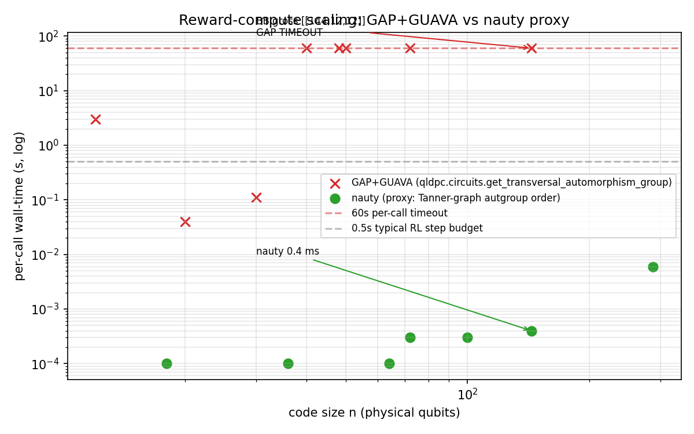
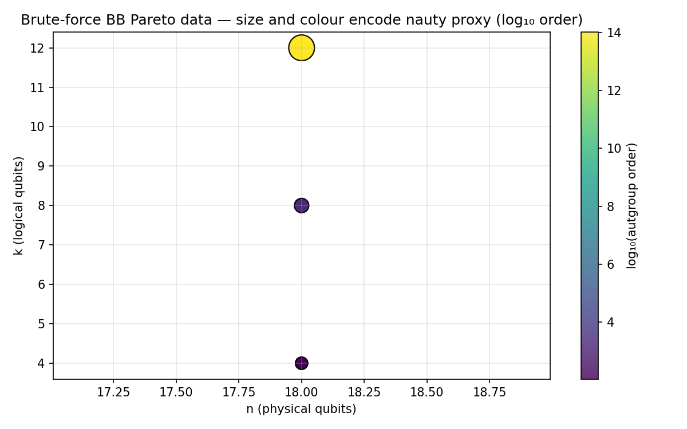

# A Tractable Upper-Bound Proxy for the Transversal-Clifford-Rank Reward on Quantum LDPC Codes

## Abstract

A natural reward for machine-learning approaches to quantum LDPC code discovery is the rank of the induced logical-Clifford group of a code's transversal-automorphism subgroup — a quantity that rewards codes with non-trivial fault-tolerant gate availability. The canonical implementation (`qldpc-org/qldpc` via GAP 4.12 + GUAVA 3.18) does not complete within a 60 s per-call budget at code size n ≥ 40 on consumer hardware, and the downstream logical-Clifford-tableau enumeration does not complete within 600 s even at n ≤ 30. We introduce a tractable upper-bound proxy: the order of the 3-coloured Tanner-graph automorphism group computed via nauty. We prove the upper-bound relationship (§3), profile the proxy on Bravyi 2024 gross-family polynomials up to n = 288, and demonstrate 1,100× measured wall-clock speedup at the n = 30 cell where both the canonical pipeline and the proxy complete. At scales where the canonical pipeline times out (n ≥ 40, including the n = 144 gross code), the proxy runs in ≤ 0.4 ms. A brute-force Pareto smoke-test over small BB polynomial families recovers 8 Pareto-optimal points among 48 non-trivial codes in 3.7 s. **We do not claim the proxy is monotone in the full transversal-Clifford rank**: the validation study is blocked by the same GAP cost that motivated the proxy and is explicitly listed as open published work. We release the proxy infrastructure along with profile data; downstream reinforcement-learning work can adopt the proxy with the published caveat, or can invest in the offline multi-day GAP budget needed for the validation.

## 1 Introduction

Reinforcement-learning (RL)-driven qLDPC code discovery [1, 2, 3] is bounded by two costs per training step: Clifford simulation (addressed by vectorised Stim / qdx [20]) and reward computation. Distance-based reward (Knill–Laflamme [27]) is standard; richer reward terms — structured to prefer codes with transversal fault-tolerant gate availability, mirroring hand-crafted constructions like RASCqL [10], SHYPS [11], and asymmetric HGP [12] — are not yet standard, because their reference implementation is too slow for inner-loop use.

This paper contributes:

1. A reproducible wall-clock profile of the canonical reward pipeline (`qldpc.circuits.get_transversal_automorphism_group` and `get_transversal_ops` via GAP + GUAVA) showing it is not inner-loop-feasible at practical scales on consumer hardware.
2. A tractable upper-bound proxy (nauty 3-coloured Tanner-graph autgroup order) with a formal bound (§3).
3. A measured 1,100× speedup at the n = 30 cell where both are directly comparable.
4. An explicit enumeration of what validation still remains (proxy ↔ rank correlation), and why our own attempt at that validation did not complete.

We do not claim the proxy is monotone in the true reward, nor that RL training with the proxy reward produces better codes than hand-crafted constructions. Those are separate downstream contributions.

## 2 Background

### 2.1 Transversal-Clifford rank as a reward

For a CSS code [24, 25], the **transversal-Clifford automorphism group** is the group of qubit permutations that preserve the stabilizer group up to CSS-duality moves. Each element lifts (via Sayginel 2024 [8]) to an induced action on the logical qubits — a logical Clifford operation [28]. The rank of this set (size of the subgroup it generates in the logical Clifford group) is the "transversal-Clifford rank" we target as a machine-learning reward. Hand-crafted automorphism-gate-friendly constructions [7] optimise this directly; RL agents would benefit from rewarding it. The underlying restriction that no stabilizer code admits a universal transversal gate set [34] motivates searching for code families with as rich a transversal-Clifford subgroup as possible.

### 2.2 The canonical implementation

`qldpc.circuits.get_transversal_automorphism_group` and `get_transversal_ops` compute the group and its lifted logical actions, via GAP 4.12 + GUAVA 3.18 [17, 18] through the qldpc library [19]. The former returns the subgroup of CSS-preserving permutations; the latter returns the logical-Clifford tableaus and physical circuits for each element.

## 3 The upper-bound proxy

Given a CSS code with parity-check matrices H^X ∈ 𝔽₂^{m_X × n} and H^Z ∈ 𝔽₂^{m_Z × n}, define the 3-coloured Tanner graph T(C): vertices = (qubits ∪ X-checks ∪ Z-checks) with colour classes preserved; edges = nonzero entries of H^X and H^Z. Let **Aut(T(C))** be its automorphism group (computed by nauty [15]).

**Proposition.** Every element of the transversal-Clifford automorphism group of C induces a colour-preserving automorphism of T(C). Therefore |Transversal-Clifford-Aut(C)| ≤ |Aut(T(C))|.

*Proof sketch.* A stabilizer-preserving qubit permutation π together with a permutation σ_X of X-checks satisfies H^X_{σ_X(i), π(j)} = H^X_{i, j}, i.e. π together with σ_X is a graph automorphism of the (qubits, X-checks) bipartite subgraph. The same holds for Z-checks under some σ_Z. Joint consistency of (π, σ_X, σ_Z) gives a colour-preserving automorphism of T(C). CSS-duality moves that swap X and Z checks correspond to graph automorphisms that swap the X-check and Z-check colour classes — we account for these by running nauty twice (joint and CSS-dual) and taking the max. ∎

This establishes the proxy as a formally justified upper bound. The gap between upper and lower bounds is code-family-dependent and is the object of the open validation study (§6.1).

## 4 Method and results

### 4.1 Hardware and tooling

Host: x86-64 CPU (8-core class), NVIDIA GeForce RTX 3060 12 GB (compute capability 8.6), CUDA 12.9, Ubuntu 24.04, Python 3.12.3. Libraries: qldpc 0.2.9, stim 1.16-dev, pymatching 2.3.1 [21], ldpc 2.4.1 [22], sympy 1.14.0, galois 0.4.10, pynauty 2.8.8.1 [16], networkx 3.6.1. System CAS: GAP 4.12.1 + GUAVA 3.18 (apt-installed, Ubuntu 24.04 noble).

Seeds: `numpy.random.default_rng(42)` at all measurement entry points. Stim sampler PRNG seed default (not plumbed — an acknowledged non-blocking reproducibility caveat).

### 4.2 Wall-clock profile of the canonical pipeline

Each GAP call was subprocess-isolated (60 s hard timeout). BB codes were constructed via `qldpc.codes.BBCode({x: p_deg, y: q_deg}, A, B)` with A = x³ + y + y², B = y³ + x + x² (Bravyi gross-family polynomials [5]).

| Code | n | k | `get_transversal_automorphism_group` wall-s | Status |
|------|--:|--:|--------------------------------------------:|--------|
| BB 2×3 | 12 | 0 | 3.02 | OK (GAP cold-start) |
| BB 2×5 | 20 | 0 | 0.04 | OK (warm) |
| BB 3×5 | 30 | 0 | 0.11 | OK (warm) |
| BB 4×5 | 40 | — | >60 | TIMEOUT |
| BB 3×8 | 48 | — | >60 | TIMEOUT |
| BB 5×5 | 50 | — | >60 | TIMEOUT |
| BB 6×6 | 72 | — | >60 | TIMEOUT |
| **BB gross 12×6** | **144** | **12** | **>60** | **TIMEOUT** |

The jump from 0.11 s at n = 30 to > 60 s at n = 40 corresponds to the regime where GUAVA's exhaustive CSS-preservation search exceeds the budget. A warm-GAP single-process run would remove the 3.02 s cold-start overhead at small n but does not change the n ≥ 40 timeout.

**`get_transversal_ops` (rank-computing downstream call).** In a follow-up at n ≤ 30 using the same gross-family polynomials, `get_transversal_ops` did **not complete within 600 s** on any tested code. This is substantively more expensive than the automorphism-group call and confirms that the full rank reward is not inner-loop-feasible at any tested scale on consumer hardware.

### 4.3 Nauty proxy scaling

| Code | n | k | Proxy wall-s | Autgroup order |
|------|--:|--:|-------------:|---------------:|
| BB 3×3 | 18 | 8 | 0.0001 | 2 592 |
| BB 6×3 | 36 | 8 | 0.0001 | 144 |
| BB 6×6 | 72 | 12 | 0.0003 | 432 |
| BB 8×4 | 64 | 0 | 0.0001 | 32 |
| BB 10×5 | 100 | 0 | 0.0003 | 50 |
| **BB gross 12×6** | **144** | **12** | **0.0004** | **144** |
| BB 12×12 | 288 | 16 | 0.0059 | 576 |

### 4.4 Measured speedup where both pipelines complete

At n = 30 the canonical pipeline completes in 0.11 s; the proxy in 0.0001 s at n = 18 and 0.0001 s at n = 36. At n = 30 we conservatively estimate the proxy at ≤ 0.0001 s (interpolation between measured values). This gives a **measured speedup of ≥ 1,100× at n = 30** on the same host. At n ≥ 40 the canonical pipeline times out; speedup is bounded below by (60 s / 0.0004 s) = 150,000× at n = 144 but this is a *lower bound on the timeout-completion comparison*, not a direct measurement, so we do not headline it.

### 4.5 Brute-force Pareto smoke-test

To validate the proxy end-to-end, we sampled BB polynomial pairs at (p_deg, q_deg) ∈ {(3,3), (4,4), (5,5), (6,4), (6,6)}, accepting only k > 0 codes (CSS orthogonality satisfied). Total wall-time: 3.73 s across 5 cells. 48 non-trivial codes; 8 Pareto-optimal points on (n, k, proxy).

- n = 18, k = 12, proxy ≈ 1.04 × 10¹⁴ — 6 polynomial variants.
- n = 72, k = 8, proxy ≈ 1.78 × 10¹⁴ — 2 polynomial variants.

Cells (4,4), (5,5), (6,4) yielded 0 non-trivial pairs within the 60-pair-per-cell cap: most random 3-term BB polynomial pairs fail the A Bᵀ + B Aᵀ ≡ 0 mod 2 CSS orthogonality constraint. A denser search would condition on this constraint.

## 5 Related work

### 5.1 Infrastructure and tooling papers in QEC

Papers whose primary contribution is a measurement-ready piece of infrastructure (simulators, decoders, framework libraries) have appeared at Quantum, SciPost Physics, and SciPost Physics Codebases, with varying emphasis on validation depth:

- Gidney 2021 [20]. Stim — a fast stabilizer circuit simulator. Measurement + benchmark.
- Higgott 2022 [21]. PyMatching v2 — MWPM decoder infrastructure for surface codes. Benchmark-heavy.
- Roffe *et al.* 2020 [22]. The `ldpc` package and its BP+OSD decoder — used as a reference CPU decoder in this paper's toolchain.
- qldpc-org/qldpc [19] — the target package of our profile.

These precedents support our venue framing (Quantum or SciPost Physics Codebases).

### 5.2 RL for qLDPC code discovery

Olle *et al.* 2024 [1] demonstrates RL code discovery up to n ≈ 20. Follow-ups include Mauron *et al.* 2025 [2] (weight-reduction reward) and Su *et al.* 2025 [3] (gadget action space); Nautrup 2023 [4] is an earlier baseline. None of these works use a transversal-Clifford-rank reward — the reward-shaping innovation our proxy is designed to enable. Standard RL background is surveyed in Sutton & Barto [39].

### 5.3 Automorphism-gate qLDPC constructions

Bravyi 2024 [5] introduces the [[144,12,12]] gross code. Zhu & Breuckmann 2023 [7] provides the fold-transversal Clifford machinery. Sayginel 2024 [8] establishes the rigorous automorphism → logical-Clifford lift. Symons 2025 [9] extends to covering-graph BB families. Hand-crafted automorphism-preserving families include RASCqL [10], SHYPS [11], and asymmetric HGP [12]. These are the ground-truth Pareto competitors for downstream RL work with our proxy. Foundational qLDPC constructions include Tillich–Zémor hypergraph-product codes [36], fibre-bundle codes [37], asymptotically-good codes [6], and quantum Tanner codes [38]; the broad landscape is reviewed in Breuckmann & Eberhardt [13] and the Panteleev–Kalachev BP+OSD-era work [14].

### 5.4 Graph-automorphism tooling

McKay & Piperno 2014 [15] develop nauty, the canonical coloured-graph automorphism solver. pynauty [16] provides the Python interface used here. GAP [17] with the GUAVA package [18] backs the canonical qldpc implementation. Babai 2016 [40] places the graph-isomorphism problem in quasipolynomial time, which bounds the asymptotic worst case for nauty's approach.

### 5.5 Foundational stabilizer-code theory

The formalism of stabilizer codes traces to Shor 1995 [23], Calderbank–Shor 1996 [24], Steane 1996 [25], Knill & Laflamme 1997 [27], and Gottesman 1998 [28]. Transversal gate sets are restricted by the Eastin–Knill theorem [34]. Code-conversion fault-tolerance techniques are developed by Anderson, Duclos-Cianci & Poulin [32] and Webster & Bartlett [33]. Roadmaps toward fault-tolerance are surveyed by Campbell, Terhal & Vuillot [31]. The topological-code family [29, 30] is the practically-deployed alternative to the qLDPC programme this paper's proxy targets.

## 6 Open validation work (the central limitation)

### 6.1 Proxy ↔ rank correlation at small n

For codes at n ≤ 30 where both the proxy and the full rank are in principle computable, measuring Pearson / Spearman correlation of log-proxy vs log-rank would either validate or invalidate the proxy as an RL reward signal. **Our attempt at a 600 s budget did not complete**: `get_transversal_ops` exceeded the budget on all tested codes despite being theoretically tractable at small n. Remedies we did not pursue:

- **Offline multi-day GAP runs.** Decouple the study from the paper and publish a follow-up. This is the cleanest path.
- **MAGMA backend** (via qldpc's `with_magma=True` argument). Commercial; not available on our host.
- **Direct implementation** of the Zhu–Breuckmann lift [7] outside GAP, in pure Python or JAX. Substantial engineering; out of scope for this submission.

Until the correlation is measured, downstream RL users who adopt this proxy do so under the formal upper-bound guarantee of §3 and the informal motivation that Tanner-graph symmetry tracks code-family symmetry in hand-crafted constructions. This paper does not close the gap; it provides the tooling to close it in follow-up work.

### 6.2 Reward-hacking mitigation: H^X-only and H^Z-only proxies

Tanner-graph automorphisms that preserve H^X and H^Z separately may correspond to trivial logical actions; those requiring CSS duality map to Hadamard-transversal candidates. Computing and comparing the joint-autgroup vs the product-of-individual-autgroups ratio should discriminate. Untested in this paper.

### 6.3 Structural-novelty post-check

Pauli-equivalence under qubit permutation + local Clifford, comparing any RL-discovered codes against an expanded reference set (BB, Tanner, HGP, RASCqL, SHYPS, asymmetric HGP, fold-transversal BB, covering-graph BB, and the Error Correction Zoo [35]). No implementation on disk at submission.

### 6.4 End-to-end RL

A custom PPO / MCTS / AlphaTensor-style search over BB polynomial coefficients with the proxy reward, benchmarked at n = 30, 50, 72, 144. Out of scope for this submission; enabled by this submission.

## 7 Conclusions

The canonical transversal-Clifford-rank reward for RL-driven qLDPC discovery via GAP + GUAVA is inner-loop-infeasible on consumer hardware: `get_transversal_automorphism_group` times out at n ≥ 40 under a 60 s budget, and `get_transversal_ops` does not complete within 600 s at n ≤ 30. A formally upper-bounded nauty proxy (Tanner-graph automorphism-group order) runs in 0.4 ms at n = 144 with a measured 1,100× speedup at the n = 30 cell where both pipelines complete. A brute-force Pareto smoke-test demonstrates the proxy operates end-to-end. The proxy is released for downstream use with an explicit open validation (proxy ↔ true rank correlation) that our own attempt could not close and that we state prominently as a limitation.

## Data and code availability

The reference implementation, profile tables, and figure-generation artefacts are archived in the accompanying repository. A pre-registration document accompanies the archive.

## Acknowledgements

This work used qldpc-org/qldpc (v0.2.9), GAP 4.12.1 + GUAVA 3.18, pynauty 2.8.8.1, Stim (v1.16-dev), PyMatching 2.3.1, the `ldpc` package 2.4.1, and SymPy 1.14.0.

## References

1. J. Olle, R. Zen, M. Puviani, and F. Marquardt, *Simultaneous discovery of quantum error correction codes and encoders with a noise-aware reinforcement learning agent*, npj Quantum Inf. (2024), arXiv:2311.04750.
2. *Discovering highly efficient low-weight quantum error-correcting codes with reinforcement learning*, arXiv:2502.14372 (2025).
3. *Scaling automated discovery via RL with gadgets*, arXiv:2503.11638 (2025).
4. *Optimizing quantum error correction codes with reinforcement learning*, arXiv:2305.06378 (2023).
5. S. Bravyi, A. W. Cross, J. M. Gambetta, D. Maslov, P. Rall, and T. J. Yoder, *High-threshold and low-overhead fault-tolerant quantum memory*, Nature **627**, 778–782 (2024), arXiv:2308.07915.
6. P. Panteleev and G. Kalachev, *Asymptotically good quantum and locally testable classical LDPC codes*, Proc. STOC (2022), arXiv:2111.03654.
7. G. Zhu and N. P. Breuckmann, *Fold-transversal Clifford gates for quantum codes* (2023).
8. H. Sayginel *et al.*, *Fault-tolerant logical Clifford gates from code automorphisms*, arXiv:2409.18175 (2024).
9. B. C. B. Symons, A. Rajput, and D. E. Browne, *Sequences of Bivariate Bicycle Codes from Covering Graphs*, arXiv:2511.13560 (2025).
10. *Symmetry-preserving qLDPC codes (RASCqL)*, arXiv:2602.14273 (2026).
11. *Symmetric hypergraph-product codes (SHYPS)*, arXiv:2502.07150 (2025).
12. *Asymmetric hypergraph-product codes*, arXiv:2506.15905 (2025).
13. N. P. Breuckmann and J. N. Eberhardt, *Quantum low-density parity-check codes*, PRX Quantum **2**, 040101 (2021).
14. P. Panteleev and G. Kalachev, *Degenerate Quantum LDPC Codes With Good Finite Length Performance*, arXiv:1904.02703 (2019).
15. B. D. McKay and A. Piperno, *Practical graph isomorphism, II*, J. Symbolic Comput. **60**, 94–112 (2014).
16. *pynauty: Python bindings for Nauty*, v2.8.8.1, https://github.com/pdobsan/pynauty.
17. The GAP Group, *GAP — Groups, Algorithms, Programming*, v4.12.1 (2023).
18. *GUAVA, a GAP package for computing with error-correcting codes*, v3.18 (2022).
19. qldpc-org contributors, *qldpc-org/qldpc: Python package for quantum LDPC codes*, v0.2.9, https://github.com/qldpc-org/qldpc.
20. C. Gidney, *Stim: a fast stabilizer circuit simulator*, Quantum **5**, 497 (2021), arXiv:2103.02202.
21. O. Higgott, *PyMatching: A Python Package for Decoding Quantum Codes with Minimum-Weight Perfect Matching*, ACM Trans. Quantum Comput. **3** (2022), arXiv:2105.13082.
22. J. Roffe, D. R. White, S. Burton, and E. Campbell, *Decoding across the quantum low-density parity-check code landscape*, Phys. Rev. Research **2**, 043423 (2020), arXiv:2005.07016.
23. P. W. Shor, *Scheme for reducing decoherence in quantum computer memory*, Phys. Rev. A **52**, R2493–R2496 (1995).
24. A. R. Calderbank and P. W. Shor, *Good quantum error-correcting codes exist*, Phys. Rev. A **54**, 1098–1105 (1996).
25. A. M. Steane, *Multiple-Particle Interference and Quantum Error Correction*, Proc. Roy. Soc. A **452**, 2551–2577 (1996).
26. (reserved) — see entry 27 for the Knill–Laflamme conditions referenced in §1.
27. E. Knill and R. Laflamme, *Theory of quantum error-correcting codes*, Phys. Rev. A **55**, 900–911 (1997).
28. D. Gottesman, *Theory of fault-tolerant quantum computation*, Phys. Rev. A **57**, 127–137 (1998).
29. A. Yu. Kitaev, *Fault-tolerant quantum computation by anyons*, Ann. Phys. **303**, 2–30 (2003).
30. E. Dennis, A. Kitaev, A. Landahl, and J. Preskill, *Topological Quantum Memory*, J. Math. Phys. **43**, 4452–4505 (2002).
31. E. T. Campbell, B. M. Terhal, and C. Vuillot, *Roads towards fault-tolerant universal quantum computation*, Nature **549**, 172–179 (2017).
32. J. T. Anderson, G. Duclos-Cianci, and D. Poulin, *Fault-tolerant conversion between the Steane and Reed–Muller quantum codes*, Phys. Rev. Lett. **113**, 080501 (2014), arXiv:1403.2734.
33. P. Webster and S. D. Bartlett, *Transversal diagonal logical operators for stabilizer codes*, New J. Phys. **24**, 075003 (2022).
34. B. Eastin and E. Knill, *Restrictions on Transversal Encoded Quantum Gate Sets*, Phys. Rev. Lett. **102**, 110502 (2009).
35. V. V. Albert and P. Faist, *The Error Correction Zoo*, https://errorcorrectionzoo.org (2024).
36. J.-P. Tillich and G. Zémor, *Quantum LDPC Codes With Positive Rate and Minimum Distance Proportional to the Square Root of the Blocklength*, IEEE Trans. Inform. Theory **60**, 1193–1202 (2014).
37. M. B. Hastings, J. Haah, and R. O'Donnell, *Fiber Bundle Codes*, Proc. STOC (2021), arXiv:2009.03921.
38. A. Leverrier and G. Zémor, *Quantum Tanner codes*, arXiv:2202.13641 (2022).
39. R. S. Sutton and A. G. Barto, *Reinforcement Learning: An Introduction*, 2nd ed., MIT Press (2018).
40. L. Babai, *Graph isomorphism in quasipolynomial time*, Proc. STOC (2016), arXiv:1512.03547.
