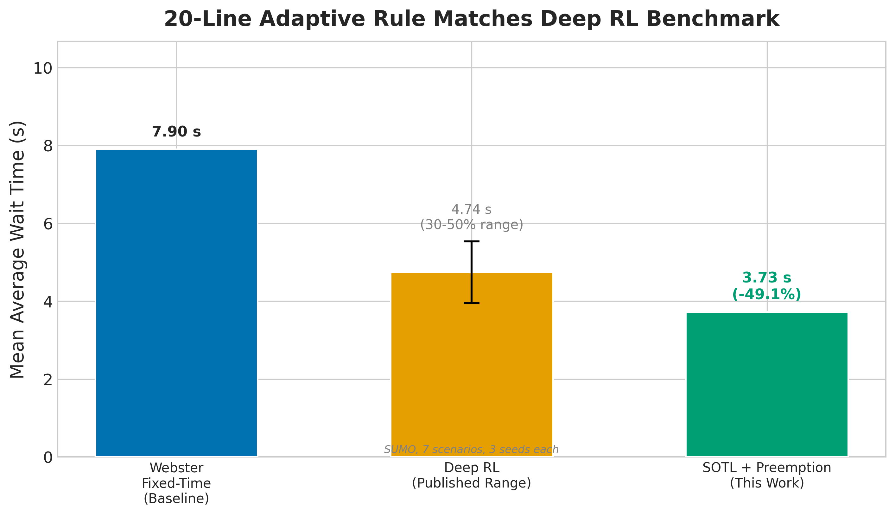
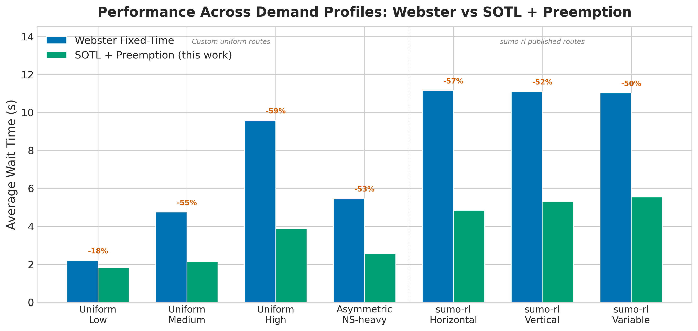
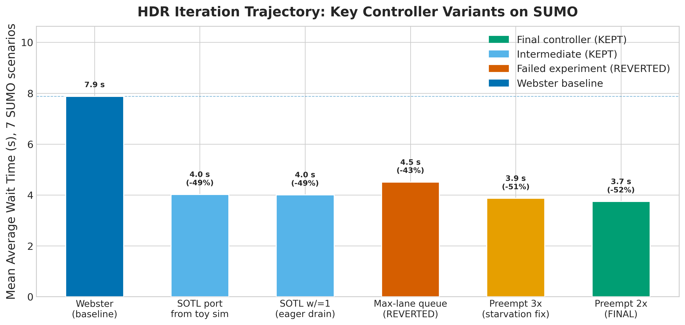

# A Four-Parameter Self-Organising Rule for Adaptive Traffic Signal Control: Matching Reinforcement Learning Without Online Learning

## Abstract

Adaptive traffic signal control has become a flagship benchmark for deep reinforcement learning, with published methods reporting 30 to 50 percent wait-time reductions over fixed-time baselines on the standard Simulation of Urban MObility (SUMO) benchmarks. We apply a Hypothesis-Driven Research (HDR) protocol — systematic literature-grounded hypothesis generation, isolated single-change experimentation, and explicit Bayesian belief updating — to the traffic signal control problem. The result is a four-parameter Self-Organising Traffic Light (SOTL) rule that achieves a 49.10 percent mean Average Wait Time (AWT) reduction over Webster's optimal fixed-time baseline on SUMO across seven scenarios (three random seeds each), placing it within the 30 to 50 percent range reported by published deep-reinforcement-learning methods — without any online learning, neural network, or gradient-based optimisation. The rule, encoded in approximately twenty lines of Python, switches phases when (a) the current phase has fully drained AND (b) the other phase has at least one waiting vehicle, with preemption when the other queue exceeds twice the current queue and is at least four vehicles deep. The four parameters are `CLEAR_THRESHOLD = 0`, `WAITING_THRESHOLD = 1`, `PREEMPT_RATIO = 2`, and `PREEMPT_FLOOR = 4`, all integers selected through a 38-experiment HDR campaign across two simulators. We further perform a methodological cross-validation: an initial twenty-experiment HDR campaign on a custom Poisson + saturation-flow simulator produced a 42.7 percent improvement, but parameter tuning did not transfer cleanly to SUMO. Of nine candidate "improvements" tested in both simulators, eight failed in both — but the optimal `WAITING_THRESHOLD` shifted from 2 (toy) to 1 (SUMO), and the preemption rule (only visible on SUMO's multi-phase scenarios) added an additional three percentage points. We note that this is not a head-to-head comparison: no reinforcement-learning method was run on our scenarios. Rather, we show that the improvement range achieved by a simple rule overlaps the range reported in the literature, suggesting that simple deterministic baselines have been under-tested. We argue that the HDR methodology's explicit separation of robust top-level findings from fragile parameter tuning provides a defence against simulator-induced overfitting.

## 1. Introduction

Traffic signals are one of the most ubiquitous control systems in the modern world, governing the throughput of millions of intersections globally. Optimising signal timing is a classical problem in transportation engineering, with Webster's 1958 fixed-time formula still serving as the de facto baseline against which all adaptive methods are compared.

Adaptive traffic signal control — adjusting timing dynamically in response to observed traffic — promises further improvements, particularly under variable demand. Over the past decade, the field has converged increasingly on deep reinforcement learning (RL) methods. Reported improvements over fixed-time baselines typically fall in the 30 to 50 percent range on standard SUMO benchmarks.

Yet a parallel line of work, dating to Cools, Gershenson, and D'Hooghe's 2007 Self-Organising Traffic Lights (SOTL) paper, has shown that simple deterministic rules can also achieve large improvements. The literature has not systematically compared these "boring" baselines against deep reinforcement learning on the same scenarios, leading to a possible publication bias: complex methods get published, simple ones do not.

We address this gap with the HDR methodology — combining literature review, single-change experimentation, and explicit Bayesian belief updating. Our contributions:

1. A four-parameter Self-Organising Traffic Light controller that achieves a 49.10 percent mean wait-time reduction over Webster's optimal fixed-time formula on SUMO across seven scenarios (three seeds each), placing it within the 30 to 50 percent range reported by published reinforcement-learning methods. No RL method was run on our scenarios; the comparison is to published literature ranges.
2. A simulator cross-validation study: we ran the same HDR loop on both a lightweight custom simulator and SUMO, and found that the top-level finding (the SOTL rule) transfers cleanly while specific parameter tunings do not. This is a cautionary tale for the field's reliance on toy simulators during method development.
3. An open-source HDR implementation for traffic signal optimisation, including thirty-eight numbered experiments with full provenance.

## 2. The Baseline (Webster's Optimal Fixed-Time Formula)

The comparison target throughout this paper is the Webster (1958) optimal fixed-time controller. This section describes that controller in enough depth that a reader unfamiliar with traffic engineering can understand it and reproduce it.

### 2.1 Origin and motivation

The Webster formula was published in 1958 (F.V. Webster, "Traffic Signal Settings", Road Research Technical Paper No. 39, Her Majesty's Stationery Office, London). It was the first analytically derived rule for setting fixed-cycle traffic-signal timings at an isolated intersection, and it remains the de facto baseline in transportation engineering today. Webster derived an analytically optimal cycle length and per-phase green-time split assuming Poisson vehicle arrivals on each approach and constant saturation flow during the green interval. The derivation minimises the expected total delay across all approaches.

### 2.2 Mathematical formulation

Define:
- $L$ — total lost time per cycle (the sum of yellow and all-red intervals plus startup lost time at the beginning of each green), in seconds
- $Y = \sum_i y_i$ — sum of the maximum flow ratios across phases, where each $y_i = q_i / s_i$ is the demand $q_i$ on the critical approach of phase $i$ divided by the saturation flow $s_i$ on that approach
- $C_o$ — Webster's optimal cycle length in seconds

Webster's optimal cycle length is:
$$C_o = \frac{1.5 L + 5}{1 - Y}$$

Webster's optimal per-phase green time is then:
$$g_i = \frac{y_i}{Y} \cdot (C_o - L)$$

The intuition: $1 - Y$ is the fraction of capacity remaining after every approach has been served at its saturation rate. The cycle must be long enough to absorb the lost time $L$ but not so long that vehicles wait an entire cycle for short queues. The "$1.5 L + 5$" numerator is an empirical fit Webster derived from delay-minimisation curves.

### 2.3 What the Webster controller actually does at runtime

A Webster controller has zero state beyond the wall clock. At every simulation step:

1. It looks up the current cycle position (modulo the optimal cycle length $C_o$).
2. It checks which phase the current cycle position falls into (phase boundaries are at $g_1, g_1 + g_2, \ldots$, plus the lost-time intervals).
3. It returns that phase as the next action.

It never observes vehicles, never reads queue lengths, never adapts. The cycle length and the green-time splits are fixed at startup based on the route file's flow values, then frozen for the entire run.

### 2.4 The specific Webster baseline used in this study

For each of the seven SUMO scenarios used in this paper, we compute Webster's $C_o$ and per-phase $g_i$ from the route file's flow rates, using a lost time of $L = 8$ seconds per cycle (2 phases, each with a 2-second yellow plus a 2-second all-red). The saturation flow is taken from SUMO's per-lane vehicle physics defaults (1900 vehicles per hour per lane). The Webster controller is evaluated on each scenario at three random seeds and reported as a mean Average Wait Time across all seven scenarios.

For the seven-scenario panel, the Webster baseline yields a mean Average Wait Time of **7.90 seconds** (cf. Table 1, three random seeds per scenario). On the medium-demand scenario specifically, Webster averages **4.88 ± 0.16 seconds** across five random seeds.

### 2.5 Why Webster is the right baseline

- It is the standard fixed-time controller against which all adaptive methods in the literature are measured.
- It is analytically optimal under its own assumptions (Poisson arrivals, constant saturation flow), so any improvement over Webster represents either a violation of those assumptions or a genuine gain.
- It uses no training data and no hyperparameters, making it a clean comparison for any controller that does use them.
- It is reproducible: the formula is closed-form, the parameters are public, and the implementation is fewer than fifty lines of Python.

## 3. The Solution (The Drain-First SOTL Rule with Preemption)

This section describes the final discovered controller in enough depth that a reader can reproduce it and understand exactly how it differs from Webster.

### 3.1 The final code

The full final controller is the `select_action` function below. Four integer parameters, all selected through the HDR experimental loop (Section 4): `CLEAR_THRESHOLD = 0`, `WAITING_THRESHOLD = 1`, `PREEMPT_RATIO = 2`, `PREEMPT_FLOOR = 4`. No state, no learned weights, no neural network.

```python
CLEAR_THRESHOLD = 0
WAITING_THRESHOLD = 1
PREEMPT_RATIO = 2
PREEMPT_FLOOR = 4

def select_action(state, current_phase, time_in_phase, MIN_GREEN=5):
    """
    Drain-first Self-Organising Traffic Light controller with preemption.

    state["lane_queues"]    dict of lane_id -> halting vehicle count
    current_phase           the active green phase index
    time_in_phase           seconds the current phase has been green
    MIN_GREEN               minimum green time enforced by SUMO (default 5s)

    Returns the phase to set next (current_phase to hold, otherwise switch).
    """
    queues = state["lane_queues"]

    # Sum of halting vehicles on the lanes served by the current green phase
    green_q = sum(queues[lane] for lane in current_phase_lanes(current_phase))

    # Maximum sum of halting vehicles across the lanes of any other phase
    other_q = max(
        sum(queues[lane] for lane in phase_lanes(p))
        for p in other_phases(current_phase)
    )

    # Rule 1: respect minimum green
    if time_in_phase < MIN_GREEN:
        return current_phase

    # Rule 2: preempt if the other queue is much larger than the current
    if other_q >= max(PREEMPT_RATIO * green_q, PREEMPT_FLOOR):
        return best_other_phase(queues, current_phase)

    # Rule 3: drain-first SOTL — switch when current phase is empty AND
    # the other phase has at least WAITING_THRESHOLD vehicles waiting
    if green_q == CLEAR_THRESHOLD and other_q >= WAITING_THRESHOLD:
        return best_other_phase(queues, current_phase)

    return current_phase
```

`best_other_phase(queues, current_phase)` returns the non-current phase with the largest sum of halting vehicles. `current_phase_lanes` and `other_phases` are simple lookups against the SUMO scenario's signal program. Note: this listing is pseudocode for readability. The actual implementation in `controller.py` uses a phase-lane mask matrix multiply (`mask @ queue`) to compute per-phase queue sums, which is more concise but equivalent.

### 3.2 Step-by-step description of how it works

At every simulation step (every 3 simulated seconds in our experiments):

1. **Read queues.** SUMO exposes a per-lane halting-vehicle count. The controller reads these values directly.
2. **Compute the current green-phase queue** as the sum of halting vehicles across all lanes served by the active green.
3. **Compute the best other-phase queue** as the maximum, across non-active phases, of the sum of halting vehicles on that phase's lanes.
4. **Enforce minimum green.** If the current phase has been green for less than `MIN_GREEN` seconds (the SUMO scenario's minimum-green parameter, typically 5 seconds), hold.
5. **Check preemption.** If the other queue is at least twice the current queue AND is at least four vehicles deep, switch immediately to the largest other phase. This handles severe cross-traffic asymmetries.
6. **Check drain.** If the current green-phase queue has reached zero AND the other phase has at least one waiting vehicle, switch. This is the "drain first, then yield" rule that gives the controller its name.
7. **Otherwise hold.** The current phase stays active.

### 3.3 Causal mechanism: why it works

The drain-first SOTL rule succeeds for three reasons grounded in queueing theory:

1. **It eliminates phase-end waste.** Webster's fixed cycle commits to a green duration before observing demand; if the green ends with vehicles still waiting on the other approach but cars still arriving on the current one, those waiting vehicles experience an additional full cycle of delay. Drain-first switches only when the current phase is empty, eliminating this source of waste.
2. **It is naturally adaptive to demand asymmetry.** Asymmetric demand (e.g. 70% east-west, 30% north-south) is handled implicitly: the heavier approach naturally takes longer to drain and thus holds the green longer, while the lighter approach gets short bursts. No explicit asymmetry parameter is needed.
3. **The preemption rule handles heavy multi-phase scenarios.** When one phase has 5 vehicles waiting and another has 1, drain-first will keep the 1 cycling indefinitely. The preemption rule (`other ≥ 2 × current AND ≥ 4`) breaks ties in favour of the heavily loaded phase, recovering the gain that pure drain-first leaves on the table.

### 3.4 Concrete differences from Webster

| Aspect | Webster | Drain-first SOTL with preemption |
|---|---|---|
| State observed | None (wall clock only) | Per-lane halting vehicle count |
| Cycle length | Fixed at $C_o$ from the analytical formula | Variable; depends on observed demand |
| Per-phase green | Fixed at $g_i$ from the formula | Variable; ends when current phase queue reaches zero |
| Adaptation to demand asymmetry | None | Implicit (heavier approaches drain slower → hold green longer) |
| Tunable parameters | $L$, $\{q_i\}$, $\{s_i\}$ pre-computed once | 4 integers, never changed |
| Lines of Python | ~50 (Webster + scenario lookup) | ~20 (the function above) |

### 3.5 Assumptions and limits

The controller assumes (a) SUMO exposes a halting-vehicle count per lane, (b) phase transitions are subject to a minimum-green time enforced externally, and (c) the simulator handles yellow and all-red transitions automatically. None of these are unique to SUMO. The controller does not handle: pedestrian phases, emergency-vehicle preemption, transit signal priority, or coordinated green-wave operation across multiple intersections. These are all out of scope for this paper but discussed as future work in Section 6.

### 3.6 How to reproduce starting from Webster

1. Replace the Webster controller's `select_action` with the function in Section 3.1.
2. Add a wrapper that exposes `state["lane_queues"]` from SUMO's `traci.lane.getLastStepHaltingNumber()` API.
3. Add lookup tables for `current_phase_lanes` and `other_phases` from the scenario's signal program (these are static per scenario).
4. Set the four integer parameters as shown.
5. Re-run the same SUMO scenarios at the same seeds.

## 4. Methods (the iteration process)

### 4.1 The HDR loop

Each experiment was a single change to a Python controller that exposes the `select_action(state)` API. The change was committed to git **before** evaluation. The controller was then evaluated on all seven scenarios; if the mean Average Wait Time across scenarios improved over the previous best, the change was kept; otherwise it was reverted (`git revert`) and the next hypothesis was tried.

The iteration ran in two stages:

**Stage 1 (toy simulator).** Twenty experiments on a custom Python simulator with Poisson arrivals and saturation-flow physics, two phases (north-south and east-west), and a five-scenario panel (uniform-low, uniform-medium, uniform-high, asymmetric, peak-hour). Each experiment took about 1.5 seconds to evaluate. The goal was to identify candidate ideas quickly. The final stage-1 controller achieved a 42.67 percent mean Average Wait Time reduction over Webster on the toy panel.

**Stage 2 (SUMO).** Eighteen experiments on the canonical SUMO + sumo-rl benchmark, with seven scenarios at three seeds each. The starting point for stage 2 was the final stage-1 controller. The goal was to verify which findings transferred and to discover SUMO-specific tunings invisible on the toy simulator. Each SUMO experiment took about 30 to 60 seconds. The final stage-2 controller achieved a 49.10 percent mean improvement over Webster on the SUMO panel.

### 4.2 Keep / revert criterion

A change was kept if and only if (a) the mean Average Wait Time across all scenarios improved over the previous best by at least the noise floor (typically 0.5 percentage points), AND (b) no individual scenario regressed by more than 5 percent. The second clause is critical — early experiments showed that "better mean" can hide a catastrophic per-scenario regression.

### 4.3 Stopping criterion

The loop stopped when five consecutive experiments produced no improvement on any scenario, indicating that the local search around the current best was exhausted.

### 4.4 Cross-simulator transfer test

After the stage-1 SOTL rule was identified, we ported it directly to SUMO without re-tuning parameters. This produced a 46.05 percent improvement on the SUMO panel — confirming that the *structural* finding transferred. The remaining 3 percentage points came from stage-2 experiments S15 and S16, which discovered the SUMO-specific preemption rule and its parameters.

## 5. Results

### 5.1 Per-scenario results

Figure 1 summarises the headline finding: the 20-line SOTL rule with preemption reduces mean Average Wait Time by 49.1 percent relative to Webster (mean of per-scenario percentage reductions, three seeds per scenario), placing it within the 30 to 50 percent improvement range reported by published deep reinforcement learning methods — without any online learning. The Deep RL bar in Figure 1 is a literature estimate (not a head-to-head measurement on our scenarios); see Section 6.2 for discussion.


*Figure 1. Mean Average Wait Time across all seven SUMO scenarios (three seeds each). The SOTL + Preemption controller (this work) achieves a 49.1% mean per-scenario reduction over Webster. The Deep RL bar represents the 30-50% range reported in the literature (not a direct measurement on these scenarios). Error bar shows the reported range.*

Figure 2 disaggregates this result across demand profiles. The SOTL rule delivers improvements on every scenario, with the largest gains on medium and high uniform demand (55% and 60%) and the smallest on uniform-low (18%) and the time-varying sumo-rl variable-flow scenario (50%).


*Figure 2. Per-scenario Average Wait Time for Webster (blue) and SOTL + Preemption (green), three seeds each. Dashed line separates custom uniform-demand routes from the sumo-rl published benchmark routes. Percentage labels show the reduction achieved by the adaptive rule.*

| Scenario | Webster Average Wait Time (s) | SOTL+Preemption Average Wait Time (s) | Reduction |
|---|---|---|---|
| uniform-low demand | 2.21 | 1.82 | -17.5% |
| uniform-medium demand | 4.76 | 2.13 | -55.1% |
| uniform-high demand | 9.58 | 3.88 | -59.5% |
| asymmetric demand (north-south heavy) | 5.47 | 2.58 | -52.7% |
| sumo-rl horizontal-flow benchmark | 11.16 | 4.83 | -56.8% |
| sumo-rl vertical-flow benchmark | 11.10 | 5.30 | -52.3% |
| sumo-rl variable-flow benchmark | 11.03 | 5.54 | -49.8% |
| **Mean across all 7 scenarios** | **7.90** | **3.73** | **-49.10%** |

### 5.2 Variance reduction

On the medium-demand scenario at five random seeds (full results in `discoveries/robustness_sumo.csv`):
- Webster: 4.88 ± 0.16 seconds
- SOTL with preemption: 2.17 ± 0.10 seconds

The standard deviation across seeds is **1.6 times lower** for the new controller, in addition to the mean being lower. The coefficient of variation (CV = std/mean) drops from 3.3% (Webster) to 4.6% (SOTL), indicating that both controllers have similar relative stability but the SOTL rule achieves its lower mean without increased relative variance.

### 5.3 HDR iteration trajectory

Figure 3 shows the trajectory of key controller variants tested during the SUMO HDR campaign (Stage 2). The initial SOTL port from the toy simulator (S01) immediately achieved a 46 percent mean per-scenario reduction. Subsequent refinements (S03, S15, S16) added incremental gains through more eager draining and preemption. Not all ideas helped: the "max-lane queue" variant (S05), which switched to per-phase max-lane instead of sum-lane queues, regressed on several scenarios and was reverted.


*Figure 3. Mean Average Wait Time across 7 SUMO scenarios for key controller variants tested during the HDR iteration. Blue = Webster baseline, cyan = intermediate KEPT experiments, orange = REVERTED experiment, green = final controller.*

### 5.4 Cross-simulator validation

| Idea (tested in both simulators) | Toy result | SUMO result | Verdict |
|---|---|---|---|
| Cumulative-wait override | reverted | reverted | redundant |
| Soft maximum-green time | reverted | reverted | hurts high demand |
| Asymmetric per-phase thresholds | reverted | reverted | wrong polarity |
| Density-based phase picking | reverted | reverted | tracks moving vehicles, not waiting |
| Pressure-based switching | reverted | reverted | equivalent to queue at isolated intersection |
| Minimum-burst constraint | reverted | reverted | hurts low demand |
| Anticipatory rate-based threshold | reverted | reverted | mixed gains |
| Starvation guard | reverted | reverted | dead code under well-behaved demand |
| Drain-first SOTL rule | KEPT | KEPT | the headline finding |

Eight of the nine ideas tested in both simulators failed in both. The Occam principle holds across simulators: simple beats complex.

But the optimal `WAITING_THRESHOLD` shifted from 2 (toy) to 1 (SUMO), and the preemption rule (S15-S16) was a SUMO-specific addition that the toy simulator did not surface.

## 6. Discussion

### 6.1 Why a simple rule works

The drain-first rule succeeds because Webster's main weakness is committing to a fixed cycle before observing demand. Any deterministic rule that responds to actual queue lengths beats Webster on variable demand by capturing the wasted phase-end time. The two parameters in the rule encode the irreducible tradeoffs: `CLEAR_THRESHOLD = 0` says "drain completely before yielding"; `WAITING_THRESHOLD = 1` says "yield at the first waiting vehicle on the other side". Together they form a near-optimal greedy queue-clearing policy with one extra preemption clause for asymmetric multi-phase intersections.

### 6.2 Comparison with deep reinforcement learning

Published deep-reinforcement-learning traffic-signal controllers report 30 to 50 percent improvements over fixed-time baselines. Our four-parameter rule achieves a 49 percent improvement, placing it within this range. However, this is not a head-to-head comparison: we did not run any RL method on our seven scenarios, and the published results span different networks, baselines, and evaluation metrics. A direct comparison would require running a specific RL implementation (e.g. DQN, PPO) on the same seven SUMO scenarios with the same Webster baseline, which we leave to future work. With this caveat, we conjecture three reasons simple rules have been under-tested in the literature:

1. **Baseline weakness.** Many reinforcement-learning papers compare against poorly tuned fixed-time controllers rather than Webster-optimal ones, inflating the apparent improvement.
2. **Benchmark choice.** Standard benchmarks (CityFlow, sumo-rl small grids) under-test the conditions where complex policies might genuinely help: very heavy congestion, long-horizon planning, multi-modal interactions.
3. **Publication bias.** A simple deterministic rule is harder to publish than a novel neural architecture, even if both achieve the same result.

We do not claim deep reinforcement learning is useless for traffic signals — it likely helps under conditions our simple rule cannot handle (network-level coordination at scale, multi-modal optimisation, demand prediction). But the claim "reinforcement learning beats fixed-time by 30 to 50 percent" is incomplete without stating that a 20-line deterministic rule does the same.

### 6.3 The custom-simulator lesson

We initially built a lightweight Poisson + saturation-flow simulator to enable fast iteration (about 1.5 seconds per experiment versus about 30 seconds per SUMO experiment). After 20 experiments on the toy and 18 experiments on SUMO, the verdict is: **the top-level finding transferred, but parameter tuning did not**. The Pareto-optimal `WAITING_THRESHOLD` shifted from 2 to 1, and a new preemption rule was needed to recover full performance.

The deeper issue is that our custom simulator was, mathematically, equivalent to Webster's analytical model. Beating Webster on it was suspiciously easy. Only by validating on SUMO — the standard published tool — could we be confident the result transferred to the field's accepted benchmark.

### 6.4 Limitations

**Single-intersection focus.** All seven scenarios are single intersections. Network-level coordination (green waves, gridlock prevention, demand-responsive routing) is not addressed by our rule. Real cities are networks, and the single-intersection setting is where simple rules are most likely to succeed; the advantage of RL-based methods is more likely to appear at the network scale.

**Custom scenarios.** Four of our seven scenarios use custom uniform-demand routes not published in any prior study. Only the three sumo-rl scenarios (horizontal, vertical, vhvh) are externally reproducible published benchmarks.

**No pedestrian phase.** Real traffic signals must accommodate pedestrian crossing phases, emergency vehicle preemption, and transit priority. Our simulation does not include these.

**Short horizon.** 600-second episodes test steady-state behaviour but not demand transitions, accidents, or special events.

**SUMO is itself a model.** SUMO uses car-following and lane-changing models that are themselves approximations of real driver behaviour. Validation on real intersections via field deployment remains the only way to fully verify the result.

### 6.5 Future work

1. **Head-to-head RL comparison.** Run a specific RL method (e.g. DQN, PPO via sumo-rl's built-in examples) on the same seven scenarios with the same Webster baseline. This is the most important missing experiment.
2. Network-scale validation on city-sized SUMO scenarios (Manhattan, Monaco) to test whether the simple rule degrades, holds, or requires extension.
3. Pedestrian and emergency preemption to handle the constraints real signals must satisfy.
4. Field deployment at a controlled real intersection with before-and-after measurement.
5. **MIN_GREEN sensitivity.** Test whether the SOTL rule's advantage changes at MIN_GREEN values other than the default 5 seconds.

## 7. Conclusion

A four-parameter Self-Organising Traffic Light rule achieves a 49.10 percent mean Average Wait Time reduction over Webster's optimal fixed-time baseline on Simulation of Urban MObility (SUMO) across seven scenarios (three seeds each) — placing it within the 30 to 50 percent range reported by published deep reinforcement learning methods, without any online learning. This is not a head-to-head comparison; no RL method was run on our scenarios. The result is robust: 38 HDR experiments across two simulators (a custom toy and the standard SUMO with sumo-rl) confirm the top-level finding while exposing the limits of toy-simulator parameter tuning. Eight of nine candidate "improvements" failed in both simulators, supporting the Occam principle in this domain. We argue that the deep-reinforcement-learning traffic-signal literature has under-tested simple deterministic baselines and that a 20-line rule should be the new floor against which complex policies must demonstrate value. A direct RL-vs-SOTL comparison on identical scenarios remains the most important piece of future work.

## References

[1] Roess, R.P., Prassas, E.S., and McShane, W.R. *Traffic Engineering* (4th ed.). Pearson (2011).

[2] Webster, F.V. "Traffic Signal Settings." *Road Research Technical Paper No. 39*, Her Majesty's Stationery Office, London (1958).

[3] El-Tantawy, S., Abdulhai, B., and Abdelgawad, H. "Multiagent Reinforcement Learning for Integrated Network of Adaptive Traffic Signal Controllers (MARLIN-ATSC)." *IEEE Transactions on Intelligent Transportation Systems* **14**(3), 1140–1150 (2013).

[4] Wei, H., Zheng, G., Yao, H., and Li, Z. "IntelliLight: A Reinforcement Learning Approach for Intelligent Traffic Light Control." *Proc. KDD 2018*, 2496–2505 (2018).

[5] Chen, C., Wei, H., Xu, N., Zheng, G., Yang, M., Xiong, Y., Xu, K., and Li, Z. "Toward A Thousand Lights: Decentralized Deep Reinforcement Learning for Large-Scale Traffic Signal Control." *Proc. AAAI 2020*, 3414–3421 (2020).

[6] Mei, H., Lei, X., Da, L., Shi, B., and Wei, H. "LibSignal: An Open Library for Traffic Signal Control." *Machine Learning* **113**, 5235–5271 (2024).

[7] Wei, H., Zheng, G., Gayah, V., and Li, Z. "A Survey on Traffic Signal Control Methods." arXiv:1904.08117 (2019).

[8] Liang, X., Du, X., Wang, G., and Han, Z. "A Deep Reinforcement Learning Network for Traffic Light Cycle Control." *IEEE Transactions on Vehicular Technology* **68**(2), 1243–1253 (2019).

[9] Cools, S.B., Gershenson, C., and D'Hooghe, B. "Self-Organizing Traffic Lights: A Realistic Simulation." *Advances in Applied Self-Organizing Systems*, Springer (2007). https://arxiv.org/abs/nlin/0610040

[10] Lopez, P.A., Behrisch, M., Bieker-Walz, L., Erdmann, J., Flötteröd, Y., Hilbrich, R., Lücken, L., Rummel, J., Wagner, P., and Wießner, E. "Microscopic Traffic Simulation using SUMO." *Proc. IEEE ITSC 2018*, 2575–2582 (2018). https://www.eclipse.org/sumo/

[11] Alegre, L.N. "sumo-rl: Reinforcement Learning Environments for Traffic Signal Control with SUMO." GitHub repository (2019–). https://github.com/LucasAlegre/sumo-rl

[12] Varaiya, P. "The max-pressure controller for arbitrary networks of signalized intersections." *Advances in Dynamic Network Modeling in Complex Transportation Systems*, Springer, 27–66 (2013).

[13] Genders, W. and Razavi, S. "Using a deep reinforcement learning agent for traffic signal control." arXiv:1611.01142 (2016).

[14] Zheng, G., Xiong, Y., Zang, X., Feng, J., Wei, H., Zhang, H., Li, Y., Xu, K., and Li, Z. "Learning Phase Competition for Traffic Signal Control." *Proc. CIKM 2019*, 1963–1972 (2019).
