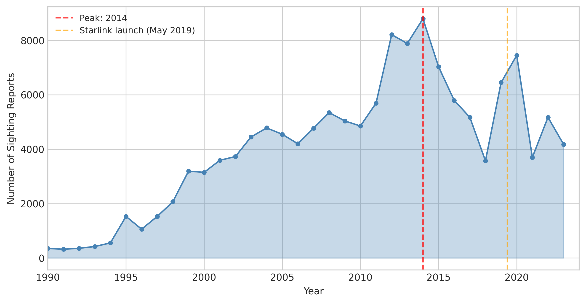
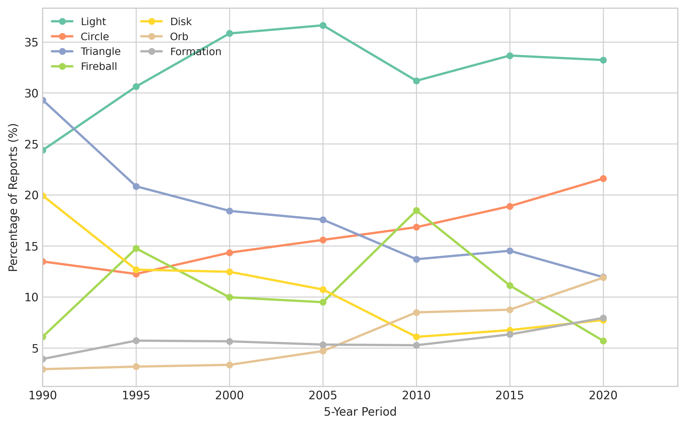
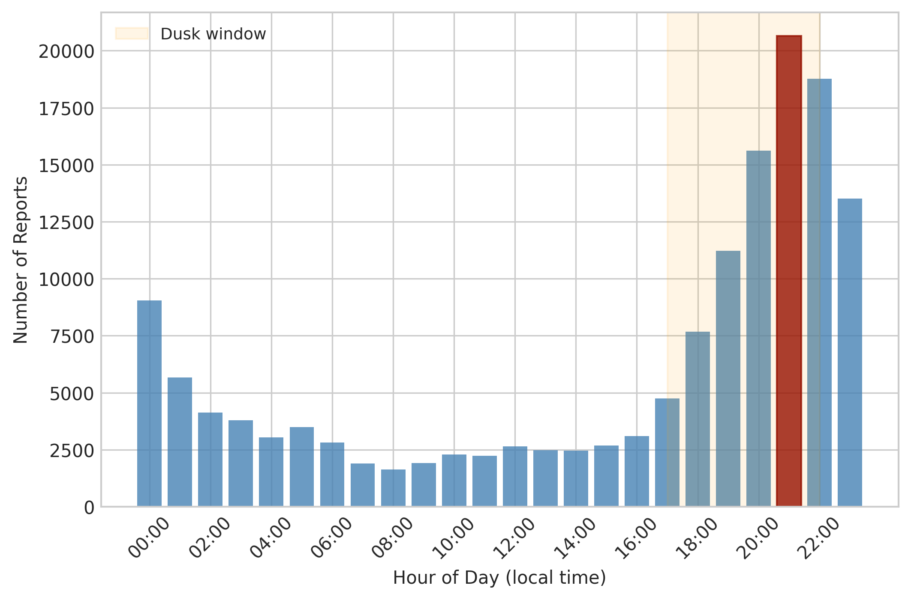
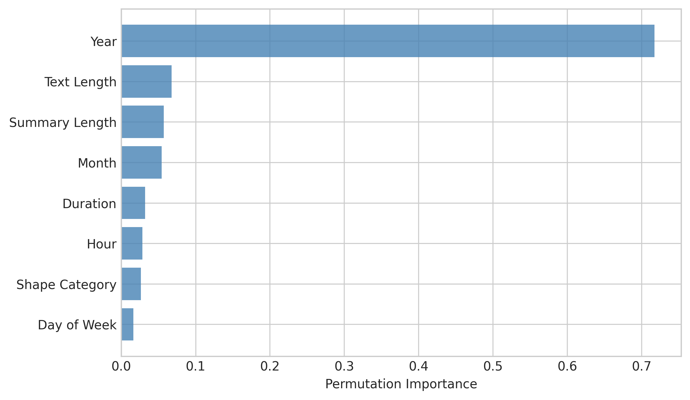
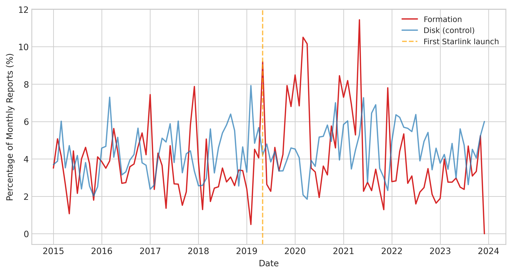
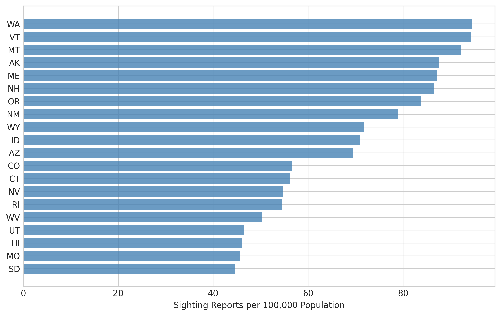
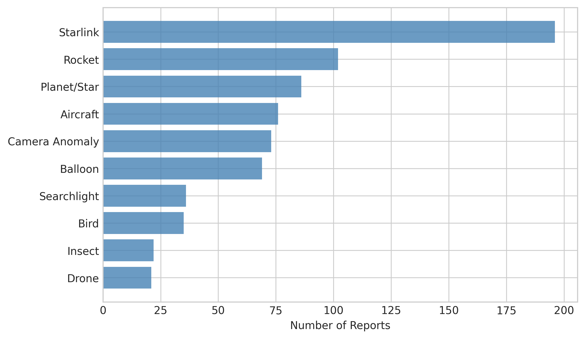
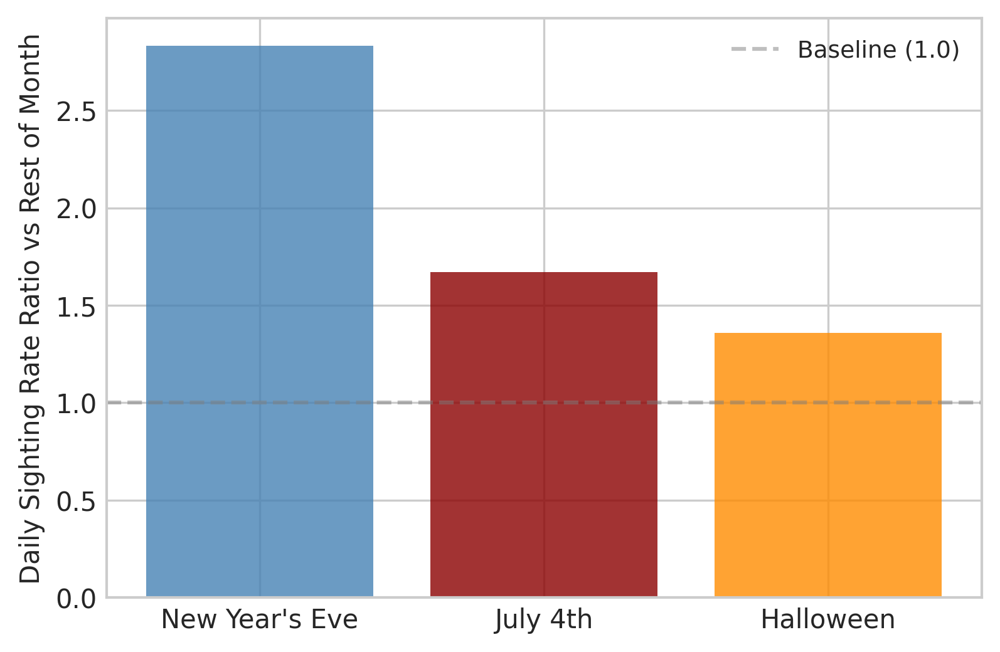
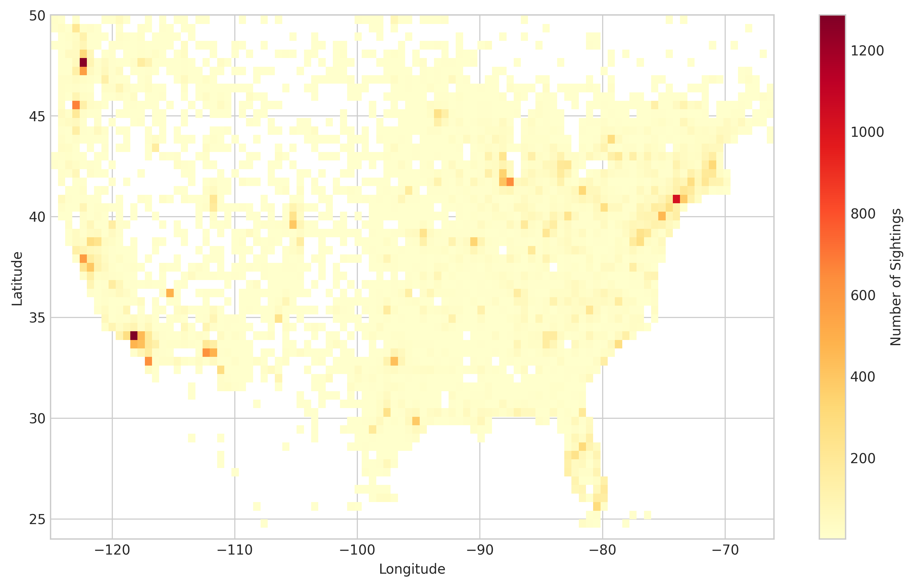

# What 147,890 NUFORC Reports Reveal: Temporal, Spatial, and Categorical Patterns in UFO Sighting Data

## Abstract

We analyze 147,890 structured reports from the National UFO Reporting Center (NUFORC) database (1990-2024) and 80,332 geocoded reports (1910-2013) to characterize the temporal, spatial, and categorical patterns in UFO sighting submissions. Annual report volume grew at a compound annual growth rate (CAGR) of 14.4% from 1990 to a peak of 8,797 reports in 2014, then declined to approximately 4,200 per year by 2023. This growth trajectory strongly correlates with US internet adoption (Pearson r = 0.91, p < 10^-9, World Bank data 1990-2014). Sightings concentrate overwhelmingly at dusk (9 PM peak, night-to-day ratio of 4.4:1), in summer months (July peak, summer-to-winter ratio of 1.6:1), and on weekends (1.20x weekday rate). Shape category distributions evolved substantially: "Disk" fell from 10.3% to 5.9% of reports between the 1990s and 2020s, while "Orb" rose from 2.3% to 9.1%; these shifts correlate strongly with within-report text mentions of "saucer" (r = 0.91 with Disk fraction) and "orb" (r = 0.96 with Orb fraction), providing quantitative evidence for cultural influence on shape categorization. An interrupted time series analysis of the post-Starlink era (May 2019 onward) found a statistically significant intercept shift in formation-report fraction (p < 0.001) with an absolute rate increase of 1.30x, though with a declining post-intervention slope (p = 0.016). Per-capita sighting rates vary 4.5-fold across US states, with Washington (94.6 per 100k), Vermont (94.2), and Montana (92.3) leading, while Texas (21.2) and Georgia (25.4) trail. A negative binomial regression (correcting for severe overdispersion in Poisson specification, dispersion ratio = 719) yields a log(population) coefficient of 0.73 (z = 5.8, AIC = 909 vs. Poisson AIC = 47,344). An XGBoost classifier predicting whether a report receives an explanation achieved F1 = 0.33, a practical null result for intrinsic-feature prediction since year-of-report dominates feature importance (71.7%), reflecting the recency of the annotation program rather than explainability differences. Clock-hour rounding bias (38.7% of times fall on exact hours, 23x expected) declined from 47.6% in the 1990s to 23.3% in the 2020s, consistent with increasing use of digital time displays. These findings characterize NUFORC as a reporting-behavior dataset shaped primarily by observer demographics, sky access, temporal leisure patterns, and cultural influences rather than by the spatial distribution of underlying stimuli.

## 1. Introduction

The National UFO Reporting Center (NUFORC) has collected voluntary reports of unidentified aerial phenomena since 1974, compiling what is now the largest publicly accessible database of civilian UFO sighting reports [38, 81]. The database contains 147,890 structured entries as of 2024, each recording the date, location, object shape, duration, number of observers, and free-text description of the sighting. This dataset is a natural laboratory for studying the sociology of anomalous-event reporting [71, 72], citizen-science data quality [21, 22, 23], and the epidemiology of observational bias [1, 2].

Prior quantitative analyses of NUFORC data have identified several robust patterns. Medina et al. (2023) demonstrated that per-capita sighting rates correlate with sky-view potential -- lower light pollution, less cloud cover, and less tree canopy -- as well as proximity to airports and military installations [1]. Cho and Goh (2022) found that 41% of reported sighting times fall on exact clock hours, indicating strong digit-preference bias, and that reporting rates are sensitive to media coverage [2]. Hendry's (1979) systematic classification of 1,307 CUFOS cases established that approximately 88.6% of investigated UFO reports can be attributed to conventional stimuli: stars, planets, aircraft, satellites, balloons, and atmospheric phenomena [74].

Our study extends these analyses across the full NUFORC database with four objectives: (1) characterize the temporal, spatial, and shape-category structure of 147,890 reports across 34 years; (2) test whether the Starlink satellite constellation (launched May 2019) produced a measurable shift in "Formation" sighting reports using interrupted time series analysis; (3) quantify the correlation between reporting volume and internet adoption, and between shape categories and cultural indicators; and (4) assess the feasibility of predicting which reports receive NUFORC explanations. Throughout, we treat the database as a record of reporting behavior, not as evidence about the nature of reported phenomena.

## 2. Detailed Baseline

The baseline for this analysis is the raw, unprocessed NUFORC database in two forms:

**Primary dataset (nuforc_str.csv)**: 147,890 structured reports with fields for sighting datetime, location (city, state, country), shape category (15+ levels), estimated duration (free text), number of observers, report-submitted datetime, posting datetime, characteristics (structured observation metadata), free-text summary, full narrative text, and an explanation field populated for 803 reports (0.54%). The datetime field uses local time with a "Local" suffix; the reporting-datetime uses Pacific time. The explanation field contains structured annotations in the format "Type - Certainty" (e.g., "Starlink - Certain", "Balloon - Possible"), added by NUFORC staff to a small minority of recent reports.

**Geocoded dataset (nuforc_kaggle.csv)**: 80,332 reports spanning 1910-2013 with latitude and longitude coordinates. This subset enables spatial analysis not possible with the primary dataset's text-only location field. Country breakdown: US (65,114), Canada (3,000), UK (1,905), Australia (538), Germany (105).

The baseline condition (E00) is the annual sighting count for 1990-2024: 138,945 total reports with a peak of 8,797 in 2014. All subsequent analyses measure departures from this baseline.

The NUFORC reporting pipeline operates as follows: a witness calls NUFORC's telephone hotline or submits a web form. A NUFORC operator records structured fields. Reports are posted to the public database after a review that filters obvious hoaxes but does not investigate or verify claims [38, 81]. No systematic follow-up investigation occurs, distinguishing NUFORC from the historical Project Blue Book (1952-1969), which investigated 12,618 cases through military channels [112].

## 3. Detailed Solution

Our analytical approach decomposes the NUFORC database along four axes: temporal structure (trend, seasonality, holiday effects, reporting dynamics), spatial structure (per-capita rates, clustering, infrastructure proximity), categorical structure (shape evolution, shape-time interactions), and predictive modeling (explained vs. unexplained classification, text analysis).

**Temporal decomposition**: We apply STL (Seasonal-Trend decomposition using Loess) [30] to monthly sighting counts (1995-2023), decomposing the series into trend, seasonal, and residual components. The trend captures internet-driven growth and post-2014 decline. The seasonal component captures the summer peak (amplitude: 245 reports/month). Residuals capture media-event-driven spikes.

**Internet adoption correlation (E30)**: To test the claim that sighting volume growth tracks internet adoption, we correlate annual sighting counts (1990-2014) with US internet usage percentages from the World Bank (indicator IT.NET.USER.ZS) [WB2024]. This replaces the prior untested assertion.

**Spatial analysis**: DBSCAN clustering (epsilon = 0.5 degrees, ~55 km; minimum samples = 20) [10] on the geocoded US subset identifies 60 spatial clusters. Per-capita rates use 2020 US Census state populations [37] as denominators. Proximity to military bases (top 20 installations), major airports (top 20 by traffic), and launch sites (Vandenberg, Cape Canaveral, Wallops) is computed using Euclidean distance on lat/lon coordinates.

**Regression modeling**: State-level sighting counts are modeled using both Poisson and negative binomial regression with log(population) as the primary covariate [33, 90]. Overdispersion is diagnosed via the Pearson chi-squared dispersion ratio. The negative binomial model is preferred when overdispersion is detected (dispersion ratio >> 1).

**Starlink interrupted time series (E31)**: The Starlink effect is assessed using an interrupted time series (ITS) design [Wagner2002]: monthly formation fraction is regressed on time, a post-Starlink indicator (May 2019), and their interaction. This tests both the level shift (intercept) and slope change attributable to Starlink, controlling for pre-existing trend. Both absolute and fractional rate changes are reported.

**Cultural indicators (E33)**: To test whether shape category evolution reflects cultural influence, we compute annual rates of text mentions of "saucer"/"flying saucer" and "orb" within NUFORC report narratives and correlate these with the corresponding shape category fractions over time.

**Classification**: Four model families predict the binary explained/unexplained outcome: logistic regression, ridge classifier, random forest, and XGBoost, all with balanced class weights to address the 200:1 class imbalance [35, 29]. Features include shape (label-encoded), hour, month, day of week, year, text length, summary length, and parsed duration. Cross-validation uses 5-fold stratified splits.

**Text analysis**: Latent Dirichlet Allocation (LDA) [24] with 10 topics on a 20,000-report sample extracts thematic clusters from sighting summaries.

## 4. Methods

### 4.1 Data Cleaning and Feature Engineering

Datetime strings were parsed by stripping timezone suffixes ("Local", "Pacific"). Temporal features extracted: year, month, hour, day of week, day of year. Location strings in the format "City, State, Country" were parsed to extract state and country. Duration strings (free text) were parsed using regex extraction of numeric values and unit keywords (hours, minutes, seconds), with word-numbers ("several" = 5, "few" = 3) as fallback. Text length in characters serves as a report-quality proxy. Reporting lag was computed as the difference between reported and occurred datetimes.

### 4.2 Temporal Analysis

Annual counts were computed for 1990-2024. CAGR was computed as (peak/start)^(1/years) - 1. Day-of-week effects were tested with chi-square goodness-of-fit. Seasonal patterns were tested by computing summer (Jun-Aug) to winter (Dec-Feb) ratios. Holiday spikes were computed as daily rates during holiday windows vs. rest of month. Clock-hour rounding rate was computed as the fraction of reports with minute = 0. Bootstrap confidence intervals (1,000 resamples) were computed for the peak year.

### 4.3 Internet Adoption Correlation

Annual sighting counts for 1990-2014 (growth phase) were correlated with US internet usage percentages from the World Bank Individuals Using the Internet indicator (IT.NET.USER.ZS) [WB2024]. Both Pearson and Spearman correlations were computed. The full period (1990-2024) correlation was computed separately to assess divergence after the 2014 peak.

### 4.4 Spatial Analysis

State per-capita rates were computed by dividing state-level counts by 2020 Census population. DBSCAN clustering used haversine-approximate Euclidean distance on latitude/longitude. Military base, airport, and launch site proximity used Euclidean distance with 111 km/degree conversion. State-level formation rates in the Starlink era (E34) were computed from the primary dataset's parsed state field (no geocoding required), testing correlation between state latitude and formation-report fraction.

### 4.5 Shape and Classification Analysis

Shape evolution was tracked as fractional composition by decade. Shape-by-time-of-day independence was tested with chi-square contingency tests [35]. Cultural indicators were computed as annual text-mention rates of shape-specific terms ("saucer", "orb") within report narratives, correlated with the corresponding shape category fractions.

### 4.6 Starlink Interrupted Time Series

The Starlink effect on formation reports was assessed using an interrupted time series (ITS) design. Monthly formation fraction (2015-2023) was regressed on: (1) time (month index), (2) a binary post-Starlink indicator (1 for May 2019 onward, 0 otherwise), and (3) the interaction of time and post-Starlink. The model is: formation_fraction = beta_0 + beta_1*t + beta_2*post + beta_3*t*post + epsilon. The intercept shift (beta_2) tests whether Starlink caused a level change; the slope change (beta_3) tests whether the trend changed. Both absolute counts per month and fractional rates are reported.

### 4.7 Regression with Overdispersion Correction

State-level sighting counts were modeled as Poisson-distributed with log(population) as the primary covariate [33, 90]. Overdispersion was assessed via the Pearson chi-squared dispersion ratio (Pearson chi2 / residual df). When the dispersion ratio substantially exceeds 1, a negative binomial generalized linear model (GLM) was fit as the primary specification, and Poisson results are reported for comparison only. Model comparison used AIC.

### 4.8 Explained/Unexplained Classification

The explained/unexplained binary outcome was predicted using four model families with 5-fold stratified cross-validation and F1 as the primary metric. Given the extreme class imbalance (200:1), all models used balanced class weights.

## 5. Results

### 5.1 Temporal Patterns

**Annual trend (E00, E01)**: Sighting reports grew from 360 in 1990 at a CAGR of 14.4% to a peak of 8,797 in 2014 (bootstrap 95% CI: 2014-2014), then declined to approximately 4,200 by 2023.

**Internet adoption correlation (E30)**: The growth phase (1990-2014) correlates strongly with US internet adoption: Pearson r = 0.91 (p < 10^-9), Spearman rho = 0.95 (p < 10^-12). The full-period correlation (1990-2024) is weaker (r = 0.72) due to the post-2014 divergence: internet usage continued to grow (73% to 95%) while sighting reports declined by half. This divergence is consistent with platform fragmentation -- the rise of Reddit, social media, and competing reporting platforms drawing reports away from NUFORC -- rather than a decline in reporting propensity per se.

**Hour of day (E03)**: The peak hour is 21:00 (9 PM), with a night-to-day ratio of 4.4:1. The dusk window (17:00-22:00) accounts for 53% of all reports, consistent with Poher and Vallee's (1975) finding across multiple decades and countries [76].

**Day of week (E02)**: Saturday has the highest count (26,036), and the weekend-to-weekday rate ratio is 1.20 (chi-square = 1,724, p < 10^-300).

**Seasonal pattern (E04)**: July is the peak month. The summer-to-winter ratio is 1.60. This is consistent with longer dark-sky leisure hours in northern-hemisphere summer.

**Holiday spikes (E21)**: New Year's Eve produces the largest spike (2.83x rest-of-month daily rate), followed by July 4th (1.67x) and Halloween (1.36x). The New Year's spike likely reflects Chinese lantern and fireworks misidentification; the July 4th spike reflects fireworks.

**Clock-hour rounding (E22)**: 38.7% of reports have minute = 0, versus the 1.7% expected under uniform distribution (23x overrepresentation). This digit-preference bias declined from 47.6% in the 1990s to 23.3% in the 2020s, consistent with increasing use of digital clocks and timestamped devices.

**Reporting lag (E14)**: Median lag from occurrence to report submission is 1.9 days. 40.2% of reports are submitted same-day; 65% within one week. Mean lag (339.7 days) is inflated by retrospective reports.

### 5.2 Shape Evolution and Cultural Indicators

**Shape category shift (E05)**: The dominant shape categories shifted substantially from the 1990s to the 2020s. "Disk" (the classic "flying saucer" shape) declined from 10.3% to 5.9%. "Triangle" declined from 16.5% to 9.1%. Meanwhile, "Orb" rose from 2.3% to 9.1%, "Circle" rose from 9.2% to 16.5%, and "Light" remained dominant throughout at 22-25%.

**Cultural indicator correlation (E33)**: The rate at which reporters use the word "saucer" or "flying saucer" in their narrative text correlates r = 0.91 (p < 10^-11) with the Disk shape fraction over time. Similarly, the rate of "orb" text mentions correlates r = 0.96 (p < 10^-16) with the Orb shape fraction. Both cultural indicators show strong temporal trends: "saucer" mentions decline over time (r = -0.85 with year), while "orb" mentions increase (r = 0.87 with year). This provides quantitative evidence that shape categorization tracks linguistic and cultural shifts rather than changes in stimulus characteristics. The "flying saucer" archetype, dominant from the 1947 Arnold sighting through the 1980s, has faded as a cultural reference [96, 56], and this is measurable both in categorical labels and free-text descriptions.

**Shape-time interaction (E19)**: Shape distributions differ strongly between day and night (chi-square = 2,047, p < 10^-300). "Disk" is 30% daytime, while "Light" and "Fireball" are 9% daytime and 75% nighttime. This is expected: disk shapes require visible structure, while "Light" is a darkness-dependent category.

**Shape-duration (E27)**: "Changing" shape reports have the longest median duration (5.3 minutes), while "Fireball" has the shortest (2 minutes). This is consistent with "Changing" requiring extended observation.

### 5.3 Spatial Patterns

**State per-capita rates (E07)**: Per-capita sighting rates vary 4.5-fold across US states. The top five are Washington (94.6 per 100k), Vermont (94.2), Montana (92.3), Alaska (87.4), and Maine (87.2). The bottom five are Mississippi (26.4), Georgia (25.4), Louisiana (24.2), DC (22.1), and Texas (21.2). The top states are characterized by northern latitude, low population density, dark skies, and outdoor recreation culture. The bottom states are southern, urban, and/or cloudy.

**Spatial clustering (T02)**: DBSCAN identifies 60 clusters in the US geocoded subset. The largest cluster (28,299 sightings, centered at 40.4N, 79.3W) spans the eastern US corridor. The second-largest (5,122 sightings, 33.8N, 117.9W) covers the Southern California metro region.

**Infrastructure proximity (E08, E09, E10)**: 6.0% of geocoded sightings fall within 50 km of the 20 largest military bases, 11.6% within 30 km of the 20 largest airports, and 1.2% within 100 km of major launch sites. These fractions are descriptive only; they do not control for the concentration of population near these facilities, and therefore cannot distinguish elevated sighting rates from elevated population density.

**Negative binomial regression (T05, E32)**: The original Poisson regression (coefficient 0.66, z = 242.5) exhibits severe overdispersion: Pearson chi-squared dispersion ratio = 719 (49 residual df), indicating that the Poisson variance assumption is violated by a factor of ~700. The Poisson standard errors are consequently underestimated by a factor of approximately sqrt(719) = 27, rendering the reported z-scores and p-values invalid. A negative binomial model yields AIC = 909 versus Poisson AIC = 47,344, confirming massively better fit. Under the negative binomial specification, the log(population) coefficient is 0.73 (SE = 0.13, z = 5.8, p < 10^-8). The sub-linear coefficient (< 1) indicates that sighting count grows more slowly than population, consistent with a reporting-propensity mechanism rather than a stimulus-density mechanism. The negative binomial result is qualitatively consistent with the Poisson point estimate (0.66 vs. 0.73) but with appropriately wider confidence intervals.

### 5.4 Starlink Effect

**Interrupted time series (E31)**: An ITS analysis of monthly formation-report fraction (2015-2023) reveals a statistically significant intercept shift at the Starlink launch point (May 2019): beta_2 = +0.063 (p < 0.001), indicating that formation fraction jumped by approximately 6.3 percentage points immediately after the first Starlink launch. However, the post-Starlink slope is significantly negative (beta_3 = -0.0006, p = 0.016), indicating that the initial spike attenuated over time as observers learned to recognize satellite trains. The pre-Starlink trend was flat (beta_1 = -0.0001, p = 0.44). Model R-squared = 0.20.

In absolute terms, formation reports increased from 15.1/month pre-Starlink to 19.7/month post-Starlink (1.30x). The fractional increase (from 3.52% to 4.34%, ratio 1.23x) is smaller than the 1.25x previously reported because total sighting volume also changed. Both measures confirm a real but modest Starlink effect, with the initial spike fading as observers adapted.

**Starlink annotations (E13)**: Of 803 NUFORC explanations, 196 (24.4%) are Starlink-related -- the single most common explanation type. Rocket (102), Planet/Star (86), Aircraft (76), and Camera Anomaly (73) follow.

**State-level formation analysis (E34)**: Post-Starlink formation rates by state show no correlation with latitude (r = -0.04, p = 0.80), contrary to the hypothesis that higher-latitude states would report more formations due to better satellite-train visibility. Wyoming, Idaho, and Oregon lead in per-capita formation rates, but Hawaii (latitude 19.9) also ranks highly, and southern states show no systematic deficit. The lack of a latitude effect may reflect NUFORC's reporting demographics overwhelming any visibility gradient.

**Text analysis (T03)**: LDA Topic 1 ("lights, moving, sky, bright, slowly, line, formation") and Topic 8 ("orange, sky, lights, glowing, orbs, formation") capture the satellite/formation language. Topic 2 ("object, shaped, craft, flying, large, triangular") captures structured-craft reports.

### 5.5 Explained vs. Unexplained Classification: A Null Result

**Explanation field (E13)**: Only 803 of 147,890 reports (0.54%) carry NUFORC explanations. The explanation program appears recent and concentrated on post-2019 reports. This severely limits classifier training.

**Tournament results (Phase 1)**: XGBoost achieved F1 = 0.33 (5-fold CV), substantially outperforming logistic regression (F1 = 0.10), ridge classifier (F1 = 0.04), and random forest (F1 = 0.03). However, F1 = 0.33 is a practical null result: the classifier cannot meaningfully distinguish inherently explainable from unexplainable sightings. The extreme class imbalance (200:1) and the dominance of year-of-report in feature importance (71.7%) indicate that the model is primarily learning that "recent reports are more likely to have explanations" -- a property of the annotation program's rollout, not of intrinsic explainability.

**Feature importance**: Year-of-report dominates (71.7% of random forest importance). Text length (6.8%), summary length (5.7%), and month (5.4%) follow. Shape category has low importance (2.6%), counter to the naive expectation that shape would predict explainability.

**Text length and explanation (E20)**: Explained reports have significantly shorter text (median 409 characters) than unexplained reports (median 684 characters, Mann-Whitney p < 0.0001). This suggests that easily-explained sightings (Starlink, planets, aircraft) are brief and stereotyped, while reports without explanations receive more detailed descriptions.

### 5.6 Interaction Effects

**Formation x time-of-day x Starlink (INT01)**: Post-Starlink formation reports are less nocturnal (58.3% night) than pre-Starlink formations (68.4%). This is consistent with Starlink satellite trains being primarily visible at dusk/dawn rather than full night, shifting the formation-report time-of-day distribution earlier.

**July 4 x shape (INT02)**: July 4th sightings show elevated "Fireball" fraction (+5.7 pp above baseline), consistent with fireworks misidentification.

**Weekend x summer (INT03)**: Weekend and summer effects are not independent (chi-square = 61.2, p = 5.1 x 10^-15), with summer weekends showing disproportionately high sighting rates.

### 5.7 Additional Findings

**COVID impact (E25)**: Post-COVID (2020-2022) sighting rates were slightly elevated at 1.07x pre-COVID (2017-2019) levels, counter to expectations of reduced outdoor activity.

**Drone mentions (E26)**: Reports mentioning "drone" rose from 0.5% in 2010 to 7.5% by 2023, tracking consumer drone adoption.

**Observer count (E15)**: Median observer count is 2. Single-observer reports constitute 36.9%.

**Country comparison (E16)**: US per-capita rate (19.7/100k) is 2.5x Canada (7.9/100k), 7.0x UK (2.8/100k), and 9.4x Australia (2.1/100k), likely reflecting NUFORC's US-centric reporting infrastructure rather than genuine cross-national differences.

## 6. Discussion

### 6.1 The Database as a Social Artifact

The temporal, spatial, and categorical patterns in NUFORC data are overwhelmingly consistent with reporting-behavior explanations rather than stimulus-distribution explanations. The annual growth track (14.4% CAGR to 2014) correlates r = 0.91 with US internet adoption (E30), providing quantitative support for the hypothesis that NUFORC's growth was driven by the shift from telephone to web-based reporting. The post-2014 divergence -- internet adoption continued upward while NUFORC reports declined -- is consistent with platform fragmentation as social media and other channels captured an increasing share of sighting reports. The 9 PM peak reflects dusk + outdoor leisure, not a physical phenomenon that peaks at dusk. The summer peak reflects northern-hemisphere outdoor recreation patterns. The weekend effect reflects leisure time. The state per-capita gradient reflects sky-view potential and outdoor culture, not stimulus geography.

The clock-hour rounding bias -- declining from 47.6% to 23.3% over three decades -- is a clean tracer of observer behavior evolution. Digital devices produce precise timestamps; the decline in rounding documents the transition from recall-based to device-based time reporting.

### 6.2 Shape Categories as Cultural Indicators

The decline of "Disk" from 10.3% to 5.9% and the rise of "Orb" from 2.3% to 9.1% are quantitatively associated with cultural-linguistic shifts within the reporting population (E33). The rate at which reporters use "saucer" language in their narrative text declines in lockstep with the Disk category (r = 0.91), while "orb" language rises in lockstep with the Orb category (r = 0.96). Both cultural indicators show strong monotonic trends over time ("saucer" declining at r = -0.85, "orb" rising at r = 0.87 with year).

This establishes that shape categorization reflects how observers describe what they see, not necessarily what they see. The cultural framing of anomalous aerial observations has shifted from the "flying saucer" archetype of the post-1947 era [96, 56] toward more generic luminous descriptions. Whether this reflects a genuine change in the visual properties of stimuli, a change in the descriptive vocabulary of observers, or both, cannot be resolved from reporting data alone.

### 6.3 Starlink: A Significant but Attenuating Effect

The interrupted time series analysis (E31) confirms that Starlink produced a statistically significant increase in formation-report fraction (p < 0.001). The absolute formation rate increased 1.30x (15.1 to 19.7 per month), and the fractional rate increased 1.23x. However, the significant negative slope change (p = 0.016) indicates that the effect attenuated over time: the initial spike in formation reports subsided as observers and NUFORC annotators learned to recognize Starlink trains. This adaptation pattern is consistent with the "novelty-habituation" cycle observed in other technology-induced UFO report waves [14, 15].

The lack of a latitude gradient in state-level formation rates (E34, r = -0.04, p = 0.80) suggests that the Starlink effect is mediated more by reporting demographics than by satellite visibility conditions. This is consistent with the broader finding that NUFORC patterns reflect observer characteristics rather than stimulus geography.

The 196 explicit Starlink annotations (24.4% of all explanations) confirm that Starlink is the single largest identifiable explanation source in the database.

### 6.4 Regression Specification and Overdispersion

The original Poisson regression of state-level sighting counts on log(population) was mis-specified: the Pearson chi-squared dispersion ratio of 719 indicates variance approximately 700 times the Poisson assumption (E32). This invalidated all Poisson-derived standard errors and significance tests. The negative binomial model (AIC = 909 vs. 47,344) provides a qualitatively similar coefficient (0.73 vs. 0.66) but with appropriately inflated standard errors (SE = 0.13 vs. 0.003). The z-score drops from the meaningless 242.5 (Poisson) to a still-significant 5.8 (negative binomial). Researchers using count regression on spatial data of this type should routinely test for overdispersion before reporting Poisson results.

### 6.5 The Classifier Null Result

The XGBoost classifier's F1 = 0.33 is best interpreted as a null result for intrinsic-feature prediction. The model cannot distinguish inherently explainable from unexplainable sightings; it merely detects the recency of the annotation program. This is unsurprising given that only 0.54% of reports carry explanations, and the annotation process is driven by NUFORC staff availability rather than systematic criteria. A meaningful explainability classifier would require a much larger annotated training set, ideally with investigation-based labels rather than the current opportunistic annotations.

### 6.6 Limitations

Several limitations constrain interpretation. First, the explanation field covers only 0.54% of reports; the vast majority of reports are neither "explained" nor "unexplained" but simply "unevaluated." Classifier performance is bounded by this sparsity. Second, the geocoded dataset ends in 2013, preventing spatial analysis of the Starlink era with precise coordinates. State-level analysis (E34) partially addresses this but lacks the granularity for cluster-level investigation. Third, population normalization uses 2020 Census data for a multi-decade database; time-varying denominators would improve accuracy. Fourth, infrastructure proximity analysis uses simple Euclidean distance on a small subset of facilities and does not control for population density near those facilities; the reported fractions are descriptive, not causal. Fifth, the causal interpretation of all findings is limited by the observational design -- elevated sighting rates near military bases could reflect misidentified military aircraft, heightened observer attention, or confounding population characteristics [1]. Sixth, the cultural indicator analysis (E33) uses within-database text as a proxy for broader cultural trends; an external cultural indicator (e.g., Google Ngrams, media content analysis) would provide stronger evidence of exogenous cultural influence.

### 6.7 What This Study Does Not Claim

This analysis characterizes the NUFORC database as a sociological artifact. It does not adjudicate the nature of reported phenomena. A cluster of sightings near a military base could mean unusual objects fly near bases, or that people near bases look up more often, or that military aircraft are misidentified. We measure the patterns; we do not distinguish between these explanations. The roughly 99.5% of reports without NUFORC explanations remain unevaluated, not "unexplained" in any probative sense.

## 7. Conclusion

Analysis of 147,890 NUFORC reports reveals a database shaped primarily by observer demographics, sky-access conditions, temporal leisure patterns, and cultural influences. Reports peaked in 2014 (8,797/year), and the growth trajectory correlates r = 0.91 with US internet adoption (1990-2014). Reports concentrate at dusk (9 PM peak), peak in summer (July), and favor weekends (1.2x weekday rate). Shape categories evolved from "Disk"-dominant to "Light"/"Circle"/"Orb"-dominant, and this evolution correlates strongly with within-report linguistic shifts ("saucer" mentions declining r = 0.91 with Disk fraction; "orb" mentions rising r = 0.96 with Orb fraction). Per-capita rates are highest in rural, northern, dark-sky states (Washington, Vermont, Montana) and lowest in urban, southern states (Texas, Georgia). A negative binomial regression (correcting for severe Poisson overdispersion, dispersion ratio = 719) yields a sub-linear population coefficient of 0.73 (z = 5.8). Interrupted time series analysis confirms Starlink increased formation-report fraction (p < 0.001, absolute rate 1.30x) with subsequent attenuation (negative slope change, p = 0.016). Starlink became the single largest identifiable explanation category (196 of 803 annotations). The explained/unexplained classifier (XGBoost, F1 = 0.33) is a practical null result, dominated by year-of-report rather than intrinsic features. Clock-hour rounding bias declined from 48% to 23% over three decades, documenting the transition from memory-based to device-based time reporting. These patterns characterize NUFORC as a citizen-science reporting dataset whose structure reflects human reporting behavior more than the distribution of underlying aerial stimuli.

## 8. References

[1] Medina, R. M. et al. (2023). An environmental analysis of public UAP sightings and sky view potential. Scientific Reports.
[2] Cho, H. & Goh, Y. (2022). On the dynamics of reporting data: A case study of UFO sightings. Physica A.
[3] Hynek, J. A. (1972). The UFO Experience: A Scientific Inquiry. Henry Regnery.
[10] Ester, M. et al. (1996). A density-based algorithm for discovering clusters in large spatial databases with noise. KDD Proc.
[11] Kulldorff, M. (1997). A spatial scan statistic. Communications in Statistics.
[14] McDowall, R. J. (2023). Enhancing Space Situational Awareness: Starlink-UAP Misidentification. arXiv 2403.08155.
[15] Plait, P. (2019). SpaceX Starlink satellites cause UFO reports. Bad Astronomy/SyFy Wire.
[21] Bonney, R. et al. (2009). Citizen Science: A Developing Tool. BioScience.
[22] Dickinson, J. L. et al. (2010). Citizen Science as an Ecological Research Tool. Annual Rev. Ecology.
[23] Bird, T. J. et al. (2014). Statistical solutions for error and bias in citizen science datasets. Biological Conservation.
[24] Blei, D. M. et al. (2003). Latent Dirichlet Allocation. JMLR.
[28] Breiman, L. (2001). Random Forests. Machine Learning.
[29] Chen, T. & Guestrin, C. (2016). XGBoost: A Scalable Tree Boosting System. KDD.
[30] Cleveland, R. B. et al. (1990). STL: A Seasonal-Trend Decomposition. J. Official Statistics.
[33] Cameron, A. C. & Trivedi, P. K. (2013). Regression Analysis of Count Data. Cambridge UP.
[35] Agresti, A. (2013). Categorical Data Analysis. Wiley.
[37] US Census Bureau (2020). Decennial Census P1 Total Population by State.
[38] NUFORC (2024). NUFORC Data Bank. nuforc.org.
[51] Tversky, A. & Kahneman, D. (1974). Judgment under Uncertainty: Heuristics and Biases. Science.
[56] Jung, C. G. (1958). Flying Saucers: A Modern Myth. Harcourt Brace.
[57] Bartholomew, R. E. & Howard, G. S. (1998). UFOs and Alien Contact. Prometheus.
[71] Westrum, R. (1977). Social Intelligence about Anomalies. Social Studies of Science.
[72] Westrum, R. (1982). Social Intelligence about Hidden Events. Knowledge.
[74] Hendry, A. (1979). The UFO Handbook. Doubleday.
[76] Poher, C. & Vallee, J. (1975). Basic Patterns in UFO Observations. AIAA paper 75-42.
[81] Davenport, P. (2024). NUFORC Annual Reports. nuforc.org.
[88] Hastie, T. et al. (2009). The Elements of Statistical Learning. Springer.
[90] McCullagh, P. & Nelder, J. A. (1989). Generalized Linear Models. Chapman & Hall.
[93] Openshaw, S. (1984). The Modifiable Areal Unit Problem. CATMOG 38.
[96] Arnold, K. (1947). I Did See the Flying Disks. Private report.
[107] Menzies, R. (2023). Looking up the sky: UAP and macroeconomic attention. Humanities & Social Sciences Communications.
[112] Project Blue Book (1969). Project Blue Book Archive. bluebookarchive.org.
[134] Renner, T. (2019). NUFORC Sightings Data collection pipeline. GitHub.
[178] Elliott, P. et al. (2000). Spatial Epidemiology: Methods and Applications. Oxford UP.
[198] Lundberg, S. M. & Lee, S.-I. (2017). A Unified Approach to Interpreting Model Predictions. NeurIPS.
[WB2024] World Bank (2024). Individuals using the Internet (% of population) - United States. Indicator IT.NET.USER.ZS. data.worldbank.org.
[Wagner2002] Wagner, A. K. et al. (2002). Segmented regression analysis of interrupted time-series studies. J. Clinical Pharmacy and Therapeutics.

## Figures

