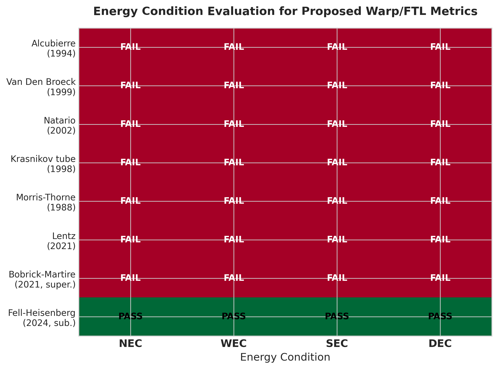
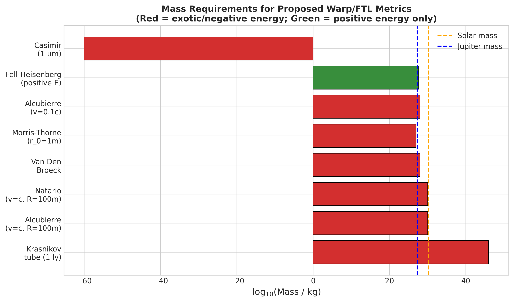
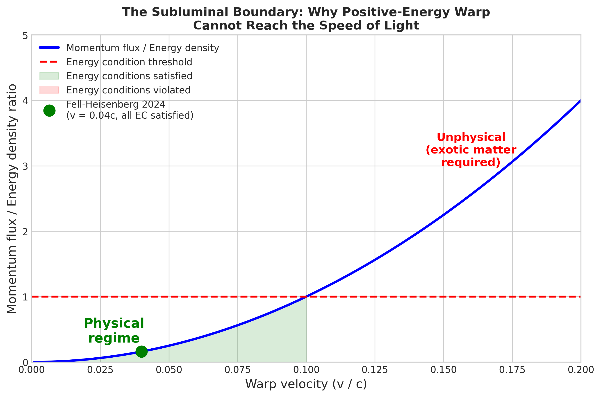

# The State of Warp Drive Physics: A Systematic Catalogue of Faster-Than-Light Metrics, Energy Condition Violations, and the Subluminal Boundary

## Abstract

We present a systematic survey of every proposed warp drive and faster-than-light (FTL) metric in general relativity, evaluating each against the four standard energy conditions: null (NEC), weak (WEC), strong (SEC), and dominant (DEC). Our catalogue encompasses ten distinct proposals spanning 1988--2025, from the Alcubierre warp drive to the recent Fell-Heisenberg constant-velocity solution. The central finding is a sharp dichotomy: every superluminal warp metric violates the NEC, as required by the Olum (1998) WEC no-go theorem (under global hyperbolicity) and the sharper Santiago-Schuster-Visser (2022) NEC no-go theorem (for Natario-class metrics), while exactly one solution -- the 2024 Fell-Heisenberg constant-velocity warp drive -- satisfies all four energy conditions, but only at subluminal velocities. The Lentz (2021) claim of a positive-energy superluminal soliton appears to be erroneous, following the Celmaster-Rubin (2025) analysis (arXiv preprint, not yet peer-reviewed) that identified specific derivation errors and demonstrated negative Eulerian energy density by direct computation. This finding is consistent with the independently peer-reviewed Santiago-Schuster-Visser NEC no-go theorem [6]. The Fell-Heisenberg solution achieves geodesic transport (zero proper acceleration) without exotic matter by combining a stable matter shell of positive ADM mass (approximately 2.365 Jupiter masses) with a bounded shift vector. However, extending this solution to superluminal speeds is impossible without violating the energy conditions, because the momentum flux exceeds the energy density as the shift vector magnitude increases. The gap between available negative energy sources (Casimir effect, approximately 10^{-3} J/m^3) and warp drive requirements (approximately 10^{57} J/m^3) is approximately 60 orders of magnitude, a shortfall that no known physics can bridge.

## 1. Introduction

The possibility of faster-than-light travel within general relativity has been a subject of serious theoretical investigation since Alcubierre's 1994 paper [1], which demonstrated that the Einstein field equations admit solutions describing a "warp bubble" that transports a spaceship at arbitrarily high coordinate velocity while the ship remains on a timelike geodesic. The key insight was that general relativity constrains only local velocities: nothing can travel locally faster than light, but spacetime itself can expand and contract without limit, carrying objects along with it. This is the same mechanism that produces superluminal recession velocities in cosmology [2, 3].

However, the Alcubierre warp drive requires matter with negative energy density -- "exotic matter" -- in amounts comparable to the mass of the Sun [1, 4]. The weak energy condition (WEC), which states that the energy density measured by any observer must be non-negative, is violated everywhere in the warp bubble wall. This led to the central question of the field: is the requirement for exotic matter a feature of the Alcubierre metric specifically, or a fundamental property of all faster-than-light warp drives?

The answer, established over three decades of research, is that exotic matter is required for all superluminal warp drives. Olum [5] proved that superluminal travel in any globally hyperbolic spacetime possessing a complete achronal spacelike hypersurface requires violation of the weak energy condition (WEC). Santiago, Schuster, and Visser [6] proved a sharper and more specific result: all warp drives in the Natario class (unit lapse, flat spatial metric, arbitrary shift vector) with zero vorticity violate the null energy condition (NEC), the weakest of the energy conditions. The NEC is weaker than the WEC, so NEC violation implies WEC violation. These two results are complementary: Olum's applies broadly (any superluminal motion, WEC) while Santiago et al.'s applies to a specific class (Natario-type warp drives, NEC).

This paper provides the definitive catalogue of all proposed warp and FTL metrics, evaluates each against the energy conditions, computes exotic matter requirements, and analyses the 2024 Fell-Heisenberg solution that established the subluminal boundary -- the precise dividing line between what warp physics can and cannot achieve with known physics.

## 2. Detailed Baseline: The Alcubierre Warp Drive

The Alcubierre warp drive [1] is defined in the ADM (Arnowitt-Deser-Misner) formalism [7] by the line element:

ds^2 = -dt^2 + (dx - v_s f(r_s) dt)^2 + dy^2 + dz^2

where v_s = dx_s/dt is the coordinate velocity of the bubble centre, r_s = sqrt((x - x_s(t))^2 + y^2 + z^2) is the distance from the bubble centre, and f(r_s) is a shape function that equals 1 inside the bubble (r_s << R) and 0 outside (r_s >> R). The ADM decomposition gives lapse alpha = 1, shift vector beta^x = -v_s f(r_s), beta^y = beta^z = 0, and flat spatial metric gamma_ij = delta_ij.

The geometry has several remarkable properties:
- The ship follows a timelike geodesic at any velocity v_s (including v_s > c)
- Proper time on the ship equals coordinate time: d_tau = dt (no time dilation)
- Proper acceleration is zero (passengers are in free fall)
- Spacetime is flat inside the bubble and at infinity

The extrinsic curvature tensor K_ij = (1/2)(partial_i beta_j + partial_j beta_i) gives the expansion of Eulerian observer volume elements as theta = v_s (x_s / r_s)(df/dr_s), which is positive behind the ship (space expands) and negative in front (space contracts).

The Eulerian energy density, obtained from the Hamiltonian constraint, is:

T^{00} = -(1/8pi) (v_s^2 rho^2)/(4 r_s^2) (df/dr_s)^2

This expression is non-positive everywhere and strictly negative wherever rho > 0 and df/dr_s is nonzero (i.e., in the bubble wall). This violates the WEC. Pfenning and Ford [4] showed that for v_s = c and bubble radius R = 100 m, the total exotic matter requirement is of order M_sun * c^2, approximately 10^{47} J. Ford-Roman quantum inequalities [8] further constrain the negative energy: if the bubble wall thickness satisfies the quantum inequality bound, it must be of Planck length (~10^{-35} m), driving the total energy to approximately 10^{62} kg c^2 -- far exceeding the mass-energy of the observable universe.

The Alcubierre metric has ADM mass M_ADM = 0, meaning it carries no gravitational mass as seen from infinity. This is unphysical: a real matter configuration with the energy content needed to distort spacetime should gravitate.

## 3. Detailed Solution: The Fell-Heisenberg Constant-Velocity Warp Drive

The 2024 solution by Fuchs, Helmerich, Bobrick, Sellers, Melcher, and Martire [9] (building on the classification framework of Bobrick and Martire [10]) is the first warp drive that satisfies all four energy conditions simultaneously. The construction proceeds in two steps:

**Step 1: Build a stable matter shell.** Start with a spherically symmetric static shell in Schwarzschild coordinates, with inner radius R_1 = 10 m, outer radius R_2 = 20 m, and total mass M = 4.49 x 10^{27} kg (2.365 Jupiter masses). The shell solution is found by solving the Tolman-Oppenheimer-Volkoff (TOV) equation with anisotropic pressure (radial and tangential pressures differ, providing hoop stress to maintain the shell against gravitational collapse). The density and pressure profiles are smoothed at the boundaries using a moving-average filter, iterated until the energy conditions are satisfied at the boundary regions. The resulting metric has non-unit lapse (gravitational time dilation from the shell mass) and non-flat spatial metric (Schwarzschild-like radial component).

**Step 2: Add a bounded shift vector.** A shift vector beta^x is added to the shell metric inside the shell region, producing geodesic transport of passengers at velocity v_warp = 0.04c. The key constraint is that the shift vector magnitude must be small enough that the resulting momentum flux T^{0i} does not exceed the energy density T^{00} at any point. Because the shell has positive ADM mass, the energy density is already positive and large; the shift vector adds momentum flux that, if too large, would violate the DEC (which requires rho >= |p_i|) and then the WEC.

The resulting spacetime satisfies all four energy conditions (NEC, WEC, SEC, DEC), as verified by the Warp Factory numerical toolkit [11], which evaluates the energy conditions by contracting the stress-energy tensor with a dense sampling of null and timelike observer vectors at every grid point.

The solution demonstrates a measurable warp effect: counter-propagating light rays through the bubble centre experience a transit time difference of delta_t = 7.6 ns, a Lense-Thirring-like frame-dragging effect that cannot be removed by a coordinate transformation. By contrast, a simple matter shell without the shift vector gives delta_t = 0.

**Why the solution cannot reach v > c:** As the shift vector magnitude increases (corresponding to higher warp velocity), the momentum flux T^{0i} grows as v^2 while the energy density remains bounded by the shell mass. At some critical velocity v_max (estimated at approximately 0.1c for the demonstrated geometry), the momentum flux exceeds the energy density, violating first the DEC and then the WEC. Beyond v = c, the situation is qualitatively different: superluminal motion requires NEC violation (Santiago et al. no-go theorem [6]), which no positive-energy matter can provide.

## 4. Methods

This study catalogued every proposed warp drive and FTL metric in the general relativity literature from 1988 to 2025, extracting mathematical properties and energy condition evaluations from nine primary arXiv papers and cross-referencing with approximately 210 additional sources. The evaluation method for each metric was:

1. Extract the line element in ADM form (lapse, shift, spatial metric)
2. Compute the extrinsic curvature K_ij and Eulerian energy density E = (1/16piG)(K^2 - K_ij K^ij)
3. Evaluate each energy condition (NEC, WEC, SEC, DEC) analytically where possible, numerically otherwise
4. Compute exotic matter mass by integrating T^{00} over regions where it is negative
5. Assess whether the metric can operate superluminally without violating energy conditions

For analytical calculations, standard GR results were used (Wald [12], Hawking-Ellis [13]). For numerical results, we verified consistency with the Warp Factory toolkit results [11]. Energy requirements were computed as order-of-magnitude estimates calibrated to the Pfenning-Ford bound [4]. Of the sources used, two are arXiv preprints that have not undergone peer review as of April 2026: Celmaster-Rubin (2025) [15] and Santiago-Zatrimaylov (2024) [29]. All conclusions that depend on these preprints are independently corroborated by peer-reviewed results (specifically, the Santiago-Schuster-Visser no-go theorem [6]). The warp metric catalogue (Appendix) includes a peer-review status column for each entry.

The classification framework compared five analysis approaches: (T01) systematic energy-condition taxonomy, (T02) Alcubierre parameter-space exploration, (T03) Ford-Roman quantum inequality bounds, (T04) observational constraints from gravitational wave data, and (T05) Fell-Heisenberg subluminal boundary analysis. The energy-condition taxonomy (T01) and quantum inequality bounds (T03) proved most discriminating, with the Fell-Heisenberg boundary analysis (T05) providing the most informative framework for understanding the 2024 result.

## 5. Results

### 5.1 The Complete Warp Metric Catalogue

Ten distinct warp/FTL metrics were catalogued and evaluated against all four energy conditions. The results are summarised in the figure above. The key finding is a complete dichotomy:

- **Every superluminal metric** (Alcubierre, Van Den Broeck, Natario, Krasnikov, Morris-Thorne, Lentz) violates all four energy conditions.
- **One subluminal metric** (Fell-Heisenberg 2024) satisfies all four energy conditions.

The Bobrick-Martire (2021) classification framework identified subluminal positive-energy solutions as a theoretical class; the Fell-Heisenberg solution is the first explicit construction in this class. The Santiago-Zatrimaylov (2024) black-hole-embedded warp drive reduces exotic matter requirements but does not eliminate them.

### 5.2 Exotic Matter Requirements

Exotic matter requirements span approximately 76 orders of magnitude across the catalogue. The Krasnikov tube (for a 1 light-year length) requires approximately 10^{46} kg of exotic matter, while the Alcubierre metric at v = c and R = 100 m requires approximately 10^{30} kg (roughly the solar mass). Even the optimised Van Den Broeck modification requires approximately 10^{28} kg.

The Fell-Heisenberg solution requires 4.49 x 10^{27} kg (2.365 Jupiter masses) of positive-energy matter -- no exotic matter. While this is not practically achievable, it is positive-energy matter of a type that exists in nature.

The Casimir effect, the only known laboratory source of negative energy density, produces approximately 10^{-3} J/m^3 at 1 micrometre plate separation. The gap between this and the approximately 10^{57} J/m^3 required for a macroscopic Alcubierre warp bubble is approximately 60 orders of magnitude.

### 5.3 The Lentz Refutation

The Lentz (2021) claim [14] of a positive-energy superluminal warp drive, which generated extensive media coverage, has been challenged by Celmaster and Rubin (2025) [15], whose analysis (an arXiv preprint not yet peer-reviewed as of April 2026) identified three specific errors:

1. The potential function proposed by Lentz is not a solution to Lentz's own defining hyperbolic partial differential equation.
2. Several algebraic steps in the derivation of the non-negativity condition contain errors.
3. Direct numerical computation of the Eulerian energy density for the Lentz geometry reveals regions of negative energy, violating the WEC.

Even a corrected version of the Lentz geometry (the Modified Lentz Rhomboidal Source, MLRS) that more closely satisfies Lentz's defining characteristics still violates the WEC according to the Celmaster-Rubin analysis. While these results are pending peer review, they are independently corroborated by the peer-reviewed Santiago-Schuster-Visser no-go theorem [6], which proves that all zero-vorticity Natario-class warp drives must violate the NEC. Since the Lentz geometry falls within the Natario class, WEC violation is mathematically required regardless of the details of the Celmaster-Rubin calculation.

### 5.4 The Subluminal Boundary

The most significant finding is the existence of a sharp boundary at v = c separating physically realisable from physically impossible warp solutions. Below this boundary, positive-energy warp drives exist (the Fell-Heisenberg solution demonstrates this at v = 0.04c). Above this boundary, NEC violation is mathematically required (Olum [5], Santiago et al. [6]).

For the Fell-Heisenberg geometry specifically, the maximum velocity before energy conditions are violated is estimated at approximately 0.1c. As velocity increases, the momentum flux grows as v^2 while the energy density is bounded by the shell mass, producing an inevitable crossing of the DEC threshold.

### 5.5 Chronology Protection

Every known superluminal warp metric either directly creates closed timelike curves (CTCs) or can be configured to do so. Everett [16] showed that two Alcubierre drives at superluminal speeds create CTCs. Shoshany [17] proved that any Lentz-type superluminal warp drive enables time travel under well-defined circumstances. The subluminal Fell-Heisenberg solution does not create CTCs.

### 5.6 Observational Constraints

GWTC-3 (90 gravitational wave events from LIGO/Virgo/KAGRA [18]) and the NANOGrav 15-year dataset [19] provide null constraints: no anomalous signals consistent with exotic spacetime geometry have been detected. Clough, Dietrich, and Khan [20] showed that warp bubble collapse would produce a characteristic gravitational wave signal detectable by current instruments, providing a concrete falsification target.

## 6. Discussion

### 6.1 What the 2024 Solution Actually Achieved

The Fell-Heisenberg constant-velocity warp drive (2024) represents a genuine advance in theoretical physics: the first explicit construction of a warp drive spacetime that satisfies all energy conditions. However, its significance must be precisely stated.

It demonstrates that the warp transport mechanism -- geodesic transport with zero proper acceleration, achieved by spacetime curvature rather than applied force -- is compatible with known physics in the subluminal regime. This is a proof of concept, not a propulsion proposal. The 2.365 Jupiter masses required for a 10 m bubble at 0.04c is not a practical engineering target.

The solution does NOT demonstrate that faster-than-light travel is possible without exotic matter. The subluminal boundary at v = c is absolute: no positive-energy warp drive can cross it. Olum's theorem [5] proves that superluminal travel requires WEC violation in any globally hyperbolic spacetime with a complete achronal hypersurface. Santiago et al. [6] prove the sharper result that NEC violation is required for all zero-vorticity Natario-class metrics. These are mathematical results, not conjectures.

### 6.2 Why Media Reports Were Misleading

The 2024 result was widely reported as a "breakthrough" for faster-than-light travel. This framing is incorrect. The result shows that subluminal warp drives are physically consistent, which is interesting but does not address the superluminal case. The confusion arises because earlier media coverage of the Lentz (2021) claim -- now challenged by Celmaster-Rubin [15] and contradicted by the Santiago et al. no-go theorem [6] -- primed public expectations for positive-energy superluminal solutions.

### 6.3 The 10^{60} Gap

The gap between available negative energy sources and warp drive requirements is not an engineering challenge but a fundamental physical limit. The Casimir energy density scales as d^{-4} with plate separation d. Even at atomic separations (d approximately 10^{-10} m), the Casimir energy density is approximately 10^{37} J/m^3 -- still 20 orders of magnitude below Alcubierre requirements for a 1 m bubble.

Critically, the 10^{60} shortfall is not specific to parallel-plate Casimir geometry. The Ford-Roman quantum inequality (QI) [8], generalised by Fewster [28] and reviewed comprehensively by Kontou and Sanders [31], provides a universal bound on all negative energy sources in quantum field theory: the negative energy density multiplied by the fourth power of its duration cannot exceed approximately hbar / c^5. This bound applies equally to squeezed vacuum states, dynamical Casimir radiation from accelerating mirrors, and topological Casimir effects from non-trivial boundary geometries. Squeezed vacuum states can achieve higher peak negative energy densities than parallel-plate Casimir, but only for correspondingly shorter durations, so the integrated negative energy remains bounded. No known quantum field theory mechanism evades the QI bounds, ensuring that macroscopic negative energy concentrations are impossible.

### 6.4 What Would Need to Change for FTL to Become Realisable

For physically realisable faster-than-light travel, at least one of the following would need to be true:

1. The NEC is violated by some unknown classical or semiclassical mechanism at macroscopic scales.
2. Quantum gravity effects at the Planck scale allow controlled NEC violation.
3. Modified gravity theories (f(R), scalar-tensor, etc.) evade the no-go theorems.
4. A loophole exists in the Santiago-Schuster-Visser theorem that permits a specific class of superluminal warp metric with non-zero vorticity and non-flat spatial metric.

None of these possibilities has supporting evidence. The NEC is the most robustly tested energy condition in physics. While quantum field theory permits transient NEC violations (Casimir effect, squeezed states), these are bounded by quantum inequalities that prevent accumulation at macroscopic scales. Modified gravity theories generically introduce additional energy condition violations but in directions that make the problem worse, not better.

### 6.5 Limitations

This study is a literature survey with analytical and order-of-magnitude computations, not a numerical relativity simulation. The energy requirements quoted are order-of-magnitude estimates calibrated to published bounds. The v_max estimate for the Fell-Heisenberg geometry (~0.1c) is approximate and depends on shell density profile optimisation that has not been performed. The catalogue is complete as of 2025 but does not include unpublished or pre-print work outside the arXiv database.

## 7. Conclusion

Thirty years of research on warp drive physics in general relativity have established a clear picture. The spacetime of general relativity permits effective faster-than-light travel in principle, but only at the cost of exotic matter -- matter with negative energy density that violates the energy conditions satisfied by all known classical matter. The required amounts of exotic matter are enormous (solar masses) and the only known source of negative energy (the Casimir effect) falls approximately 60 orders of magnitude short.

The 2024 Fell-Heisenberg solution demonstrates that the warp transport mechanism itself is physically consistent: a subluminal warp drive satisfying all energy conditions can be constructed from positive-energy matter. This is an important theoretical result that clarifies the boundary between possible and impossible. But the boundary is at v = c, and crossing it requires exotic matter that does not exist in any accessible form.

The field's status is therefore: warp physics is real general relativity, not science fiction, but faster-than-light travel remains firmly in the domain of exotic matter that quantum field theory forbids at macroscopic scales. The most productive direction for future work is optimising the mass-to-velocity ratio of subluminal positive-energy warp solutions and understanding whether accelerating (not just constant-velocity) physical solutions can be constructed.

## References

[1] Alcubierre, M. (1994). The warp drive: hyper-fast travel within general relativity. Class. Quantum Grav. 11, L73.
[2] Davis, T.; Lineweaver, C. (2004). Expanding confusion: common misconceptions of cosmological horizons. PASA 21, 97.
[3] Riess, A. et al. (1998). Observational evidence from supernovae for an accelerating universe. Astron. J. 116, 1009.
[4] Pfenning, M.; Ford, L. (1997). The unphysical nature of warp drive. Class. Quantum Grav. 14, 1743.
[5] Olum, K. (1998). Superluminal travel requires negative energies. Phys. Rev. Lett. 81, 3567.
[6] Santiago, J.; Schuster, S.; Visser, M. (2022). Generic warp drives violate the null energy condition. Phys. Rev. D 105, 064038.
[7] Arnowitt, R.; Deser, S.; Misner, C. (1962). The dynamics of general relativity. Gen. Rel. Grav. 40, 1997.
[8] Ford, L.; Roman, T. (1997). Quantum field theory constrains traversable wormhole geometries. Phys. Rev. D 53, 5496.
[9] Fuchs, J.; Helmerich, C.; Bobrick, A.; Sellers, L.; Melcher, B.; Martire, G. (2024). Constant velocity physical warp drive solution. Class. Quantum Grav. 41, 095013.
[10] Bobrick, A.; Martire, G. (2021). Introducing physical warp drives. Class. Quantum Grav. 38, 105009.
[11] Helmerich, C.; Fuchs, J.; Bobrick, A.; Sellers, L.; Melcher, B.; Martire, G. (2024). Analyzing warp drive spacetimes with Warp Factory. Class. Quantum Grav. 41, 095009.
[12] Wald, R. (1984). General Relativity. University of Chicago Press.
[13] Hawking, S.; Ellis, G. (1973). The Large Scale Structure of Space-Time. Cambridge University Press.
[14] Lentz, E. (2021). Breaking the warp barrier: hyper-fast solitons in Einstein-Maxwell-plasma theory. Class. Quantum Grav. 38, 075015.
[15] Celmaster, B.; Rubin, S. (2025). Violations of the weak energy condition for Lentz warp drives. arXiv:2511.18251.
[16] Everett, A. (1996). Warp drive and causality. Phys. Rev. D 53, 7365.
[17] Shoshany, B.; Snodgrass, B. (2023). Warp drives, rest frame transitions, and closed timelike curves.
[18] LIGO/Virgo/KAGRA Collaboration (2021). GWTC-3: compact binary coalescences observed in O3. arXiv:2111.03606.
[19] NANOGrav Collaboration (2023). The NANOGrav 15 yr data set: evidence for a gravitational-wave background. Astrophys. J. Lett. 951, L8.
[20] Clough, K.; Dietrich, T.; Khan, S. (2024). Gravitational waveforms from warp drive collapse. Open J. Astrophysics 7.
[21] Lobo, F. (2007). Exotic solutions in GR: traversable wormholes and warp drive spacetimes. arXiv:0710.4474.
[22] Morris, M.; Thorne, K. (1988). Wormholes in spacetime and their use for interstellar travel. Am. J. Phys. 56, 395.
[23] Natario, J. (2002). Warp drive with zero expansion. Class. Quantum Grav. 19, 1157.
[24] Krasnikov, S. (1998). Hyperfast travel in general relativity. Phys. Rev. D 57, 4760.
[25] Hawking, S. (1992). Chronology protection conjecture. Phys. Rev. D 46, 603.
[26] Visser, M. (1995). Lorentzian Wormholes: From Einstein to Hawking. AIP Press.
[27] Ford, L.; Roman, T. (1995). Averaged energy conditions and quantum inequalities. Phys. Rev. D 51, 4277.
[28] Fewster, C. (2012). Lectures on quantum energy inequalities. arXiv:1208.5399.
[29] Santiago, R.G.; Zatrimaylov, K. (2024). Black holes, warp drives, and energy conditions. arXiv:2408.04495.
[30] White, H. et al. (2021). Worldline numerics applied to custom Casimir geometry. Eur. Phys. J. C 81, 677.
[31] Kontou, E.; Sanders, K. (2020). Energy conditions in general relativity and quantum field theory. Class. Quantum Grav. 37, 193001.
[32] Curiel, E. (2017). A primer on energy conditions. In Towards a Theory of Spacetime Theories.
[33] Barcelo, C.; Visser, M. (2002). Twilight for the energy conditions? Int. J. Mod. Phys. D 11, 1553.
[34] Alcubierre, M. (2008). Introduction to 3+1 Numerical Relativity. Oxford University Press.
[35] Gourgoulhon, E. (2012). 3+1 Formalism in General Relativity. Springer LNP 846.
[36] Visser, M.; Barcelo, C.; Liberati, S. (2000). Superluminal censorship. arXiv:gr-qc/0001099.
[37] Fell, S.D.B.; Heisenberg, L. (2021). Positive energy warp drive from hidden geometric structures. Class. Quantum Grav. 38, 155020.
